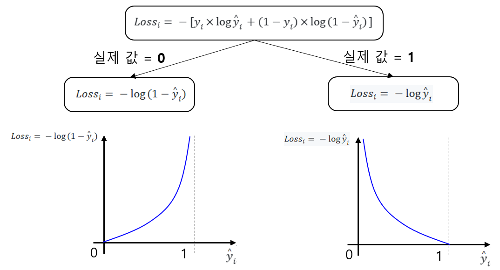

## 목차
* [1. Regression](#1-regression)
* [2. Linear Regression](#2-linear-regression)
  * [2-1. Regression 최적화 및 손실 함수](#2-1-regression-최적화-및-손실-함수)
  * [2-2. Regression 최적화 과정](#2-2-regression-최적화-과정)
  * [2-3. 손실 함수 미분값의 계산](#2-3-손실-함수-미분값의-계산)
* [3. Logistic Regression](#3-logistic-regression)
  * [3-1. Logistic Regression의 최적화](#3-1-logistic-regression의-최적화)
  * [3-2. Logistic Regression의 손실 함수, Log Loss](#3-2-logistic-regression의-손실-함수-log-loss) 
  * [3-3. 손실 함수 미분값의 계산](#3-3-손실-함수-미분값의-계산) 
* [4. 탐구: 어떤 Regression이 적절할까?](#4-탐구-어떤-regression이-적절할까)
  * [4-1. 실험 (예시 데이터셋)](#4-1-실험-예시-데이터셋)
  * [4-2. 실험 결과 분석](#4-2-실험-결과-분석)

## 코드
작성중

## 1. Regression
**Regression (회귀)** 는 **여러 개의 독립 변수와 1개의 종속 변수 사이의 관계를 함수의 형태로 모델링** 하는 기법이다.
* 따라서, 머신러닝 모델의 출력값 (종속 변수) 으로 연속적인 숫자 값을 예측한다.

간단한 회귀의 유형으로는 다음과 같은 것이 있다. 딥 러닝 (Deep Learning) 은 이 회귀를 복잡하게 조합하여 구성한 것이라고 할 수 있다. 
* Linear Regression (선형 회귀)
  * 종속 변수 (y) 를 독립 변수 (x1, x2, ...) 의 **선형 결합** 으로 예측
  * 출력값이 **연속된 숫자 값** 일 때 적절
* Logistic Regression (로지스틱 회귀)
  * **0부터 1까지의 일종의 확률 값** 을 나타내는 종속 변수 (y) 를 독립 변수 (x1, x2, ...) 의 **비선형 결합** 으로 예측 
  * 출력값이 **binary value (0 or 1)** 일 때 적절

| 선형 회귀                                             | 로지스틱 회귀                                           |
|---------------------------------------------------|---------------------------------------------------|
|  |  |

## 2. Linear Regression
**Linear Regression (선형 회귀)** 는 종속 변수 y를 독립 변수 x1, x2, ... 의 **선형 결합** 으로 예측하는 방법이며, 수식은 다음과 같다.
* 기본 가정
  * $m$ 개의 학습 데이터 샘플과 $n$ 개의 독립 변수 (feature)
* **[수식 1]** $y = w_1x_1 + w_2x_2 + ... + w_nx_n + b$
  * $x_1, x_2, ..., x_n$ : 독립 변수 
  * $w_1, w_2, ..., w_n$ : 각 독립 변수 $x_1, x_2, ..., x_n$ 에 대한 가중치
  * $b$ : bias (스칼라 값)
* **[수식 2]** $y = Xw + b$
  * $X$ : 입력 데이터, $m \times n$ 크기의 행렬
  * $y$ : 출력 데이터, $m \times 1$ 크기의 벡터
  * $w$ : 가중치 행렬, $n \times 1$ 크기의 벡터

선형 회귀는 독립변수의 개수에 따라 다음과 같이 **단순 선형회귀** 와 **다중 선형회귀** 로 분류한다.

| 구분      | 설명                                     |
|---------|----------------------------------------|
| 단순 선형회귀 | - 독립변수가 1개인 선형회귀 - $y = w_1x_1 + b$ |
| 다중 선형회귀 | - 독립변수가 여러 개인 선형회귀                     |

### 2-1. Regression 최적화 및 손실 함수
* 핵심 아이디어 
  * 독립 변수들과 종속 변수의 관계를 가장 잘 나타내는 Linear Regression 직선을 만들기 위해서는 **가중치와 bias에 대한 최적화** 가 필요하다.
  * 이 최적화는 **종속 변수의 예측값과 실제 값의 오차** 를 나타내는 **손실 함수를 미분을 통해 최소화** 하는 방법을 이용한다. 
* Linear Regression의 손실 함수는 다음을 사용한다고 가정한다.
  * **Mean Square Error (MSE, 평균 제곱 오차)**
    * 종속 변수의 실제 값과 예측 값의 차이를 제곱한 것들의 평균
  * $L = \frac{1}{m} \Sigma_{i=1}^m (y_i - \hat{y}_i)^2$
    * $y_i$ : 종속 변수의 실제 값
    * $\hat{y}_i$ : 종속 변수의 예측값

### 2-2. Regression 최적화 과정
손실 함수 (MSE) 를 최소화하는 과정은 다음과 같다.
* 손실 함수를 각 가중치 $w_1, w_2, ..., w_n$ 에 대해 미분하여, 각 가중치에 대한 접선의 기울기 $\frac{\delta}{\delta w} L$ 를 구한다.
* 각 가중치에 해당 접선의 기울기의 일정 배수 ($\alpha$ 배) 를 뺀다.
  * $w := w - \alpha \frac{\delta}{\delta w} L$ 
* 이것을 접선의 기울기가 0으로 수렴할 때까지 반복한다.
* **이 과정과 동일한 방법이 딥러닝의 역전파에서도 사용된다.**

| 과정  | 위치    | 설명                                                       |
|-----|-------|----------------------------------------------------------|
| (1) | A     | A 에서의 Loss Function의 접선의 기울기를 구한다. (결과: 2.0)             |
| (2) | A → B | 가중치 $w$ 에서 (1) 에서 구한 기울기를 이용하여 $2.0 \times \alpha$ 를 뺀다. |
| (3) | B     | B 에서의 Loss Function의 접선의 기울기를 구한다. (결과: 1.5)             |
| (4) | B → C | 가중치 $w$ 에서 (1) 에서 구한 기울기를 이용하여 $1.5 \times \alpha$ 를 뺀다. |
| ... | ...   | ...                                                      |
| (5) | D     | 이런 과정을 충분한 횟수만큼 반복하면 결국 기울기가 0인 최소 지점으로 수렴한다.            |

* 편향 (bias) 역시 마찬가지로 손실 함수를 편향에 대해 미분했을 때의 접선의 기울기 $\frac{\delta}{\delta b} L$ 를 이용하여 다음과 같이 업데이트해 나간다.
  * $b := b - \alpha \frac{\delta}{\delta b} L$ 

### 2-3. 손실 함수 미분값의 계산
**1. weight에 대한 미분값 계산**

* $\frac{\delta}{\delta w_1} L$
* = $\frac{\delta}{\delta w_1} \frac{1}{m} \Sigma_{i=1}^m (y_i - \hat{y}_i)^2$
* = $\frac{\delta}{\delta w_1} \frac{1}{m} \Sigma_{i=1}^m [y_i - (x_{i1}w_1+x_{i2}w_2+...+x_{in}w_n+b)]^2$
* = $\frac{1}{m} \Sigma_{i=1}^m [-2x_i \times [y_i - (x_{i1}w_1+x_{i2}w_2+...+x_{in}w_n+b)]]$

**2. bias에 대한 미분값 계산**

* $\frac{\delta}{\delta b} L$
* = $\frac{\delta}{\delta b} \frac{1}{m} \Sigma_{i=1}^m (y_i - \hat{y}_i)^2$
* = $\frac{\delta}{\delta b} \frac{1}{m} \Sigma_{i=1}^m [y_i - (x_{i1}w_1+x_{i2}w_2+...+x_{in}w_n+b)]^2$
* = $\frac{1}{m} \Sigma_{i=1}^m [-2 \times [y_i - (x_{i1}w_1+x_{i2}w_2+...+x_{in}w_n+b)]]$

## 3. Logistic Regression
**Logistic Regression (로지스틱 회귀)** 는 종속 변수 y를 독립 변수 x1, x2, ... 의 **sigmoid 함수를 이용한 비선형 결합** 으로 나타내는 것을 말한다.

* sigmoid 함수의 수식
  * $sigmoid(x) = \frac{1}{1 + e^{-x}}$ 
* 기본 가정
  * $m$ 개의 학습 데이터 샘플과 $n$ 개의 독립 변수 (feature) 
* **[수식]** $y = sigmoid(w_1x_1 + w_2x_2 + ... + w_nx_n + b) = \frac{1}{1 + e^{w_1x_1 + w_2x_2 + ... + w_nx_n + b}}$
  * $x_1, x_2, ..., x_n$ : 독립 변수 
  * $w_1, w_2, ..., w_n$ : 각 독립 변수 $x_1, x_2, ..., x_n$ 에 대한 가중치
  * $b$ : bias (스칼라 값)

Logistic Regression은 **종속 변수 y가 0~1의 확률 값일 때** 사용한다.
* Linear Regression의 경우 독립 변수들과 종속 변수의 관계를 하나의 직선으로 최적화하므로, **확률을 나타내려는 의도의 종속 변수가 0 미만 또는 1 초과** 가 될 수 있다.

### 3-1. Logistic Regression의 최적화
Logistic Regression 역시 **Linear Regression과 유사하게 손실 함수를 가중치, bias로 미분했을 때의 기울기가 0으로 수렴하도록** 업데이트해 나간다.

Logistic Regression의 손실 함수는 Linear Regression과 달리 **Log Loss (Binary Cross Entropy)** 를 이용한다.

### 3-2. Logistic Regression의 손실 함수, Log Loss
Log Loss의 핵심 아이디어는 다음과 같다.
* 예측한 확률 값과 실제 값의 차이가 1에 가까운 매우 큰 값일수록 Loss를 급격하게 올린다.

Log Loss의 수식은 다음과 같다.
* 수식
  * 개별 sample에 대한 Loss
    * $Loss_{i} = - [y_i \times \log{\hat{y}_i} + (1 - y_i) \times \log{(1 - \hat{y}_i)}]$
  * 전체 Log Loss
    * $L = \frac{1}{m} \Sigma_{i=1}^m [Loss_{i}] = \frac{-1}{m} \Sigma_{i=1}^m [y_i \times \log{\hat{y}_i} + (1 - y_i) \times \log{(1 - \hat{y}_i)}]$

* notation
  * $m$ : 학습 데이터 샘플 개수
  * $y_i$ : 실제 값
  * $\hat{y}_i$ : 예측한 확률 값

각 경우에 따라 Log Loss 함수의 값을 분석하면 다음과 같다.

| 구분        | 설명                                                                               |
|-----------|----------------------------------------------------------------------------------|
| $y_i = 0$ | $Loss_{i} = - \log{(1 - \hat{y}_i)}$ - 예측한 확률 값 $\hat{y}_i$ 가 1에 가깝게 클수록 급격히 커짐 |
| $y_i = 1$ | $Loss_{i} = - \log{\hat{y}_i}$ - 예측한 확률 값 $\hat{y}_i$ 가 0에 가깝게 작을수록 급격히 커짐    |

### 3-3. 손실 함수 미분값의 계산
**1. weight에 대한 미분값 계산**

* $\frac{\delta}{\delta w_1} L$
* = $\frac{\delta}{\delta w_1} \frac{-1}{m} \Sigma_{i=1}^m [y_i \times \log{\hat{y}_i} + (1 - y_i) \times \log{(1 - \hat{y}_i)}]$
* = $\frac{\delta}{\delta w_1} \frac{-1}{m} \Sigma_{i=1}^m [y_i \times \log{(x_{i1}w_1 + x_{i2}w_2 + ... + x_{in}w_n + b)} + (1 - y_i) \times \log{(1 - (x_{i1}w_1 + x_{i2}w_2 + ... + x_{in}w_n + b))}]$
* = $\frac{-1}{m} \Sigma_{i=1}^m [y_i \times \frac{\delta}{\delta w_1} \log{(x_{i1}w_1 + x_{i2}w_2 + ... + x_{in}w_n + b)} + (1 - y_i) \times \frac{\delta}{\delta w_1} \log{(1 - (x_{i1}w_1 + x_{i2}w_2 + ... + x_{in}w_n + b))}]$
* = $\frac{-1}{m} \Sigma_{i=1}^m [\frac{x_{i1}y_i}{x_{i1}w_1 + x_{i2}w_2 + ... + x_{in}w_n + b} + \frac{-x_{1i}(1 - y_i)}{1 - (x_{i1}w_1 + x_{i2}w_2 + ... + x_{in}w_n + b)}]$

**2. bias에 대한 미분값 계산**

* $\frac{\delta}{\delta b} L$
* = $\frac{\delta}{\delta b} \frac{-1}{m} \Sigma_{i=1}^m [y_i \times \log{\hat{y}_i} + (1 - y_i) \times \log{(1 - \hat{y}_i)}]$
* = $\frac{\delta}{\delta b} \frac{-1}{m} \Sigma_{i=1}^m [y_i \times \log{(x_{i1}w_1 + x_{i2}w_2 + ... + x_{in}w_n + b)} + (1 - y_i) \times \log{(1 - (x_{i1}w_1 + x_{i2}w_2 + ... + x_{in}w_n + b))}]$
* = $\frac{-1}{m} \Sigma_{i=1}^m [y_i \times \frac{\delta}{\delta b} \log{(x_{i1}w_1 + x_{i2}w_2 + ... + x_{in}w_n + b)} + (1 - y_i) \times \frac{\delta}{\delta b} \log{(1 - (x_{i1}w_1 + x_{i2}w_2 + ... + x_{in}w_n + b))}]$
* = $\frac{-1}{m} \Sigma_{i=1}^m [\frac{y_i}{x_{i1}w_1 + x_{i2}w_2 + ... + x_{in}w_n + b} + \frac{-(1 - y_i)}{1 - (x_{i1}w_1 + x_{i2}w_2 + ... + x_{in}w_n + b)}]$

## 4. 탐구: 어떤 Regression이 적절할까?
일반적으로 Linear Regression과 Logistic Regression은 다음의 경우에 적합하다.

| 구분                  | 적합한 경우                                                                       |
|---------------------|------------------------------------------------------------------------------|
| Linear Regression   | - 하나의 직선 형태에 가까운 분포를 이루는 데이터 - 연속되는 숫자 값 형태의 데이터                          |
| Logistic Regression | - 출력값이 binary value (0 또는 1) 또는 확률값인 경우 - 이진 분류 문제를 Regression으로 해결하려는 경우 |

### 4-1. 실험 (예시 데이터셋)

### 4-2. 실험 결과 분석