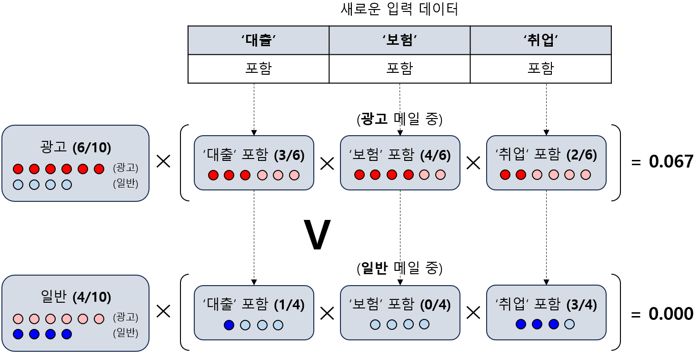

## 목차
* [1. Bayes 이론과 조건부 독립](#1-bayes-이론과-조건부-독립)
* [2. Naive Bayes 알고리즘이란?](#2-naive-bayes-알고리즘이란)
* [3. Naive Bayes 알고리즘의 예시](#3-naive-bayes-알고리즘의-예시)

## 1. Bayes 이론과 조건부 독립
**베이즈 정리 (Bayesian Rule)** 는 조건부 확률을 구하는 공식이다.
* **P(A|B) = P(B|A) * P(A) / P(B)**

그 증명은 다음과 같다.

* $P(A|B) = P(A \cap B) / P(B)$
* $P(B|A) = P(A \cap B) / P(A)$

이므로

* $P(A|B) = P(A \cap B) / P(A) * P(A) / P(B)$
* $P(A|B) = (P(A \cap B) / P(A)) * P(A) / P(B)$
* $P(A|B) = P(B|A) * P(A) / P(B)$

가 성립한다.

## 2. Naive Bayes 알고리즘이란?
**Naive Bayes 알고리즘** 은 지도 학습 알고리즘 중 하나로, Bayes 정리를 이용하여 다음과 같이 각 Class별 확률의 곱을 이용하여, 확률이 가장 높은 Class로 예측한다.
* **(전체 데이터 중 해당 Class ck 의 비율) * { P(d1=v1|ck) * ... * P(dn=vn|ck) }**
* 단, P(d=v|c) 는 기존에 학습한 데이터셋의 해당 Class (c) 인 데이터를 기준으로, feature d 의 값이 예측 대상 데이터의 feature d 의 값 v와 같을 확률
----

모델이 분류할 수 있는 n개의 class $c_1$, $c_2$, ..., $c_n$에 대해서, 입력 feature에 해당하는 m개의 조건 $d_1$, $d_2$, ..., $d_m$ 이 있을 때, Naive Bayes 알고리즘의 작동 방식은 다음과 같다.

이때, 새로 주어진, 분류 값을 구해야 하는 데이터의 $d_1$ 값은 $v_1$, $d_2$ 값은 $v_2$, ..., $d_m$ 값은 $v_m$ 라고 하자.

먼저 다음과 같이 확률들의 곱을 구한다.
* **class $c_1$ 에 대한 확률들의 곱** : $P(c_1) \times P(d_1=v_1|c_1) \times P(d_2=v_2|c_1) \times ... \times P(d_m=v_m|c_1)$
* **class $c_2$ 에 대한 확률들의 곱** : $P(c_2) \times P(d_1=v_1|c_2) \times P(d_2=v_2|c_2) \times ... \times P(d_m=v_m|c_2)$

...

* **class $c_n$ 에 대한 확률들의 곱** : $P(c_n) \times P(d_1=v_1|c_n) \times P(d_2=v_2|c_n) \times ... \times P(d_m=v_m|c_n)$

그 다음, 각 class에 대한 확률 중 가장 높은 값을 찾는다. 데이터를 해당 class로 분류한다.

## 3. Naive Bayes 알고리즘의 예시
예를 들어 다음과 같은 데이터가 있다고 하자. 이 데이터는 메일 내용에 "대출", "보험", "취업"이라는 단어가 포함되어 있는지를 검토하여, 광고 메일인지 여부를 판단하는 Naive Bayes 모델의 학습 데이터이다.

|"대출" 포함|"보험" 포함|"취업" 포함|분류|
|---|---|---|---|
|True|True|False|광고|
|True|False|False|광고|
|False|True|True|광고|
|True|True|False|광고|
|False|False|True|일반|
|False|False|True|광고|
|False|True|False|광고|
|True|False|True|일반|
|False|False|False|일반|
|False|False|True|일반|
|True|True|True|?|

위와 같은 데이터가 있다고 할 때, "대출", "보험", "취업"이라는 단어를 모두 포함한 메일은 스팸 메일인지 판단해야 한다.

이때, 먼저 다음의 확률들을 구한다.

* **class "광고" 에 대한 확률들의 곱** :

$P(광고) \times P("대출" 포함 = True|광고) \times P("보험" 포함 = True|광고) \times P("취업" 포함 = True|광고)$

= $(6 / 10) \times (3 / 6) \times (4 / 6) \times (2 / 6)$

= 0.066667

* **class "일반" 에 대한 확률들의 곱** :

$P(일반) \times P("대출" 포함 = True|일반) \times P("보험" 포함 = True|일반) \times P("취업" 포함 = True|일반)$

= $(4 / 10) \times (1 / 4) \times (0 / 4) \times (3 / 4)$

= 0.0

따라서 class "광고"에 대한 확률들의 곱이 "일반"에 대한 확률들의 곱보다 크므로, 해당 메일은 **광고 메일**로 분류된다는 것을 알 수 있다.