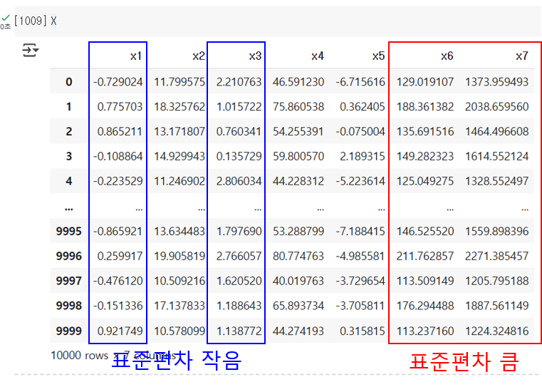
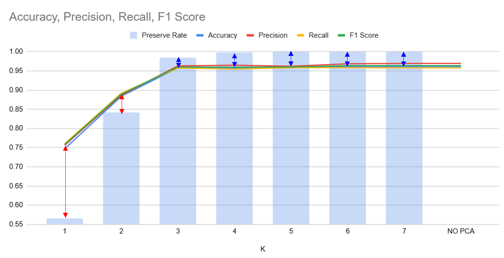

## 목차
* [1. PCA (Principal Component Analysis, 주성분 분석)](#1-pca-principal-component-analysis-주성분-분석)
* [2. PCA의 기본 원리](#2-pca의-기본-원리)
* [3. PCA에서 분산이 최대인 축을 선택하는 이유](#3-pca에서-분산이-최대인-축을-선택하는-이유)
* [4. PCA의 과정](#4-pca의-과정)
  * [4-1. 평균 0, 표준편차 1로 scaling](#4-1-평균-0-표준편차-1로-scaling) 
  * [4-2. Covariance Matrix 계산](#4-2-covariance-matrix-계산)
  * [4-3. Eigenvector + Eigenvalue 계산](#4-3-eigenvector--eigenvalue-계산)
* [5. 탐구 (Trade-off: 모델 성능 손실 vs. 차원의 저주 해결)](#5-탐구-trade-off-모델-성능-손실-vs-차원의-저주-해결)
  * [5-1. 실험 (예시 데이터셋)](#5-1-실험-예시-데이터셋)
  * [5-2. 실험 결과](#5-2-실험-결과)

## 코드
* [모델 성능 손실 vs. 차원의 저주 해결 비교](#5-탐구-trade-off-모델-성능-손실-vs-차원의-저주-해결) 실험 코드 : [code (ipynb)](codes/PCA_example.ipynb)

## 1. PCA (Principal Component Analysis, 주성분 분석)
**"헌 축 줄게 새 축 다오. 어떤 축으로? 분산이 가장 큰 축으로!"**

**PCA (Principal Component Analysis)** 는 데이터셋의 분산을 최대한 보존하는 "feature의 결합" 인 **주성분 (Principal Component)** 을 추출하여 **데이터셋의 차원을 축소** 하는 방법이다.
* 분산을 최대한 보존하기 위해, 데이터셋에서 **분산이 가장 큰 축 (axis)** 에 해당하는 "feature의 조합" 을 찾는다.

머신러닝 중 문제 해결 관점에서 PCA의 역할은 다음과 같다.
* [차원의 저주](../Data%20Science%20Basics/데이터_사이언스_기초_차원의_저주.md) 및 [다중공선성](../Data%20Science%20Basics/데이터_사이언스_기초_다중공선성_VIF.md)을 해결하기 위한 차원 축소의 대표적인 방법이다.
* 의미가 없는 feature로 인한 다음과 같은 문제점 해결 가능
  * Overfitting
  * 그 외에도 학습이 원활히 진행되지 않는 현상

## 2. PCA의 기본 원리
데이터셋의 feature 개수 (차원) 를 줄이면 기본적으로 정보가 일정 부분 손실될 수밖에 없다. 그러나 **좋은 feature의 조합으로 차원 축소** 를 하면, 정보 손실을 최소화할 수 있다.
* 기본 가정
  * feature 조합의 **분산이 클수록 보존되는 정보도 많다.**
* PCA의 기본 원리 
  * 위 기본 가정에 따라서, **분산이 가장 큰 "feature의 조합"** 을 찾으면 정보량을 최대화하면서 차원 축소를 할 수 있다.

예를 들어 위와 같은 경우 **기존의 축 x1, x2 를 분산이 가장 큰 A 라는 새로운 feature 축으로 차원 축소** 한다.
* 축의 분산 : **A > B > C**
* 축의 정보 보존 : **A > B > C**

## 3. PCA에서 분산이 최대인 축을 선택하는 이유
분산이 큰 축을 선택해야 해당 축의 값에 따른 데이터 간의 target value 등의 차이점이 비교적 명확하기 때문이다.

* 위 그림에서 **분산이 낮은 축 C** 로 갈수록 해당 축을 기준으로 **노란색과 연두색 Class의 데이터가 섞이는** 모습을 볼 수 있다.
* 예상 정확도는 머신러닝 모델이 다음과 같이 분류했을 때의 정확도이다.
  * 해당 축을 기준으로 왼쪽 5개는 특정 Class (예: 노란색) 으로 분류
  * 오른쪽 5개는 다른 Class (예: 연두색) 로 분류 

| 축 | 분산 | 정보 보존 | 노란색 Class와 연두색 Class가 섞임 | 예상 정확도 |
|---|----|-------|--------------------------|--------|
| A | 높음 | 높음    | 없음                       | 100%   |
| B | 중간 | 중간    | 왼쪽에서 5번째와 6번째만 섞임        | 80%    |
| C | 낮음 | 낮음    | 가장 많이 섞임                 | 60%    |

## 4. PCA의 과정
데이터셋의 feature를 **D 차원에서 K 차원으로** 축소할 때, PCA의 과정은 다음 순서와 같다.

* 원본 데이터셋의 각 feature를 **평균 0, 표준편차 1로 scaling**
* **D 차원** feature의 데이터셋에 대해, **각 feature마다, 그 값들의 집합을 확률변수로 하는** Covariance Matrix 계산
* Covariance Matrix에 대한 Eigenvector 및 Eigenvalue 계산
* (Eigenvalue, Eigenvector) 의 쌍을 **Eigenvalue가 큰 순으로 정렬**
* 이들 중 Eigenvalue가 **가장 큰 것 K 개** 만 선택
* 이들의 Eigenvector를 축으로 하여 **K 개의 feature 축을 선택, K 차원으로 축소**

이때, 데이터 특징의 보존 비율은 다음과 같다.
* (상위 K 개의 Eigenvalue의 합산) / (전체 D 개의 Eigenvalue의 합산)

### 4-1. 평균 0, 표준편차 1로 scaling
가장 먼저 각 feature를 평균 0, 표준편차 1이 되도록 (Z score) 다음 수식을 이용하여 scaling 한다.
* $\displaystyle Z = \frac{X - \mu}{\sigma}$
  * $\mu$ : 해당 feature 의 평균값
  * $\sigma$ : 해당 feature 의 표준편차

그 이유는 **여러 feature를 조합하여 분산이 가장 큰 축을 선택할 때, 각 feature의 scale의 차이가 주는 영향을 없애기** 위해서이다.

### 4-2. Covariance Matrix 계산

**공분산 (Covariance) = Cov(X, Y)** 은 **두 확률변수 X, Y 사이의 상관관계** 를 나타내는 값이다.
* 공분산이 0보다 크면, 두 확률변수 중 한쪽이 커질 때 다른 한쪽도 커진다.
* 공분산이 0보다 작으면, 한쪽이 커질 때 다른 한쪽은 작아진다.
* 공분산이 0에 가까우면, 두 확률변수 간 상관관계가 거의 없다.

공분산의 계산 방법
* $E(X) = \mu, E(Y) = v$ 일 때,
* $Cov(X, Y) = E((X - \mu)(Y - v))$ 로 계산한다.
  * 이때, $Cov(X, X) = Var(X)$ 가 성립한다.

**공분산 행렬 (Covariance Matrix)** 은 여러 개의 확률변수 X1, X2, ..., XN 이 있을 때, 이들 간의 공분산을 다음과 같이 행렬로 나타낸 것이다.
* PCA 에서는 X1, X2, ..., XN 은 각 feature (총 N개) 를 나타낸다.

### 4-3. Eigenvector + Eigenvalue 계산

**Eigenvector (고유벡터), Eigenvalue (고유값)** 이란, 다음을 만족시키는 수식에서 각각 $v$ 와 $\lambda$ 를 의미한다.
* **[수식]** $\Sigma v = \lambda v$
  * $\Sigma$ : 공분산 행렬 (크기 : $N \times N$)
  * $v$ : 고유 벡터 (크기 : $N \times 1$)
  * $\lambda$ : 고유값 (스칼라 값)
  * $N$ : 원래 데이터셋의 feature 의 개수
* 위 수식의 해의 개수는 **원래 데이터셋의 feature의 개수와 같은 N 개** 이다.
  * 즉, **N개의 (Eigenvector, Eigenvalue) 의 쌍** 이 도출됨을 의미한다. 

## 5. 탐구 (Trade-off: 모델 성능 손실 vs. 차원의 저주 해결)
* 차원의 저주에 대해서는 [해당 문서](../Data%20Science%20Basics/데이터_사이언스_기초_차원의_저주.md) 참고.

### 5-1. 실험 (예시 데이터셋)

**1. 기본 정보**

* 데이터셋
  * 총 7개의 input feature로 구성
  * 출력값은 0 또는 1 

* 원본 데이터

* 평균 0, 표준편차 1로 스케일링된 데이터

* 모델
  * [Logistic Regression](머신러닝_모델_Linear_Logistic_Regression.md#3-logistic-regression)

**2. 상관계수 분석**

* 요약
  * **서로 강력한 양의 상관관계를 갖는 feature 들을 중복으로 간주하여 이에 대한 처리 (예: 중복 제거) 필요** 
* 상세 분석
  * feature x2, x4, x6, x7 은 상호 간 매우 강력한 양의 상관관계, y 와는 강력한 음의 상관관계
  * feature x5 는 x1, x3 과 유의미한 상관관계, y 와는 상관관계 작음

**3. 각 feature의 분포 분석**

각 feature의 분포 분석 (클릭 시 확장)

* feature **x1**

* feature **x2**

* feature **x3**

* feature **x4**

* feature **x5**

* feature **x6**

* feature **x7**

### 5-2. 실험 결과

**결론**
* Trade-off 를 고려할 때 **최적의 차원의 개수 선택 방법**
  * **PCA 이후 차원의 개수 (K) 가 늘어나도 특징 보존 비율이 더 이상 크게 증가하지 않기 시작하는 시점** 을 찾아서, 그 지점으로 K의 값을 결정하는 것이 좋음
* 실험 결과 요약
  * 특징 보존 비율 (Preserve Rate) 가 충분히 높으면 (이 데이터셋에서는 약 98% 이상), 더 높아져도 성능이 유의미하게 오르지 않음
  * 특징 보존 비율이 높아지는 속도에 비해 **성능지표가 오르는 속도는 다소 느림**
    * 특징 보존 비율이 낮을 때는 **특징 보존 비율 < 성능지표**
    * 특징 보존 비율이 높을 때는 **특징 보존 비율 > 성능지표**
  * 아래 그래프를 볼 때, **이 데이터셋에서 최적의 K 값은 3 (3차원으로 PCA 하는 것이 최적)** 임 

| K      | Accuracy | Precision | Recall  | F1 Score | 특징 보존 비율 (Preserve Rate) |
|--------|----------|-----------|---------|----------|-----------------------------|
| 1      | 0.7470   | 0.7562    | 0.7605  | 0.7583   | 0.5660                      |
| 2      | 0.8840   | 0.8867    | 0.8918  | 0.8892   | 0.8419                      |
| 3      | 0.9580   | 0.9629    | 0.9574  | 0.9601   | 0.9850                      |
| 4      | 0.9575   | 0.9648    | 0.9548  | 0.9597   | 0.9978                      |
| 5      | 0.9580   | 0.9619    | 0.9583  | 0.9601   | 0.9997                      |
| 6      | 0.9615   | 0.9686    | 0.9585  | 0.9635   | 1                           |
| 7      | 0.9615   | 0.9695    | 0.9577  | 0.9636   | 1                           |
| NO PCA | 0.9615   | 0.9695    | 0.9577  | 0.9636   | -                           |

* PCA 없이 원본 데이터를 scaling 한 데이터로 학습했을 때의 결과와, 원래 데이터의 차원 개수인 7 차원으로 PCA 했을 때의 성능지표가 완전히 같다.