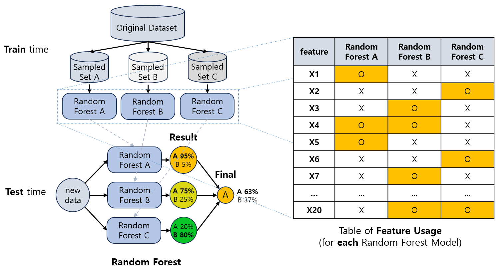
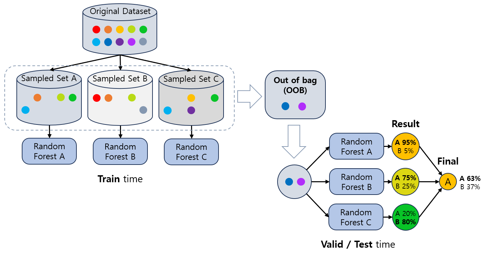

## 목차
* [1. Random Forest](#1-random-forest)
* [2. Random Forest 모델의 장단점](#2-random-forest-모델의-장단점)
* [3. Random Forest 모델 평가: Out-of-bag (OOB)](#3-random-forest-모델-평가-out-of-bag-oob)

## 1. Random Forest
**Random Forest** 의 핵심 아이디어는 다음과 같다.
* 서로 다른 [Decision Tree](머신러닝_모델_Decision_Tree.md) 를 **데이터 샘플 및 feature를 랜덤하게 선택** 하여 여러 개 생성
  * Decision **Tree** 가 여러 개이기 때문에 Random **Forest** 라고 부름
  * feature를 랜덤하게 선택한다는 것은 **전체 feature 중 특정 개수만큼 랜덤하게 선택** 하는 것을 의미
* 이들 Decision Tree에 대한 [Bagging 방식의 Ensemble](머신러닝_모델_Ensemble.md#2-2-bagging) 기법이다.

즉, **Random Forest = Decision Tree + Bagging (또는 Ensemble)** 이라고 할 수 있다.

## 2. Random Forest 모델의 장단점

Random Forest 모델의 장단점은 다음과 같다.

* 장점
  * Bagging의 특성상 overfitting 및 underfitting을 방지할 수 있음
  * Ensemble의 특성상 outlier에 의한 영향이 적음
  * 각 tree의 생성이 독립적이므로 병렬 처리 가능
* 단점
  * 단일 Decision Tree는 분기를 통해 예측의 근거를 쉽게 해석할 수 있으나, Random Forest에서는 그 장점이 사라짐 
  * 단일 Tree보다 소요되는 자원 (계산량 (→ 시간), 메모리) 이 많음
  * 하이퍼파라미터가 많으므로 최적화 시간이 오래 소요됨

| 단일 Decision Tree | Random Forest                                  |
|------------------|------------------------------------------------|
| max depth        | max depth **+ 트리 개수 + feature sampling ratio** |

## 3. Random Forest 모델 평가: Out-of-bag (OOB)

Random Forest 모델은 Bagging 방식이므로, 학습 데이터셋에 있는 sample 중 **실제로 학습에 사용되지 않은 sample** 이 존재할 수 있다.
* 이런 샘플을 **Out-of-bag (OOB)** 라고 한다.
* Out-of-bag 샘플들은 학습되지 않았기 때문에, **Random Forest 모델의 검증 및 테스트 데이터** 로 사용 가능하다.

Out-of-bag 에 속하는 데이터의 개수는 대략적으로 다음과 같다.
* $D \times (1 - r)^N$ 개
  * $D$ : 학습 데이터셋의 전체 데이터 개수
  * $r$ : Random Forest 에서의 각 Tree의 학습을 위한 데이터 sampling ratio
  * $N$ : Random Forest 에서 트리의 개수
* 예를 들어 전체 2만 개의 데이터를 각 트리마다 5% 씩 샘플링하고, 총 100개의 Tree로 Random Forest를 구성한다면 Out-of-bag에 속하는 데이터의 개수는 대략 다음과 같다.
  * $20000 \times (1 - 0.05)^{100}$
  * = 약 118.411 개

