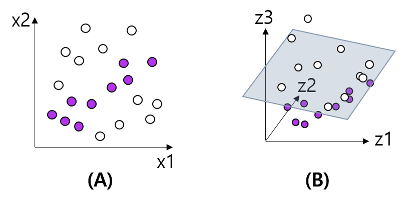

## 목차
* [1. SVM (Support Vector Machine) 이란?](#1-svm-support-vector-machine-이란)
* [2. SVM의 알고리즘](#2-svm의-알고리즘)
* [3. 커널 트릭 (kernel trick)](#3-커널-트릭-kernel-trick)

## 1. SVM (Support Vector Machine) 이란?
**SVM (Support Vector Machine)** 은 아래 그림 중 (B)와 같이 각 class 간의 구분을 위한 **'구분선'과 각 class에 속하는 원소들 간의 거리를 최대화**시키는 지도 학습 알고리즘이다.

즉, 각 class에 속하는 data point들과 거리가 가장 먼 구분선, 평면, 또는 초평면 (hyperplane) 을 선택하는 알고리즘이다.

위 그림을 보면, (A) 의 실선과 같은 구분선 (초평면) 을 사용하면 보라색과 흰색을 구분할 수 있지만, **이 구분선 (실선) 과 각 class에 속하는 원소들의 경계선을 나타내는 점선과의 거리의 2배 (=점선 사이의 거리) 에 해당하는 'margin'의 값**은 크지 않다. 이 상황에서 해당 모델은 흰색 data point와 아주 가까운 지점에 있지만 실선을 사이에 둔 새로운 데이터를 보라색으로 분류하고, 반대로 보라색 data point와 아주 가까이 있지만 실선을 사이에 둔 새로운 데이터를 흰색으로 분류한다.

한편, (B) 의 실선과 같은 구분선 (초평면) 을 사용하는 경우, 보라색과 흰색을 마찬가지로 잘 구분하면서도 앞서 언급한 margin의 값이 (A) 보다 훨씬 큰 것을 알 수 있다. 이 구분선을 사용하면 흰색 data point와 아주 가까이 있는 새로운 data point는 흰색 data point들과 구분선을 사이에 두지 않으므로 흰색으로 분류된다.

즉, Support Vector Machine은 **데이터에 노이즈 등이 있을 때 오분류할 수 있다는 문제를 해결**하는 머신러닝 알고리즘이다.

## 2. SVM의 알고리즘
SVM의 기본 알고리즘은 앞서 언급한 **margin (점선 사이의 거리) 을 최대화**하는 초평면을 찾는 것이다.
* 이를 통해 class의 구분선 (실선) 과 점선 사이의 거리도 최대화한다.
* 단, 주어진 dataset에 있는 데이터를 2개의 class로 완벽히 분류할 수 없는 경우에 error를 허용한다.

## 3. 커널 트릭 (kernel trick)
SVM에서는 데이터를 2개의 class로 완벽히 분류할 수 없지만 **커널 트릭 (kernel trick)**이라는 변형 방법을 통해 2개의 class로 완벽히 분류할 수 있는 경우가 있다.

예를 들어 위 그림의 (A) 에서 보라색과 흰색을 구분해야 하는 경우, 다음의 수식을 이용하여 데이터 분포를 위 그림의 (B) 와 같이 바꾸어서 해결할 수 있다. 위 그림의 (B) 에서는 1개의 2차원 평면을 이용하여 data point들의 class를 완벽히 구분할 수 있다.

* $(z_1, z_2, z_3) = (x_1, x_2, 0.75x_1 - x_2)$

이와 같이 **차원을 확장**, kernel trick을 이용하면 SVM을 이용하여 class를 구분할 수 있는 경우가 있다.