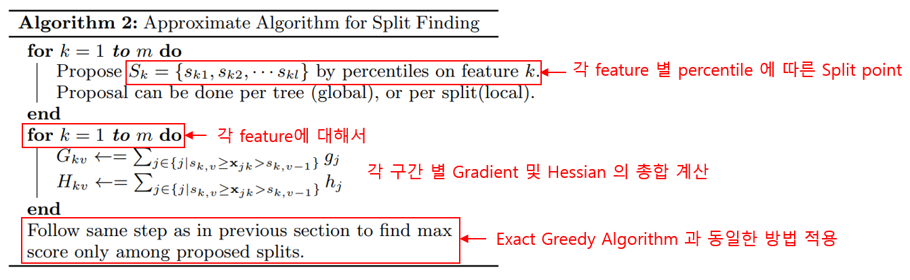
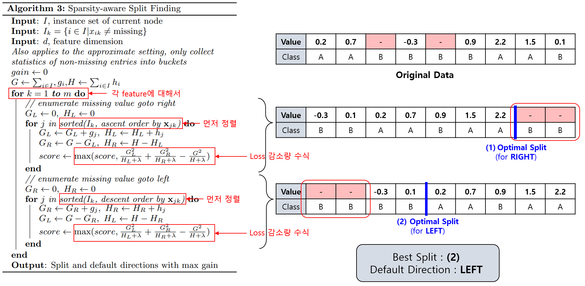

## 목차
* [1. XGBoost (eXtreme Gradient Boosting)](#1-xgboost-extreme-gradient-boosting)
* [2. XGBoost의 장단점](#2-xgboost의-장단점)
* [3. Gradient Boosting 및 그 문제점](#3-gradient-boosting-및-그-문제점)
* [4. 알고리즘 상세](#4-알고리즘-상세)
  * [4-1. Loss Function 의 Regularization](#4-1-loss-function-의-regularization) 
  * [4-2. CART (Classification and Regression Trees)](#4-2-cart-classification-and-regression-trees)
  * [4-3. 병렬 학습을 위한 Split 알고리즘](#4-3-병렬-학습을-위한-split-알고리즘)
    * Basic Exact Greedy Algorithm
    * Approximate Algorithm
  * [4-4. 결측치 데이터 처리](#4-4-결측치-데이터-처리)
    * Sparsity-aware Split Finding 
* [5. 하이퍼파라미터](#5-하이퍼파라미터)
  * [5-1. 기본 설정값 관련](#5-1-기본-설정값-관련) 
  * [5-2. 트리 구조 관련](#5-2-트리-구조-관련)
  * [5-3. overfitting 관련](#5-3-overfitting-관련)
  * [5-4. 기타 하이퍼파라미터](#5-4-기타-하이퍼파라미터)

## 1. XGBoost (eXtreme Gradient Boosting)
**XGBoost (eXtreme Gradient Boosting)** 은 [Ensemble (앙상블)](머신러닝_모델_Ensemble.md) 기법 중 [Boosting (부스팅)](머신러닝_모델_Ensemble.md#2-3-boosting) 방법을 적용한 모델 중 하나로, 핵심 아이디어는 다음과 같다.
* Boosting 기법 중 [Gradient Boosting](#3-gradient-boosting-및-그-문제점) 이 모델을 순차적으로 학습해야 하고, 이때 **병렬 학습이 안 된다는 점을 보완**
  * 병렬 학습을 위해, 데이터를 여러 부분 (subset) 으로 나누어 학습
* [Decision Tree](머신러닝_모델_Decision_Tree.md) 를 응용한 Regression 방식의 트리인 **CART (Classification and Regression Trees)** 를 사용

외부 링크 : [XGBoost 공식 논문](https://arxiv.org/pdf/1603.02754) 

## 2. XGBoost의 장단점
XGBoost의 장단점은 다음과 같다.

* 장점
  * 병렬 학습 가능 및 이로 인한 빠른 수행 시간
  * [Regularization](../Deep%20Learning%20Basics/딥러닝_기초_Regularization.md#l1-l2-regularization) 등을 통해 overfitting 을 방지할 수 있음
  * [자체적인 missing value (결측치) 처리 기능](#4-4-결측치-데이터-처리)
* 단점
  * 하이퍼파라미터가 많으므로 최적화에 시간이 오래 소요됨

## 3. Gradient Boosting 및 그 문제점
**Gradient Boosting** 은 Ensemble 기법 중 하나인 Boosting의 일종으로, 핵심 아이디어는 다음과 같다.
* 다음 학습할 모델로 **Residual (Loss Function의 negative gradient)** 값을 전달한다.

Residual에 대해 자세히 살펴보면 다음과 같다.

* **[Loss Function]** $L = \frac{1}{2} \times (y_i - f(x_i))^2$
  * $y_i$ : 실제 출력값
  * $x_i$ : 입력값
  * $f(x_i)$ : 모델의 예측값
* **[Gradient]** $\frac{\delta L}{\delta x_i} = f(x_i) - y_i$
* **[Residual]** $y_i - f(x_i)$ 
  * 실제 출력값과 예측값의 차이
  * $y_i - f(x_i) = -(f(x_i) - y_i)$ 이므로 이것을 **Negative Gradient** 라고 한다.

이 모델의 문제점은 **모델을 순차적으로 학습하므로 병렬 처리가 불가능** 하다는 것이다.

## 4. 알고리즘 상세

XGBoost에서는 다음과 같이 **CART (Classification and Regression Trees)** 와 **병렬 학습 (이를 위한 Split)** 을 적용한다.

| 구분                                                                                                                      | 목적             | 설명                                                                                                                                          |
|-------------------------------------------------------------------------------------------------------------------------|----------------|---------------------------------------------------------------------------------------------------------------------------------------------|
| Loss Function 에 [L2 와 유사한 Regularization](../Deep%20Learning%20Basics/딥러닝_기초_Regularization.md#l1-l2-regularization) 적용 | overfitting 방지 | - $Loss = \Sigma_i l(\hat{y}_i, y_i) + \Sigma_k \Omega(f_k)$  - $\Omega(f) = \lambda T + \frac{1}{2} \lambda w^2$                        |
| CART (Classification and Regression Trees)                                                                              |                | - **각 트리의 출력값 (연속된 숫자) 의 가중치 합** 으로 최종 예측값 결정 - 회귀 트리 (Regression Tree) 를 이용한 앙상블 (Ensemble)                                             |
| 병렬 학습 (Split)                                                                                                           | 모델 속도 향상       | 다음과 같이 4가지로 구분 - Basic Exact Greedy Algorithm - Approximate Algorithm - Weighted Quantile Search - Sparsity-aware Split Finding |
| 결측치 데이터 처리 알고리즘 (Sparsity-aware Split Finding)                                                                          | 결측치가 있는 데이터 학습 | - **모든 결측치를 왼쪽, 오른쪽으로 몰아서** 배치했을 때의 information gain 을 각각 계산 - **information gain이 가장 높은** split point를 탐색                               |

### 4-1. Loss Function 의 Regularization

XGBoost의 Loss Function에는 **overfitting 방지를 위하여 다음과 같이 [L2 Regularization](../Deep%20Learning%20Basics/딥러닝_기초_Regularization.md#l1-l2-regularization) 과 유사한 Regularization** 을 적용한다.

* **[수식]** $Loss = \Sigma_i l(\hat{y}_i, y_i) + \Sigma_k \Omega(f_k)$
  * $\Omega(f) = \lambda T + \frac{1}{2} \lambda w^2$
  * $l$ : 미분 가능한 convex loss function
  * $\hat{y}_i$ : $i$ 번째 데이터에 대한 prediction
  * $y_i$ : $i$ 번째 데이터에 대한 실제 값 (target)
  * $\Omega$ : **모델 (Regression Tree 등) 이 복잡해지는 것에 대해 페널티** 를 주는 역할

이것을 논문에서는 **Regularized Learning Object** 라고 한다.

### 4-2. CART (Classification and Regression Trees)

**CART (Classification and Regression Trees)** 의 핵심 아이디어는 다음과 같다.
* leaf node에 class 대신 숫자 값이 있는 **Regression Tree** 의 최종 출력값의 가중치 합으로 최종 예측
  * Regression Tree를 이용한 Ensemble 기법으로 볼 수 있음
* Decision Tree 의 leaf node가 **Class (Categorical)** 라면, CART 의 각 Tree의 leaf node는 **Numerical** 임

### 4-3. 병렬 학습을 위한 Split 알고리즘

XGBoost 에서 병렬 학습을 위해 사용되는 Split 알고리즘은 다음과 같다.

| 알고리즘                                            | 핵심 아이디어                                                                                                                                |
|-------------------------------------------------|----------------------------------------------------------------------------------------------------------------------------------------|
| Basic Exact Greedy Algorithm                    | - 모든 feature 각각에 대해, 모든 가능한 Split point 를 탐색 - **Loss 감소량이 최대화** 되는 Split point 를 선택                                                |
| Approximate Algorithm                           | - 각 feature 별로 **데이터 구간을 나누고, 각 구간별로 Gradient와 Hessian에 기반** 하여 최적의 Split point 탐색 - Basic Exact Greedy Algorithm 의 메모리 부족 등 문제점 보완 |
| Weighted Quantile Sketch (참고)                   | - 각 데이터에 weight이 부여되어 있을 때 사용                                                                                                          |
| [Sparsity-aware Split Finding](#4-4-결측치-데이터-처리) | - **모든 결측치를 왼쪽, 오른쪽으로 몰아서** 배치했을 때의 information gain 을 각각 계산 - **information gain이 가장 높은** split point를 탐색                          |

----

**1. Basic Exact Greedy Algorithm**

핵심 아이디어
* 모든 feature 에 대해 모든 가능한 Split point를 탐색하고, 이들 중 **Loss 감소량이 최대화되는 것을 찾아서** Split point를 선택한다.

([출처](https://arxiv.org/pdf/1603.02754) : Tianqi Chen and Carlos Guestrin, XGBoost: A Scalable Tree Boosting System, 2016)

**Loss 감소량** 계산의 핵심 아이디어

* **Loss가 낮다는 것은 information (정보량) 이 높다** 는 것을 의미하므로, 그 정보량의 계산값을 score 라고 할 때 다음을 이용한다.
  * (Loss 감소량) = (전체적인 Information Gain)
  * = (양쪽 leaf node 의 score 의 합) - (부모 node 의 score)
  * = **(왼쪽 leaf node 의 score) + (오른쪽 leaf node 의 score) - (부모 node 의 score)**
* 이 score 는 1차 편미분값 Gradient 와 2차 편미분값 Hessian 을 이용하여 다음과 같이 계산한다.
  * 각 node 에 해당하는 데이터 (row) 에 대해, 다음 수식 결과의 합산
    * $\frac{(Gradient)^2}{(Hessian) + \lambda}$ 

**Loss 감소량** 의 수식

([출처](https://arxiv.org/pdf/1603.02754) : Tianqi Chen and Carlos Guestrin, XGBoost: A Scalable Tree Boosting System, 2016)

* $I_L$, $I_R$ : Split 이후의 left, right left node 에 속한 데이터 (row) 의 집합
* $I$ : $I = I_L \cup I_R$
* $g_i$ : $i$ 번째 데이터의 Gradient
* $h_i$ : $i$ 번째 데이터의 Hessian
* $\lambda$ : Regularization parameter 로, 전체 score 를 줄이는 역할을 함. 이를 통해 $\gamma$ 의 역할과 결합하여 overfitting 을 방지한다. 
* $\gamma$ : Information Gain이 이 값보다 작으면 분기를 중단하여 overfitting 을 방지한다.

----

**2. Approximate Algorithm**

핵심 아이디어
* 각 feature 별로 **데이터를 여러 구간** 으로 나누어, **각 구간별로** 최적의 Split point 를 찾는다.
  * 이때 1차 미분값인 Gradient 과 2차 미분값인 Hessian 을 이용한다.
* 이를 통해 Exact Greedy Algorithm 을 적용했을 때 **메모리가 부족해서 진행이 불가능** 한 문제를 해결한다.

([출처](https://arxiv.org/pdf/1603.02754) : Tianqi Chen and Carlos Guestrin, XGBoost: A Scalable Tree Boosting System, 2016)

----

### 4-4. 결측치 데이터 처리

**XGBoost 에서 결측치 처리** 를 위해서는 **Sparsity-aware Split Finding 이라는 Split 알고리즘** 이 적용된다. 그 핵심 아이디어는 다음과 같다.
* 각 feature 별로 **모든 결측치를 왼쪽과 오른쪽으로 몰아넣었을 때**를 후보로 하여, 이들 중 최적 split point 탐색
  * 최적 split point 는 information gain이 가장 높은 split point를 의미
  * 이때, 해당 feature의 결측치가 아닌 데이터는 정렬된 상태

즉, 알고리즘을 요약하면 다음과 같다.

* 각 feature에 대해,
  * 먼저, 해당 feature의 결측치가 아닌 값들을 정렬한다.
  * 결측치를 왼쪽으로 몰아넣었을 때의 최적 split point 를 찾는다.
  * 마찬가지로 결측치를 오른쪽으로 몰아넣었을 때의 최적 split point 를 찾는다.
  * 이 최적 split point 중, information gain 이 더 높은 best split point 를 찾는다.
* 마지막으로, Best Split point 에 기반하여 각 feature 의 데이터를 Split 한다.

([출처](https://arxiv.org/pdf/1603.02754) : Tianqi Chen and Carlos Guestrin, XGBoost: A Scalable Tree Boosting System, 2016)

## 5. 하이퍼파라미터

[Python의 XGBoost 라이브러리](https://github.com/microsoft/LightGBM/tree/master/python-package) 를 기준으로, XGBoost를 구성하는 하이퍼파라미터는 다음과 같다.

| 구분             | 하이퍼파라미터                                                                               | 의미                                                                                                                                                                                   |
|----------------|---------------------------------------------------------------------------------------|--------------------------------------------------------------------------------------------------------------------------------------------------------------------------------------|
| 모델 기본 설정값 관련   | - booster - nthread - eta - num_boost_around - objective - eval_metric | - 모델 종류 (tree-based vs. linear)  - CPU 스레드 개수 - 학습률 - [Boosting](머신러닝_모델_Ensemble.md#2-3-boosting) 관점에서의 모델 학습 반복 횟수 - objective function (Loss Function) - 성능 metric |
| 트리 구조 관련       | - gamma - max_depth                                                                | - leaf node를 분할하기 위한 Loss 감소량의 최소값 - 트리의 최대 깊이                                                                                                                                    |
| Overfitting 관련 | - min_child_weight  - alpha - lambda                                            | - 각 leaf node가 포함해야 하는 최소 row의 개수 - L1 [Regularization](../Deep%20Learning%20Basics/딥러닝_기초_Regularization.md#l1-l2-regularization) 의 Lambda 값 - L2 Regularization 의 Lambda 값   |
| 기타             | - sub_sample - scale_pos_weight                                                    | - 각 Tree에서 샘플링되는 데이터의 비율 - [데이터 불균형](../Data%20Science%20Basics/데이터_사이언스_기초_데이터_불균형.md) 시 label 별 가중치 조절                                                                          |

### 5-1. 기본 설정값 관련

* booster
  * 모델의 종류
  * gbtree (트리 기반 모델), gblinear (선형 모델), dart (Dropout Additive Regression Trees) 중 하나
* nthread
  * 학습에 사용할 CPU 스레드 개수
* eta
  * 학습률 (Learning Rate)
  * 모델의 학습 속도를 나타내며, 클수록 빠른 학습
  * 단, 너무 크면 overfitting 의 위험이 있음
* num_boost_around
  * Boosting 관점에서, weak learner 의 학습 반복 횟수
* objective
  * Objective function (Loss function)
  * reg:squarederror (오차 제곱), binary:logistic (이진 분류), multi:softmax (Multi-class 분류) 등
* eval_metric
  * 성능 평가 metric
  * rmse (Root Mean Squared Error), mae (Mean Absolute Error) 등

### 5-2. 트리 구조 관련

* gamma
  * Leaf node를 추가로 분할하기 위한 Loss 감소량 (information gain) 의 최소값
  * overfitting 방지 목적으로 사용 가능
* max_depth
  * 트리의 최대 깊이
  * 너무 작은 값으로 하면 underfitting 발생 가능
  * 너무 큰 값으로 하면 overfitting 발생 가능

### 5-3. Overfitting 관련

* min_child_weight
  * 각 leaf node가 포함해야 하는 (그 leaf node에 해당하는) 최소 data row의 개수
  * 값이 작을수록 overfitting 발생 가능성 증가
* alpha, lambda
  * 각각 L1, L2 Regularization 에서 사용하는 Lambda 값

### 5-4. 기타 하이퍼파라미터

* sub_sample
  * 학습 시, 각 Tree 에서 샘플링하여 학습에 사용하는 데이터의 비율
  * 1보다 작은 값으로 지정하여 overfitting 을 방지할 수 있다.
* scale_pos_weight
  * 데이터 불균형 시 각 label 별 가중치를 조정하여 데이터 불균형에 따른 성능 저하 해결
  * **positive sample 에 대해 해당 값만큼을 배수로 하는** 가중치 부여
