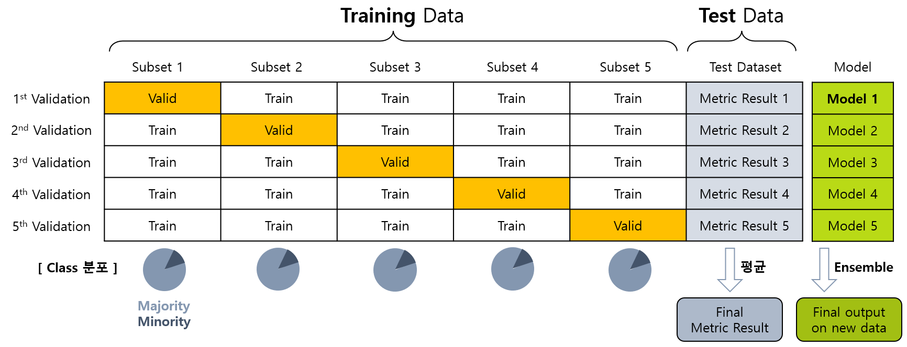

## 목차
* [1. Cross Validation](#1-cross-validation)
* [2. Cross Validation 사용 이유](#2-cross-validation-사용-이유)
* [3. K-Fold Cross Validation](#3-k-fold-cross-validation)
* [4. Startified K-Fold Cross Validation](#4-stratified-k-fold-cross-validation)
* [5. 다른 Validation 방법들](#5-다른-validation-방법들)
  * [5-1. Hold-out Validation](#5-1-hold-out-validation)
  * [5-2. Leave-p-Out Cross Validation](#5-2-leave-p-out-cross-validation)
  * [5-3. Leave-one-Out Cross Validation](#5-3-leave-one-out-cross-validation)
* [6. Time-Series Cross Validation](#6-time-series-cross-validation)

## 1. Cross Validation
**Cross Validation (교차 검증)** 은 머신러닝 모델 학습 시 **학습 데이터와 검증 데이터를 여러 번 나누어 검증** 하는 것을 말한다.
* 일반적으로 머신러닝에서 데이터는 [Train, Valid, Test 데이터로 나눈다.](머신러닝_방법론_Train_Valid_Test.md)

## 2. Cross Validation 사용 이유
Cross Validation 을 사용하는 이유 및 그 장단점은 다음과 같다.

* 사용 이유 (장점)
  * 모든 학습 데이터를 평가하므로, **validation data가 부족할 때 그 양을 늘리는** 효과가 있다.
  * 성능을 여러 번 검증하므로, 보다 **신뢰도 있는 성능 평가** 를 할 수 있다. (오차범위가 줄어든다.)
  * **overfitting을 해결** 할 수 있다.
    * 학습/검증 데이터 조합이 여러 가지이기 때문에 **결과적으로 모델을 여러 번, 모든 데이터를 학습** 하게 되기 때문이다. 
    * 이들 각 모델에 대해 Voting 등 [적절한 Ensemble](머신러닝_모델_Ensemble.md) 을 적용하면 된다. 
* 단점
  * 여러 번의 성능 검증에 시간이 오래 걸린다.

## 3. K-Fold Cross Validation

**K-Fold Cross Validation** 은 Cross Validation의 대표적인 방법 중 하나로, 다음과 같이 진행한다.
* 학습 데이터셋을 같은 크기의 K 개의 subset (Fold) 으로 나눈다.
* 각 subset 에 대해 다음을 반복한다.
  * 해당 subset 을 validation data 로, 나머지 (K - 1) 개의 subset 을 train data 로 지정
  * 모델 학습 및 성능 검증 실시

## 4. Stratified K-Fold Cross Validation

**Stratified K-Fold Cross Validation (계층별 K-Fold 교차 검증)** 은 [데이터 불균형](../Data%20Science%20Basics/데이터_사이언스_기초_데이터_불균형.md) 이 심한 데이터셋에서 사용할 수 있는 방법이다.
* 이 경우, 일반적인 K-Fold Cross Validation 으로 각 Fold 를 랜덤 분할하면, **Minority Class** 의 데이터가 표본 부족으로 인해 **각 Fold 에 고르지 않게 분포** 될 수 있다.
* 이를 해결하기 위해 **데이터 Class의 분포를 최대한 고르게 하여** K-Fold Cross Validation 데이터셋을 만든다.

## 5. 다른 Validation 방법들
### 5-1. Hold-out Validation
* 데이터셋을 **Train dataset, Test dataset 의 두 부분으로** 나눈다.
* Train dataset 을 통해서 학습한 모델을 Test dataset 을 통해 성능 평가한다.

### 5-2. Leave-p-Out Cross Validation

핵심 아이디어
* 전체 학습 데이터 n개 중 **p개의 sample 만을 validation data 로** 사용
* 이와 같이 구성할 수 있는 **모든 조합 (nCp 개)** 에 대해 테스트

단점
* p의 값이 커짐에 따라 학습 소요 시간이 거의 기하급수적으로 늘어난다.

### 5-3. Leave-one-Out Cross Validation

핵심 아이디어
* 전체 학습 데이터 n개 중 **1개의 sample 만을 validation data 로** 사용
* Leave-p-Out Cross Validation 에서 **p=1 일 때** 에 해당
* 이와 같이 구성할 수 있는 **모든 경우의 수 (n개)** 에 대해 테스트

장단점
* 장점
  * 데이터셋의 크기가 작을 때, (valid가 아닌) 학습 데이터를 최대한 늘림으로써 모델 성능을 그나마 최대한 끌어올릴 수 있다.
* 단점
  * 학습 소요 시간이 K-fold 의 K 배 (보통 5~10배) 보다 훨씬 큰 n 배 길어진다. 

## 6. Time-Series Cross Validation

핵심 아이디어
* 시계열 데이터의 경우, 일반적인 방식의 K-fold Cross Validation 을 적용하면 **validation 데이터가 나타내는 시점보다 미래의 데이터** 가 포함되는 문제가 발생한다.
  * 이로 인해 overfitting 등 문제가 발생할 가능성이 있다. 
* 이를 위해, **Training data를 Validation data 보다 과거를 나타내는 데이터만** 남긴다.

