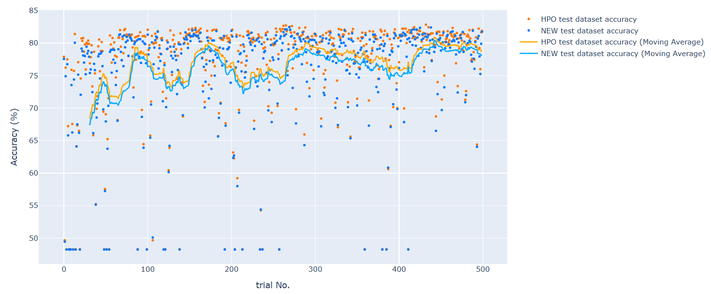

## 목차
* [1. 하이퍼파라미터 (Hyper-parameter)](#1-하이퍼파라미터-hyper-parameter)
* [2. 하이퍼파라미터 최적화 (튜닝)](#2-하이퍼파라미터-최적화-튜닝)
* [3. 하이퍼파라미터 최적화 방법론](#3-하이퍼파라미터-최적화-방법론)
  * [3-1. Grid Search, Random Search](#3-1-grid-search-random-search)
  * [3-2. Bayesian 최적화](#3-2-bayesian-최적화)
* [4. 하이퍼파라미터 최적화 라이브러리](#4-하이퍼파라미터-최적화-라이브러리)
  * [4-1. HyperOpt](#4-1-hyperopt)
  * [4-2. Optuna](#4-2-optuna)
  * [4-3. HyperOpt vs. Optuna](#4-3-hyperopt-vs-optuna)
* [5. 탐구: Test dataset 으로 최적화할 때의 Overfitting](#5-탐구-test-dataset-으로-최적화할-때의-overfitting)
  * [5-1. 데이터셋 및 모델](#5-1-데이터셋-및-모델)
  * [5-2. 실험 진행 방법 및 하이퍼파라미터](#5-2-실험-진행-방법-및-하이퍼파라미터)
  * [5-3. 실험 결과](#5-3-실험-결과)

## 코드
* [하이퍼파라미터 최적화 라이브러리](#4-하이퍼파라미터-최적화-라이브러리) 비교 코드 : [code (ipynb)](codes/Hyperparam_Opt_example.ipynb)
* [Test Dataset 으로 최적화 시 Overfitting 실험](#5-탐구-test-dataset-으로-최적화할-때의-overfitting) 코드 : [code (ipynb)](codes/Hyperparam_Opt_experiment.ipynb)

## 1. 하이퍼파라미터 (Hyper-parameter)
**하이퍼파라미터 (Hyper-parameter)** 는 머신러닝 알고리즘을 통해 직접 찾는 값이 아닌, **해당 알고리즘을 설계하는 데 있어서의 설정값** 을 의미한다.

대표적인 하이퍼파라미터는 다음과 같다.

| 구분                   | 하이퍼파라미터                                                                                                                                                                                                |
|----------------------|--------------------------------------------------------------------------------------------------------------------------------------------------------------------------------------------------------|
| 딥 러닝 (Deep Learning) | - hidden layer의 개수 및 각 layer에 있는 뉴런 개수<br>- 학습률 (Learning Rate)<br>- weight decay<br>- [L1, L2 Regularization](../Deep%20Learning%20Basics/딥러닝_기초_Regularization.md#l1-l2-regularization) 에서의 lambda 값 |
| 트리 기반 모델             | - 트리의 최대 깊이<br>- 각 Tree가 갖는 leaf node의 최대 개수                                                                                                                                                           |                                                                                                                                      
| 기타 주요 머신러닝 모델        | - [k-NN](머신러닝_모델_KNN.md) 에서의 K 값<br> - [K-means Clustering](머신러닝_모델_K-means_Clustering.md) 에서의 K 값                                                                                                     |                                                                                                                                                            
| 모델별 하이퍼파라미터          | 각 모델별, 해당 모델에서 사용하는 하이퍼파라미터                                                                                                                                                                            |                                                                                                                                                                           

## 2. 하이퍼파라미터 최적화 (튜닝)

하이퍼파라미터 최적화는 **하이퍼파라미터 튜닝 (Hyper-parameter tuning)** 이라고도 하며, **모델의 하이퍼파라미터를 특정 데이터셋에 최적화** 하는 것이다.

하이퍼파라미터 최적화가 필요한 이유는 다음과 같다.
* 각 하이퍼파라미터의 기본 설정값 또는 관습적으로 설정하는 값은 **원하는 데이터셋에 최적화가 되어 있지 않기** 때문이다.
* 각 데이터셋 별로 그 특성에 따라 **최적의 하이퍼파라미터가 다를 수 있기** 때문이다.
  * 데이터셋 크기에 따라 overfitting 방지를 위해 설정하는 특정 하이퍼파라미터의 최적 값이 다를 수 있다. 

**하이퍼파라미터 최적화는 test dataset 이 아닌 valid dataset 에서 해야 한다.**
* 이를 위해 valid dataset을 다음과 같이 구분할 수도 있다.
  * 특정 하이퍼파라미터 조합 하에서의 모델 학습용
  * 하이퍼파라미터 최적화 용
* **test dataset 으로 하이퍼파라미터를 최적화** 하면 **하이퍼파라미터에 대한 overfitting** 이 발생할 수도 있다. 

## 3. 하이퍼파라미터 최적화 방법론

널리 알려진 하이퍼파라미터 최적화 방법론은 다음과 같다.

| 방법론                   | 설명                                                                               |
|-----------------------|----------------------------------------------------------------------------------|
| Grid Search           | 지정된 하이퍼파라미터 범위 내에서 **바둑판 or 격자점 형태로 모든** 하이퍼파라미터 조합에 대해 테스트                      |
| Random Search         | 지정된 하이퍼파라미터 범위 내에서 **특정 횟수만큼 랜덤하게 하이퍼파라미터 조합을 생성** 하고, 그 조합에 대해 테스트              |
| Bayesian Optimization | **성능이 좋았던 하이퍼파라미터 조합과 거리가 가까운** 조합 위주로 탐색<br>- 확률적으로 성능이 좋을 것으로 예상되는 하이퍼파라미터를 탐색 |

### 3-1. Grid Search, Random Search

**Grid Search**
* 지정된 범위 내에서 바둑판 (격자점) 형태로 모든 하이퍼파라미터의 조합에 대해서 성능을 탐색한다.
* 이들 중 성능이 가장 높은 최적의 조합을 찾는다.
* **테스트할 하이퍼파라미터 개수가 커질수록 최적화 시간이 기하급수적으로 늘어난다.**

**Random Search**
* 지정된 범위 내에서 특정 횟수만큼 랜덤하게 하이퍼파라미터 조합을 생성한다.
* 생성된 조합들 중 마찬가지로 성능이 가장 높은 최적의 조합을 찾는다.


### 3-2. Bayesian 최적화

**Bayesian 최적화 (Bayesian Optimization)** 의 핵심 아이디어는 다음과 같다.
* 지금까지의 통계에 근거하여, 성능이 가장 좋았던 하이퍼파라미터의 조합과 거리가 가까운 조합 위주로 탐색한다.
* 이것은 **확률적으로 성능이 좋을 것으로 예상되는** 하이퍼파라미터이다.

Bayesian 최적화는 성능이 좋을 것으로 예상되는 쪽으로 하이퍼파라미터를 탐색하므로, **빠른 시간 내에 최적 성능에 가까운 하이퍼파라미터를 찾을 수 있다** 는 장점이 있다. 

----

Bayesian 최적화를 이해하기 위한 핵심 개념은 다음과 같다.

| 개념                               | 설명                                                                                                                                                                                                                                                        |
|----------------------------------|-----------------------------------------------------------------------------------------------------------------------------------------------------------------------------------------------------------------------------------------------------------|
| Surrogate Model                  | 하이퍼파라미터 조합을 입력값, 성능 metric 값을 출력값으로 하는 모델                                                                                                                                                                                                                 |
| Acquisiton Function              | Surrogate Model의 학습 데이터로 추가할 **다음 하이퍼파라미터 조합을 생성** 하는 함수<br>- Exploitation : 현재까지 **확률적으로 성능지표 값이 높았던 조합과 가까운** 거리의 조합으로 생성<br>- Exploration : 그 외의 **불확실성이 높은** 하이퍼파라미터 조합으로 생성<br>- 하이퍼파라미터 최적화를 진행하면서 **Exploration 보다는 Exploitation 의 시도 확률이 점차 높아짐** |

Acquisition Function에는 대표적으로 **EI (Expected Improvement)** 와 **POI (Probability of Improvement)** 가 있다.

----

**1. POI (Probability of Improvement)**

핵심 아이디어
* 새로운 하이퍼파라미터 조합에 의한 **예측 성능값 분포의 평균** 이 현재까지의 성능값의 최댓값보다 더 클 확률을 계산

수식
* 새로운 하이퍼파라미터 조합에 의한 **성능 개선 확률**
* **[성능 개선 확률]** $POI[x] = \frac{\mu(x) - f(x^+) - \xi}{\sigma(x)}$ 
* 수식 설명
  * $x$ : 새로운 하이퍼파라미터 조합
  * $x^+$ : 기존에 성능이 가장 좋았던 하이퍼파라미터 조합
  * $f(x^+)$ : 기존 성능의 최댓값
  * $\xi$ : 성능 개선 정도가 일정 수준 이상이 되어야 $POI[x] > 0$ 이 되도록 **성능 개선 정도를 보장하기 위한 상수**


* 위 그림에서는 $POI[x_1]$, $POI[x_2]$, $POI[x_3]$ 중 $POI[x_3]$ 이 가장 크므로, 다음 하이퍼파라미터 조합으로 $x_3$ 을 선택한다.

----

**2. EI (Expected Improvement)**

핵심 아이디어
* 해당 하이퍼파라미터 조합으로 성능이 어느 정도 개선될지를 확률적으로 계산
* **기존 POI가 단순히 최댓값보다 클 확률** 을 계산한다면, **EI 는 성능의 개선 정도를 추가적으로 고려** 하는 컨셉
  * 즉, **(새로운 하이퍼파라미터 조합에 의한 예상 최대 성능) - (현재 최대 성능)** 만큼의 가중치를 둔다.


* 위 그림에서는 $EI[x_1]$, $EI[x_2]$, $EI[x_3]$ 중 $EI[x_3]$ 이 가장 크므로, 다음 하이퍼파라미터 조합으로 $x_3$ 을 선택한다.

수식
* 새로운 하이퍼파라미터 조합에 의한 **성능 개선 정도의 기댓값**
* **[성능 개선 정도]** $EI[x] = E[\max {(f(x) - f(x^+), 0)}]$
  * $\sigma(x) > 0$ 이면, $EI[x] = (\mu(x) - f(x^+) - \xi) \Phi(Z) + \sigma(x) \phi(Z)$ 
  * $\sigma(x) = 0$ 이면, $EI[x] = 0$
* 수식 설명
  * $Z$
    * $\sigma(x) > 0$ 이면, $Z = \frac{\mu(x) - f(x^+) - \xi}{\sigma (x)}$
    * $\sigma(x) = 0$ 이면, $Z = 0$
  * $\Phi(z)$, $\phi(z)$
    * $\Phi(z)$ : $z$ 에 대한 누적 분포 함수
    * $\phi(z)$ : 표준정규분포 함수의 밀도 함수
  * $x$ : 새로운 하이퍼파라미터 조합 
  * $f(x)$ : 새로운 하이퍼파라미터에 의한 성능 값
  * $x^+$ : 기존에 성능이 가장 좋았던 하이퍼파라미터 조합
  * $f(x^+)$ : 기존 성능의 최댓값
  * $\xi$ : 성능 개선 정도가 일정 수준 이상이 되어야 $EI[x] > 0$ 이 되도록 **성능 개선 정도를 보장하기 위한 상수**

----

## 4. 하이퍼파라미터 최적화 라이브러리

하이퍼파라미터 최적화를 위한 Python 라이브러리로 잘 알려진 것은 다음과 같다.
* 더 많이 쓰이는 라이브러리는 **Optuna** 이다.

| 라이브러리                                            | 핵심 아이디어                                                                                                                                |
|--------------------------------------------------|----------------------------------------------------------------------------------------------------------------------------------------|
| [HyperOpt](https://github.com/hyperopt/hyperopt) | **Domain Space** 의 범위 내에서 **Optimization Algorithm** 을 통해 **Objective Function** 의 값을 최소화하는 하이퍼파라미터 조합 탐색                              |
| [Optuna](https://github.com/optuna/optuna)       | - **Objective Function** 대한 최적화를 나타내는 **Study** 가 있다.<br> - Study는 특정 하이퍼파라미터 조합으로 이에 따른 Objective Function의 값을 도출하는 **Trial** 을 반복한다. |

여기서는 [LightGBM](머신러닝_모델_LightGBM.md) 을 각 라이브러리를 이용하여 특정 데이터셋에 최적화하는 코드를 소개한다.

### 4-1. HyperOpt

**핵심 개념**

* Domain Space : 하이퍼파라미터 조합의 탐색 범위
* Optimization Algorithm : HyperOpt 의 하이퍼파라미터 최적화 알고리즘
* Objective Function : 그 값을 최소화하는 하이퍼파라미터 조합을 찾으려는 함수

**코드**

* Domain Space 정의
  * ```hp.loguniform``` : 범위 내에서 **로그 스케일로** 하이퍼파라미터 값 탐색
  * ```hp.quniform``` : 범위 내에서 **정수 범위의** 하이퍼파리미터 값 탐색

```python
domain_space = {
    'learning_rate': hp.loguniform('learning_rate', np.log(0.001), np.log(0.25)),
    'max_depth': hp.quniform('max_depth', 3, 15, q=1)
}
```

* Objective Function 정의
  * minimize 하는 방향으로의 loss 만 return 가능
  * status 를 함께 반환해야 함

```python
def objective_hyperopt(params):
    params['max_depth'] = int(params['max_depth'])

    model = lgb.LGBMClassifier(
        objective='multiclass',
        metric='multi_logloss',
        boosting_type='gbdt',
        num_iterations=100,
        verbosity=-1,
        **params
    )

    # [ Train ] ---> [ Train ] / [ Valid_lgbm ] 로 분리
    X_train_, X_valid_lgbm, y_train_, y_valid_lgbm =\
        train_test_split(X_train, y_train,
                         test_size=0.15,
                         random_state=2025)

    # LightGBM 용 eval_set 인 X_valid_lgbm, y_valid_lgbm 을 이용하여 LightGBM 모델을 valid
    model.fit(X_train_, y_train_,
              eval_set=[(X_valid_lgbm, y_valid_lgbm)])
    
    # HPO 용 valid set인 X_valid_hpo, y_valid_hpo 를 이용하여 하이퍼파라미터 조합 성능 테스트
    preds_hpo = model.predict(X_valid_hpo)
    accuracy_hpo = accuracy_score(preds_hpo, y_valid_hpo)

    print(f'[HPO] accuracy with {params} : {(100 * accuracy_hpo):6.2f} %')

    return {"loss": (-1) * accuracy_hpo, "status": STATUS_OK}
```

* 하이퍼파라미터 최적화 실시
  * ```fmin``` 함수를 이용하여 ```objective_hyperopt``` 함수의 return 값을 최소화하는 하이퍼파라미터 탐색
  * tpe = [Tree-Structured Parzen Estimator](https://arxiv.org/pdf/2304.11127)

```python
trials = Trials()
best_params_hyperopt = fmin(fn=objective_hyperopt,
                            space=domain_space,
                            algo=tpe.suggest, # tpe = Tree-Structured Parzen Estimator
                            max_evals=100,
                            trials=trials)
```

* 최적의 하이퍼파라미터 확인

```python
best_params_hyperopt["max_depth"] = int(best_params_hyperopt["max_depth"])
print(f'Best Parameters : {best_params_hyperopt}')
```

### 4-2. Optuna

**핵심 개념**

* Study : Objective Function 의 값을 최적으로 만드는 하이퍼파라미터 조합을 찾는 일련의 과정
* Trial : Study 안에서 특정 하이퍼파라미터 조합을 찾으려는 함수

**코드**

* Objective Function 정의
  * maximize 하는 방향으로의 성능지표 값 (Accuracy) 도 설정 가능
  * status 를 함께 반환할 필요 없음

```python
def objective_optuna(trial):
    params = {
        'learning_rate': trial.suggest_loguniform('learning_rate', 0.001, 0.25),
        'max_depth': trial.suggest_int('max_depth', 3, 15)
    }

    model = lgb.LGBMClassifier(
        objective='multiclass',
        metric='multi_logloss',
        boosting_type='gbdt',
        num_iterations=100,
        verbosity=-1,
        **params
    )

    # [ Train ] ---> [ Train ] / [ Valid_lgbm ] 로 분리
    X_train_, X_valid_lgbm, y_train_, y_valid_lgbm =\
        train_test_split(X_train, y_train,
                         test_size=0.15,
                         random_state=2025)

    # LightGBM 용 eval_set 인 X_valid_lgbm, y_valid_lgbm 을 이용하여 LightGBM 모델을 valid
    model.fit(X_train_, y_train_,
              eval_set=[(X_valid_lgbm, y_valid_lgbm)])
    
    # HPO 용 valid set인 X_valid_hpo, y_valid_hpo 를 이용하여 하이퍼파라미터 조합 성능 테스트
    preds_hpo = model.predict(X_valid_hpo)
    accuracy_hpo = accuracy_score(preds_hpo, y_valid_hpo)

    print(f'[HPO] accuracy with {params} : {(100 * accuracy_hpo):6.2f} %')

    return accuracy_hpo
```

* 하이퍼파라미터 최적화 실시
  * study 라는 객체 생성 후 해당 객체를 이용하여 최적화 진행

```python
study = optuna.create_study(direction="maximize")
study.optimize(objective_optuna, n_trials=100)
```

* 최적의 하이퍼파라미터 확인

```python
best_params_optuna = study.best_params
print(f'Best Parameters : {best_params_optuna}')
```

### 4-3. HyperOpt vs. Optuna

* 다음 관점에서 **Optuna 가 약간 더 우수** 하다고 할 수 있음
  * Objective function 의 최적화 방향을 최소화, 최대화 모두 가능
  * 코드가 비교적 간결함
* 실제로 라이브러리 사용자 수가 **Optuna가 더 많음**

|                    | HyperOpt                                                          | Optuna                              |
|--------------------|-------------------------------------------------------------------|-------------------------------------|
| Domain Space 정의    | Objective 함수 **외부**                                               | Objective 함수 **내부**                 |
| Objective Function | - args: parameter list<br> - return: {최소화하려는 loss, **STATUS_OK**} | - args: trial<br>- return: 최적화하려는 값 |
| 최적화 방향             | **최소화** 만 가능                                                      | **최소화, 최대화 모두** 가능                  |

## 5. 탐구: Test dataset 으로 최적화할 때의 Overfitting

실험 목적 및 핵심 아이디어
* Valid dataset 이 아닌 Test dataset 으로 하이퍼파라미터 최적화를 위한 성능지표를 계산했을 때, **새로운 데이터셋에서 overfitting 이 발생하는지** 알아본다.
* 하이퍼파라미터 최적화를 위한 모델 학습 반복 횟수 (Optuna 기준 Trial 횟수) 별 다음 데이터셋에서의 성능 차이의 추이를 비교한다.
  * HPO Test dataset (하이퍼파라미터 최적화를 위한 성능지표 계산용) 
  * New Test dataset (하이퍼파라미터 최적화 완료 후 진짜 성능 측정용)
  * **(New Test dataset 성능) < (HPO Test dataset 성능)** 이면 overfitting 을 의미한다.

### 5-1. 데이터셋 및 모델

**데이터셋**
* Scikit-learn 의 **CovType (나무 수종 분류)** 데이터셋 (약 58만 개 데이터) 에서 2만 개를 랜덤 추출
* 선정 이유
  * HPO Test dataset 에서의 성능과 New Test dataset 에서의 성능의 변별이 가능한 정도의 충분히 큰 크기
  * 하이퍼파라미터 종류가 많은 Tree 기반 모델을 적용하기에 적절한 Classification task 데이터셋

**모델**
* [**LightGBM**](머신러닝_모델_LightGBM.md) 모델
* 선정 이유
  * HPO 최적화를 실험하기에 충분히 많은 하이퍼파라미터
  * 1만 개 이상의 큰 데이터셋에서 우수한 성능 발휘
  * 빠른 모델 학습 속도

### 5-2. 실험 진행 방법 및 하이퍼파라미터

**실험 진행 방법**
* 데이터셋을 다음과 같이 구분
  * Train dataset (실제 모델 학습 시 일부를 valid dataset 으로 분리)
  * HPO Test dataset (하이퍼파라미터 최적화 용도)
  * New Test dataset (하이퍼파라미터 최적화 완료 후 실제 데이터 기준 성능 평가)
* HPO Test dataset 과 New Test dataset 의 성능 비교
  * 하이퍼파라미터 최적화를 위한 모델 학습 반복 횟수별 각 데이터셋의 성능 차이의 추이 비교
  * **(New Test dataset 성능) < (HPO Test dataset 성능)** 이면 overfitting 을 의미한다.

**성능지표 : Accuracy Score**
* 선정 이유
  * 3개 이상의 Class 가 있는 데이터셋에서 가장 직관적인 성능 지표

**사용 라이브러리**
* 하이퍼파라미터 최적화
  * HyperOpt
  * Optuna
* LightGBM 모델
  * LightGBM 의 LGBMClassifier 

**사용 하이퍼파라미터**
* learning_rate : LightGBM 모델의 학습률 (Learning Rate)
* max_depth : 트리의 최대 깊이
* num_leaves : 1개의 tree의 최대 leaf node 개수
* min_data_in_leaf : 각 leaf node가 나타내야 하는 최소한의 sample 개수
* lambda_l1, lambda_l2 : [L1, L2 Regularization](../Deep%20Learning%20Basics/딥러닝_기초_Regularization.md#l1-l2-regularization) 에서 각각 사용되는 Lambda 값

### 5-3. 실험 결과
**결론**
* 해당 데이터셋 실험에서는 HPO 에 따른 **overfitting 을 확인할 수 없었음**
* 다른 데이터셋이나 다른 모델을 이용하면 overfitting 이 발생할 수도 있을 것으로 추정
* 단, HPO 에 대한 overfitting 은 일반적으로 말하는 **Train vs. Test dataset 에 대한 overfitting 보다는 약할 것으로 추정**

**Overfitting 확인이 불가했음에도, 다른 데이터셋/모델로 진행 시 Overfitting 발생 가능 추정 근거**
* Hyper-parameter 가 Surrogate Model 을 위한 Metric 측정용 데이터에 최적화되어 있음
* 이것은 엄밀히 말하면 **새로운 테스트 데이터에 최적화된 것은 아님**
* **[25.02.26 23:20 추가]** [데이터 크기 1,500 개, 3,000 Trial 로 조정한 실험](codes/Hyperparam_Opt_experiment_2.ipynb) 결과, 하이퍼파라미터 최적화 관점에서의 Overfitting 이 나타난 것으로 보인다.

**HyperOpt 실험 결과 상세**
* 각 trial 별 Accuracy 그래프



* 각 trial 별 HPO metric test vs. new dataset 간 Accuracy 차이


**Optuna 실험 결과 상세**
* 각 trial 별 Accuracy 그래프


* 각 trial 별 HPO metric test vs. new dataset 간 Accuracy 차이

