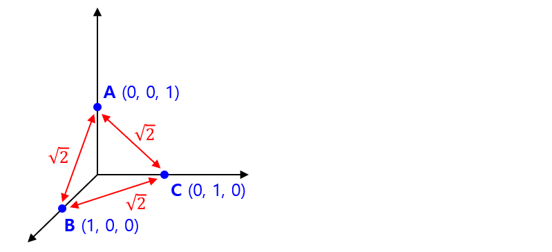

## 목차
* [1. One-Hot Encoding](#1-one-hot-encoding)
* [2. One-Hot Encoding 의 활용](#2-one-hot-encoding-의-활용)
  * [2-1. Categorical Feature](#2-1-categorical-feature) 
  * [2-2. NLP (자연어 처리)](#2-2-nlp-자연어-처리)
* [3. One-Hot Encoding 의 장단점](#3-one-hot-encoding-의-장단점)

## 1. One-Hot Encoding
**One-Hot Encoding (원 핫 인코딩)** 이란, 머신러닝을 통해 학습할 데이터셋의 각 데이터 (row) 를 다음과 같은 배열 형태로 변환하는 것이다.
* 특정 index 에만 1을 할당
* 나머지 모든 index 에는 0을 할당

예를 들어 ```[0, 0, 0, 1, 0, 0]``` 은 index 3에만 1이 할당되어 있고, 나머지 모든 index에는 0이 할당되어 있으므로 One-Hot Encoding 된 배열의 형태이다.

One-Hot Encoding 의 핵심은 **숫자가 아닌 값을 머신러닝 알고리즘이 학습할 수 있는 여러 개의 숫자 형태로 바꿔 주는** 것이다.

## 2. One-Hot Encoding 의 활용
One-Hot Encoding 은 일반적으로 다음과 같이 사용된다.
* Categorical Feature 에 대해, 그 값을 각 Category 별로 해당 Category 이면 1, 아니면 0 의 배열로 변환한다.
* NLP (자연어 처리) 에서, 각 단어 (token) 를 해당 단어와 매칭되는 index 이면 1, 다른 index 이면 0 의 배열로 변환한다.

### 2-1. Categorical Feature
Categorical Feature 를 표현하기 위해서 One-Hot Encoding 을 하는 원리는 다음과 같다.
* 각 Class 를 이에 대응되는 하나의 index 로 mapping
* 데이터셋 내부의 각 데이터의 해당 feature 의 값을 다음과 같은 형태의 배열로 대체
  * 해당 feature 가 나타내는 Class 에 해당하는 index 는 1
  * 나머지 모든 index 는 0
  * (배열의 크기) = (해당 feature 가 가질 수 있는 모든 Class 의 개수)
* input feature, target feature 모두 적용 가능하다.

**[ 특징 ]**

각 Category 를 나타내는 배열을 벡터라고 할 때, 이들 간 거리가 $\sqrt{2}$ 로 모두 서로 일정하다.
* 각 Category 간 '의미적 거리'가 일정한 것으로 해석해야 할 때 적절하다.



**[ 예시 ]**

다음의 데이터셋에서 **주요 사용 언어** 및 **개발자 유형** 은 Categorical feature 이다.

| LLM 사용량<br>(input feature) | 주요 사용 언어<br>(input feature) | 개발자 유형<br>(target feature) |
|----------------------------|-----------------------------|----------------------------|
| 20                         | Python                      | 머신러닝 개발자                   |
| 22                         | C++                         | 머신러닝 개발자                   |
| 24                         | C++                         | 프론트엔드 개발자                  |
| 17                         | Spring                      | 백엔드 개발자                    |
| 8                          | JavaScript                  | 프론트엔드 개발자                  |
| 35                         | Python                      | 머신러닝 개발자                   |
| 32                         | Python                      | 백엔드 개발자                    |
| 27                         | Kotlin                      | 안드로이드 앱 개발자                |

여기서 이들 각각을 One-Hot Encoding 으로 변환하면 다음과 같다.
* 주요 사용 언어
  * index 0 ~ 4 는 각각 Python, C++, Spring, JavaScript, Kotlin 에 대응
* 개발자 유형
  * index 0 ~ 3 은 각각 머신러닝, 프론트엔드, 백엔드, 안드로이드 앱 개발자에 대응 

| LLM 사용량<br>(input feature) | 주요 사용 언어<br>(input feature) | 개발자 유형<br>(target feature) |
|----------------------------|-----------------------------|----------------------------|
| 20                         | ```[1, 0, 0, 0, 0]```       | ```[1, 0, 0, 0]```         |
| 22                         | ```[0, 1, 0, 0, 0]```       | ```[1, 0, 0, 0]```         |
| 24                         | ```[0, 1, 0, 0, 0]```       | ```[0, 1, 0, 0]```         |
| 17                         | ```[0, 0, 1, 0, 0]```       | ```[0, 0, 1, 0]```         |
| 8                          | ```[0, 0, 0, 1, 0]```       | ```[0, 1, 0, 0]```         |
| 35                         | ```[1, 0, 0, 0, 0]```       | ```[1, 0, 0, 0]```         |
| 32                         | ```[1, 0, 0, 0, 0]```       | ```[0, 0, 0, 0]```         |
| 27                         | ```[0, 0, 0, 0, 1]```       | ```[0, 0, 0, 1]```         |

위와 같이 다시 정리된 데이터셋에서, One-Hot Encoding 은 실질적으로 다음과 같은 효과를 갖는다.
* input feature '주요 사용 언어' 를 5개의 column 으로 확장
  * 주요 사용 언어가 'Python' 이면 1, 그렇지 않으면 0
  * 주요 사용 언어가 'C++' 인가?
  * 주요 사용 언어가 'Spring' 인가?
  * 주요 사용 언어가 'JavaScript' 인가?
  * 주요 사용 언어가 'Kotlin' 인가?
* output feature '개발자 유형' 을 4개의 column 으로 확장
  * 개발자 유형이 '머신러닝 개발자' 이면 1, 그렇지 않으면 0
  * 개발자 유형이 '프론트엔드 개발자' 인가?
  * 개발자 유형이 '백엔드 개발자' 인가?
  * 개발자 유형이 '안드로이드 앱 개발자' 인가?

### 2-2. NLP (자연어 처리)
자연어 처리에서 단어 또는 형태소 (token) 를 One-Hot Encoding 으로 처리하는 원리는 다음과 같다.
* token 의 사전을 만들고, 각 token 별로 index 를 지정하여 대응시킨다.
* 문장에 있는 각 token 을 다음과 같은 형태의 배열로 대체한다.
  * 크기는 token 사전에 있는 token 의 가짓수
  * 해당 token 에 대응되는 index 는 1
  * 대응되지 않는 모든 index 는 0

자세한 것은 [Word Embedding 문서](../../Natural%20Language%20Processing/Basics_Word%20Embedding.md) 참고.

## 3. One-Hot Encoding 의 장단점
One-Hot Encoding 의 장단점은 다음과 같다.

* 장점
  * 배열 (벡터) 로의 표현이 직관적이고 간단함
  * 각 Class 를 나타내는 배열을 벡터라고 할 때, 이 벡터 간 거리가 일정함 
    * 단, 각 Class 간 '의미적 거리'가 서로 같지 않다고 해석해야 할 때는, 이것이 오히려 단점이 됨 

* 단점
  * column 이 너무 많아지고, 이로 인해 [차원의 저주](../Data%20Science%20Basics/데이터_사이언스_기초_차원의_저주.md) 발생
  * Category 의 종류가 너무 많을 때와 같이 **벡터의 차원이 너무 큰** 경우, 모델이 **실제 학습하는 데이터는 Sparse Data** 가 됨
    * LightGBM 에는 [이를 보완할 수 있는 알고리즘](머신러닝_모델_LightGBM.md#4-2-efb-exclusive-feature-bundling)이 있음 

* One-Hot Encoding 사용이 적절한 경우
  * Category 의 종류의 수가 많지 않을 때
  * 서로 다른 Category 간 '의미적 거리'가 서로 같다고 해석해야 할 때