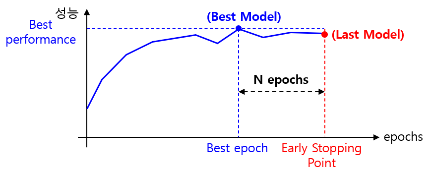

## 목차
* [1. Train, Valid, Test 데이터셋](#1-train-valid-test-데이터셋)
  * [1-1. 비유적 설명](#1-1-비유적-설명)
* [2. Train, Valid, Test 데이터셋 분리 비율](#2-train-valid-test-데이터셋-분리-비율)
* [3. Overfitting 과 Early Stopping](#3-overfitting-과-early-stopping)
* [4. Train Dataset 을 Shuffle 하는 이유](#4-train-dataset-을-shuffle-하는-이유)

## 1. Train, Valid, Test 데이터셋

머신러닝에서 데이터를 학습시킬 때, 데이터를 일반적으로 다음과 같이 구분한다.

* Training Dataset
  * 모델의 실제 학습에 사용되는 데이터셋
* Valid Dataset
  * 모델의 학습 도중의 성능 평가 및 모델 개선을 위한 하이퍼파라미터 조정에 사용되는 데이터셋
  * Valid Dataset 없이 Test Dataset 의 결과를 이용하여 하이퍼파라미터를 조정해 나가면, **Test Dataset 성능은 좋지만 Test Dataset 과 별개의 새로운 데이터셋에서의 성능이 좋지 않을 수 있다. ([Overfitting](../Deep%20Learning%20Basics/딥러닝_기초_Overfitting_Dropout.md#2-딥러닝에서의-오버피팅-overfitting))**
* Test Dataset
  * 모델의 성능을 실제 측정하기 위한 데이터셋

**이때, Training Dataset, Valid Dataset, Test Dataset 에는 서로 중복되는 데이터가 있으면 안 된다.** 모델의 실제 성능을 측정할 수 없기 때문이다.

Validation Dataset 이 사용되는 경우는 다음과 같다.
* 딥 러닝에서 **overfitting을 방지하기 위한 학습 중단 시점** 결정에 사용
  * 모델은 여러 epoch 동안 학습된다.
  * 각 epoch 마다, Validation Dataset 을 통해 성능을 측정한다.
  * 성능이 일정 횟수의 epoch 동안 신기록을 달성하지 못하면 학습을 중단한다.
* 딥 러닝 이외에도, 각종 모델 최적화에 사용
  * 사람이 직접 하이퍼파라미터나 모델 구조 등을 변경해 가면서 성능을 테스트할 때
  * [라이브러리를 이용한 자동적인 하이퍼파라미터 최적화 방법](머신러닝_방법론_HyperParam_Opt.md#4-하이퍼파라미터-최적화-라이브러리) 에서 사용

### 1-1. 비유적 설명

흔히 다음과 같이 **머신러닝 모델을 수능 수험생, 데이터셋을 수능/모의고사/변형 문제** 에 비유한다.

| 데이터셋          | 비유                      |
|---------------|-------------------------|
| Train Dataset | 문제집에 있는 기출문제 및 기출 변형 문제 |
| Valid Dataset | 정기적으로 치르는 모의고사          |
| Test Dataset  | 마지막에 치르는 수능 시험          |

## 2. Train, Valid, Test 데이터셋 분리 비율

Train, Valid, Test 데이터를 분리하는 전략은 다음과 같다.
* Train data 와 Test data 로만 분리
* Train, Valid, Test 데이터셋으로 분리
  * 원본 데이터셋에 Train data 와 Test data 만 있는 경우, Train data 를 처음부터 또는 모델 학습 시 모델 내부적으로 그 일부를 Valid data 로 분리한다.

## 3. Overfitting 과 Early Stopping

* Training Data 로만 학습을 계속하다 보면 Overfitting 이 발생할 수 있는데, 이를 방지하기 위해 Early Stopping 을 사용한다.
* **Early Stopping 시점 결정에 Valid dataset 이 사용** 된다.
  * 최고의 성능지표를 기록한 후 N epoch (N은 일정한 값) 동안 성능 신기록이 없으면 학습을 종료한다.
  * 따라서, **최고 성능의 모델은 학습 중단 시점이 아닌, 그보다 N epochs 만큼 전의 모델** 이다.



## 4. Train Dataset 을 Shuffle 하는 이유

머신러닝 학습 코드를 보면, 다음과 같이 Valid, Test 데이터셋이 아닌 **Train Dataset 에서만큼은 데이터 순서를 섞는 Shuffle 을 적용** 한다. 그 이유는 다음과 같다.

```python
train_loader = DataLoader(train_dataset, batch_size=TRAIN_BATCH_SIZE_GLASS, shuffle=True)
valid_loader = DataLoader(valid_dataset, batch_size=VALID_BATCH_SIZE, shuffle=False)
test_loader = DataLoader(test_dataset, batch_size=TEST_BATCH_SIZE, shuffle=False)
```

* **학습하는 각 batch** 가 전체 데이터를 대표할 수 있는 **대표성** 을 갖게 하기 위함 
  * 이를 통해 [Overfitting](../Deep%20Learning%20Basics/딥러닝_기초_Overfitting_Dropout.md#2-딥러닝에서의-오버피팅-overfitting) 등을 방지
* 데이터 순서로 인해 학습에 지장이 생길 수 있음
  * 예를 들어, 한 epoch 에서 Class 가 dog 인 데이터가 계속 나온 다음에 cat 인 데이터가 계속 나오면, **cat 을 학습할 때 Loss가 급격히 증가하는 등의 현상** 이 발생할 수 있는데, 이는 학습에 지장을 주는 것임 
* 모델이 **데이터의 순서마저 학습하는 것을 방지** (추정)
  * 예를 들어, Class 가 dog 인 데이터만 계속 나온다면 dog 의 다음 학습 데이터는 dog 일 확률이 매우 높다고 판단할 수 있음