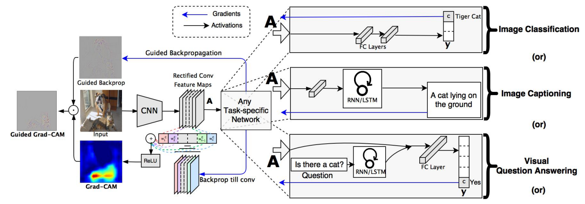

# An XAI method for convolutional neural networks in self-driving cars
다음 논문에서 쓰인 기술에 대해 기본 원리 및 사용 이유 파악
* **[An XAI method for convolutional neural networks in self-driving cars](https://journals.plos.org/plosone/article?id=10.1371/journal.pone.0267282)**

## 이미지 설명/해석 알고리즘

### SHAP
**SHAP (SHapley Additive exPlanations)** [Paper](https://arxiv.org/pdf/1705.07874.pdf)

**기본 아이디어** : 섀플리 값과 feature 간 독립성
* 섀플리 값 : 각 feature 또는 feature 조합의 기여도를 다음과 같이 계산한다.
  * ```(모델의 모든 feature 조합) - (특정 feature를 제외한 feature 조합)``` 의 평균 계산
  * feature 조합의 기여도는 각 feature별로 계산한 이 값들의 합이다.
* feature 간 독립성 : 각 feature별 계산값의 합을 계산한다.

**feature importance와의 차이점** : feature importance는 feature의 변화의 영향력을 계산하지만, SHAP는 **feature 간 의존성** 을 추가로 고려한다.

**SHAP의 종류**
* Kernel SHAP : Model-Agnostic (어떤 모델이든 상관없이 적용 가능), Linear LIME + Shapley values
* Linear SHAP, Low-Order SHAP, Max SHAP : Model-Specific
* Deep SHAP : Model-Specific, DeepLIFT + Shapley values

### LIME
**LIME (Local Interpretable Model-agnostic Explanations)** [Paper](https://arxiv.org/pdf/1602.04938.pdf)
**기본 아이디어** : 특정 예측값 부근에서 설명력이 높은 (locally faithful) 설명 가능한 모델을 찾는다.
* f, g, p(x)가 각각 설명하려는 모델, 임의의 설명 가능한 모델, p(x)가 특정 point x에 얼마나 가까운지를 나타내는 값이라고 할 때, 다음을 minimize 하는 모델 g를 찾는다.
  * **L(f, g, p(x)) + O(g)**
  * L(f, g, p(x)) 은 근접도 p(x)를 고려한 f에 대한 g의 설명에서의 일종의 오차 함수, O(g) 는 모델의 복잡도이다.

**SHAP과의 차이점** : 특정 관측값에 대해, SHAP은 섀플리 값 측정 결과에 따라 가중치가 부여되지만, LIME은 관측치가 원본 데이터와의 거리가 가까울수록 가중치가 크다.

### Grad-CAM
**Grad-CAM (Gradient-weighted Class Activation Mapping)** [Paper](https://arxiv.org/pdf/1610.02391.pdf)

(출처 : Ramprasaath R. Selvaraju, Michael Cogswell et al, Grad-CAM: Visual Explanations from Deep Networks via Gradient-based Localization)

**기본 아이디어** : **CNN의 layer, 특히 마지막 convolutional layer로의 gradient 값** 에 근거하여 각 뉴런의 중요도를 파악한다.
* class를 구분하는 softmax 직전의 예측 score의, convolutional layer의 feature map에 대한 gradient를 계산한다.  
* 이 예측 score를 증가시킬 수 있는 픽셀을 표시하기 위해, 양의 값일 때만 +가 되는 ReLU 활성화 함수를 적용한다. (위 그림의 ReLU 부분)  

### XCNN
**XCNN (eXplainable CNN, Interpretable CNN)** [Paper](https://arxiv.org/pdf/2007.06712.pdf)

**기본 아이디어** : 어떤 이미지 X에 대해 먼저 Encoder-Decoder Heatmap Generator를 거쳐서 설명/해석 가능한 Heatmap I(x)를 생성한 후, 이것을 Discriminator CNN을 통해 분류하게 한다.
* **I(x) = Tanh(Decode(Encode(x)))**
* CNN의 분류에서의 loss function은 **loss = log(D(I(x)))** 이다.
* Encoder와 Decoder를 이용한 heatmap 생성 부분과 해당 heatmap에 대한 Discriminator가 있다는 점에서 GAN (Generative Adversarial Network) 을 떠올릴 수 있다.

## 기타 생각
해당 논문을 저술할 당시에는 Fig. 7의 our method (본인이 고안한 방법) 이 표지판 이미지들을 잘 설명할 수 있다고 생각했는데, SHAP 역시 일정 부분 설명하고 있는 것을 확인할 수 있다.
