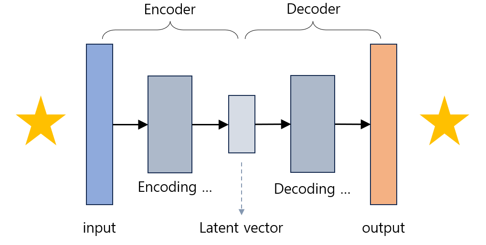
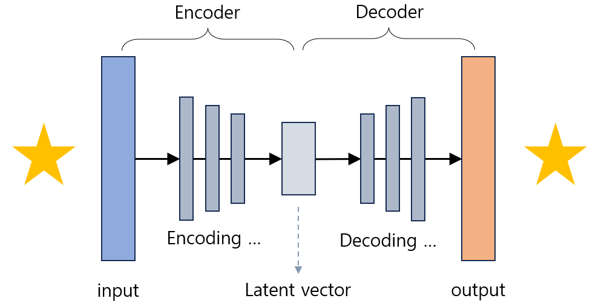
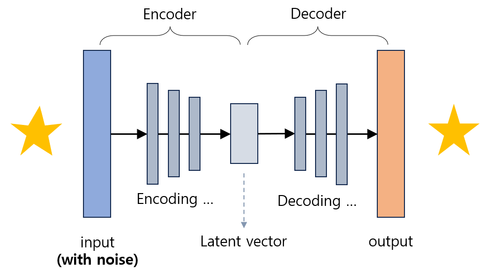

# Auto Encoder

## Auto Encoder (AE) 란?
**AutoEncoder (AE, 오토인코더)** 는 비지도 학습 (unsupervised learning) AI의 일종으로, 입력 데이터에 대한 출력값이 없는 데이터에 대해 그 특징을 추출하거나 생성형 AI를 만들기 위해 사용하는 신경망이다.

AutoEncoder의 구조는 **서로 동일한 입력과 출력** 을 가지며, 가운데의 latent vector 를 중심으로 좌우 대칭을 이룬다.
* **Encoder (인코더)** : 입력과 latent vector 사이의 신경망으로, 입력을 latent vector로 변환한다.
* **Decoder (디코더)** : latent vector 와 출력값 사이의 신경망으로, latent vector 에 해당하는 벡터의 숫자 값들을 출력값으로 변환한다.
  * 출력값은 AutoEncoder의 학습 데이터에 있는 데이터와 유사한 형태이므로, latent vector를 조작하면 **생성형 AI처럼 유사한 데이터를 생성** 할 수 있다.
* 입력과 출력이 **서로 동일하기** 때문에 label이 불필요하므로, Auto-Encoder는 **비지도학습** 방법이다.

데이터 특징 분석, 생성형 AI 이외에도 anomaly detection 목적으로 Auto-Encoder를 학습시킬 수 있다.

## Auto Encoder의 작동 원리

**충분히 학습된 Auto-Encoder** 에 대해, Encoder와 Decoder 각각의 역할은 상술한 바와 같다.

입력 데이터를 $x$, latent vector를 $z$, 출력 데이터를 $\hat {x}$ 라고 할 때, **Auto-Encoder의 Loss** 는 다음과 같다.
* loss = $||x - \hat{x}||^2$ = $||x - decoder(z)||^2$ = $||x - decoder(encoder(x))||^2$ (오차의 제곱의 합에 비례)
* 여기서 $||A||^2$ 는 2d norm 을 의미한다.
* 일반적인 딥러닝에서 사용하는 loss function과 큰 차이가 없는 것을 알 수 있다.

### Stacked Auto-Encoder

**Stacked Auto-Encoder** 는 Encoder 또는 Decoder만 따로 떼어 놓고 보아도 딥 러닝 모델에 해당하는 Auto-Encoder 라고 할 수 있다. 즉 **Encoder와 Decode에 은닉층이 있는** 오토인코더이다.

* **Encoding** : 입력으로 들어온 고차원의 데이터가 hidden layer를 포함한 encoder를 거쳐 저차원의 latent vector로 변환된다.
* **Decoding** : 저차원의 latent vector가 hidden layer를 포함한 decoder를 거쳐 고차원의 데이터로 복원된다.

## Denoising Auto-Encoder (DAE)

**Denoising Auto-Encoder (DAE)** 는 입력 데이터에만 약간의 **noise를 추가** 하여, noise가 **있는** 입력에 대해 noise가 **없는** 출력을 복원하도록 학습시키는 AutoEncoder를 말한다.
* **Denoising** 은 입력 데이터에 있는 noise를 출력 데이터에서 제거하는 것에 대해 학습한다는 뜻이다.
* Denoising Auto-Encoder가 노이즈가 있는 입력으로부터 노이즈가 없는 출력값을 학습할 때의 loss를 **reconstruction error** 라고 한다.
* 입력에 noise를 추가함으로써 **Auto-Encoder가 의미 있는 feature를 학습** 하게 할 수 있다.

## Convolutional Auto-Encoder
Convolutional Neural Network (CNN) 과 Auto-Encoder의 결합 형태로, Auto-Encoder의 Encoder 및 Decoder가 CNN 형태로 구성되어 있는 것을 말한다. 따라서 latent vector로부터 **이미지를 생성** 할 수 있으므로, 이미지를 생성하는 생성형 AI에 활용할 수 있다.

## Variational Auto Encoder (VAE)
**Variational Auto Encoder (VAE)** 는 기존 Auto-Encoder에서의 latent vector를 구성하는 각 feature의 평균 및 분산을 이용하여 해당 feature들에 대한 확률 분포를 만들고, 이를 이용하여 새로운 데이터를 생성한다.

기존의 Auto-Encoder와는 약간 다르지만 구조적으로 유사하다. 즉 **Auto-Encoder와는 다르다.**