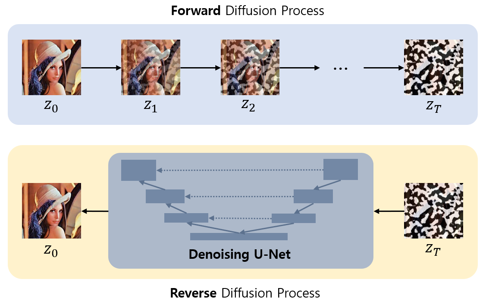
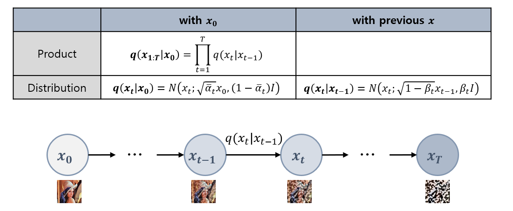

## 목차

* [1. Diffusion Model 이란?](#1-diffusion-model-이란)
* [2. Diffusion Model 의 핵심 아이디어](#2-diffusion-model-의-핵심-아이디어)
* [3. Diffusion Model 의 구성](#3-diffusion-model-의-구성)
  * [3-1. Forward Diffusion Process](#3-1-forward-diffusion-process)
  * [3-2. Reverse Diffusion Process](#3-2-reverse-diffusion-process)
  * [3-3. Sampling Process](#3-3-sampling-process)
* [4. Diffusion Model 의 Loss Function](#4-diffusion-model-의-loss-function)

## 참고 문헌

* [Marvik, "An Introduction to Diffusion Models and Stable Diffusion", 2023.11.28](https://blog.marvik.ai/2023/11/28/an-introduction-to-diffusion-models-and-stable-diffusion/)

## 1. Diffusion Model 이란?

Diffusion Model 은 다른 이미지 생성형 AI와 마찬가지로, **학습 데이터를 통해 학습 후, 그 데이터와 유사한 데이터 (특히 이미지) 를 생성** 하는 모델이다.

* [Forward Diffusion Process](#3-1-forward-diffusion-process) 에서 **Noise 가 '점차 확산'** 되기 때문에 Diffusion 이라는 이름이 붙었다.
* 2025 수능 국어 영역 '노이즈' 지문으로 등장했다.

## 2. Diffusion Model 의 핵심 아이디어

Diffusion Model 의 핵심 아이디어는 다음과 같다.

| 과정                                                          | 설명                                                                                          |
|-------------------------------------------------------------|---------------------------------------------------------------------------------------------|
| [Forward Diffusion Process](#3-1-forward-diffusion-process) | 학습 데이터에 **단계적으로 Gaussian Noise** 를 추가                                                       |
| [Reverse Diffusion Process](#3-2-reverse-diffusion-process) | Noise가 추가된 데이터로부터 **원본 데이터를 복원하는 방법** 을 학습 - **단계적으로** 진행되는 **Noising Process 를 역으로 학습** |

## 3. Diffusion Model 의 구성

Diffusion Model 의 구성을 그림으로 나타내면 다음과 같다.

* Reverse Diffusion Process 에서는 이미지 복원 모델로 [U-Net](../Image%20Processing/Model_U-Net.md) 을 많이 사용한다.

### 3-1. Forward Diffusion Process

**Forward Diffusion Process** 는 **Markov Chain 의 개념을 이용** 하여 학습 데이터에 **단계적으로 Noise 를 추가** 하는 과정이다.

* timestep $t (t = 0, 1, ..., T)$ 에서의 이미지에 추가적으로 noise 를 추가하여 timestep $t+1$ 에서의 이미지를 생성하는 방식이다.
* **timestep 이 길어질수록 Noise 가 증가하고, 원본 이미지의 형태를 점점 더 알아볼 수 없게** 된다.

* 수식 notation 설명

| notation              | 설명                                                   |
|-----------------------|------------------------------------------------------|
| $q$                   | approximate posterior (사후 확률 분포)                     |
| $t = 0,1,...,T$       | timestep (매 timestep 마다 noise 추가)                    |
| $T$                   | 전체 timestep 횟수                                       |
| $\beta_t$             | forward process variance **(학습을 통해 최적화됨)**           |
| $\alpha_t$            | $\alpha_t = 1 - \beta_t$                             |
| $\overline{\alpha_t}$ | 최초 timestep 부터 현재 timestep 까지의 **모든 $\alpha_t$ 의 곱** |

### 3-2. Reverse Diffusion Process

### 3-3. Sampling Process

## 4. Diffusion Model 의 Loss Function
