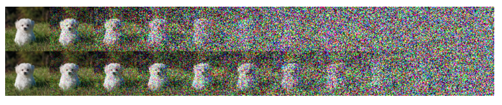
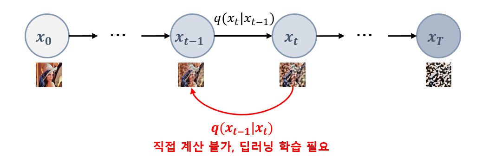
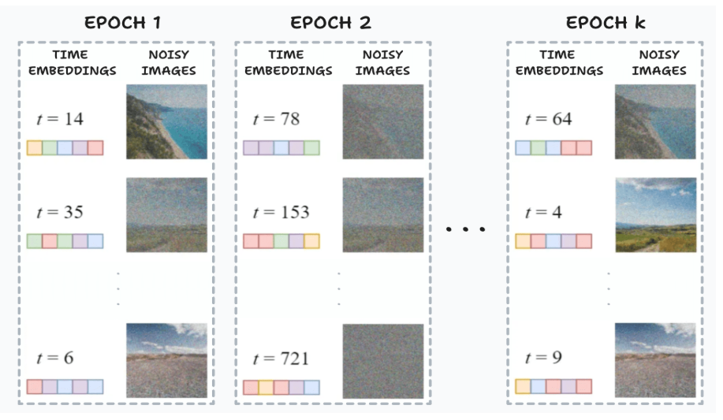
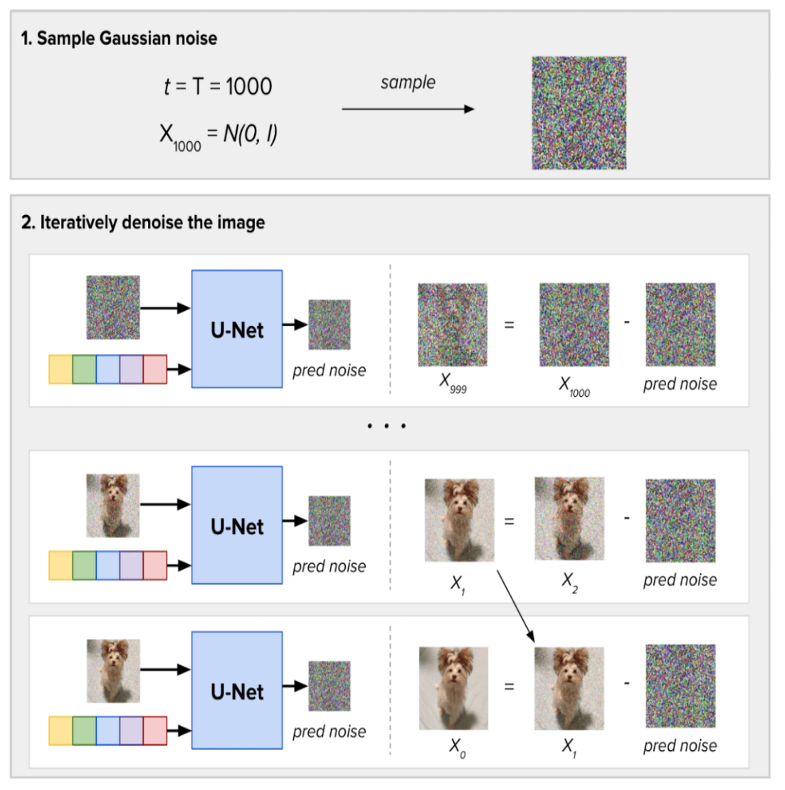
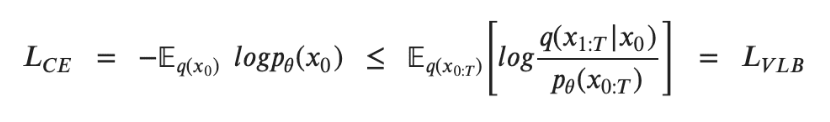

## 목차

* [1. Diffusion Model 이란?](#1-diffusion-model-이란)
* [2. Diffusion Model 의 핵심 아이디어](#2-diffusion-model-의-핵심-아이디어)
* [3. Diffusion Model 의 구성](#3-diffusion-model-의-구성)
  * [3-1. Forward Diffusion Process](#3-1-forward-diffusion-process)
  * [3-2. Reverse Diffusion Process](#3-2-reverse-diffusion-process)
  * [3-3. Sampling Process](#3-3-sampling-process)
* [4. Diffusion Model 의 Loss Function](#4-diffusion-model-의-loss-function)
* [5. Stable Diffusion](#5-stable-diffusion)

## 참고 문헌

* [Marvik, "An Introduction to Diffusion Models and Stable Diffusion", 2023.11.28](https://blog.marvik.ai/2023/11/28/an-introduction-to-diffusion-models-and-stable-diffusion/)

## 1. Diffusion Model 이란?

Diffusion Model 은 다른 이미지 생성형 AI와 마찬가지로, **학습 데이터를 통해 학습 후, 그 데이터와 유사한 데이터 (특히 이미지) 를 생성** 하는 모델이다.

* [Forward Diffusion Process](#3-1-forward-diffusion-process) 에서 **Noise 가 '점차 확산'** 되기 때문에 Diffusion 이라는 이름이 붙었다.
* 2025 수능 국어 영역 '노이즈' 지문으로 등장했다.

## 2. Diffusion Model 의 핵심 아이디어

Diffusion Model 의 핵심 아이디어는 다음과 같다.

| 과정                                                          | 설명                                                                                          |
|-------------------------------------------------------------|---------------------------------------------------------------------------------------------|
| [Forward Diffusion Process](#3-1-forward-diffusion-process) | 학습 데이터에 **단계적으로 Gaussian Noise** 를 추가                                                       |
| [Reverse Diffusion Process](#3-2-reverse-diffusion-process) | Noise가 추가된 데이터로부터 **원본 데이터를 복원하는 방법** 을 학습<br>- **단계적으로** 진행되는 **Noising Process 를 역으로 학습** |

## 3. Diffusion Model 의 구성

Diffusion Model 의 구성을 그림으로 나타내면 다음과 같다.

* Reverse Diffusion Process 에서는 이미지 복원 모델로 [U-Net](../Image%20Processing/Model_U-Net.md) 을 많이 사용한다.


### 3-1. Forward Diffusion Process

**Forward Diffusion Process** 는 **Markov Chain 의 개념을 이용** 하여 학습 데이터에 **단계적으로 Noise 를 추가** 하는 과정이다.

* timestep $t (t = 0, 1, ..., T)$ 에서의 이미지에 추가적으로 noise 를 추가하여 timestep $t+1$ 에서의 이미지를 생성하는 방식이다.
* **timestep 이 길어질수록 Noise 가 증가하고, 원본 이미지의 형태를 점점 더 알아볼 수 없게** 된다.


* 수식 notation 설명

| notation              | 설명                                                   |
|-----------------------|------------------------------------------------------|
| $q$                   | approximate posterior (사후 확률 분포)                     |
| $t = 0,1,...,T$       | timestep (매 timestep 마다 noise 추가)                    |
| $T$                   | 전체 timestep 횟수                                       |
| $\beta_t$             | forward process variance **(학습을 통해 최적화됨)**           |
| $\alpha_t$            | $\alpha_t = 1 - \beta_t$                             |
| $\overline{\alpha_t}$ | 최초 timestep 부터 현재 timestep 까지의 **모든 $\alpha_t$ 의 곱** |

* Scheduler
  * Scheduler 는 **매 timestep 마다 얼마나 많은 Noise 를 추가할지를 나타내는 것** 이다.
  * [Learning Rate Scheduler](../AI%20Basics/Deep%20Learning%20Basics/딥러닝_기초_Learning_Rate_Scheduler.md) 와 일정 부분 유사한 개념이다.
  * 대표적으로 사용되는 Scheduler 는 다음과 같다.

| Linear Scheduler                                                          | Cosine Scheduler                                     |
|---------------------------------------------------------------------------|------------------------------------------------------|
| $\beta_t$ 를 ```t=0``` 일 때 ```1e-4``` → ```t=T``` 일 때 ```0.02``` 까지 점진적 증가 | ```t=0``` 과 ```t=T``` 근처에서는 변화가 거의 없고, 중간에서 변화가 가장 큼 |

* image below: **Linear** scheduler (**top**), **Cosine** scheduler (**bottom**)



[(출처)](https://arxiv.org/pdf/2102.09672) : Alex Nichol and Prafulla Dhariwal, "Improved Denoising Diffusion Probabilistic Models", 2021

### 3-2. Reverse Diffusion Process

**Reverse Diffusion Process** 는 [Forward Diffusion Process](#3-1-forward-diffusion-process) 에 의해 생성된 Noise 추가 이미지로부터 **원래 이미지를 복원** 하는 과정이다.

* Forward Diffusion Process 인 $q(x_t|x_{t-1})$ 에 대해, Reverse Diffusion Process 는 $q(x_{t-1}|x_t)$ 로 나타낼 수 있다.
* 다음과 같은 특징을 갖는다.
  * $q(x_t|x_{t-1})$ 와 달리 **직접 계산할 수 없다.**
  * 따라서 이를 학습하기 위한 **딥러닝 모델** 을 필요로 한다. (보통 [U-Net](../Image%20Processing/Model_U-Net.md) 사용)



* 학습 데이터 및 학습 프로세스

| 입력 데이터                                                 | 출력 데이터                |
|--------------------------------------------------------|-----------------------|
| - $x_t$ (timestep $t$ 에서의 이미지)<br>- **time embedding** | - predicted **noise** |



[(출처)](https://blog.marvik.ai/2023/11/28/an-introduction-to-diffusion-models-and-stable-diffusion/) : Marvik, "An Introduction to Diffusion Models and Stable Diffusion"

### 3-3. Sampling Process

**Sampling Process** 는 학습된 Diffusion Model 을 이용하여 실제로 이미지를 생성하는 과정이다.

* Sampling Process 의 순서
  * **1. 데이터 준비**
    * Random Noise 생성: total timestep 횟수 $T$ 를 이용 
    * 입력 데이터: (Random noise) & (time embedding 과 동일한 shape 의 데이터)
    * 출력 데이터: (Noise prediction)
  * **2. previous timestep $t-1$ 의 이미지 계산**
    * (timestep $t-1$ 의 이미지) = (timestep $t$ 의 이미지) - (Noise prediction) 
    * 이 과정을 $t = 0$ 이 될 때까지 계속 반복하면 noise 가 제거된 이미지가 생성됨



[(출처)](https://blog.marvik.ai/2023/11/28/an-introduction-to-diffusion-models-and-stable-diffusion/) : Marvik, "An Introduction to Diffusion Models and Stable Diffusion"

## 4. Diffusion Model 의 Loss Function



[(출처)](https://lilianweng.github.io/posts/2021-07-11-diffusion-models/#:~:text=Diffusion%20models%20are%20inspired%20by,data%20samples%20from%20the%20noise.) : Lilian Weng, "What are Diffusion Models?", 2021.07.11

* 위와 같은 [Cross-Entropy Loss](../AI%20Basics/Deep%20Learning%20Basics/딥러닝_기초_Loss_function.md#2-5-categorical-cross-entropy-loss), 즉 negative [log likelihood](../AI%20Basics/Data%20Science%20Basics/데이터_사이언스_기초_Probability_vs_Likelihood.md#3-1-log-likelihood-로그-가능도-로그-우도) 가 Diffusion Model 의 Loss Function 이다.
* 위 Loss Function 을 최소화해야 한다.

## 5. Stable Diffusion

* [Stable Diffusion](Basics_Stable%20Diffusion.md) 문서 참고.
