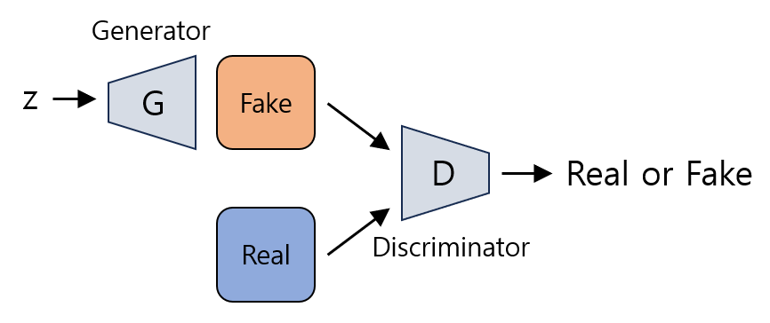
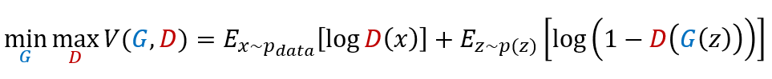

# GAN (Generative Adversarial Network)

## GAN (Generative Adversarial Network) 이란?
**GAN (Generative Adversarial Network, 생성적 적대 신경망)** 이란 unsupervised learning (비지도학습) 의 한 방법으로 생성형 AI에 사용할 수 있는 딥러닝 알고리즘이다.

GAN의 구성 요소는 다음과 같으며, 이들 **생성 모델과 분류 모델이 서로 경쟁** 하는 형태이다.
* **생성 모델** : 이미지를 생성하는 역할을 한다. 분류 모델이 진짜로 판단할 만큼 정교한 가짜 이미지를 생성해서 분류 모델을 속이는 것이 목표이다.
* **분류 모델** : 진짜 이미지 (실제 이미지) 와 생성 모델이 생성한 가짜 이미지를 분류한다.

## GAN의 구조 및 작동 원리



GAN은 위와 같이 **Generator (생성 모델, G)** 과 **Discriminator (분류 모델, D)** 이 **경쟁적으로 학습** 하는 구조이다.
* **Generator** : 학습 데이터에 기반하여, latent vector z (random noise) 를 이용하여 진짜 같은 가짜 이미지를 생성한다.
  * 진짜 이미지들의 분포를 학습하여 가짜 이미지를 생성한다.
  * Discriminator가 가짜 이미지를 진짜로 판별하도록 하는 것을 목표로 학습한다.
* **Discriminator** : 진짜 이미지와 Generator가 생성한 가짜 이미지를 구분한다.

GAN의 학습 과정은 다음과 같다.
* 파라미터가 초기값으로 설정된 Generator를 이용하여 이미지를 생성한다.
* 진짜 이미지와 생성된 가짜 이미지를 이용하여 Discriminator를 학습시킨다.
* Discriminator 모델을 그대로 둔 채로 Generator를 이용하여 이미지를 생성한다.
* 마찬가지로 Discriminator를 학습시킨다.
* 이 과정을 계속 반복한다.
* 최종적으로는 **$D(x) = 0.5$, 즉 Discriminator가 이미지를 진짜인지 가짜인지 구분할 수 없는 상태** 가 된다.



GAN의 **loss function** 은 위와 같다.
* $G$ : Generator, $D$ : Discriminator
* $D(x)$ : Discriminator의 출력값으로, 데이터 $x$가 실제 데이터일 확률을 의미한다.
* $G(z)$ : latent vector $z$를 이용하여 Generator가 생성한 가짜 데이터이다.
* $1 - D(G(z))$ : Generator가 생성한 가짜 데이터를 진짜 데이터로 판단할 확률을 1에서 뺀 값으로, 가짜 데이터를 가짜로 판단할 확률이다.
* Discriminator는 위 식의 값을 최대화하려고 한다.
  * 위 식의 우변의 ```+``` 기호 왼쪽 부분은 실제 데이터를 진짜로 판단할 확률에 log를 씌운 것으로, Discriminator가 최대화해야 한다.
  * 위 식의 우변의 ```+``` 기호 오른쪽 부분은 가짜 데이터를 가짜로 판단할 확률에 log를 씌운 것으로, 역시 Discriminator가 최대화해야 한다.
* Generator는 위 식의 값을 최소화하려고 한다.
  * 위 식의 우변의 ```+``` 기호 오른쪽에 있는, 가짜 데이터를 가짜로 판단할 확률을 낮추는 것이 Generator의 목표이다.

## GAN의 단점: 쉽게 학습되지 않음
GAN 을 실제로 학습시켜 보면 쉽게 학습이 되지 않는다는 것을 알 수 있다.
* 처음에는 Generator의 loss가 커지다가 작아지면서 안정적으로 학습이 되는 듯하다.
* 시간이 지나면 Generator의 loss가 커지다가 급격히 진동하는데, 이는 GAN이 Generator의 성능이 좋아지면 Discriminator의 성능이 좋아지는 등 한쪽의 성능이 좋아지면 다른 쪽의 성능이 좋아지는 특징을 가지기 때문이다. 즉, **서로 경쟁하는 과정에서 성능 변화 경향은 서로 유사** 하므로, 결국 수렴하지 못하기 때문이다.

## GAN의 활용 사례
* [Data Augmentation](https://github.com/WannaBeSuperteur/AI-study/blob/main/Image%20Processing/Basics_Image%20Augmentation.md)
  * 이미지 데이터가 부족할 때, 기존 이미지 데이터들을 GAN을 통해 학습하여 새로운 그럴듯한 이미지 데이터를 만들어 낼 수 있다.
  * 머신러닝 기술인 GAN을 활용하여 머신러닝 학습의 데이터 부족 문제를 해결하는 셈이다.
* 화질이 낮은 이미지를 고해상도 이미지로 복원
* 사진을 반 고흐와 같은 특정 화가의 화풍, 만화 캐릭터 등 특정 화풍으로 전환
* 가상 인간 생성

## 다양한 GAN 모델

### DCGAN
**DCGAN (Deep Convolutional Generative Adversarial Network)** 은 GAN의 학습 불안정성을 해결하기 위해 2016년에 구글에서 발표한 딥러닝 모델이다. 이 모델은 다음과 같은 특징을 갖는다.
* 기존의 GAN의 생성 모델 및 분류 모델에는 fully-connected 방식을 적용했는데, 그 대신 convolutional 방식을 채택했다.
  * 이를 통해 보다 향상된 성능과 안정성을 갖는다.
* 생성 모델에서는 factorial strided convolution이라는 방법을 사용하는데, 이것은 입력 사이에 padding, convolution을 적용하여 이미지 크기가 더 커지게 한다.
* 생성 모델이 데이터의 확률분포를 잘 파악하기 때문에 latent vector를 이용하여 결과물을 조작할 수 있다.
  * 이미지 A와 이미지 B의 latent vector의 평균을 계산해서 이미지 A와 이미지 B의 중간 상태에 해당하는 이미지를 생성할 수 있다.
  * 이미지 A와 이미지 B의 차이를 이미지 C에 적용하여 이미지 D를 생성할 때 **이미지를 연산한 것처럼** 결과가 적용된다.
    * 예: (달리는 고양이) - (멈춰 있는 고양이) + (멈춰 있는 토끼) 의 latent vector 를 이용하여 (달리는 토끼) 의 이미지를 생성할 수 있다.

#### DGCAN의 활용 사례
DCGAN의 **이미지를 연산한 것처럼** 생성할 수 있다는 특징 때문에 다음과 같이 다양하게 응용할 수 있다.
* 특정인에 대한 가짜 영상 생성 (얼굴의 특정 부분에 해당하는 부분에 대한 latent vector의 연산 이용)
  * 해당 기술에 대한 악용의 우려가 있다.
* 눈을 감은 사진을 눈을 뜬 사진으로 바꾸는 기술