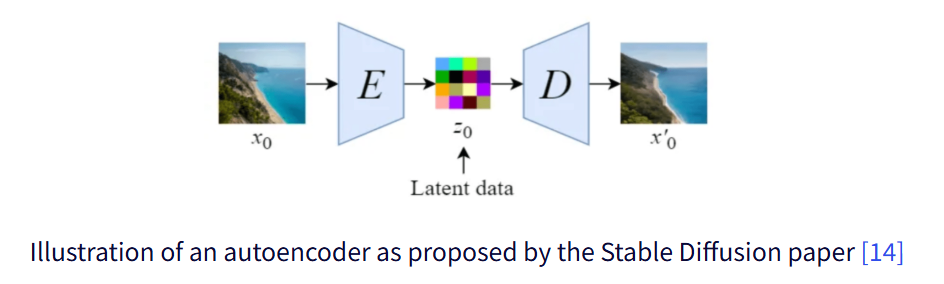
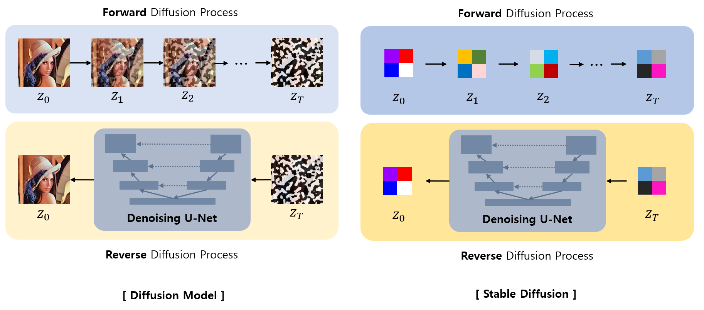
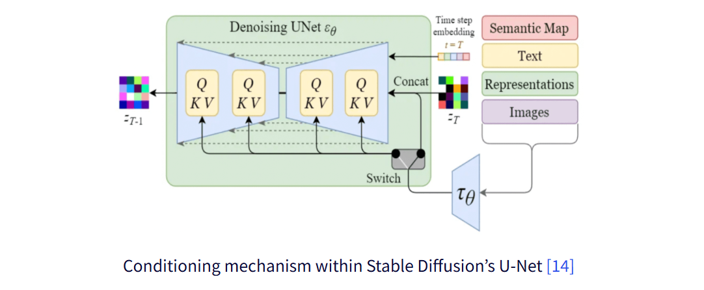
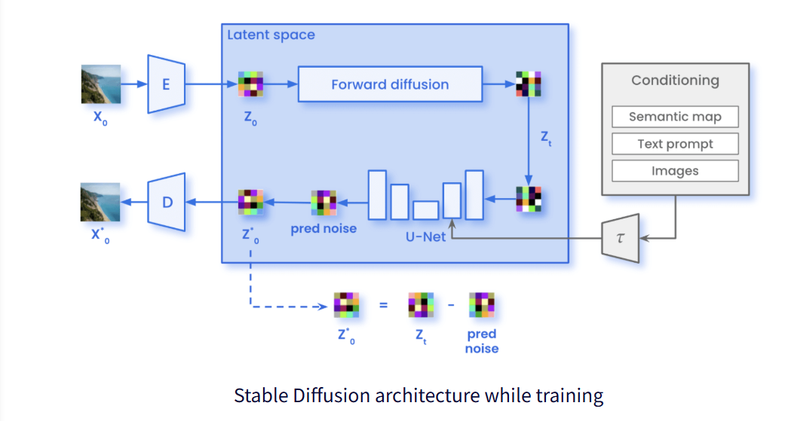
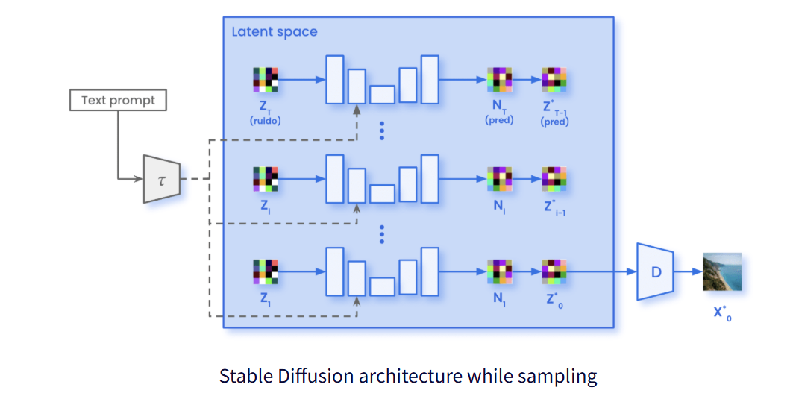

## 목차

* [1. Stable Diffusion 이란?](#1-stable-diffusion-이란)
* [2. Diffusion Model 과의 차이점](#2-diffusion-model-과의-차이점)
  * [2-1. Latent Space 를 이용](#2-1-latent-space-를-이용)
  * [2-2. Conditioning Mechanism](#2-2-conditioning-mechanism)
* [3. Stable Diffusion 의 구조](#3-stable-diffusion-의-구조)
  * [3-1. Training 시](#3-1-training-시)
  * [3-2. Sampling (= Inference) 시](#3-2-sampling--inference-시)
* [4. Stable Diffusion 사용 사례](#4-stable-diffusion-사용-사례)

## 참고 문헌

* [Amazon AWS, "Stable Diffusion이란 무엇인가요?"](https://aws.amazon.com/ko/what-is/stable-diffusion/)
* [Marvik, "An Introduction to Diffusion Models and Stable Diffusion", 2023.11.28](https://blog.marvik.ai/2023/11/28/an-introduction-to-diffusion-models-and-stable-diffusion/)

## 1. Stable Diffusion 이란?

**Stable Diffusion** 은 [Diffusion Model](Basics_Diffusion%20Model.md) 을 **계산 복잡도 및 효율성** 측면에서 개선한 모델이다.

* 기존의 Diffusion Model 은 **전체 사이즈 이미지를 [U-Net](../Image%20Processing/Model_U-Net.md) 등을 이용하여 처리** 하기 때문에 계산량 및 메모리 사용량이 많다.
* 특히 **Gaussian Noise 로부터 Denoising 하여 이미지를 생성** 하는 과정은 수행 시간이 매우 길다.

## 2. Diffusion Model 과의 차이점

Stable Diffusion 이 기존 Diffusion Model 과 다른 점은 다음과 같다.

| 차이점                                                   | 설명                                                                                                                                                                                      |
|-------------------------------------------------------|-----------------------------------------------------------------------------------------------------------------------------------------------------------------------------------------|
| [Latent Space를 이용하는 구조](#2-1-latent-space-를-이용)       | [Auto-Encoder](Basics_Auto%20Encoder.md) 또는 [VAE (Variational Auto-Encoder)](Basics_Variational%20Auto%20Encoder.md) 처럼 Encoder 와 Decoder 를 이용하여 **full-size 이미지를 latent space로 차원 축소** |
| [Conditioning Mechanism](#2-2-conditioning-mechanism) | 특정 Class 의 이미지를 생성하기 위해, **Conditional mechanism (Classifier-Free Guidance, CFG)** 방식 적용                                                                                                |

### 2-1. Latent Space 를 이용

Stable Diffusion 에서는 **계산량 감소를 위해 차원 축소** 를 실시하고, 이를 위해 **Encoder-Decoder 구조를 이용하여 원본 이미지를 Latent Space 로 차원 축소** 한다.

* Encoder-Decoder 구조

[(출처)](https://blog.marvik.ai/2023/11/28/an-introduction-to-diffusion-models-and-stable-diffusion/) : Marvik, "An Introduction to Diffusion Models and Stable Diffusion"

* Latent Space 를 이용한 Forward/Reverse Diffusion Process
  * 왼쪽이 **Diffusion Model (NOT Stable Diffusion)**, 오른쪽이 **Stable Diffusion** 이다. (Latent Data 는 2 x 2 로 표현)

### 2-2. Conditioning Mechanism

Stable Diffusion 의 **Conditioning Mechanism** 은 아래와 같이 **Embedding 을 U-Net 에 추가로 입력** 하는 구조이다. 

[(출처)](https://blog.marvik.ai/2023/11/28/an-introduction-to-diffusion-models-and-stable-diffusion/) : Marvik, "An Introduction to Diffusion Models and Stable Diffusion"

| 구조                               | 설명                                                                                                                                                                                                                                                                                                              |
|----------------------------------|-----------------------------------------------------------------------------------------------------------------------------------------------------------------------------------------------------------------------------------------------------------------------------------------------------------------|
| Embedding 추가 입력                  | - 텍스트 입력을 [BERT](../Natural%20Language%20Processing/Basics_BERT,%20SBERT%20모델.md#1-bert-모델이란) 또는 [CLIP](../Paper%20Study/Vision%20Model/%5B2025.09.07%5D%20CLIPArTT%20-%20Adaption%20of%20CLIP%20to%20New%20Domains%20at%20Test%20Time.md#1-1-기존-clip-방법-및-그-문제점) 등으로 임베딩한다. - 임베딩 결과물을 **U-Net 으로 입력** 시킨다. |
| U-Net 의 Multi-Head Attention 레이어 | - U-Net 에 입력된 결과물은 **U-Net 의 Multi-Head Attention Layer 로 입력되어 Query/Key/Value 로 표현** 된다. - 즉, Multi-Head Attention Layer 는 **이 임베딩을 mapping 시키는 역할** 을 한다.                                                                                                                                                  |
| 기타 조건 정보 추가 입력                   | 경우에 따라 Semantic Map, 이미지 등 **추가적인 Conditional info** 가 입력될 수 있다.                                                                                                                                                                                                                                                |

## 3. Stable Diffusion 의 구조

Stable Diffusion 의 구조는 다음과 같다.

* 최종 예측은 $z*_0$ 을 **Decoder 에 입력시켰을 때의 출력값** 이다.

| 실행 단계                     | 구조                                                                                                                               | 복원된 Latent Data 의 예측             |
|---------------------------|----------------------------------------------------------------------------------------------------------------------------------|----------------------------------|
| 학습 (Training)             | Forward Diffusion + Reverse Diffusion (U-Net, with **Conditional Inputs**) - Diffusion과 유사하지만, 전체 이미지 대신 **Latent Data** 를 이용 | $z_0^★ = z_t - (PredictedNoise)$ |
| 추론 (Sampling / Inference) | Text Prompt + 직전 단계의 Latent Vector → (U-Net) → 다음 단계의 Laten Vector                                                               | $z_T → z_{T-1}^★ → ... → z_0^★$  |

### 3-1. Training 시

* 기본 구조
  * **Forward Diffusion + Reverse Diffusion (U-Net)** 구조
* Diffusion 과의 차이점
  * 전체 이미지 대신 **Latent Data** 를 이용
  * **Conditional Input** 이 추가됨 (text embedding 등)
* 복원된 Latent Data 예측 
  * **Predicted Noise** 를 이용하여 **복원된 Latent Data $z_0^★$ 를 예측**

[(출처)](https://blog.marvik.ai/2023/11/28/an-introduction-to-diffusion-models-and-stable-diffusion/) : Marvik, "An Introduction to Diffusion Models and Stable Diffusion"

### 3-2. Sampling (= Inference) 시

* 기본 구조

| 구분     | 설명                                                          |
|--------|-------------------------------------------------------------|
| 입력     | Text Prompt + (원본 Latent Vector 복원에서의 직전 단계의 Latent Vector) |
| 출력     | 다음 단계의 Latent Vector                                        |
| 중간 신경망 | U-Net 등                                                     |

* 복원된 Latent Data 예측
  * $z_T → z_{T-1}^★ → ... → z_0^★$
  * $z_0^★$ 를 **Decoder 에 입력시켰을 때의 출력** 이 최종 복원된 이미지

[(출처)](https://blog.marvik.ai/2023/11/28/an-introduction-to-diffusion-models-and-stable-diffusion/) : Marvik, "An Introduction to Diffusion Models and Stable Diffusion"

## 4. Stable Diffusion 사용 사례

