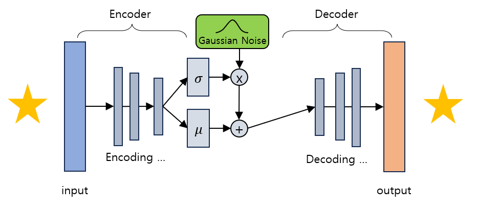

# Variational Auto Encoder (VAE)

2024.02.17 작성중

## Variational Auto Encoder (VAE) 란?
**Variational Auto Encoder (VAE)** 는 기존의 Auto-Encoder와는 다르지만 그 구조가 비슷한 형태의 비지도학습 알고리즘이다.

주로 이미지를 생성하기 위한 생성형 AI에 사용되며, 기본적인 구조는 다음과 같다.
* Encoder, latent vector, Decoder 로 구성되며, 이것은 Auto-Encoder와 유사하다고 볼 수 있는 특징이다.

기본적인 작동 방법은 다음과 같다.
* 입력 이미지를 Encoder를 통해 입력하여 latent vector z를 계산한다.
* latent vector z를 다시 Decoder에 입력하여, **기존 입력 이미지와 비슷하면서도 새로운 이미지를 생성** 한다.
* 이때 입력 이미지의 다양한 특징들을 각각의 확률변수로 하는 확률분포를 생성하며, 이 확률분포에서 확률 값이 높은 부분을 이용하여 새로운 이미지를 생성한다.

## Variational Auto Encoder의 작동 원리

VAE의 기본 동작 원리는 다음과 같다.
* 입력 이미지에 대해서 잘 설명하는 feature를 추출하고, 그 feature를 latent vector z에 저장한다.
  * 이때 각 feature의 분포는 Gaussian Distribution 이고, latent vector z는 각 feature의 평균 및 분산을 의미한다.
  * 예를 들어, 사람의 얼굴을 그리려면 눈, 코, 입, 머리카락 등의 요소가 필요한데, **이들의 특징 (길이 등) 에 대한 평균 및 분산을 latene vector z에 저장** 한다.

Decoder 부분에서는 Latent vector z를 이용하여 다음과 같이 한다.
* z에 저장된 확률분포상에서 각 feature에 대한 확률 값이 높은 부분을 추출한다.
* 해당 부분을 이용하여 새로운 이미지를 생성한다.

즉, VAE의 목표는 **입력 데이터의 분포를 잘 나타내고 근사하는** 모델을 만드는 것이다.

VAE의 학습을 위한 입력 데이터 및 출력 데이터는 다음과 같다. 즉 입력 데이터에 대한 label이 없으므로 **비지도학습** 알고리즘이다.
* 입력 데이터 : 이미지
* 출력 데이터 : 입력 데이터와 같은 이미지
* reconstruction loss : 입력 데이터와 출력 데이터의 차이를 나타내는 loss 값으로, **VAE 의 loss 값** 에 해당한다.

## Variational Auto Encoder의 활용 사례
* 이미지 생성 인공지능 (생성형 AI)
* 이상 탐지
* 이미지 복원 기법을 적용한 사실적인 이미지 생성

## AE와 VAE의 비교
AE (AutoEncoder) 와 VAE의 특징의 공통점과 차이점은 다음과 같다.

* 공통점
  * Encoder, Decoder를 포함하는 구조로 구성되어 있다.
  * Encoder와 Decoder의 사이에 latent vector를 포함하므로, 해당 벡터를 조작하면 이미지나 텍스트 등 결과물을 '생성'할 수 있다.
* 차이점 1
  * AutoEncoder 는 입력을 재현할 수 있는 latent vector를 만드는 것이 목적이다. 즉 **Encoder** 를 위한 네트워크이다.
  * VAE 는 생성형 모델을 처음부터 의도한 것으로서, 실제로 생성을 담당하는 부분인 **Decoder** 를 학습하는 것이 목적이다.
* 차이점 2
  * AutoEncoder는 전반부가 Encoder 네트워크 -> latent vector 로 구성되어 있다.
  * VAE 는 전반부가 Encoder 네트워크 -> **mean vector + standard deviation vector** -> latent vector **(표본 추출)** 로 구성되어 있다. 