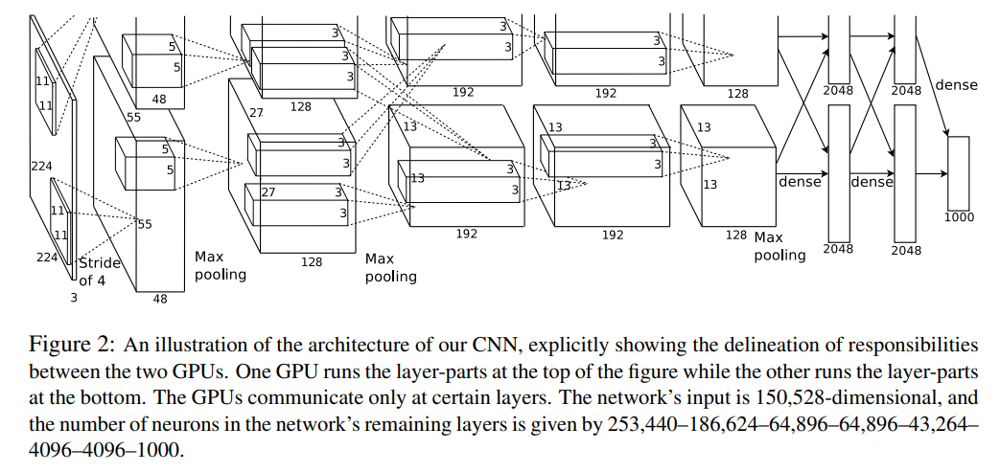

# 이미지 프로세싱 기초 - AlexNet

## AlexNet이란?

[AlexNet 논문](https://proceedings.neurips.cc/paper_files/paper/2012/file/c399862d3b9d6b76c8436e924a68c45b-Paper.pdf)



(출처: Alex Krizhevsky, Ilya Sutskever et al, ImageNet Classification with Deep Convolutional Neural Networks)

**AlexNet** 은 위 논문과 같이 Toronto 대학의 Alex Krizhevsky, Ilya Sutskever, Geoffrey E. Hinton 3명의 연구진이 2012년에 제안한 CNN 구조이다.

AlexNet은 다음과 같은 구조를 가지고 있다.
* Max Pooling을 3개의 구간에 적용했다.
* 이미지 크기가 Convolutional Layer 들을 거치면서 **224 -> 55 -> 27 -> 13 -> 13 -> 13** 으로 변화한다. 이때 ```55 -> 27 -> 13 -> 13 -> 13```에 해당하는 부분은 총 2개가 있다.
* Fully Connected Layer 부분은 **2 x 2048 -> 2 x 2048 -> 1000** 으로 변화하며, **최종적으로 1000개의 class 분류에 대한 softmax 출력값** 을 갖는다.

따라서 AlexNet은 이미지의 class가 최대 1000개일 때, 그 이미지들을 분류하는 CNN이라고 할 수 있다.

## AlexNet의 특징
AlexNet은 다음과 같은 특징이 있다.

* tanh 등 다른 활성화 함수에 비해 학습 속도를 빠르게 하기 위해 **ReLU 활성화 함수** 를 적용하였다.
* 이미지 데이터에 대한 overfitting을 방지하기 위해 **Data Augmentation** 을 적용했다.
* Dropout rate = 0.5의 **Dropout** 을 적용했다.

## 실험 결과 및 논문 상세
* 논문에서는 모델을 학습시킬 때 momentum을 0.9, weight decay를 0.0005로 한 stochastic gradient descent를 적용했다.
* ILSVRC-2010 기준으로 Top-1에서는 37.5%, Top-5에서는 17.0%의 error rate를 보였다.
* ILSVRC-2012 에도 참여했지만 테스트 데이터가 공개되어 있지 않아서 test error를 측정할 수 없었다.