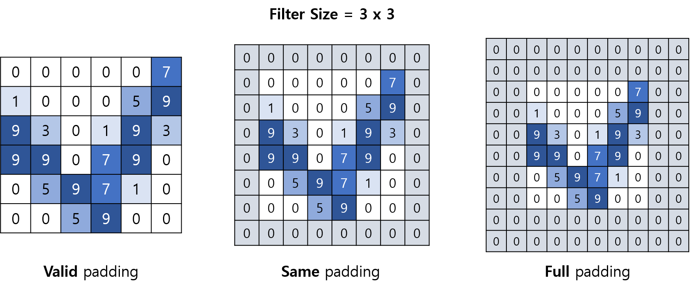

# 이미지 프로세싱 기초 - CNN (Convolutional Neural Network)

2023.12.06 작성중

## CNN이란?
**CNN (Convolutional Neural Network, 합성곱 신경망)** 이란, **인간의 시각을 모방** 하여 만들어진 딥러닝 모델로, **이미지 인식** 분야에서 좋은 성능을 발휘한다.

## CNN의 기본 구조
이미지를 컴퓨터가 인식할 수 있는 일정한 형태의 숫자 데이터로 나타내려면 다음을 생각해 볼 수 있다.
* 이미지는 가로 ```w```, 세로 ```h```의 크기이고, 각 픽셀에 ```R, G, B```라는 3개의 숫자 값이 있다.

따라서, CNN으로 입력되는 이미지 데이터는 다음과 같음을 생각할 수 있다.
* **흑백** 이미지의 경우, 가로 ```w```, 세로 ```h``` 크기의 **1개의 채널** 이 있는 이미지
* **컬러** 이미지의 경우, 가로 ```w```, 세로 ```h``` 크기의 **R, G, B 3개의 채널** 이 있는 이미지
* **컬러 + 투명도** 이미지의 경우, 가로 ```w```, 세로 ```h``` 크기의 **R, G, B, 투명도 4개의 채널** 이 있는 이미지

여기서 R, G, B와 같은 값을 CNN에서는 **채널 (channel)** 이라고 한다.


**CNN의 구조** 는 다음과 같이 이루어져 있다.
* **Convolutional Layer :** 이미지에서 feature들을 추출하기 위한 수많은 필터 (filter) 가 있는 레이어
  * Convolution이 진행되어 갈수록 filter가 나타내는 구조가 복잡해진다. (처음에는 단순한 선과 같은 구조를 나타냄)
* **Pooling Layer :** 특정 영역에서 평균값 또는 가장 큰 값을 추출하는 방식으로, 이미지 형태를 유지하면서 크기를 줄이는 레이어
  * Max Pooling, Average Pooling
* **Fully-connected Layer :** Pooling Layer까지 진행된 결과물을 flatten 시켜서 입력으로 받고, 최종 결과값을 출력하는 레이어

CNN에서는 **vanishing gradient를 해결** 하기 위해 일반적으로 **ReLU** 활성화 함수를 사용한다.

### Convolutional Layer의 원리
Convolutional Layer는 다음과 같이 원본 이미지와 필터를 이용하여 **합성곱 연산** 을 진행한다.


여기서 예를 들어, 위 이미지에서 테두리 및 볼드체로 표시한 **Convolution 된 이미지** 의 cell 중 위쪽에서 3번째, 왼쪽에서 2번째의 cell의 값을 계산하는 방법은 다음과 같다.
* **-17** = 3 * **1** + 0 * **1** + 1 * **1** + 9 * **0** + 0 * **0** + 7 * **0** + 5 * **(-1)** + 9 * **(-1)** + 7 * **(-1) **

이와 같이, 입력 이미지에서 filter와 크기가 일치하는 각 부분들을 찾아서, **해당 부분들에 대한 합성곱 결과** 를 나타낸 것이 Convolution의 결과이다.

### Pooling Layer의 원리
Pooling Layer는 다음과 같이 Max Pooling 또는 Average Pooling을 이용하여 이미지 크기를 줄인다.
* **Max Pooling** : Pooling 된 후의 각 부분은 Pooling 되기 전의 이미지의 대응되는 부분의 **최댓값** 이다.
* **Average Pooling** : Pooling 된 후의 각 부분은 Pooling 되기 전의 이미지의 대응되는 부분의 **평균값** 이다.


예를 들어 위 그림에서 MAX Pooling을 적용하면, Pooling 후의 이미지의 왼쪽 위 셀은 대응되는 영역이 원본 이미지의 4x4 중 왼쪽 위 2x2, 즉 ```[-12, -4, -17, -16]``` 이므로, 그 값은 ```max([-12, -4, -17, -16])``` = ```-4``` 이다.

한편 Average Pooling을 적용하면, Pooling 후의 이미지의 왼쪽 위 셀은 그 값이 ```average([-12, -4, -17, -16])``` = ```-12.25``` 이다.

각 Pooling 방식의 장점은 다음과 같다.

**Max Pooling 장점 :** 이미지 내의 가장 두드러지는 강력한 특징을 그대로 가져갈 수 있다.
**Average Pooling 장점 :** 덜 중요한 feature도 반영하므로, 다양한 feature가 최종 출력에 영향을 미치는 경우도 고려할 수 있다. 

## Padding, Stride


**Padding** : Convolutional Layer를 거친 후의 이미지를 그 직전의 이미지와 동일한 크기로 유지할지의 옵션
* **Valid Padding** : padding을 추가하지 않는다.
* **Same Padding** : Filter의 가로세로 길이가 ```f```일 때, 주변 4방향으로 ```(f-1)/2``` 크기만큼 ```0```으로 채움으로써, Convolutional Layer를 거친 후에도 이미지의 크기가 그대로 유지되게 한다.
* **Full Padding** : Filter의 가로세로 길이가 ```f```일 때, 주변 4방향으로 ```(f-1)``` 크기만큼 ```0```으로 채운다.


**Stride** : Convolutional Layer와 Pooling Layer에서, 연산을 적용할 픽셀 간격
* Stride가 커질수록 해당 레이어를 거친 이후의 이미지의 크기가 그 이전의 이미지의 크기에 비해 더 많이 작아진다.
* Stride가 각각 1, 2일 때, Convolutional Layer와 Pooling Layer를 거치는 예시는 위 그림과 같다.
  * Stride가 1일 때는 입력 이미지의 각 3x3 영역을 1칸씩 sliding 하면서 합성곱 연산을 수행하므로, Convolutional Layer를 통과한 이후의 출력 이미지에서도 입력 이미지에서 **세로로 1칸** 떨어져 있었던 3x3의 **파란색** 영역과 3x3의 **점선** 영역이 **세로로 1칸** 떨어져 있다.
  * Stride가 2일 때는 입력 이미지의 각 3x3 영역을 2칸씩 sliding 하면서 합성곱 연산을 수행하므로, Convolutional Layer를 통과한 이후의 출력 이미지에서는 입력 이미지에서 **가로로 2칸** 떨어져 있었던 3x3의 **파란색** 영역과 3x3의 **실선** 영역이 **가로로 1칸** 떨어져 있다.

### 다음 레이어의 이미지 크기