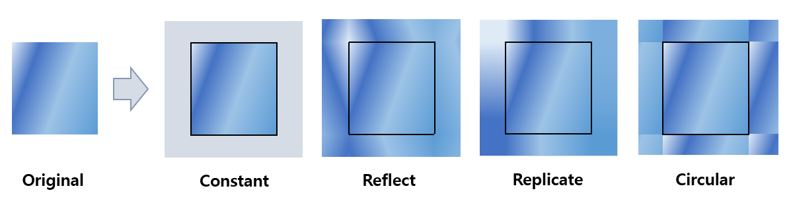

## 목차

* [1. CNN 의 Padding 적용 방법의 유형](#1-cnn-의-padding-적용-방법의-유형)
  * [1-1. Constant](#1-1-constant)
  * [1-2. Reflect](#1-2-reflect)
  * [1-3. Replicate](#1-3-replicate)
  * [1-4. Circular](#1-4-circular)
* [2. 실험: 어떤 Padding 적용 방법의 성능이 가장 좋을까?](#2-실험-어떤-padding-적용-방법의-성능이-가장-좋을까)
  * [2-1. 실험 설계](#2-1-실험-설계)
  * [2-2. 실험 결과](#2-2-실험-결과)
  * [2-3. 실험 결과에 대한 이유](#2-3-실험-결과에-대한-이유)

## 코드

## 1. CNN 의 Padding 적용 방법의 유형

[Convolutional Neural Network (CNN)](Basics_CNN.md) 에서 Convolutional Layer 에 [Padding](Basics_CNN.md#3-padding-stride) 을 적용하는 방법은 다음과 같이 여러 가지가 있다.

여기서는 [PyTorch 에서 제공하는 Padding 의 방법들](https://pytorch.org/docs/stable/generated/torch.nn.functional.pad.html) 을 소개한다.

| 방법        | 설명                                                       |
|-----------|----------------------------------------------------------|
| Constant  | **일정한 정수** 값으로 padding 을 채움                              |
| Reflect   | 원본 feature map 에 있는 값들을 **상하좌우로 거울처럼** 반전                |
| Replicate | 원본 feature map 의 **가장자리에 있는 값** 들을 그대로 연장                |
| Circular  | 원본 feature map 을 연장할 때 **반대 방향의 끝 성분부터 순환하는 형태로** 그대로 연장 |



여기서는 다음 tensor 를 기준으로 설명한다.

```python
y = tensor([[[23., 29., 26., 17., 24., 22.,  6.],
             [17., 12.,  8., 23.,  4.,  8., 15.],
             [29., 22., 26., 12., 16.,  9., 27.],
             [15.,  2., 12., 22.,  9., 24., 20.],
             [22.,  1.,  9., 13.,  8., 14.,  9.],
             [13.,  1.,  0., 17., 28.,  6., 15.],
             [ 5.,  1., 21.,  8., 13.,  5.,  5.]]])
```

### 1-1. Constant

말 그대로 이미지의 상하좌우에 **일정한 상수 (costant) 값으로** 패딩을 채우는 것을 의미한다.

* PyTorch 에서 기본값은 0 (Zero Padding) 이다.
* 계산이 가장 단순하지만, Padding 을 가장 인위적으로 만들기 때문에 모델 성능 향상에는 좋지 않다.

PyTorch 에서는 다음과 같이 코드를 작성한다.

```python
import torch.nn.functional as F
y_padding = F.pad(y, (left, right, up, down), "constant", const)
```

* left: 좌측 패딩
* right: 우측 패딩
* up: 위쪽 패딩
* down: 아래쪽 패딩
* const : 패딩을 채울 상수 값 (미지정 시 0)

**예시**

```python
F.pad(y, (1, 2, 3, 4), "constant")
```

**실행 결과**

```python
tensor([[[ 0.,  0.,  0.,  0.,  0.,  0.,  0.,  0.,  0.,  0.],
         [ 0.,  0.,  0.,  0.,  0.,  0.,  0.,  0.,  0.,  0.],
         [ 0.,  0.,  0.,  0.,  0.,  0.,  0.,  0.,  0.,  0.],
         [ 0., 23., 29., 26., 17., 24., 22.,  6.,  0.,  0.],
         [ 0., 17., 12.,  8., 23.,  4.,  8., 15.,  0.,  0.],
         [ 0., 29., 22., 26., 12., 16.,  9., 27.,  0.,  0.],
         [ 0., 15.,  2., 12., 22.,  9., 24., 20.,  0.,  0.],
         [ 0., 22.,  1.,  9., 13.,  8., 14.,  9.,  0.,  0.],
         [ 0., 13.,  1.,  0., 17., 28.,  6., 15.,  0.,  0.],
         [ 0.,  5.,  1., 21.,  8., 13.,  5.,  5.,  0.,  0.],
         [ 0.,  0.,  0.,  0.,  0.,  0.,  0.,  0.,  0.,  0.],
         [ 0.,  0.,  0.,  0.,  0.,  0.,  0.,  0.,  0.,  0.],
         [ 0.,  0.,  0.,  0.,  0.,  0.,  0.,  0.,  0.,  0.],
         [ 0.,  0.,  0.,  0.,  0.,  0.,  0.,  0.,  0.,  0.]]])
```

### 1-2. Reflect

이 방법은 원본 feature map 에 있는 값들을 **상하좌우로 거울처럼** 반전시키는 것이다.

* feature map의 값을 거울처럼 대칭되게 복사하므로, 이웃한 픽셀끼리 데이터 값이 유사하다는 CNN의 기본 아이디어를 고려할 때 **이미지의 연속성이 보장** 된다.
* padding 의 size 가 입력 데이터보다 클 수 없으므로, 이를 고려하지 않았을 때 오류가 발생할 수 있다.

PyTorch 에서는 다음과 같이 코드를 작성한다.

```python
import torch.nn.functional as F
y_padding = F.pad(y, (left, right, up, down), "reflect")
```

**예시**

```python
F.pad(y, (1, 2, 3, 4), "reflect")
```

**실행 결과**

* ```---```, ```|```, ```[ ]``` 는 실제 출력에는 없는, 기준이 되는 원본 feature map 가장자리의 행, 열 및 그 교차점을 나타내기 위해 따로 추가한 표시이다.

```python
                |                             |
tensor([[[ 2., 15.,  2., 12., 22.,  9., 24., 20., 24.,  9.],
         [22., 29., 22., 26., 12., 16.,  9., 27.,  9., 16.],
         [12., 17., 12.,  8., 23.,  4.,  8., 15.,  8.,  4.],
     --- [29.,[23], 29., 26., 17., 24., 22.,[ 6], 22., 24.], ---
         [12., 17., 12.,  8., 23.,  4.,  8., 15.,  8.,  4.],
         [22., 29., 22., 26., 12., 16.,  9., 27.,  9., 16.],
         [ 2., 15.,  2., 12., 22.,  9., 24., 20., 24.,  9.],
         [ 1., 22.,  1.,  9., 13.,  8., 14.,  9., 14.,  8.],
         [ 1., 13.,  1.,  0., 17., 28.,  6., 15.,  6., 28.],
     --- [ 1.,[ 5],  1., 21.,  8., 13.,  5.,[ 5],  5., 13.], ---
         [ 1., 13.,  1.,  0., 17., 28.,  6., 15.,  6., 28.],
         [ 1., 22.,  1.,  9., 13.,  8., 14.,  9., 14.,  8.],
         [ 2., 15.,  2., 12., 22.,  9., 24., 20., 24.,  9.],
         [22., 29., 22., 26., 12., 16.,  9., 27.,  9., 16.]]])
                |                             |
```

### 1-3. Replicate

이 방법은 원본 feature map 의 **가장자리에 있는 값** 들을 그대로 연장하는 것이다.

* Reflect 와 마찬가지로, feature map을 복사하므로 이웃한 픽셀끼리 데이터 값이 유사하다는 CNN의 기본 아이디어를 고려할 때 **이미지의 연속성이 보장** 된다.
* 가장자리 픽셀의 연장으로 인한 반복에 의해, 모델 학습에 지장을 줄 수 있다.

PyTorch 에서는 다음과 같이 코드를 작성한다.

```python
import torch.nn.functional as F
y_padding = F.pad(y, (left, right, up, down), "replicate")
```

**예시**

```python
F.pad(y, (1, 2, 3, 4), "replicate")
```

**실행 결과**

* ```---```, ```|```, ```[ ]``` 는 실제 출력에는 없는, 기준이 되는 원본 feature map 가장자리의 행, 열 및 그 교차점을 나타내기 위해 따로 추가한 표시이다.

```python
                |                             |
tensor([[[23., 23., 29., 26., 17., 24., 22.,  6.,  6.,  6.],
         [23., 23., 29., 26., 17., 24., 22.,  6.,  6.,  6.],
         [23., 23., 29., 26., 17., 24., 22.,  6.,  6.,  6.],
     --- [23.,[23], 29., 26., 17., 24., 22.,[ 6],  6.,  6.], ----
         [17., 17., 12.,  8., 23.,  4.,  8., 15., 15., 15.],
         [29., 29., 22., 26., 12., 16.,  9., 27., 27., 27.],
         [15., 15.,  2., 12., 22.,  9., 24., 20., 20., 20.],
         [22., 22.,  1.,  9., 13.,  8., 14.,  9.,  9.,  9.],
         [13., 13.,  1.,  0., 17., 28.,  6., 15., 15., 15.],
     --- [ 5.,[ 5],  1., 21.,  8., 13.,  5.,[ 5],  5.,  5.], ---
         [ 5.,  5.,  1., 21.,  8., 13.,  5.,  5.,  5.,  5.],
         [ 5.,  5.,  1., 21.,  8., 13.,  5.,  5.,  5.,  5.],
         [ 5.,  5.,  1., 21.,  8., 13.,  5.,  5.,  5.,  5.],
         [ 5.,  5.,  1., 21.,  8., 13.,  5.,  5.,  5.,  5.]]])
                |                             |
```

### 1-4. Circular

이 방법은 원본 feature map 을 연장할 때 **반대 방향의 끝 성분부터 순환하는 형태로** 그대로 연장하는 것이다.

* 대부분의 이미지에는 적합하지 않으나, 신호 처리 등 주기적인 특성을 갖는 분야에서 유용할 수 있다.
* 이는 **이미지의 위쪽 끝 - 아래쪽 끝, 왼쪽 끝 - 오른쪽 끝** 의 픽셀 값은 서로 완전히 다른 경우가 많기 때문이다.

PyTorch 에서는 다음과 같이 코드를 작성한다.

```python
import torch.nn.functional as F
y_padding = F.pad(y, (left, right, up, down), "circular")
```

**예시**

```python
F.pad(y, (1, 2, 3, 4), "circular")
```

**실행 결과**

* ```---```, ```|```, ```[ ]``` 는 실제 출력에는 없는, 기준이 되는 원본 feature map 가장자리의 행, 열 및 그 교차점을 나타내기 위해 따로 추가한 표시이다.

```python
                |                             |
tensor([[[ 9., 22.,  1.,  9., 13.,  8., 14.,  9., 22.,  1.],
         [15., 13.,  1.,  0., 17., 28.,  6., 15., 13.,  1.],
         [ 5.,  5.,  1., 21.,  8., 13.,  5.,  5.,  5.,  1.],
     --- [ 6.,[23], 29., 26., 17., 24., 22.,[ 6], 23., 29.], ---
         [15., 17., 12.,  8., 23.,  4.,  8., 15., 17., 12.],
         [27., 29., 22., 26., 12., 16.,  9., 27., 29., 22.],
         [20., 15.,  2., 12., 22.,  9., 24., 20., 15.,  2.],
         [ 9., 22.,  1.,  9., 13.,  8., 14.,  9., 22.,  1.],
         [15., 13.,  1.,  0., 17., 28.,  6., 15., 13.,  1.],
     --- [ 5.,[ 5],  1., 21.,  8., 13.,  5.,[ 5],  5.,  1.], ---
         [ 6., 23., 29., 26., 17., 24., 22.,  6., 23., 29.],
         [15., 17., 12.,  8., 23.,  4.,  8., 15., 17., 12.],
         [27., 29., 22., 26., 12., 16.,  9., 27., 29., 22.],
         [20., 15.,  2., 12., 22.,  9., 24., 20., 15.,  2.]]])
                |                             |
```

## 2. 실험: 어떤 Padding 적용 방법의 성능이 가장 좋을까?

* MNIST + Additional 1 Dataset

### 2-1. 실험 설계

### 2-2. 실험 결과

### 2-3. 실험 결과에 대한 이유