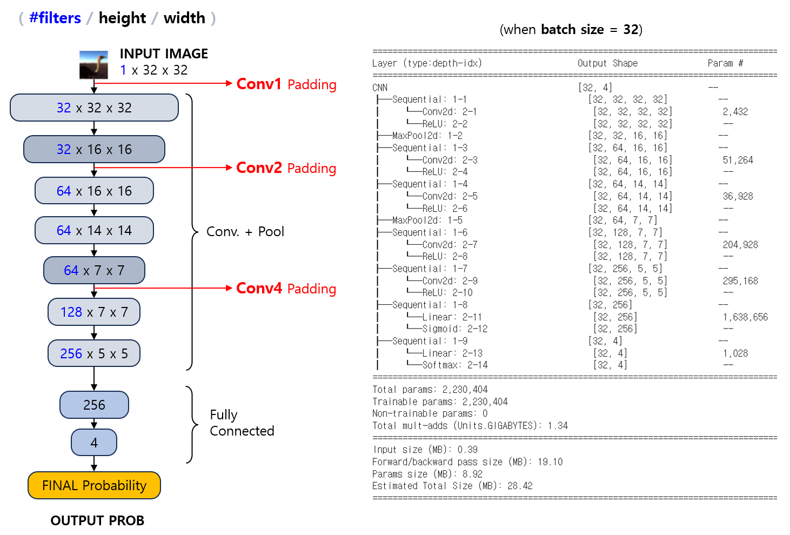
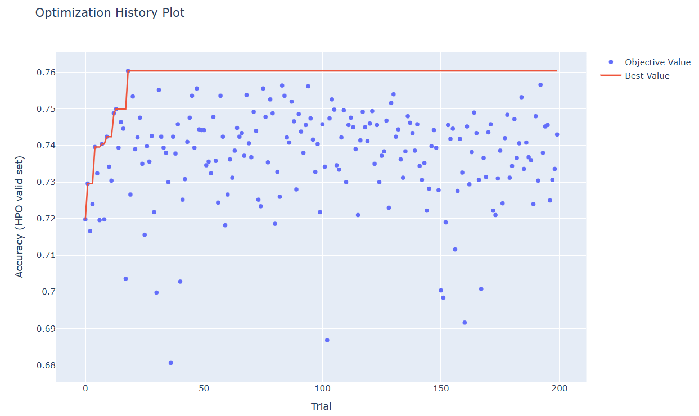
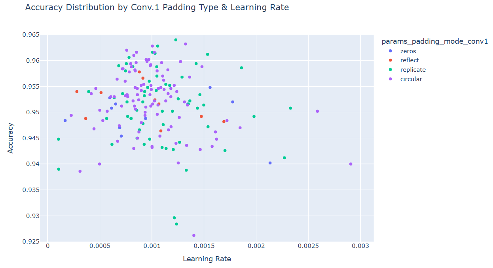
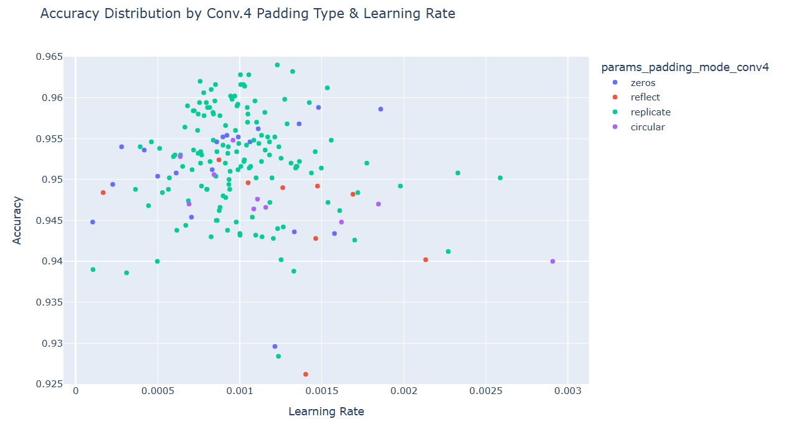
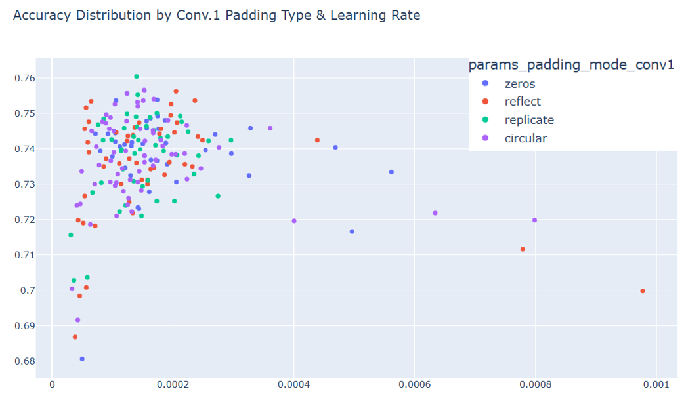
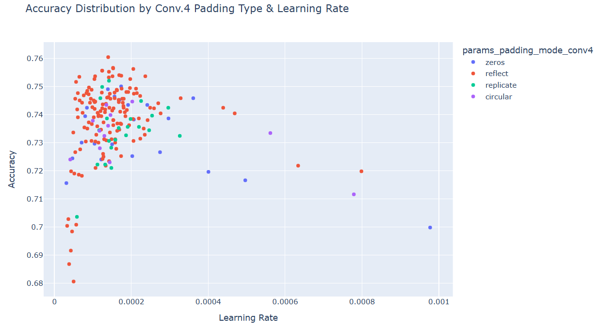

## 목차

* [1. CNN 의 Padding 적용 방법의 유형](#1-cnn-의-padding-적용-방법의-유형)
  * [1-1. Constant](#1-1-constant)
  * [1-2. Reflect](#1-2-reflect)
  * [1-3. Replicate](#1-3-replicate)
  * [1-4. Circular](#1-4-circular)
* [2. 실험: 어떤 Padding 적용 방법의 성능이 가장 좋을까?](#2-실험-어떤-padding-적용-방법의-성능이-가장-좋을까)
  * [2-1. 실험 설계](#2-1-실험-설계)
  * [2-2. 실험 결과](#2-2-실험-결과)
  * [2-3. 실험 결과에 대한 이유](#2-3-실험-결과에-대한-이유)

## 코드

* MNIST 숫자 분류 Dataset [실험](#2-실험-어떤-padding-적용-방법의-성능이-가장-좋을까) 코드 : [code (ipynb)](codes/CNN_Padding_experiment_MNIST.ipynb)
* CIFAR-10 이미지 분류 Dataset [실험](#2-실험-어떤-padding-적용-방법의-성능이-가장-좋을까) 코드 : [code (ipynb)](codes/CNN_Padding_experiment_CIFAR10.ipynb)

## 1. CNN 의 Padding 적용 방법의 유형

[Convolutional Neural Network (CNN)](Basics_CNN.md) 에서 Convolutional Layer 에 [Padding](Basics_CNN.md#3-padding-stride) 을 적용하는 방법은 다음과 같이 여러 가지가 있다.

여기서는 [PyTorch 에서 제공하는 Padding 의 방법들](https://pytorch.org/docs/stable/generated/torch.nn.functional.pad.html) 을 소개한다.

| 방법        | 설명                                                       |
|-----------|----------------------------------------------------------|
| Constant  | **일정한 정수** 값으로 padding 을 채움                              |
| Reflect   | 원본 feature map 에 있는 값들을 **상하좌우로 거울처럼** 반전                |
| Replicate | 원본 feature map 의 **가장자리에 있는 값** 들을 그대로 연장                |
| Circular  | 원본 feature map 을 연장할 때 **반대 방향의 끝 성분부터 순환하는 형태로** 그대로 연장 |


여기서는 다음 tensor 를 기준으로 설명한다.

```python
y = tensor([[[23., 29., 26., 17., 24., 22.,  6.],
             [17., 12.,  8., 23.,  4.,  8., 15.],
             [29., 22., 26., 12., 16.,  9., 27.],
             [15.,  2., 12., 22.,  9., 24., 20.],
             [22.,  1.,  9., 13.,  8., 14.,  9.],
             [13.,  1.,  0., 17., 28.,  6., 15.],
             [ 5.,  1., 21.,  8., 13.,  5.,  5.]]])
```

### 1-1. Constant

말 그대로 이미지의 상하좌우에 **일정한 상수 (costant) 값으로** 패딩을 채우는 것을 의미한다.

* PyTorch 에서 기본값은 0 (Zero Padding) 이다.
* 계산이 가장 단순하지만, Padding 을 가장 인위적으로 만들기 때문에 모델 성능 향상에는 좋지 않다.

PyTorch 에서는 다음과 같이 코드를 작성한다.

```python
# Padding of torch.nn.functional
import torch.nn.functional as F
y_padding = F.pad(y, (left, right, up, down), "constant", const)

# in Conv. Layer (Zero Padding)
conv = torch.nn.Conv2d(in_channels,
                       out_channels,
                       kernel_size,
                       padding=(left, right, up, down),
                       padding_mode='zeros')
```

* left: 좌측 패딩
* right: 우측 패딩
* up: 위쪽 패딩
* down: 아래쪽 패딩
* const : 패딩을 채울 상수 값 (미지정 시 0)

**예시**

```python
F.pad(y, (1, 2, 3, 4), "constant")
```

**실행 결과**

```python
tensor([[[ 0.,  0.,  0.,  0.,  0.,  0.,  0.,  0.,  0.,  0.],
         [ 0.,  0.,  0.,  0.,  0.,  0.,  0.,  0.,  0.,  0.],
         [ 0.,  0.,  0.,  0.,  0.,  0.,  0.,  0.,  0.,  0.],
         [ 0., 23., 29., 26., 17., 24., 22.,  6.,  0.,  0.],
         [ 0., 17., 12.,  8., 23.,  4.,  8., 15.,  0.,  0.],
         [ 0., 29., 22., 26., 12., 16.,  9., 27.,  0.,  0.],
         [ 0., 15.,  2., 12., 22.,  9., 24., 20.,  0.,  0.],
         [ 0., 22.,  1.,  9., 13.,  8., 14.,  9.,  0.,  0.],
         [ 0., 13.,  1.,  0., 17., 28.,  6., 15.,  0.,  0.],
         [ 0.,  5.,  1., 21.,  8., 13.,  5.,  5.,  0.,  0.],
         [ 0.,  0.,  0.,  0.,  0.,  0.,  0.,  0.,  0.,  0.],
         [ 0.,  0.,  0.,  0.,  0.,  0.,  0.,  0.,  0.,  0.],
         [ 0.,  0.,  0.,  0.,  0.,  0.,  0.,  0.,  0.,  0.],
         [ 0.,  0.,  0.,  0.,  0.,  0.,  0.,  0.,  0.,  0.]]])
```

### 1-2. Reflect

이 방법은 원본 feature map 에 있는 값들을 **상하좌우로 거울처럼** 반전시키는 것이다.

* feature map의 값을 거울처럼 대칭되게 복사하므로, 이웃한 픽셀끼리 데이터 값이 유사하다는 CNN의 기본 아이디어를 고려할 때 **이미지의 연속성이 보장** 된다.
* padding 의 size 가 입력 데이터보다 클 수 없으므로, 이를 고려하지 않았을 때 오류가 발생할 수 있다.

PyTorch 에서는 다음과 같이 코드를 작성한다.

```python
# Padding of torch.nn.functional
import torch.nn.functional as F
y_padding = F.pad(y, (left, right, up, down), "reflect")

# in Conv. Layer
conv = torch.nn.Conv2d(in_channels,
                       out_channels,
                       kernel_size,
                       padding=(left, right, up, down),
                       padding_mode='reflect')
```

**예시**

```python
F.pad(y, (1, 2, 3, 4), "reflect")
```

**실행 결과**

* ```---```, ```|```, ```[ ]``` 는 실제 출력에는 없는, 기준이 되는 원본 feature map 가장자리의 행, 열 및 그 교차점을 나타내기 위해 따로 추가한 표시이다.

```python
                |                             |
tensor([[[ 2., 15.,  2., 12., 22.,  9., 24., 20., 24.,  9.],
         [22., 29., 22., 26., 12., 16.,  9., 27.,  9., 16.],
         [12., 17., 12.,  8., 23.,  4.,  8., 15.,  8.,  4.],
     --- [29.,[23], 29., 26., 17., 24., 22.,[ 6], 22., 24.], ---
         [12., 17., 12.,  8., 23.,  4.,  8., 15.,  8.,  4.],
         [22., 29., 22., 26., 12., 16.,  9., 27.,  9., 16.],
         [ 2., 15.,  2., 12., 22.,  9., 24., 20., 24.,  9.],
         [ 1., 22.,  1.,  9., 13.,  8., 14.,  9., 14.,  8.],
         [ 1., 13.,  1.,  0., 17., 28.,  6., 15.,  6., 28.],
     --- [ 1.,[ 5],  1., 21.,  8., 13.,  5.,[ 5],  5., 13.], ---
         [ 1., 13.,  1.,  0., 17., 28.,  6., 15.,  6., 28.],
         [ 1., 22.,  1.,  9., 13.,  8., 14.,  9., 14.,  8.],
         [ 2., 15.,  2., 12., 22.,  9., 24., 20., 24.,  9.],
         [22., 29., 22., 26., 12., 16.,  9., 27.,  9., 16.]]])
                |                             |
```

### 1-3. Replicate

이 방법은 원본 feature map 의 **가장자리에 있는 값** 들을 그대로 연장하는 것이다.

* Reflect 와 마찬가지로, feature map을 복사하므로 이웃한 픽셀끼리 데이터 값이 유사하다는 CNN의 기본 아이디어를 고려할 때 **이미지의 연속성이 보장** 된다.
* 가장자리 픽셀의 연장으로 인한 반복에 의해, 모델 학습에 지장을 줄 수 있다.

PyTorch 에서는 다음과 같이 코드를 작성한다.

```python
# Padding of torch.nn.functional
import torch.nn.functional as F
y_padding = F.pad(y, (left, right, up, down), "replicate")

# in Conv. Layer
conv = torch.nn.Conv2d(in_channels,
                       out_channels,
                       kernel_size,
                       padding=(left, right, up, down),
                       padding_mode='replicate')
```

**예시**

```python
F.pad(y, (1, 2, 3, 4), "replicate")
```

**실행 결과**

* ```---```, ```|```, ```[ ]``` 는 실제 출력에는 없는, 기준이 되는 원본 feature map 가장자리의 행, 열 및 그 교차점을 나타내기 위해 따로 추가한 표시이다.

```python
                |                             |
tensor([[[23., 23., 29., 26., 17., 24., 22.,  6.,  6.,  6.],
         [23., 23., 29., 26., 17., 24., 22.,  6.,  6.,  6.],
         [23., 23., 29., 26., 17., 24., 22.,  6.,  6.,  6.],
     --- [23.,[23], 29., 26., 17., 24., 22.,[ 6],  6.,  6.], ----
         [17., 17., 12.,  8., 23.,  4.,  8., 15., 15., 15.],
         [29., 29., 22., 26., 12., 16.,  9., 27., 27., 27.],
         [15., 15.,  2., 12., 22.,  9., 24., 20., 20., 20.],
         [22., 22.,  1.,  9., 13.,  8., 14.,  9.,  9.,  9.],
         [13., 13.,  1.,  0., 17., 28.,  6., 15., 15., 15.],
     --- [ 5.,[ 5],  1., 21.,  8., 13.,  5.,[ 5],  5.,  5.], ---
         [ 5.,  5.,  1., 21.,  8., 13.,  5.,  5.,  5.,  5.],
         [ 5.,  5.,  1., 21.,  8., 13.,  5.,  5.,  5.,  5.],
         [ 5.,  5.,  1., 21.,  8., 13.,  5.,  5.,  5.,  5.],
         [ 5.,  5.,  1., 21.,  8., 13.,  5.,  5.,  5.,  5.]]])
                |                             |
```

### 1-4. Circular

이 방법은 원본 feature map 을 연장할 때 **반대 방향의 끝 성분부터 순환하는 형태로** 그대로 연장하는 것이다.

* 대부분의 이미지에는 적합하지 않으나, 신호 처리 등 주기적인 특성을 갖는 분야에서 유용할 수 있다.
* 이는 **이미지의 위쪽 끝 - 아래쪽 끝, 왼쪽 끝 - 오른쪽 끝** 의 픽셀 값은 서로 완전히 다른 경우가 많기 때문이다.

PyTorch 에서는 다음과 같이 코드를 작성한다.

```python
# Padding of torch.nn.functional
import torch.nn.functional as F
y_padding = F.pad(y, (left, right, up, down), "circular")

# in Conv. Layer
conv = torch.nn.Conv2d(in_channels,
                       out_channels,
                       kernel_size,
                       padding=(left, right, up, down),
                       padding_mode='circular')
```

**예시**

```python
F.pad(y, (1, 2, 3, 4), "circular")
```

**실행 결과**

* ```---```, ```|```, ```[ ]``` 는 실제 출력에는 없는, 기준이 되는 원본 feature map 가장자리의 행, 열 및 그 교차점을 나타내기 위해 따로 추가한 표시이다.

```python
                |                             |
tensor([[[ 9., 22.,  1.,  9., 13.,  8., 14.,  9., 22.,  1.],
         [15., 13.,  1.,  0., 17., 28.,  6., 15., 13.,  1.],
         [ 5.,  5.,  1., 21.,  8., 13.,  5.,  5.,  5.,  1.],
     --- [ 6.,[23], 29., 26., 17., 24., 22.,[ 6], 23., 29.], ---
         [15., 17., 12.,  8., 23.,  4.,  8., 15., 17., 12.],
         [27., 29., 22., 26., 12., 16.,  9., 27., 29., 22.],
         [20., 15.,  2., 12., 22.,  9., 24., 20., 15.,  2.],
         [ 9., 22.,  1.,  9., 13.,  8., 14.,  9., 22.,  1.],
         [15., 13.,  1.,  0., 17., 28.,  6., 15., 13.,  1.],
     --- [ 5.,[ 5],  1., 21.,  8., 13.,  5.,[ 5],  5.,  1.], ---
         [ 6., 23., 29., 26., 17., 24., 22.,  6., 23., 29.],
         [15., 17., 12.,  8., 23.,  4.,  8., 15., 17., 12.],
         [27., 29., 22., 26., 12., 16.,  9., 27., 29., 22.],
         [20., 15.,  2., 12., 22.,  9., 24., 20., 15.,  2.]]])
                |                             |
```

## 2. 실험: 어떤 Padding 적용 방법의 성능이 가장 좋을까?

**실험 목표**

* 데이터셋 특징에 따라 위에서 알아본 Padding 방법들 중 Layer 별로 어떤 것을 적용해야 최적의 성능이 나오는지 알아본다. 
* **[Circular Padding](#1-4-circular) 을 적용했을 때 불연속의 느낌이 있는 것 / 없는 것** 각각 확인한다.

### 2-1. 실험 설계

**데이터셋**

* 데이터셋 2개
  * 1개는 상하좌우 4방향의 경계가 모두 일정한 색으로 서로 같은 것, 1개는 그렇지 않은 것 

| 데이터셋                                                                             | Task                                   | 상하좌우 경계                                                                     | 예시 이미지                        |
|----------------------------------------------------------------------------------|----------------------------------------|-----------------------------------------------------------------------------|-------------------------------|
| **MNIST 숫자 이미지 분류** 데이터셋<br>- train 60K / test 10K<br>- 빠른 실험 진행을 위해, 그 중 일부만 사용 | Classification<br>(10 Classes)         | 4방향 경계가 **모두 검은색 (#000000) 으로 일정함**<br>- circular padding 으로 해도 불연속의 느낌이 없음 |  |
| **CIFAR-10** 데이터셋<br>- train 50K / test 10K<br>- 빠른 실험 진행을 위해, 그 중 일부만 사용        | Classification<br>(10 → **4 Classes**) | 4방향 경계가 **일정하지 않고 서로 다름**<br>- circular padding 으로 하면 불연속의 느낌이 있음           |  |

* 선정 이유
  * 데이터셋이 각각 28 x 28, 32 x 32 size 의 작은 이미지들로 구성
  * 이로 인해 비교적 간단한 신경망을 설계할 수 있으므로, 간단한 딥러닝 실험에 적합하다고 판단
* 데이터셋 분리
  * 빠른 실험 진행을 위해서 학습 데이터의 일부분만 사용
  * CIFAR-10 데이터셋의 경우 **10개 Class 중 특정 4개에 해당하는 데이터** 로만 Train / Valid / Test 데이터셋 구성

| 데이터셋                     | 학습 데이터  | Valid 데이터 (Epoch 단위) | Valid 데이터 (Trial 단위) | Test 데이터           |
|--------------------------|---------|----------------------|----------------------|--------------------|
| MNIST 숫자 분류              | 1,000 장 | 2,000 장              | 5,000 장              | 10,000 장 (원본 그대로)  |
| CIFAR-10 **(4 Classes)** | 2,000 장 | 2,000 장              | 5,000 장              | 4,000 장 (4개 Class) |

**성능 Metric**

* **Accuracy**
* 선정 이유
  * Accuracy 로 성능을 측정해도 될 정도로, [각 Class 간 데이터 불균형](../Data%20Science%20Basics/데이터_사이언스_기초_데이터_불균형.md) 이 적음 

**신경망 구조**

* 아래 그림은 위쪽부터 각각 MNIST 숫자 분류 데이터셋, CIFAR-10 데이터셋에 대한 신경망임

```python
# 신경망 구조 출력 코드

from torchinfo import summary

model = CNN()
print(summary(model, input_size=(BATCH_SIZE, 1, 28, 28)))
```




* [Dropout](딥러닝_기초_Overfitting_Dropout.md#3-dropout) 미 적용
* [Learning Rate Scheduler](딥러닝_기초_Learning_Rate_Scheduler.md) 미 적용
* Optimizer 는 [AdamW](딥러닝_기초_Optimizer.md#2-3-adamw) 를 사용
  * 해당 Optimizer 가 [동일 데이터셋을 대상으로 한 성능 실험](딥러닝_기초_Optimizer.md#3-탐구-어떤-optimizer-가-적절할까) 에서 최상의 정확도를 기록했기 때문
* [Early Stopping](../AI%20Basics/Deep%20Learning%20Basics/딥러닝_기초_Early_Stopping.md) 을 위한 Epoch 수는 10 으로 고정

**상세 학습 방법**

* 다음과 같이 하이퍼파라미터 최적화를 실시하여, **최적화된 하이퍼파라미터를 기준으로 한 성능을 기준** 으로 최고 성능의 Optimizer 를 파악
  * **레이어 별 Padding 의 종류 (총 3개)** ```padding_mode_conv{1|2|4}```
    * 3개의 Layer 에 대해 각각 서로 다른 Padding 적용 
    * input layer 에 가까운 순으로 각각 conv1, conv2, conv4
    * Padding 의 종류는 ```zeros``` (Zero Padding), ```reflect```, ```replicate```, ```circular``` 의 4가지
  * **learning rate** ```learning_rate```
    * MNIST 탐색 범위 : 0.0001 ~ 0.003 (= 1e-4 ~ 3e-3)
    * CIFAR-10 탐색 범위 : 0.00003 ~ 0.001 (= 3e-5 ~ 1e-3)

* 하이퍼파라미터 최적화
  * [하이퍼파라미터 최적화 라이브러리](../Machine%20Learning%20Models/머신러닝_방법론_HyperParam_Opt.md#4-하이퍼파라미터-최적화-라이브러리) 중 Optuna 를 사용
  * 각 데이터셋 별 하이퍼파라미터 탐색 200 회 반복 (= 200 Trials) 실시

### 2-2. 실험 결과

**1. 실험 결론**

* 모든 데이터셋, 모든 레이어에 대해서 **Padding Option 에 따른 성능의 큰 차이가 없음**
  * **상하좌우 4방향의 경계가 모두 검은색으로 일정** 한 MNIST 데이터셋의 경우, 각 레이어 별 Padding 방식에 따른 성능 차이가 **눈에 띄지 않음**
  * **상-하 경계, 좌-우 경계 간 연결 시 불연속** 으로 느껴지는 **CIFAR-10** 데이터셋의 경우에도, 4 가지의 Padding option 사이에 성능의 큰 차이가 없는 것으로 보인다.
* 단 Zero Padding 의 경우, 두 데이터셋 모두, 추가 실험 시 다른 Padding 방법들보다 성능이 떨어질 수도 있음

**2. Best Hyper-param 및 그 성능 (정확도)**

| 구분                   | MNIST 숫자 분류                                                                                                                                                      | CIFAR-10                                                                                                                                                  |
|----------------------|------------------------------------------------------------------------------------------------------------------------------------------------------------------|-----------------------------------------------------------------------------------------------------------------------------------------------------------|
| 최종 테스트셋 정확도          | 96.40%                                                                                                                                                           | 74.48%                                                                                                                                                    |
| HPO Valid set 최고 정확도 | 96.40%                                                                                                                                                           | 73.78%                                                                                                                                                    |
| Best Hyper-param     | ```padding_mode_conv1```: ```replicate```<br>```padding_mode_conv2```: ```zeros```<br>```padding_mode_conv4```: ```replicate```<br>```learning_rate```: 0.001229 | ```padding_mode_conv1```: ```reflect```<br>```padding_mode_2```: ```circular```<br>```padding_mode_4```: ```replicate```<br>```learning_rate```: 0.000168 |

**3. 하이퍼파라미터 최적화 진행에 따른 정확도 추이**

* MNIST 숫자 분류


* CIFAR-10



**4. (MNIST 숫자 분류) 각 하이퍼파라미터의 값에 따른 성능 분포**

* ```Conv1``` Layer 의 Padding 종류에 따른 성능
  * Zero padding 을 사용하는 경우 성능이 다소 낮을 수도 있을 것으로 보인다. 



* ```Conv2``` Layer 의 Padding 종류에 따른 성능
  * 4 가지의 Padding option 사이에 성능의 큰 차이가 없는 것으로 보인다. 


* ```Conv4``` Layer 의 Padding 종류에 따른 성능
  * ```reflect``` padding 을 사용하는 경우 성능이 다소 낮을 수도 있을 것으로 보인다.



**5. (CIFAR-10) 각 하이퍼파라미터의 값에 따른 성능 분포**

* ```Conv1``` Layer 의 Padding 종류에 따른 성능
  * 4 가지의 Padding option 사이에 성능의 큰 차이가 없는 것으로 보인다. 



* ```Conv2``` Layer 의 Padding 종류에 따른 성능
  * 4 가지의 Padding option 사이에 성능의 큰 차이가 없는 것으로 보인다. 


* ```Conv4``` Layer 의 Padding 종류에 따른 성능
  * 4 가지의 Padding option 사이에 성능의 큰 차이가 없는 것으로 보인다. 



### 2-3. 실험 결과에 대한 이유

**모든 레이어에 대해, Padding Option 에 따른 성능의 큰 차이가 없음**

* 이미지를 분류하는 데 핵심적인 부분은 feature map 의 padding 이 아닌 main 부분에 이미 포함되어 있기 때문으로 추정
* Padding 부분은 이미지 Class 분류에 영향을 거의 미치지 못했을 것으로 추정됨
* 단, Zero Padding 의 경우, Padding 부분이 constant 값으로 이미지에 대한 정보를 담지 못하기 때문에, 다른 Padding 방법들에 비해 성능이 떨어질 가능성이 있음