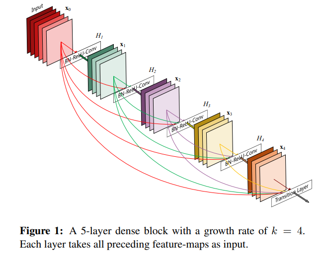

# 이미지 프로세싱 기초 - DenseNet

## DenseNet이란?

[DenseNet 논문](https://arxiv.org/pdf/1608.06993.pdf)

(출처: Gao Huang, Zhuang Liu et al, Densely Connected Convolutional Networks)

**DenseNet** 은 위 논문과 같이 Cornell 대학, Tsinghua 대학 및 Facebook AI 연구진이 협업하여 개발, 2017년에 공개한 CNN 구조이다.

DenseNet은 다음과 같은 구조를 가지고 있다.
* **입력 -> Conv -> Dense Block -> {N x (Conv -> Pooling -> Dense Block)} -> Pooling -> Linear -> output**
  * 위 구조에서 N은 Dense Block 구조의 개수이다.
* 가운데의 Convolutional Layer와 Pooling Layer를 합쳐서 Transition Layer라고 하는데, 그 구조는 다음과 같다.
  * Convolutional Layer : **1x1 Convolutional Layer** 이다.
  * Pooling Layer : **2x2 average pooling** 을 사용한다.
  * Batch Normalization Layer를 포함한다.

## ImageNet에 사용하는 DenseNet의 구조

(출처: Gao Huang, Zhuang Liu et al, Densely Connected Convolutional Networks)

ImageNet에 사용하기 위한 DenseNet 구조는 위와 같이 Convolutional Layer의 출력 크기가 112 x 112이고, fully-connected layer의 최종 출력은 1000차원의 softmax이다.

## DenseNet의 Dense Block 구조

(출처: Gao Huang, Zhuang Liu et al, Densely Connected Convolutional Networks)

DenseNet에는 위와 같은 Dense Block 구조가 있는데, 이는 다음과 같이 구성된다.
* **Batch Normalization -> ReLU -> Convolutional Layer**
* **Dense Connectivity** : 같은 Dens Block에 있는 모든 레이어가 그 앞에 있는 모든 레이어와 직접 연결된다.
* N번째 레이어는 1번째, 2번째, ..., (N-1)번째 레이어에서 생성된 feature map의 concatenation을 나타낸다.