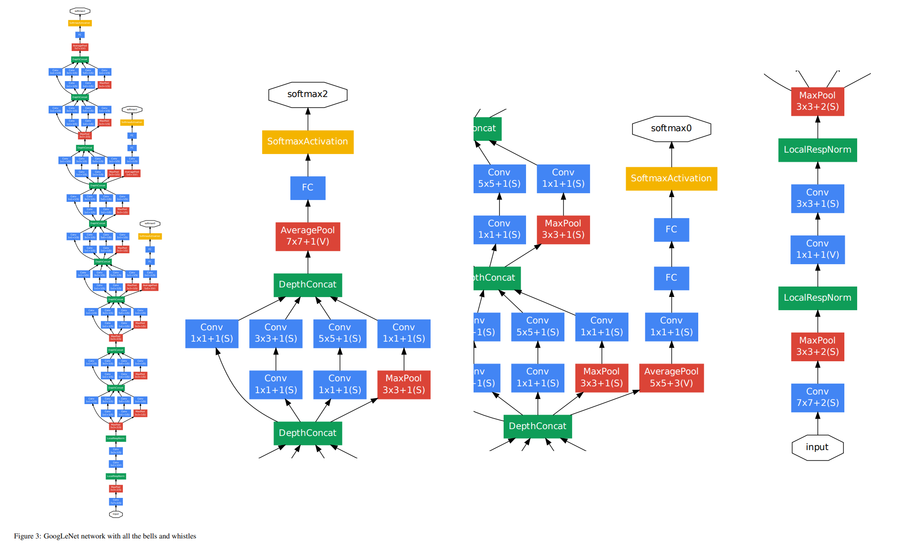
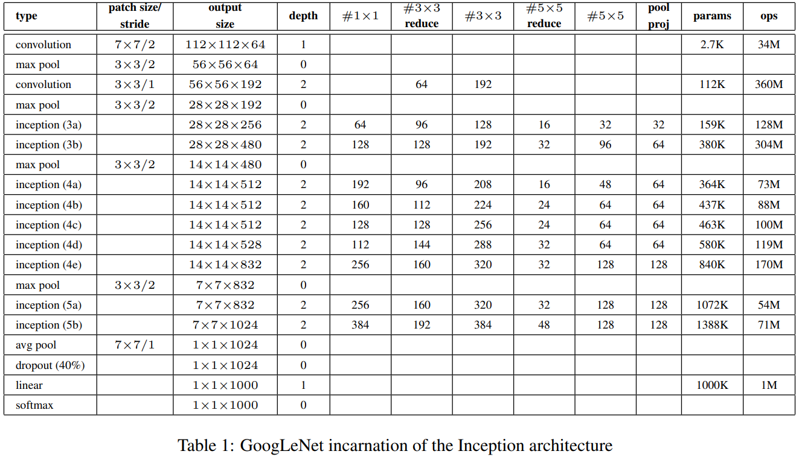
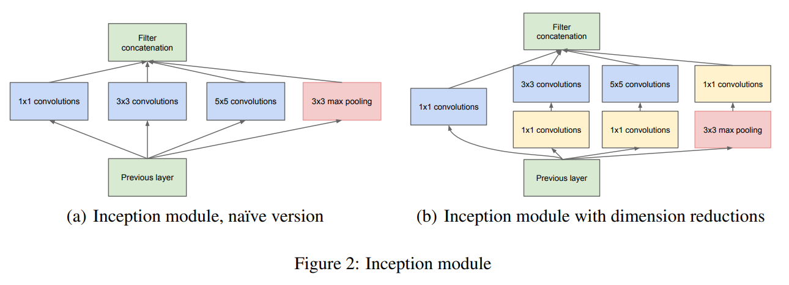

# 이미지 프로세싱 기초 - GoogLeNET

## GoogLeNet이란?

[GoogLeNet 논문](https://arxiv.org/pdf/1409.4842.pdf)

(출처: Christian Szegedy, Wei Liu et al, Going deeper with convolutions)

**GoogLeNet** 은 위 논문과 같이 Google의 연구진 위주로 구성된 연구팀이 개발한 CNN 모델이다.

(출처: Christian Szegedy, Wei Liu et al, Going deeper with convolutions)

GoogLeNet의 세부적인 구성 요소들을 표로 나타내면 위 표와 같다.

## GoogLeNet의 Inception Module

(출처: Christian Szegedy, Wei Liu et al, Going deeper with convolutions)

GoogLeNet에서는 위와 같은 형태의 Inception Module이 있다.
* **기본 아이디어** : Inception 구조의 기본 아이디어는 CNN에서 **최적의 local sparse 구조** 를 찾는 것이다.
* **기본 구조** : 1x1, 3x3, 5x5 등 다양한 크기의 Convolutional Layer와 Pooling Layer가 있다.
* Inception module with dimension reductions 에서 1x1 Convolutional Layer를 추가로 사용하는 이유는 **차원 축소** 를 위한 것이다.
  * 필터 개수가 많은 경우 5x5 Convolutional Layer를 거칠 때 컴퓨팅 자원이 많이 소비되기 때문에, 해당 레이어를 통과하기 전에 1x1 Convolution을 추가하여 자원 소비를 줄이자는 것이다.

## 실험 결과 및 논문 상세
GoogLeNet은 다음과 같이 분류 및 탐지 문제에서 모두 우수한 성능을 거두었다.
* ILSVRC 2014 Classification Challenge에서 추가적인 데이터를 사용하지 않고도 top-5의 Error를 6.67%까지 줄여서 1위 성적을 거두었다.
  * 2014년뿐만 아니라 2012년, 2013년 결과를 포함해도 1위이다.
* ILSVRC 2014 Detection Challenge에서는 1000개의 ImageNet 데이터를 추가로 사용하여 mAP = 43.9%의 성적으로 1위를 거두었다.