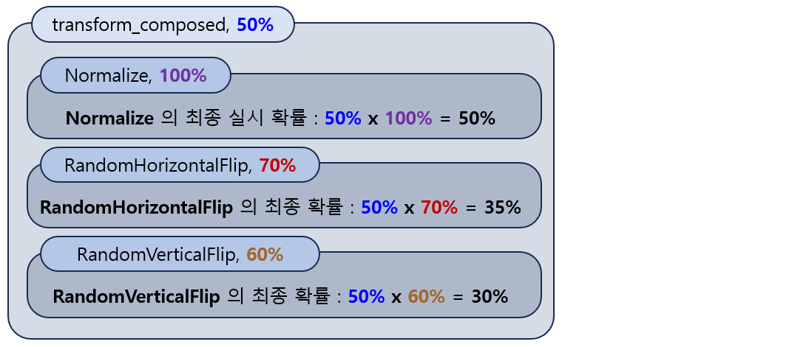

## 목차

* [1. Image Augmentation 방법 상세](#1-image-augmentation-방법-상세)
  * [1-1. 이미지 형태의 기하학적 변형](#1-1-이미지-형태의-기하학적-변형)
  * [1-2. 이미지 색상 변형](#1-2-이미지-색상-변형)
  * [1-3. 기타 변형 or 노이즈 추가](#1-3-기타-변형-or-노이즈-추가)
* [2. torchvision 을 이용한 Augmentation](#2-torchvision-을-이용한-augmentation)
  * [2-1. 기본 사용법](#2-1-기본-사용법)
  * [2-2. Augmentation 방법 별 함수](#2-2-augmentation-방법-별-함수)
  * [2-3. AutoAugment](#2-3-autoaugment)
* [3. 실험: 최선의 Augmentation 방법 탐색](#3-실험-최선의-augmentation-방법-탐색)
  * [3-1. 실험 설계](#3-1-실험-설계)
  * [3-2. 실험 결과](#3-2-실험-결과)
  * [3-3. 실험 결과에 대한 이유 분석](#3-3-실험-결과에-대한-이유-분석)

## 코드

## 1. Image Augmentation 방법 상세

[Image Augmentation](Basics_Image_Augmentation.md) 의 방법은 다음과 같이 분류할 수 있다.

| 분류              | 상세 유형                                                                                                             | 특징                                                                                                                        |
|-----------------|-------------------------------------------------------------------------------------------------------------------|---------------------------------------------------------------------------------------------------------------------------|
| 이미지 형태의 기하학적 변형 | - 좌우 반전<br>- 상하 반전<br>- 랜덤한 각도로 회전<br>- Affine 변환<br>- 이미지의 랜덤한 영역만 남기고 잘라내기 (crop)<br>- 이미지의 중심 일정 영역만 남기고 잘라내기  | - Object Detection 과 같은 task 의 경우, bounding box 등 관련 정보도 바뀌어야 함<br>- 물체의 형태가 바뀌면 target value (예: 분류) 가 달라질 수 있는 경우 사용 불가 |
| 이미지 색상 변형       | - 밝기 조정<br>- 대비 (contrast) 조정<br> - 채도 (saturation) 조정<br>- 회색조 (Grayscale)<br>- 반전 (Invert)<br>- 정규화 (Normalize) | - 물체의 색이 바뀌면 target value 가 달라질 수 있는 경우 사용 불가                                                                             |
| 기타 변형 or 노이즈 추가 | - Noise 추가<br>- Gaussian Blur<br>- Sharpness 추가<br> - JPEG 이미지로 변환                                                | - Noise 가 있는 이미지가 많은 데이터셋에 적합할 수 있음                                                                                       |

### 1-1. 이미지 형태의 기하학적 변형

이 방법의 주요 특징은 다음과 같다.

* 물체의 위치가 바뀌므로, 일부 Task 에서 픽셀 좌표 정보가 바뀌어야 함
  * Object Detection 에서의 Bounding Box 의 위치
  * Segmentation 에서의 Segmented pixel 좌표 정보
* 물체의 형태가 바뀌면 Target Value 가 달라지는 경우 사용 불가
  * 예를 들어 MNIST 숫자 분류 데이터셋에서, '6'을 180도 회전하면 '9'가 되어 Class가 달라지는 경우 


이 방법의 대표적인 예로 다음과 같은 것들이 있다.

* 상하, 좌우 반전
  * 반전 여부만 달라지므로 상하 반전으로 2배, 좌우 반전으로 2배까지 데이터를 증강시킬 수 있다. 
* 랜덤한 각도로 회전
  * 직사각형 모양의 이미지를 회전시킨 후 원래 직사각형에 넣으려고 하면 남는 공간이 생기는데, 이를 적절한 방법으로 채워야 한다. 
* Affine 변환
  * 이미지를 **평행사변형 형태로 변환하거나, 회전하거나, Scaling 하는 등** 다양하게 변형 가능
  * 수학적으로는 다음과 같이 표현된다.
    * 여기서 $a_{11}$, $a_{12}$, $a_{13}$, $a_{21}$, $a_{22}$, $a_{23}$ 의 값에 따라 어떻게 변환되는지가 결정된다.


* 이미지의 랜덤한 영역 / 중심부만 남기고 잘라내기
  * 직사각형 형태로 이미지의 일부분만 남기고 잘라낸다.
  * 물체의 크기 또는 확대 배율이 서로 다른 이미지들이 있는 데이터셋에 적합하다.

### 1-2. 이미지 색상 변형

이 방법의 주요 특징은 다음과 같다.

* 물체의 위치가 바뀌지 않으므로, Object Detection, Segmentation 등의 task 에서도 픽셀 좌표 정보가 바뀌지 않아도 됨
* 물체의 형태가 바뀌면 Target Value 가 달라지는 경우에도 사용 가능
* 물체의 색이 바뀌면 Target Value 가 달라지는 경우 사용 불가
  * 예: 익은 사과와 그렇지 않은 사과를 구분하는 task


이 방법의 대표적인 예로 다음과 같은 것들이 있다.

* 밝기, 대비 (contrast), 채도 (saturation) 조정
* 회색조 (Grayscale)
* 반전 (Invert)
  * 모든 픽셀에 대해서, R, G, B channel 의 값을 각각 (255 - R), (255 - G), (255 - B) 로 바꾼다. 
* [정규화 (Normalize)](../AI%20Basics/Data%20Science%20Basics/데이터_사이언스_기초_Normalization.md)
  * [Min-max Normalization](../AI%20Basics/Data%20Science%20Basics/데이터_사이언스_기초_Normalization.md#2-1-min-max-normalization) 과 유사하게, 이미지의 픽셀 값을 **-1.0 ~ +1.0 으로 linear 하게** 정규화하는 방법
  * [Gaussian (Z-score) Normalization](../AI%20Basics/Data%20Science%20Basics/데이터_사이언스_기초_Normalization.md#2-2-standarization-z-score-normalization) 과 같이, 이미지의 픽셀 값을 **그 평균, 표준편차를 이용하여 정규화** 하는 방법
    * ImageNet과 같이 유명한 데이터셋은 자체적으로 Gaussian Normalization 을 위한 mean, std-dev 값을 공개하는 경우가 많다. 

### 1-3. 기타 변형 or 노이즈 추가

이 방법의 주요 특징은 다음과 같다.

* 물체의 기하학적 형태나 색이 달라졌을 때 Target Value 가 달라지는 경우에도 사용 가능
* 구체적인 방법에 따라, Noise 나 Blurring 등이 있는 이미지가 많은 데이터셋에 적합할 수 있음

이 방법의 대표적인 예로 다음과 같은 것들이 있다.

* 노이즈 (Noise) 추가
* Gaussian Blur 적용
* Sharpness 추가
* JPEG 이미지로 변환
  * 실무적 관점에서, PNG와 JPEG 이미지가 학습 데이터에 섞여 있거나, 실제 사용자가 입력하는 이미지가 JPEG 이미지일 때 유용하다.

## 2. torchvision 을 이용한 Augmentation

PyTorch 에서 제공하는 **torchvision 이라는 라이브러리를 이용** 하여 Image Augmentation 을 할 수 있다.

1개의 이미지에 대해 다음 방법을 여러 번 반복 시행하여 Image Augmentation 을 할 수 있다. 핵심 아이디어는 **최대한 다양한 경우의 수의 이미지가 골고루 나오게** 하는 것이다.

* 상하, 좌우 반전 등 만들 수 있는 이미지의 경우의 수가 제한된 Augmentation 은 그 실시 확률을 적당히 지정 (예: 50%)
* 랜덤한 각도로 회전 등 경우의 수가 제한되지 않은 Augmentation 은 그 실시 확률을 100% 에 가까운 높은 확률로 지정 (예: 90% ~ 95%)


### 2-1. 기본 사용법

torchvision 의 기본 사용법은 다음과 같다.

* 필요한 라이브러리를 import 한다. ([Pillow](Library_Pillow.md) 포함)
* Pillow 를 이용하여 이미지를 읽고 tensor 로 변환한다.
* tensor 로 변환된 이미지에 torchvision 의 transform 을 적용한다.
  * 이때, ```p``` 는 해당 transform 을 적용할 확률을 의미한다.
* tensor 로 변환된 이미지를 ```torchvision.utils.save_image``` 를 이용하여 저장한다.

```python
import torch
import torchvision
from torchvision.transforms import v2
import torchvision.transforms.functional as transform

import PIL

# read image and convert to PyTorch tensor
img = PIL.Image.open('lena.PNG')
img_tensor = transform.to_tensor(img)

print(img_tensor)

# apply transform
transform_1 = v2.RandomHorizontalFlip(p=0.5)
img_tensor = transform_1(img_tensor)

transform_2 = v2.RandomVerticalFlip(p=0.5)
img_tensor = transform_2(img_tensor)

# save transformed image
torchvision.utils.save_image(img_tensor, 'lena_.PNG')
```

**Composed Transform**

torchvision 에서는 다음과 같이 여러 개의 transform 을 **Compose (하나로 묶기)** 할 수 있다.

아래 코드는 ```v2.Normalize```, ```v2.RandomHorizontalFlip```, ```v2.RandomVerticalFlip``` 이 적용된 Composed Transform 을 정의하고 그것을 50%의 확률로 실행하는 것이다. 이미지 로딩 및 저장을 제외한 코드 설명은 다음과 같다.

* 위 3개의 transform 을 각각 "항상 실행", "70% 확률로 실행", "60% 확률로 실행" 하는 Composed Transformation 인 ```transform_composed``` 를 적용한다.
* 이 ```transform_composed``` 를 50% 확률로 실행하기 위해, ```RandomApply``` 함수를 이용하여 ```transform_composed_``` 라는 50% 확률의 Transform 을 정의한다.
* 이미지를 ```transform_composed_``` 를 이용하여 변환한다.

```python
# read image and convert to PyTorch tensor
img = PIL.Image.open('lena.PNG').convert('RGB')
img_tensor = transform.to_tensor(img)

# define composed transform
transform_composed = v2.Compose([
    v2.Normalize(mean=[0.485, 0.456, 0.406],
                 std=[0.229, 0.224, 0.225]),
    v2.RandomHorizontalFlip(p=0.7),  # 70% chance
    v2.RandomVerticalFlip(p=0.6)  # 60% chance
])

# randomly applied composed transform with 50% chance
transform_composed_ = v2.RandomApply([transform_composed], p=0.5)
img_tensor = transform_composed_(img_tensor)

# save transformed image
torchvision.utils.save_image(img_tensor, 'lena_.PNG')
```

위 코드의 Transformation 을 그림으로 나타내면 다음과 같다.

* 예를 들어 RandomHorizontalFlip 은 그 **전제 조건인 transform_composed 의 실행 확률이 50%** 이고 RandomHorizontalFlip 자체의 실행 확률은 70% 이므로, 이 둘을 곱하면 최종 실행 확률은 35% 이다.



### 2-2. Augmentation 방법 별 함수

torchvision 에서 제공하는 Augmentation 방법 별 함수는 다음과 같다. 적용 확률을 나타내는 인수인 ```p```에 대한 설명은 생략한다.

**1. 이미지의 기하학적 형태 변환**

| Augmentation 방법 | 함수                         | 인수 설명                                                                                                                                                                                                                     |
|-----------------|----------------------------|---------------------------------------------------------------------------------------------------------------------------------------------------------------------------------------------------------------------------|
| 상하 대칭           | ```RandomVerticalFlip```   |                                                                                                                                                                                                                           |
| 좌우 대칭           | ```RandomHorizontalFlip``` |                                                                                                                                                                                                                           |
| 랜덤 회전           | ```RandomRotation```       | ```degrees``` : 회전 각도의 범위 (tuple 형식, 도 단위)                                                                                                                                                                                |
| Affine 변환       | ```RandomAffine```         | ```degrees``` : 회전 각도의 범위 (tuple 형식, 도 단위)<br>```translate``` : (a, b) 형식<br>- a : 이미지의 가로 길이의 a배 만큼 가로 이동<br>- b : 이미지의 세로 길이의 b배 만큼 가로 이동<br>```scale``` : 이미지 크기 조절용 scaling factor<br>```shear``` : 이미지를 평행사변형 형태로 변형 |
| 이미지 랜덤 잘라내기     | ```RandomCrop```           | ```size``` : (a, b) 형식<br>- 이미지 중심을 기준으로 가로 b 픽셀, 세로 a 픽셀만큼 잘라내기                                                                                                                                                          |
| 이미지 중심 잘라내기     | ```CenterCrop```           | ```size``` : (a, b) 형식<br>- 이미지 중심을 기준으로 가로 b 픽셀, 세로 a 픽셀만큼 잘라내기                                                                                                                                                          |

* 랜덤 회전, Affine 변환 등 변환 후 빈 공간이 생기는 경우 이를 ```transforms.v2.Pad``` 를 이용하여 채우는 것이 좋다. 예를 들어 다음과 같이 사용한다.
  * Padding Mode 는 [PyTorch CNN 의 Padding Mode](Basics_CNN_Paddings.md#1-cnn-의-padding-적용-방법의-유형) 와 유사하다.

```python
transform_example = v2.Compose([
    v2.RandomRotation(degrees=(-30, 30)),
    v2.Pad(padding=50, padding_mode='reflect')  # reflect padding 적용
])
img_tensor = transform_example(img_tensor)
```

**2. 이미지 색상 변형**

| Augmentation 방법    | 함수                    | 인수 설명                                                                                                                       |
|--------------------|-----------------------|-----------------------------------------------------------------------------------------------------------------------------|
| 밝기 조정              | ```ColorJitter```     | ```brightness``` : (factor 최솟값, factor 최댓값) 형식<br>- 범위 내에서 랜덤하게 factor 가 정해짐<br> - factor 가 0이면 검은색, 1이면 원래 이미지, 1 이상이면 밝아짐 |
| 대비 (contrast) 조정   | ```ColorJitter```     | ```contrast``` : (factor 최솟값, factor 최댓값) 형식<br> - ```brightness``` 와 동일한 원리                                                |
| 채도 (saturation) 조정 | ```ColorJitter```     | ```saturation``` : (factor 최솟값, factor 최댓값) 형식<br> - ```brightness```, ```contrast``` 와 동일한 원리                              |
| 회색조 (Grayscale)    | ```RandomGrayscale``` |                                                                                                                             |
| 반전 (Invert)        | ```RandomInvert```    |                                                                                                                             |
| 정규화 (Normalize)    | ```Normalize```       | ```mean``` : 각 channel 별, 0~1 로 linear 하게 정규화된 픽셀 값들의 평균<br>```std``` : 각 channel 별, 0~1 로 linear 하게 정규화된 픽셀 값들의 표준편차       |

**3. 기타 변형 or 노이즈 추가**

| Augmentation 방법 | 함수                          | 인수 설명                                                                                                                                        |
|-----------------|-----------------------------|----------------------------------------------------------------------------------------------------------------------------------------------|
| 노이즈 추가          | ```GaussianNoise```         | ```mean``` : Noise 의 평균값<br>```sigma```: Noise 의 표준편차                                                                                        |
| Gaussian Blur   | ```GaussianBlur```          | ```kernel_size``` : Gaussian Blur 효과의 크기<br>```sigma``` : (factor 의 최솟값, factor 의 최댓값) 형식<br>- factor 는 Gaussian Blur 효과의 강도 (kernel 의 표준편차) |
| Sharpness 추가    | ```RandomAdjustSharpness``` | ```sharpness_factor``` : sharpness의 강도 (2 이상이어야 sharpness 적용)                                                                                |
| JPEG 이미지로 변환    | ```JPEG```                  | ```quality``` : JPEG 변환 품질 (1 ~ 100, 값이 클수록 고품질)                                                                                             |

### 2-3. AutoAugment

* [(논문) AutoAugment: Learning Augmentation Strategies from Data](https://arxiv.org/pdf/1805.09501)

**AutoAugment** 의 핵심 아이디어는 다음과 같다.

* 강화학습 (Reinforcement Learning) 을 이용하여 Augmentation 방법들의 최선의 조합을 찾는다.
* 강화학습 관점에서의 설명은 다음과 같다.

| 핵심 요소 (강화학습 관점)  | 설명                                                                                                                                            |
|------------------|-----------------------------------------------------------------------------------------------------------------------------------------------|
| 환경 (Environment) | 주어진 이미지 데이터셋 + Search Space. Search Space는 다음과 같이 구성된다.<br> - Augmentation 방법 16가지 (Shear X/Y, Rotate 등)<br>- 사용 확률 11가지<br>- 적용 정도 (강도) 10가지 |
| 행동 (Action)      | 아래의 Policy 를 이용하여 이미지 데이터셋을 처리하는 신경망을 학습                                                                                                      |
| 보상 (Reward)      | 이미지 데이터셋 처리 신경망의 Valid Accuracy                                                                                                               |
| 정책 (Policy)      | - 5개의 Sub-policy 로 구성<br> - 각 Sub-policy 는 Augmentation 방법 2가지를 연속 적용하는 것                                                                     |

## 3. 실험: 최선의 Augmentation 방법 탐색

### 3-1. 실험 설계

### 3-2. 실험 결과

### 3-3. 실험 결과에 대한 이유 분석