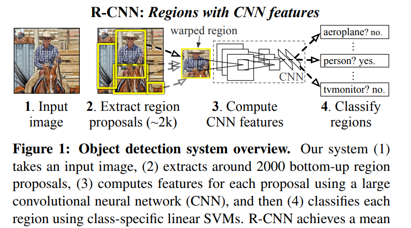
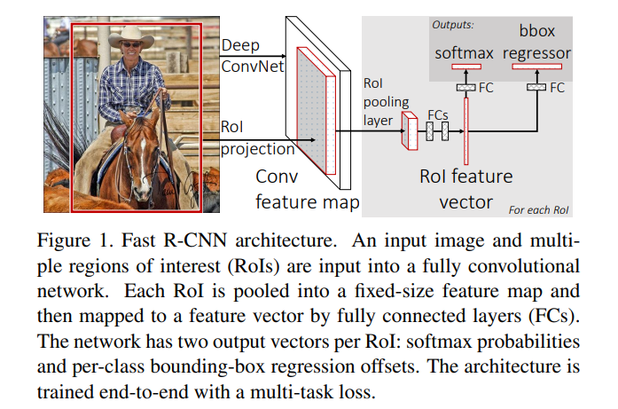
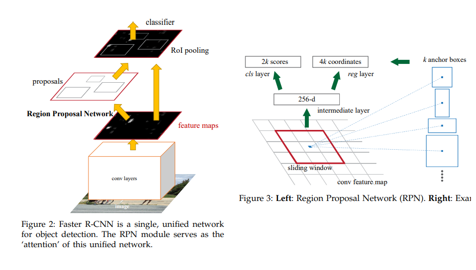

# 이미지 프로세싱 기초 - R-CNN, Fast R-CNN, Faster R-CNN

* [1. R-CNN](#1-r-cnn)
* [2. Fast R-CNN](#2-fast-r-cnn)
* [3. Faster R-CNN](#3-faster-r-cnn)

## 1. R-CNN

[R-CNN 논문](https://arxiv.org/pdf/1311.2524.pdf)



(출처: Ross Girshick, Jeff Donahue et al, Rich feature hierarchies for accurate object detection and semantic segmentation)

**R-CNN (Regions with CNN features)** 은 이미지로부터 region을 추출하여, CNN을 통해 그 region이 무엇인지 판별하는 CNN 응용 구조 중 하나이다.

R-CNN은 다음과 같이 동작한다.

* 1. 이미지를 입력받는다.
* 2. 약 2,000개의 region을 추출한다. (bottom-up region proposal)
* 3. 각 region proposal에 대해, 먼저 해당 region을 CNN에 입력시킬 수 있도록 크기를 227 x 227 픽셀로 조절 (warp) 시킨다. 그 후 CNN에 해당 region을 입력하여 feature에 해당하는 값들을 계산한다.
* 4. 각 region을 선형 SVM을 이용하여 분류한다.

**Region Proposal 추출 방법**
* objectness, selective search 등 다양한 논문에서 물체의 카테고리에 독립적인 region proposal을 생성하는 방법을 제시하고 있다.

**Feature 추출 방법**
* 각 region proposal로부터 4096차원의 feature vector를 추출한다.
  * 이때 feature는 227 x 227 RGB 이미지를 CNN에 forward propagation 시켜서 계산한다.

**Feature와 SVM**
* class가 N개일 때, feature matrix는 보통 2000 x 4096 차원이고, SVM의 가중치 행렬은 보통 4096 x N 차원이다.

## 2. Fast R-CNN

[Fast R-CNN 논문](https://arxiv.org/pdf/1504.08083.pdf)



(출처: Ross Girshick (Microsoft Research), Fast R-CNN)

**Fast R-CNN** 은 R-CNN의 문제점을 보완하여 그 해결책으로 내놓은 CNN 응용 구조이다.

논문에서 지적한 **R-CNN의 문제점** 은 다음과 같다.
* 학습 단계가 여러 stage를 포함하는 파이프라인이다.
  * 즉, R-CNN은 처음 학습 시 CNN을 fine-tuning하고, 따라서 SVM이 CNN의 feature에 맞게 학습되어 object detector의 역할을 한다.
    * 따라서 이것이 softmax 분류기를 대체할 수 있다.
  * 3번째 학습 stage에서는 bounding box (b-box) regressor가 학습된다.
* 학습이 공간 및 시간 측면에서 expensive하다.
* 모델을 테스트할 때, 물체 인식이 느리다.

이 문제점을 해결하기 위해서 **RoI (Region of Interest) Pooling Layer** 를 제안했다.
* 각각의 object proposal에 대해 RoI pooling layer가 feature map으로부터 **일정한 크기의 feature vector** 를 추출한다.
* RoI pooling layer는 max pooling을 사용하여 유효한 RoI들을 더 작은 feature map으로 변환한다.
  * 즉 ```h * w```의 RoI window를 ```H * W``` 개의 sub-window로 나누고, 이때 각 sub-window의 대략적인 크기는 ```(h / H) * (w / W)``` 이다.
  * VGG16에서는 ```H = W = 7```로 지정했다.
* 각 RoI가 softmax와 bbox (bounding-box) regressor에 의한 output을 최종 출력한다.

## 3. Faster R-CNN

[Faster R-CNN 논문](https://arxiv.org/pdf/1506.01497.pdf)



(출처: Shaoqing Ren, Kaiming He et al, Faster R-CNN: Towards Real-Time Object Detection with Region Proposal Networks)

**Faster R-CNN** 은 **R-CNN** 과 **Fast R-CNN** 에서 개량된 모델로, RPN (Region Proposal Networks) 이라는 구조를 갖는다.

**Region Proposal Network** : 아무 크기의 이미지나 입력받아서, 직사각형 모양의 object proposal의 집합을 출력한다.
* 이때 각 proposal은 objectness score라는 점수를 포함한다.
* region proposal을 생성하기 위해, **convolutional feature map의 출력 이미지에 대해 작은 Neural Network를 sliding** 하여 region을 찾는다.
* **Anchor** : sliding window의 각 위치에서 동시에 여러 개의 region proposal을 예측하는데, 각 location에 대한 proposal의 최대 개수가 k일 때 이들 k개의 proposal에 대한 reference box들을 anchor라고 한다.