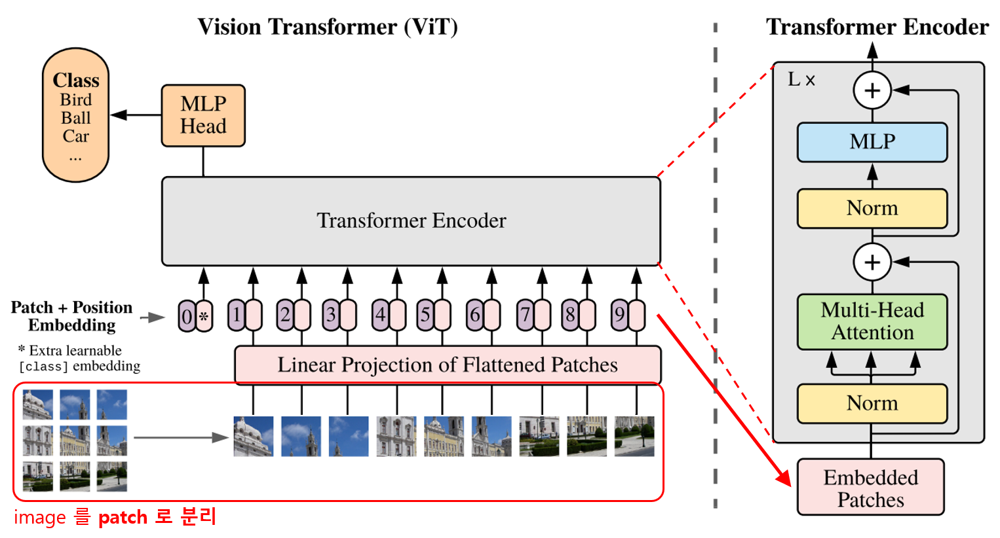
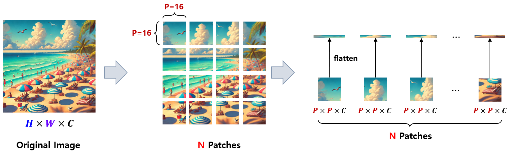
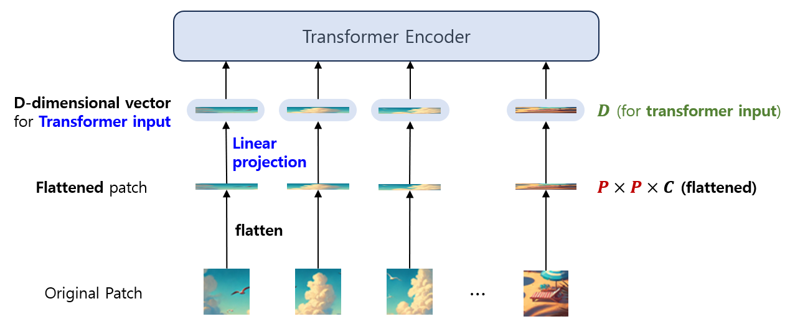
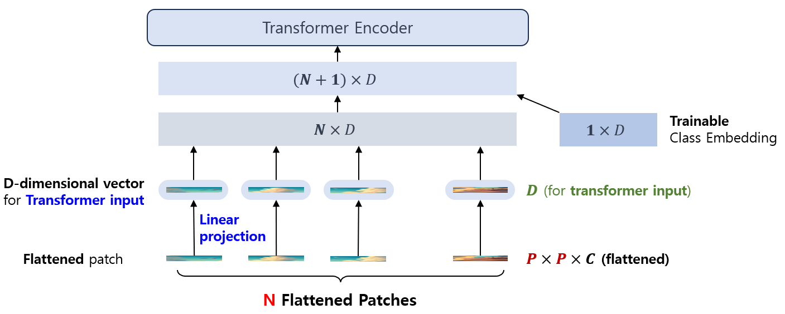
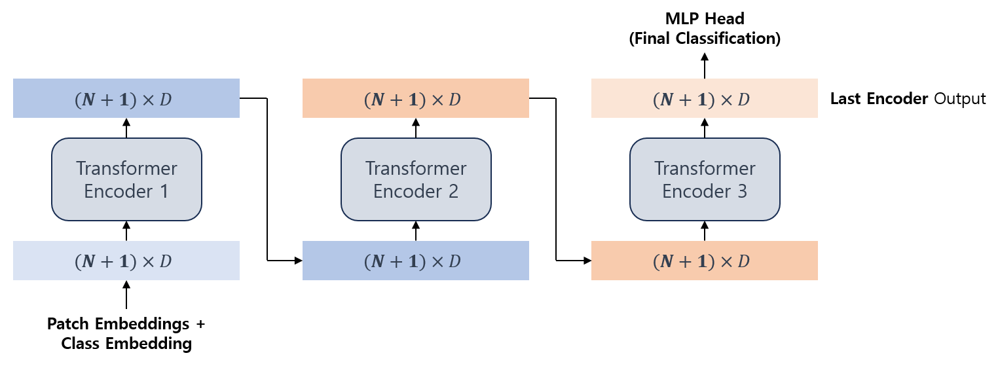
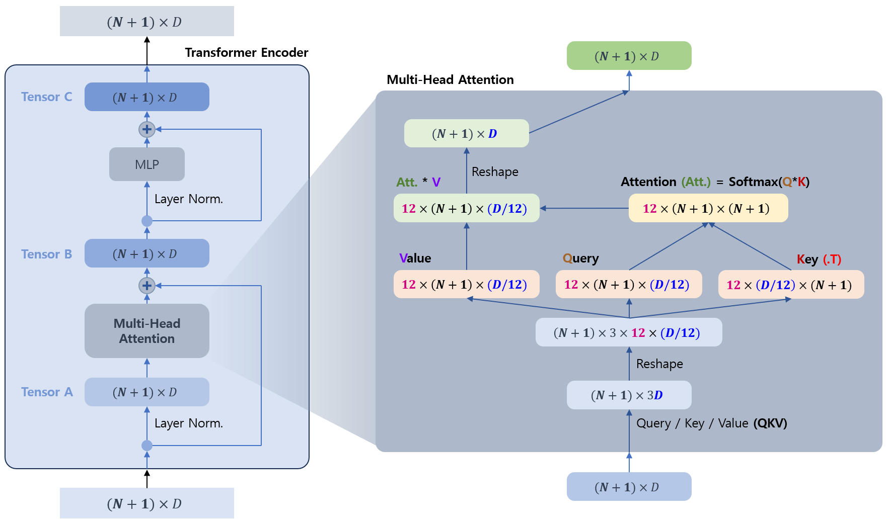
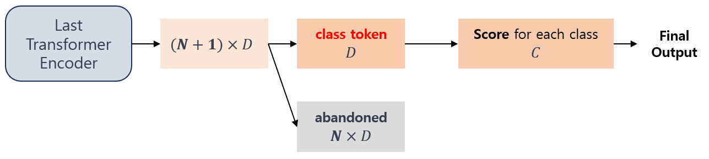

## 목차

* [1. Vision Transformer (ViT)](#1-vision-transformer-vit)
  * [1-1. ViT 모델의 제약 사항](#1-1-vit-모델의-제약-사항)
* [2. ViT 의 구조](#2-vit-의-구조)
  * [2-1. 이미지를 Patch 로 분할](#2-1-이미지를-patch-로-분할) 
  * [2-2. Flattened Patch 에 대한 Linear Projection (Position Embedding)](#2-2-flattened-patch-에-대한-linear-projection-position-embedding)
  * [2-3. 학습 가능한 Class Embedding](#2-3-학습-가능한-class-embedding)
  * [2-4. Transformer Encoder](#2-4-transformer-encoder)
  * [2-5. MLP Head](#2-5-mlp-head)
* [3. ViT의 응용 모델](#3-vit의-응용-모델)

## 1. Vision Transformer (ViT)

[(논문) An Image is Worth 16x16 Words: Transformers for Image Recognition at Scale](https://arxiv.org/pdf/2010.11929)

**Vision Transformer (ViT)** 는 NLP 에서 자주 쓰이는 [Transformer 모델](../Natural%20Language%20Processing/Basics_트랜스포머%20모델.md) 의 구조를 **언어가 아닌 Vision 문제에 적용** 한 것으로, ICLR 2021에서 위 논문을 통해 발표되었다.

Vision Transformer 의 핵심 아이디어는 다음과 같아.

* 기존의 [CNN (Convolutional Neural Network)](Basics_CNN.md) 의 구조를 Transformer 로 대체
* Transformer 의 계산 효율성이 높은 구조를 이용하므로, 계산 효율성이 높음

Vision Transformer 등장 이후, [PapersWithCode Image Classification task 순위 (ImageNet 기준)](https://paperswithcode.com/sota/image-classification-on-imagenet) 의 순위권에는 ViT 기반 모델이 다수 포진하고 있다.

### 1-1. ViT 모델의 제약 사항

ViT 기반 모델은 **Transformer 구조의 높은 계산 효율성 + 우수한 성능** 이라는 이점에도 불구하고, **일정한 크기의 Patch 로 이미지를 분할** 한다는 특성 때문에 다음과 같은 실무적 제약 사항이 있다.

* Patch Size 의 배수 해상도가 아닌 이미지는 전처리 없이 사용하려면 resize 해야 한다.
  * 단, 미세한 특징이 중요한 이미지라면 이때 **중요한 정보가 왜곡** 되는 등 문제가 나타날 수 있다. 
* Resize 를 하지 않는 경우, **Padding 을 추가하는 등 전처리** 를 해야 한다.
  * 즉, 전처리를 추가적으로 해야 하기 때문에 **불필요한 연산량이 발생** 한다는 문제가 있다.

또한, ViT 역시 [Transformer](../Natural%20Language%20Processing/Basics_트랜스포머%20모델.md) 특성상 **거대한 데이터셋으로 [Pre-train](../AI%20Basics/Deep%20Learning%20Basics/딥러닝_기초_Transfer_Learning.md#3-1-사전-학습-pre-training)** 해야지 성능을 제대로 발휘할 수 있다는 것도 한계점이다.

* 이것은 **공개된 모델을 Fine-tuning 하지 않고서는 제대로 된 성능을 보기 어렵다** 는 것을 의미한다.
* 최근 발표되는 것을 포함한 유명한 ViT 계열 모델은 자체적으로 Pre-train 된 모델 (예: 논문 작성용 성능 테스트에 쓰인 것들) 을 제공하고 있다.

## 2. ViT 의 구조

Vision Transformer 의 전체 구조는 다음과 같다.

[(출처)](https://arxiv.org/pdf/2010.11929) Alexey Dosovitskiy, Lucas Beyer et al., "An Image is Worth 16x16 Words: Transformers for Image Recognition at Scale", ICLR 2021

* ViT 의 핵심 작동 방법
  * 이미지를 일정한 크기의 Patch 로 분할한다.
  * 분할된 각 Patch 를 NLP 에서의 하나의 token 역할로 간주하여 [Word Embedding](../Natural%20Language%20Processing/Basics_Word%20Embedding.md) 처럼 임베딩한다.
  * 임베딩된 Patch 들을 Transformer Encoder 에 입력시킨다.
  * Transformer Encoder 출력을 통해 이미지의 분류를 예측한다.

### 2-1. 이미지를 Patch 로 분할

ViT 에서는 원본 이미지를 일정한 크기의 Patch 로 분할한다. 따라서 Patch 의 크기를 일정하게 하기 위해, **원본 이미지의 크기는 Patch 크기의 배수** 여야 한다는 제약 사항이 있다.

Patch 는 Transformer 에서의 **단어 (token) 과 같은 역할** 이며, [Word Embedding](../Natural%20Language%20Processing/Basics_Word%20Embedding.md) 처럼 이후에 Flatten 되어 임베딩된다.

Patch 의 크기로는 보통 16 x 16 을 많이 사용한다.

(이미지 출처: ChatGPT DALL-E 로 생성)

위 그림을 기준으로, 원래 $H \times W \times C$ 였던 이미지의 크기가 $N \times (P \times P \times C)$ 로 바뀐 후 Flatten 된다.

* $C$ : channel 개수
* $P$ : 이미지 patch 의 가로/세로 길이 (= 16)
* $N$ : 이미지 patch 의 개수 ($H \times W = N \times P \times P$)

### 2-2. Flattened Patch 에 대한 Linear Projection (Position Embedding)

그 다음으로, Flatten 된 Patch 들을 **Transformer Encoder 의 입력** 으로 들어올 수 있도록 차원을 변환한다. (Linear Projection)

* $P \times P \times C$ 차원의 Flattened Patch 에 Linear Projection 을 적용한다.
* 이를 통해 이 Patch 들을 Transformer 의 입력으로 들어갈 수 있는 $D$ 차원의 벡터로 변환한다.
* 이러한 Linear Projection 은 **Patch 에 대한 Embedding 과정** 이며, 이렇게 임베딩된 Patch 를 **Position Embedding** 이라고 한다.

### 2-3. 학습 가능한 Class Embedding

ViT 에서의 Class Embedding 은 **[BERT](../Natural%20Language%20Processing/Basics_BERT,%20SBERT%20모델.md) 모델의 class token** 과 마찬가지로, **모델의 추가 입력으로 들어가는, 학습 가능한 Embedding** 이다.

즉, 각 Flattend patch 가 임베딩된 D차원의 벡터들과 함께 Class Embedding 이 추가로 Transformer 의 Encoder 로 들어간다. 즉 **$N \times D$ 차원이 아닌 $(N + 1) \times D$ 차원의 행렬** 이 Transformer Encoder 로 입력되는 셈이다.

### 2-4. Transformer Encoder

기존 Transformer 와 비슷하게, ViT 에서도 **Transformer Encoder 를 여러 개 이용하여, K 번째 Encoder 의 출력이 (K + 1) 번째 Encoder 의 입력으로 들어가는 구조** 를 취하고 있다.

* 마지막 Encoder 의 출력을 이미지의 최종 분류에 사용한다. (MLP Head)

각 Transformer Encoder 에서는 아래와 같이 **기존의 Transformer 와 유사한 방식의 Multi-head Attention 을 이용** 하여 그 결과를 출력한다.

* Query, Key, Value 를 이용하여 Attention 한다는 점은 서로 같다.
* 기존 Transformer 구조와의 차이점은 [Layer Norm. (Normalization)](../AI%20Basics/Deep%20Learning%20Basics/딥러닝_기초_Regularization.md#4-2-layer-normalization) 의 위치이다.

### 2-5. MLP Head

MLP Head 는 **ViT 모델의 최종적인 출력** 부분이다.

* 마지막 Transformer Encoder 의 출력값을 **MLP (Multi-Layer Perceptron) Head** 를 통해 최종적으로 **각 Class 별 Score 로 변환** 한다.

상세 동작 과정은 다음과 같다.

* 마지막 Transformer Encoder 출력 행렬의 차원은 $(N + 1) \times D$ 이다.
* 이 행렬 중 **Class Token에 해당하는 $1 \times D$ (또는 $D$) 차원** 만 남기고, 나머지 $N \times D$ 에 해당하는 부분은 버린다.
* 마지막으로, 이 $D$ 차원의 Class Token 을 $C$ 차원의 벡터 ($C$ 는 클래스 개수) 로 변환한다.
* 이것이 ViT 의 최종 출력인 **각 Class 별 최종 score** 이다.

## 3. ViT의 응용 모델

2021년 이후 ViT 모델을 응용한 다음과 같은 여러 가지 Vision 모델들이 지속적으로 등장하고 있다. [(참고)](https://paperswithcode.com/sota/image-classification-on-imagenet)

| 모델      | 파라미터 개수                                                                                                         | ImageNet Top-1 정확도                                                                             | 출시 연도 | 논문                                       |
|---------|-----------------------------------------------------------------------------------------------------------------|------------------------------------------------------------------------------------------------|-------|------------------------------------------|
| DaViT   | 1437M (DaViT-G) 362M (DaViT-H)                                                                               | 90.4% (DaViT-G) 90.2% (DaViT-H)                                                             | 2022  | [논문](https://arxiv.org/pdf/2204.03645v1) |
| Swin-V2 | 3000M (SwinV2-G)                                                                                                | 90.17% (SwinV2-G)                                                                              | 2021  | [논문](https://arxiv.org/pdf/2111.09883v2) |
| ViT-L   | 307M (384 x 384, ViT-22B [Distilled](../AI%20Basics/Deep%20Learning%20Basics/딥러닝_기초_Knowledge_Distillation.md)) | 89.6% (384 x 384, ViT-22B Distilled)                                                           | 2023  | [논문](https://arxiv.org/pdf/2302.05442v1) |
| MaxViT  |                                                                                                                 | 89.53% (MaxViT-XL, 512 x 512) 89.41% (MaxViT-L, 512 x 512) 89.36% (MaxViT-XL, 384 x 384) | 2022  | [논문](https://arxiv.org/pdf/2204.01697v4) |