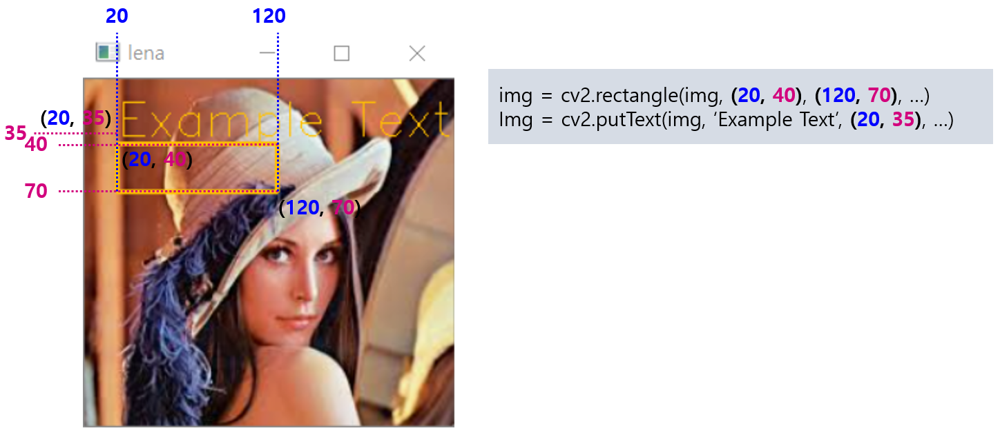
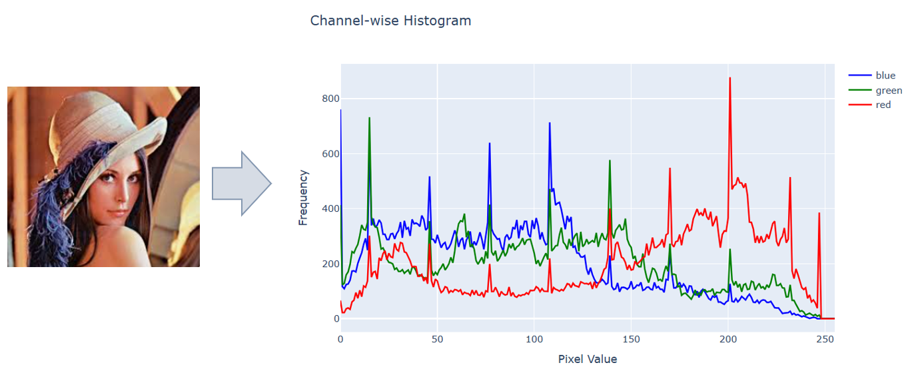

## 목차

* [1. OpenCV 개요](#1-opencv-개요)
* [2. 이미지 열기, 저장 및 표시 방법](#2-이미지-열기-저장-및-표시-방법)
  * [2-1. 이미지 열기](#2-1-이미지-열기) 
  * [2-2. 이미지 저장](#2-2-이미지-저장) 
  * [2-3. 이미지 표시](#2-3-이미지-표시) 
* [3. 이미지 변형 방법](#3-이미지-변형-방법)
  * [3-1. 기하학적 형태 변형](#3-1-기하학적-형태-변형)
  * [3-2. 색상 포맷 변환](#3-2-색상-포맷-변환)
  * [3-3. 색상 변형](#3-3-색상-변형)
  * [3-4. 기타 변형 및 노이즈 추가](#3-4-기타-변형-및-노이즈-추가)
  * [3-5. 표시 추가](#3-5-표시-추가)
* [4. channel 별 색상 값 분포 히스토그램 출력](#4-channel-별-색상-값-분포-히스토그램-출력)

## 1. OpenCV 개요

**OpenCV (Open Source Computer Vision)** 는 이미지 처리에 사용되는 오픈 소스 라이브러리 중 하나이다.

Python 에서는 pip 을 이용하여 다음과 같은 방법으로 설치할 수 있다. (```pip install opencv``` 또는 ```pip install cv2``` 가 아니다.)

```
pip install opencv-python
```

실제 Python 에서 사용할 때는 다음과 같이 import 하여 사용할 수 있다.

```python
import cv2
```

## 2. 이미지 열기, 저장 및 표시 방법

OpenCV에서 이미지를 열고, 저장하고, 표시하는 방법은 다음과 같다.

| 동작     | 요약                                                            | 코드                                    |
|--------|---------------------------------------------------------------|---------------------------------------|
| 이미지 열기 | ```img_path``` 경로에 있는 이미지를 열어서 ```image``` 변수에 텐서 형태로 저장한다.   | ```image = cv2.imread(img_path)```    |
| 이미지 저장 | 텐서 형태의 이미지 ```image``` 를 ```save_path``` 경로에 저장한다.            | ```cv2.imwrite(save_path, image)```   |
| 이미지 표시 | 텐서 형태의 이미지 ```image``` 를 제목이 ```window_title``` 인 새 창으로 표시한다. | ```cv2.imshow(window_title, image)``` |

### 2-1. 이미지 열기

OpenCV에서 이미지를 열기 위해서는 **cv2.imread** 함수를 사용해야 한다.

**기본 형식**

* ```img_path``` 경로에 있는 이미지를 읽어서 3차원 텐서로 변환하고, 그것을 ```img``` 에 저장한다.
* 3차원 텐서의 형식은 다음과 같다.
  * (```H```, ```W```, ```C```) 차원의 텐서 (RGB 의 경우 ```C``` 의 값은 3 이며 **Blue - Green - Red** 순서)
  * 텐서의 각 성분은 0 ~ 255 의 정규화되지 않은 원래 픽셀 값

```
img = cv2.imread(img_path, flag)
```

**함수 인수 설명**

| 인수       | 설명                                                                                                                                                                                                                                                              |
|----------|-----------------------------------------------------------------------------------------------------------------------------------------------------------------------------------------------------------------------------------------------------------------|
| img_path | Python 에서 인식하는 이미지 경로                                                                                                                                                                                                                                           |
| flag     | ```cv2.IMREAD_COLOR``` 일 때, RGB color 로 이미지를 읽는다.<br>- 텐서의 차원은 ```(H, W, 3)```<br>```cv2.IMREAD_GRAYSCALE``` 일 때, Grayscale 이미지로 읽는다.<br>- 텐서의 차원은 ```(H, W)```<br>```cv2.IMREAD_UNCHANGED``` 일 때, alpha channel (투명도) 을 포함하여 읽는다.<br>- 텐서의 차원은 ```(H, W, 4)``` |

**사용 예시**

```
img = cv2.imread('lena.png', cv2.IMREAD_UNCHANGED)
```

* 설명
  * ```lena.png``` 이미지를 읽어서 ```img``` 에 저장한다.
  * 이때 alpha channel 을 포함하여, ```(H, W, 4)``` 차원의 텐서로 읽는다.

### 2-2. 이미지 저장

OpenCV에서 이미지를 저장하기 위해서는 **cv2.imwrite** 함수를 사용해야 한다.

**기본 형식**

* 텐서 형태의 이미지인 ```image``` 를 ```save_path``` 경로에 저장한다.

```
cv2.imwrite(save_path, image)
```

**함수 인수 설명**

| 인수              | 설명                                               |
|-----------------|--------------------------------------------------|
| ```image```     | 텐서 형태의 이미지로, ```imread``` 함수로 읽어온 이미지와 형식이 같아야 함 |
| ```save_path``` | 이미지의 저장 경로                                       |

**사용 예시**

```
cv2.imwrite('lena2.png', image)
```

* 설명
  * ```image``` 변수에 저장된 텐서 형태의 이미지를 ```lena2.png``` 로 저장한다.

### 2-3. 이미지 표시

OpenCV에서 이미지를 새 창에 표시하기 위해서는 **cv2.imshow** 함수를 사용해야 한다.

**기본 형식**

* 텐서 형태의 이미지인 ```image``` 를 ```window_title``` 이라는 제목의 새 창으로 표시한다.

```
cv2.imshow(window_title, image)
```

**함수 인수 설명**

| 인수                 | 설명                   |
|--------------------|----------------------|
| ```image```        | 새 창으로 표시할 텐서 형태의 이미지 |
| ```window_title``` | 이미지를 표시할 새 창의 제목     |

**사용 예시**

```
cv2.imshow('Lena', img)
```

* 설명
  * ```img``` 변수에 저장된 텐서 형태의 이미지를 ```Lena``` 라는 제목을 가진 새 창으로 표시한다.

## 3. 이미지 변형 방법

OpenCV에서 이미지 변형을 적용하려면 다음과 같은 함수를 사용할 수 있다.

| 변형 방법 유형       | 변형 방법                                                    | OpenCV 함수 기본 형식                                                                                                                                  |
|----------------|----------------------------------------------------------|--------------------------------------------------------------------------------------------------------------------------------------------------|
| 기하학적 형태 변형     | - 좌우 반전<br>- 상하 반전<br>- 특정 각도로 회전<br>- 잘라내기 (Crop)       | - ```cv2.flip(img, 1)```<br>- ```cv2.flip(img, 0)```<br>- ```cv2.rotate``` 또는 별도 함수 정의<br>- 함수 불필요                                               |
| **색상 포맷 변환**   | - **RGB ↔ BGR 변환**<br>- GRAY → RGB 변환<br>- GRAY → BGR 변환 | - ```cv2.cvtColor(img, cv2.COLOR_BGR2RGB)```<br> - ```cv2.cvtColor(img, cv2.COLOR_GRAY2RGB)```<br> - ```cv2.cvtColor(img, cv2.COLOR_GRAY2BGR)``` |
| 색상 변형          | - 밝기 조정<br>- 회색조<br>- 반전<br>- 픽셀 값을 직접 조작                | - ```cv2.add(value)```, ```cv2.sub(value)```<br> - ```cv2.cvtColor(img, cv2.COLOR_BGR2GRAY)```<br>- 함수 불필요<br>- 함수 불필요                           |
| 기타 변형 및 노이즈 추가 | - 노이즈 추가<br>- Gaussian Blur 적용                           | - 별도 함수 정의<br>- ```cv2.GaussianBlur(img, ksize, sigmaX)```                                                                                       |
| 표시 추가          | - 직사각형 추가<br>- 글자 추가                                     | - ```cv2.rectangle(img, (x0, y0), (x1, y1), color, thickness)```<br>- ```cv2.putText(img, text, (x, y), font_face, font_scale, color)```         |

### 3-1. 기하학적 형태 변형

**1. 좌우, 상하 반전**

* 좌우 반전
  * ```new_img = cv2.flip(img, 1)```
  * ```img``` 를 좌우 반전한 이미지 (텐서) 를 ```new_img``` 에 저장한다.
* 상하 반전
  * ```new_img = cv2.flip(img, 0)```
  * ```img``` 를 상하 반전한 이미지 (텐서) 를 ```new_img``` 에 저장한다.

**2. 90도 단위의 특정 각도로 회전**

* 시계 방향 90도 회전
  * ```new_img = cv2.rotate(img, cv2.ROTATE_90_CLOCKWISE)``` 
  * ```img``` 를 시계 방향으로 90도 회전한 이미지 (텐서) 를 ```new_img``` 에 저장한다.
* 180도 회전
  * ```new_img = cv2.rotate(img, cv2.ROTATE_180)``` 
  * ```img``` 를 180도 회전한 이미지 (텐서) 를 ```new_img``` 에 저장한다.
* 반시계 방향 90도 회전
  * ```new_img = cv2.rotate(img, cv2.ROTATE_90_COUNTERCLOCKWISE)``` 
  * ```img``` 를 반시계 방향으로 90도 회전한 이미지 (텐서) 를 ```new_img``` 에 저장한다.

**3. 90도 단위가 아닌 특정 각도로 회전**

* 다음 함수를 이용한다. 이때 ```angle``` 은 도 단위이며, 해당 각도만큼 **반시계 방향** 으로 회전한다.

```python
import cv2
import numpy as np

# 이미지를 angle 의 각도로 회전
#
# args:
# - image : 이미지 (텐서 형태)
# - angle : 각도 (도 단위, 반시계 방향으로 회전)
#
# return
# - rotated_image : 회전이 적용된 이미지

def rotate_angle(image, angle):
    (h, w) = image.shape[:2]  # height & width
    center = (w // 2, h // 2)  # center of image

    # compute new image size
    rotation_matrix = cv2.getRotationMatrix2D(center, angle, 1.0)

    cos = np.abs(rotation_matrix[0, 0])
    sin = np.abs(rotation_matrix[0, 1])
    new_w = int((h * sin) + (w * cos))
    new_h = int((h * cos) + (w * sin))

    # re-compute the center point for rotation
    rotation_matrix[0, 2] += (new_w / 2) - center[0]
    rotation_matrix[1, 2] += (new_h / 2) - center[1]

    # use Affine transformation to create rotated image
    rotated_image = cv2.warpAffine(image, rotation_matrix, (new_w, new_h))
    return rotated_image
```

**4. 이미지 잘라내기 (Crop)**

* 이미지 잘라내기 (crop)
  * ```new_img = img[y0:y1, x0:x1]``` 또는 ```new_img = img[y:y + h, x:x + w]```
  * 이미지의 가로 ```x0``` ~ ```x1``` 픽셀 범위 사이, 세로 ```y0``` ~ ```y1``` 픽셀 범위 사이를 따로 잘라내어 ```new_img``` 에 저장한다.
  * 또는, 이미지의 ```(x, y)``` 픽셀 좌표에서 높이 ```h```, 너비 ```w``` 만큼을 따로 잘라내어 ```new_img``` 에 저장한다.

### 3-2. 색상 포맷 변환

RGB 와 BGR 간의 색상 포맷 변환은 **Matplotlib 등 다른 라이브러리들과의 호환에 있어서 중요하다.** 그 방법은 다음과 같다.

* RGB ↔ BGR 변환
  * ```new_img = cv2.cvtColor(img, cv2.COLOR_BGR2RGB)```
  * 이미지 ```img``` 의 Color Channel 순서를 R-G-B 와 B-G-R 간 상호 변환하여 ```new_img``` 에 저장한다.
* GRAY → RGB 변환
  * ```new_img = cv2.cvtColor(img, cv2.GRAY2RGB)```
  * ```(H, W)``` 차원 텐서인 Gray-scale 이미지 ```img``` 를 ```(H, W, 3)``` 차원인 RGB 이미지로 변경한다. (각 픽셀에 대해 R, G, B 값은 모두 동일)
* GRAY → BGR 변환
  * ```new_img = cv2.cvtColor(img, cv2.GRAY2BGR)```
  * ```cv2.GRAY2RGB``` 옵션을 적용해서 GRAY → RGB 변환할 때와 동일

### 3-3. 색상 변형

**1. 밝기 조정**

* ```value``` 는 밝기를 보다 밝거나 어둡게 하기 위한 픽셀 값 변화도이다. (0 ~ 255 기준)
* ```B```, ```G```, ```R```, ```alpha``` 는 각각 Blue, Green, Red, Alpha (투명도) channel 의 픽셀 값 변화도이다. (0 ~ 255 기준)

|                                          | 보다 밝게                                | 보다 어둡게                                    |
|------------------------------------------|--------------------------------------|-------------------------------------------|
| Gray-scale 이미지<br>```(H, W)```           | ```cv2.add(img, value)```            | ```cv2.subtract(img, value)```            |
| RGB 이미지<br>```(H, W, 3)```               | ```cv2.add(img, (B, G, R, 0))```     | ```cv2.subtract(img, (B, G, R, 0))```     |
| RGB + alpha (투명도) 이미지<br>```(H, W, 4)``` | ```cv2.add(img, (B, G, R, alpha))``` | ```cv2.subtract(img, (B, G, R, alpha))``` |

**2. 회색조**

* ```new_img = cv2.cvtColor(img, cv2.BGR2GRAY)```
* ```img``` 에 회색조 효과를 적용하여 ```(H, W)``` 차원의 Gray-scale 이미지로 만들고, 이것을 ```new_img``` 에 저장한다.

**3. 반전**

* ```new_img = 255 - img```
* 이미지의 차원 (GrayScale, RGB, RGB + alpha) 에 관계없이 위 수식을 적용하면 된다.

**4. 픽셀 값을 직접 조작**

* 별도 함수 없이, **NumPy 배열 (픽셀 값 0 ~ 255 의 정수) 로 나타내어지는** 이미지가 갖는 차원의 의미를 이용하면 된다.

|            | Grayscale    | RGB             | RGB + alpha      |
|------------|--------------|-----------------|------------------|
| 차원         | ```(H, W)``` | ```(H, W, 3)``` | ```(H, W, 4)```  |
| channel 순서 |              | [B, G, R]       | [B, G, R, alpha] |

### 3-4. 기타 변형 및 노이즈 추가

**1. Gaussian Noise 추가**

* 다음 함수를 이용한다. 이때 ```sigma``` 는 픽셀 값 0 ~ 255 기준의 표준편차이며, 클수록 노이즈가 심하다.

```python
import numpy as np

# 이미지에 표준편차 sigma 의 Gaussian Noise 추가
#
# args:
# - image : 이미지 (텐서 형태)
# - sigma : Gaussian Noise 의 표준편차 (픽셀 값 0 ~ 255 기준)
#
# return
# - new_image : Gaussian Noise 가 추가된 이미지

def add_gaussian_noise(image, sigma):
    if len(image.shape) == 2:  # Gray-scale
        h, w = image.shape[:2]
    else:  # RGB or RGB + alpha
        h, w, c = image.shape[:3]

    # generate Gaussian noise (new_image 에 np.uint8 미적용 시 오류 발생)
    gaussian_noise = np.random.normal(0, sigma, (h, w, c)).astype(np.int16)
    new_image = np.clip(image + gaussian_noise, 0, 255).astype(np.uint8)

    return new_image
```

**2. Gaussian Blur 적용**

* ```new_img = cv2.GaussianBlur(img, ksize, sigmaX)```
  * ```img``` 에 커널 크기 ```ksize``` 의 Gaussian Blur 를 적용한 새로운 이미지를 ```new_img``` 에 저장한다. ```ksize``` 가 없으면 커널 크기는 ```sigmaX``` 에 비례한다.
  * ```ksize = (ksizeX, ksizeY)``` 형식이다.
    * ```ksizeX``` : 가로 방향의 커널 크기 (클수록 가로 방향으로 Blur 가 큼)
    * ```ksizeY``` : 세로 방향의 커널 크기 (클수록 세로 방향으로 Blur 가 큼)

### 3-5. 표시 추가

OpenCV 이미지에 직사각형이나 텍스트와 같은 표시를 추가하는 방법은 다음과 같다.

**1. 직사각형 추가**

* ```new_img = cv2.rectangle(img, (x0, y0), (x1, y1), (B, G, R), thickness)```
  * 원본 이미지 ```img``` 의 픽셀 좌표 ```(x0, y0)``` 부터 ```(x1, y1)``` 까지, 굵기 ```thickness``` 의 직사각형을 그린다.
  * 이때 직사각형의 테두리 색은 ```(B, G, R)``` 로 한다.
  * 이 직사각형이 그려진 이미지를 반환하여 ```new_img``` 에 저장한다.

**2. 텍스트 추가**

* ```new_img = cv2.putText(img, text, (x, y), font_face, font_scale, (B, G, R))```
  * 원본 이미지 ```img``` 의 픽셀 좌표 ```(x, y)``` 에 ```text``` 라는 내용의 텍스트를 추가한다.
  * 그 서체는 ```font_face```, 글자 색은 ```(B, G, R)```, 글자 크기는 ```font_scale``` 로 한다.
  * 이러한 글자가 쓰인 이미지를 반환하여 ```new_img``` 에 저장한다.

예를 들어,

```python
img = cv2.rectangle(img, (20, 40), (120, 70), (0, 192, 255), 2)
img = cv2.putText(img, 'Example Text', (20, 35), cv2.FONT_HERSHEY_SIMPLEX, 1, (0, 192, 255))
```

의 결과, ```img``` 는 다음과 같이 표시된다.



## 4. channel 별 색상 값 분포 히스토그램 출력

Channel 별 색상 값 분포에 대한 히스토그램은 다음과 같이 ```cv2.calcHist``` 를 이용하여 계산하고, 이를 출력할 수 있다.

```
colors = ['blue', 'green', 'red']
channels = cv2.split(image)

# Plotly 차트를 그리기 위한 Figure 생성
fig = go.Figure()

# 각 channel 별 히스토그램 계산
for channel, color in zip(channels, colors):

    # channel : 각 채널 별 해당 채널에 대한 픽셀 값, shape = (H, W)
    # hist    : 각 채널 별 픽셀 값이 0 ~ 255 인 픽셀의 개수, shape = (256, 1)

    hist = cv2.calcHist([channel], [0], None, [256], [0, 256])
    
    fig.add_trace(go.Scatter(y=hist.flatten(),
                             mode="lines",
                             name=color,
                             line=dict(color=color)))

# Plotly 차트 제목 및 각 축의 제목
fig.update_layout(
    title="Channel-wise Histogram",
    xaxis_title="Pixel Value",
    yaxis_title="Frequency"
)

# Plotly 차트 표시
fig.show()
```

그 결과는 다음과 같다.

