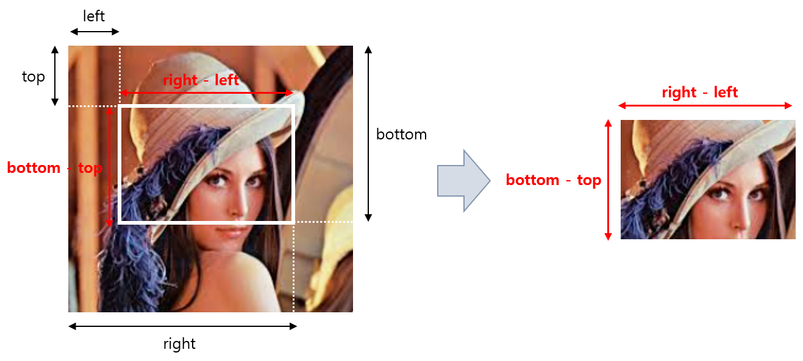

## 목차

* [1. Pillow (PIL) 개요](#1-pillow-pil-개요)
* [2. 이미지 열기, 저장 및 표시 방법](#2-이미지-열기-저장-및-표시-방법)
  * [2-1. 이미지 열기](#2-1-이미지-열기) 
  * [2-2. 이미지 저장](#2-2-이미지-저장) 
  * [2-3. 이미지 표시](#2-3-이미지-표시) 
* [3. 이미지 변형 방법](#3-이미지-변형-방법)
  * [3-1. 기하학적 형태 변형](#3-1-기하학적-형태-변형)
  * [3-2. 색상 변형](#3-2-색상-변형)
  * [3-3. 기타 변형](#3-3-기타-변형)

## 1. Pillow (PIL) 개요

**Pillow (PIL)** 은 Python 에서 사용할 수 있는 이미지 처리 라이브러리 중 하나이다.

Python 에서는 pip 을 이용하여 다음과 같은 방법으로 설치할 수 있다.

```
pip install pillow
```

실제 Python 에서 사용할 때는 다음과 같이 import 하여 사용할 수 있다. (```import PIL``` 또는 ```import pillow``` 가 아니다.)

```python
from PIL import Image
```

## 2. 이미지 열기, 저장 및 표시 방법

Pillow 에서 이미지를 열고, 저장하고, 표시하는 방법은 다음과 같다.

| 동작     | 요약                                                         | 코드                               |
|--------|------------------------------------------------------------|----------------------------------|
| 이미지 열기 | 이미지 경로 ```img_path``` 에 있는 이미지를 열어서 ```img``` 라는 변수에 저장한다. | ```img = Image.open(img_path)``` |
| 이미지 저장 | 이미지 ```img``` 를 경로 ```save_path``` 에 저장한다.                 | ```img.save(save_path)```        |
| 이미지 표시 | 이미지 ```img``` 를 새 창으로 표시한다.                                | ```img.show()```                 |

### 2-1. 이미지 열기

Pillow에서 이미지를 열어서 불러오기 (특정 변수에 저장하기) 위해서는 **Image.open** 함수를 사용해야 한다.

**기본 형식**

```python
img = Image.open(img_path)
```

**함수 인수 설명**

| 인수             | 설명                           |
|----------------|------------------------------|
| ```img_path``` | ```img``` 라는 변수로 저장할 이미지의 경로 |

**사용 예시**

```python
img = Image.open('lena.PNG')
```

* 설명
  * ```lena.PNG``` 이미지를 열어서 (불러와서) 변수 ```img``` 에 저장한다. 

### 2-2. 이미지 저장

Pillow에서 이미지를 저장하기 위해서는 load 한 이미지에 대해 **save** 함수를 사용해야 한다.

**기본 형식**

```python
img.save(save_path)
```

**함수 인수 설명**

| 인수           | 설명          |
|--------------|-------------|
| ```save_path``` | 이미지를 저장할 경로 |

**사용 예시**

```python
img.save('lena3.PNG')
```

* 설명
  * ```img``` 가 가리키는 이미지를 ```lena3.PNG``` 라는 이름으로 저장한다.

### 2-3. 이미지 표시

Pillow에서 이미지를 새 창에 표시하기 위해서는 Matplotlib 을 이용하여 **plt.show** 함수를 사용해야 한다.

**기본 형식**

```python
img.show()
```

* 설명
  * 변수 ```img``` 가 가리키는 이미지를 새 창으로 표시한다.
  * 이때 OS에 따라 Command Line 창이 먼저 나타나는 경우도 있다.

## 3. 이미지 변형 방법

Pillow 에서 이미지 변형을 적용하려면 다음과 같은 함수를 사용할 수 있다.

| 변형 방법 유형   | 변형 방법                                              | Pillow 함수 기본 수식                                                                                                                                                           |
|------------|----------------------------------------------------|---------------------------------------------------------------------------------------------------------------------------------------------------------------------------|
| 기하학적 형태 변형 | - 좌우 반전<br>- 상하 반전<br>- 특정 각도로 회전<br>- 잘라내기 (Crop) | - ```img.transpose(Image.FLIP_LEFT_RIGHT)```<br>- ```img.transpose(Image.FLIP_TOP_BOTTOM)```<br>- ```img.rotate(angle)```<br>- ```img.crop((left, top, right, bottom))``` |
| 색상 변형      | - 밝기 조정<br>- 대비 조정<br>- 회색조<br>- 반전                | - ```ImageEnhance.Brightness(img).enhance(factor)```<br>- ```ImageEnhance.Contrast(img).enhance(factor)```<br>- ```img.convert('L')```<br>- ```ImageOps.invert(img)```    |
| 기타 변형      | - Gaussian Blur 적용                                 | - ```img.filter(ImageFilter.GaussianBlur(radius))```                                                                                                                      |

### 3-1. 기하학적 형태 변형

**1. 좌우, 상하 반전**

* 좌우 반전
  * ```new_img = img.transpose(Image.FLIP_LEFT_RIGHT)```
  * ```img``` 를 좌우 반전한 이미지를 ```new_img``` 에 저장한다.
* 상하 반전
  * ```new_img = img.transpose(Image.FLIP_TOP_BOTTOM)```
  * ```img``` 를 상하 반전한 이미지를 ```new_img``` 에 저장한다.

**2. 특정 각도로 회전**

* 특정 각도로 회전 (90도 단위가 아니어도 됨
  * ```new_img = img.rotate(angle)```
  * ```img``` 를 반시계 방향으로 ```angle``` (도 단위) 만큼 회전시킨 이미지를 ```new_img``` 에 저장한다.

**3. 잘라내기**

* 이미지 잘라내기 (Crop)
  * ```new_img = img.crop((left, top, right, bottom))``` 
  * ```img``` 를 다음과 같은 시작점과 끝점을 이용하여 해당 부분만 따로 잘라내고, 그 결과물을 ```new_img``` 에 저장한다.
    * 이미지의 왼쪽에서 ```left``` 픽셀, 위쪽에서 ```top``` 픽셀을 시작점으로 한다.
    * 이미지의 왼쪽에서 ```right``` 픽셀, 위쪽에서 ```bottom``` 픽셀을 끝점으로 한다.
  * 즉, ```new_img``` 의 크기는 가로 ```right - left``` 픽셀, 세로 ```bottom - top``` 픽셀이 된다.



### 3-2. 색상 변형

**1. 밝기 조정**

* 아래 코드는 ```img``` 의 밝기를 ```factor``` 배 증가시킨 후, 그 이미지를 ```new_img``` 에 저장한다.
* 이때, ```factor``` 의 값이 1 이상이면 기존보다 더 밝아지고, 1 미만이면 기존보다 어두워진다.

```python
from PIL import Image, ImageEnhance

new_img = ImageEnhance.Brightness(img).enhance(factor)
```

**2. 대비 조정**

* 아래 코드는 ```img``` 의 대비를 ```factor``` 배 증가시킨 후, 그 이미지를 ```new_img``` 에 저장한다.
* 이때, ```factor``` 의 값이 1 이상이면 기존보다 더 선명해지고, 1 미만이면 기존보다 흐릿해진다.

```python
from PIL import Image, ImageEnhance

new_img = ImageEnhance.Contrast(img).enhance(factor)
```

**3. 회색조**

* 아래 코드는 ```img``` 를 회색조로 만든 후, 그 이미지를 ```new_img``` 변수에 저장한다.

```python
new_img = img.convert('L')
```

**4. 반전**

* 아래 코드는 ```img``` 의 색상을 반전시킨 후, 그 이미지를 ```new_img``` 변수에 저장한다.

```python
from PIL import Image, ImageOps

new_img = ImageOps.invert(img)
```

* 위 코드를 실행한 결과 ```OSError: not supported for mode RGBA``` 오류가 발생하는 경우, 다음과 같이 하면 된다.

```python
from PIL import Image, ImageOps

r, g, b, alpha = img.split()
rgb_img = Image.merge('RGB', (r, g, b))
new_img = ImageOps.invert(rgb_img)
```

### 3-3. 기타 변형

**1. Gaussian Blur 적용**

* 아래 코드는 ```img``` 이미지에 ```radius``` 만큼의 크기의 Gaussian Blur 를 적용하고, 그 결과물을 ```new_img``` 변수에 저장하는 코드이다.
* 아래 코드에서 ```radius``` 의 값이 클수록 Gaussian Blur 가 더 강해진다.

```python
from PIL import Image, ImageFilter

new_img = img.filter(ImageFilter.GaussianBlur(radius))
```