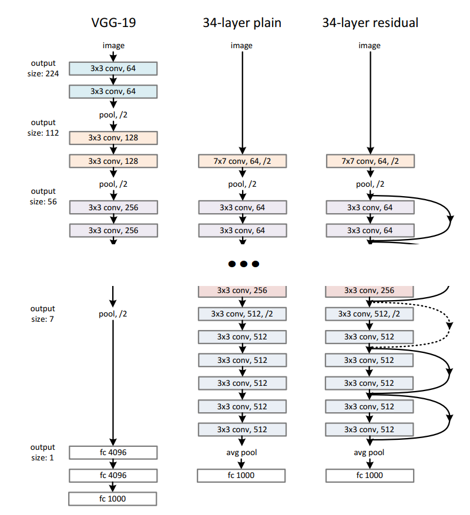

# 이미지 프로세싱 모델 - ResNet

* [1. ResNet이란?](#1-resnet이란)
* [2. Residual Learning](#2-residual-learning)

## 1. ResNet이란?

[ResNet 논문](https://arxiv.org/pdf/1512.03385.pdf)

(출처: Kaiming He, Xiangyu Zhang et al, Deep Residual Learning for Image Recognition)

**ResNet** 은 위 논문과 같이 Microsoft 연구팀 Kaiming He, Xiangyu Zhang 외 2명의 연구원이 개발한 CNN 응용 구조이다.

위 그림은 ImageNet 데이터를 처리하기 위한 구조이다.
* 공통적으로 많은 Convolutional Layer들이 이어져 있는 형태이다.
* 왼쪽 2개는 Residual Learning이 적용되어 있지 않고, 오른쪽 1개에만 적용되어 있다.
* 최종 fully connected layer의 출력은 1000-dimension 이다.
* 논문에서는 구현 시 미니배치 크기가 256인 SGD를 사용했으며, weight decay = 0.0001, momentum = 0.9를 적용했다.

## 2. Residual Learning

[ResNet의 Short Connection Block 구조](./images/ResNet_2.png)

(출처: Kaiming He, Xiangyu Zhang et al, Deep Residual Learning for Image Recognition)

ResNet의 중요한 특징은 위 그림과 같이 **Short Connection (Skip Connection) 이 있는 Block 구조 (building block)** 이다. 이와 같이 Layer를 거쳐서 변형된 **F(x)** 와 원래 입력값인 **x** 를 합성한 **F(x) + x** 를 다음 레이어로 전달하는 학습 방식을 **Residual Learning** 이라고 한다.
* Residual (잔차) 의 개념을 학습에 적용했다.
* x와 F(x)의 차원이 서로 다르면 Short Connection에 적절한 projection (1x1 Convolution 등) 을 적용하여 차원을 일치시킨다.
* 합성 이후에 ReLU 활성화 함수를 적용하고 계속 진행한다.

**Residual Learning의 장점** 은 다음과 같다.
* 입력값 x를 **그대로** 가져가는 것을 통해 **degradation problem** 을 해결할 수 있다.
  * **Degradation Problem** : 신경망 모델의 레이어가 많은, 즉 깊은 신경망일 때는 모델의 학습이 진행되어 특정 optima (local/global) 로 수렴하고 있음에도 error 값이 커지는 현상
* F(x) 에 x만 더하는 것이므로 복잡도가 많이 증가하지 않는다.