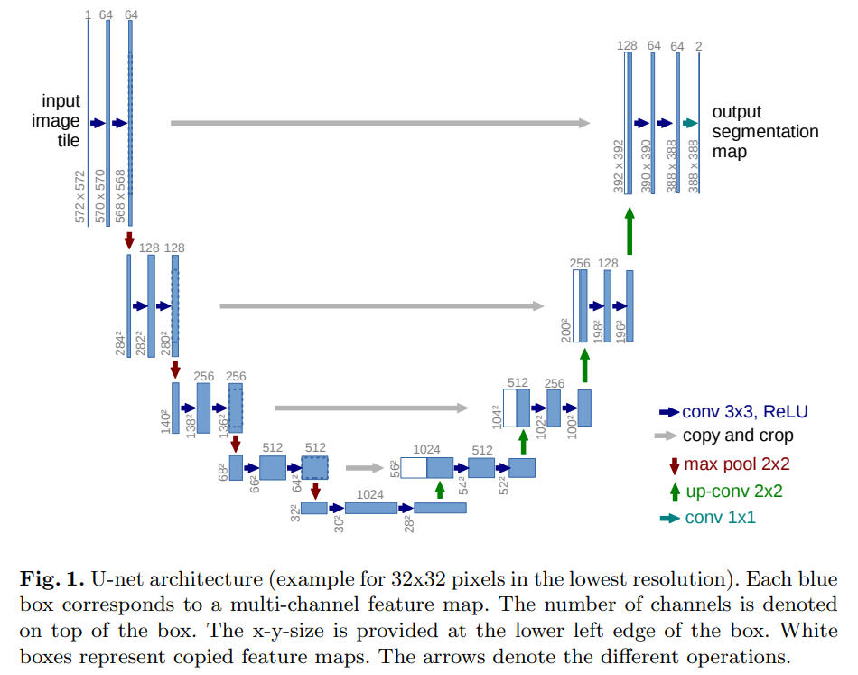

# 이미지 프로세싱 모델 - U-Net

* [1. U-Net이란?](#1-u-net이란)
* [2. U-Net의 특징](#2-u-net의-특징)
* [3. 논문에 언급된 사항](#3-논문에-언급된-사항)

## 1. U-Net이란?

* [U-Net 논문](https://arxiv.org/pdf/1505.04597.pdf)
* [U-Net 다운로드 링크](https://lmb.informatik.uni-freiburg.de/people/ronneber/u-net/)

(출처: Olaf Ronneberger, Philipp Fischer et al, U-Net: Convolutional Networks for Biomedical Image Segmentation)

**U-Net** 은 Freiburg 대학 연구진이 개발한 U자 형태의 CNN 응용 구조로, **Image Segmentation** 분야에서 많이 사용된다.

위 그림을 보면 U-Net은 572x572 크기의 이미지를 입력받아서, 이보다 약간 작은 388x388 크기의 segmentation map을 출력하는 것을 알 수 있다.

## 2. U-Net의 특징

U-Net의 구조적 특징은 다음과 같다.
* 이미지 크기가 신경망을 거치면서 **572 x 572 -> ... -> 28 x 28 -> ... -> 388 x 388** 로 변화한다.
* U자 모양의 대칭적인 구조를 가지고 있으며, U자 모양의 오른쪽 **(expansive path)** 에 있는 층은 대응되는 왼쪽 **(contracting path)** 층으로부터 출력된 이미지를 crop한 결과를 이용한다.
* 이미지 크기가 줄어들 때는 max pooling을, 다시 늘어날 때는 up-convolution을 적용한다.
* 마지막 출력 부분에서 1x1 convolution을 적용한다.

U-Net의 또 다른 특징은 다음과 같다.
* 적은 양의 이미지를 이용하여 sliding-window convolutional network라는 기존의 방법을 outperform 한다.
* 마지막 feature map에 픽셀 단위의 softmax를 적용한 결과물에 cross entropy loss를 적용한 함수인 **energy function E** 를 사용한다.
* **weight map w(x)** 를 사용한다.

## 3. 논문에 언급된 사항

* ISBI cell tracking challenge 2015에서 PhC-U373, DIC-HeLa 데이터셋에 대해 모두 Segmentation 결과가 가장 좋았다.
  * 성능 측정 방법: 물체 인식 모델의 성능 측정에 사용되는 지표인 IOU (Intersection over Union)
* 논문에서는 U-Net을 학습시킬 때 Data Augmentation을 이용했다.