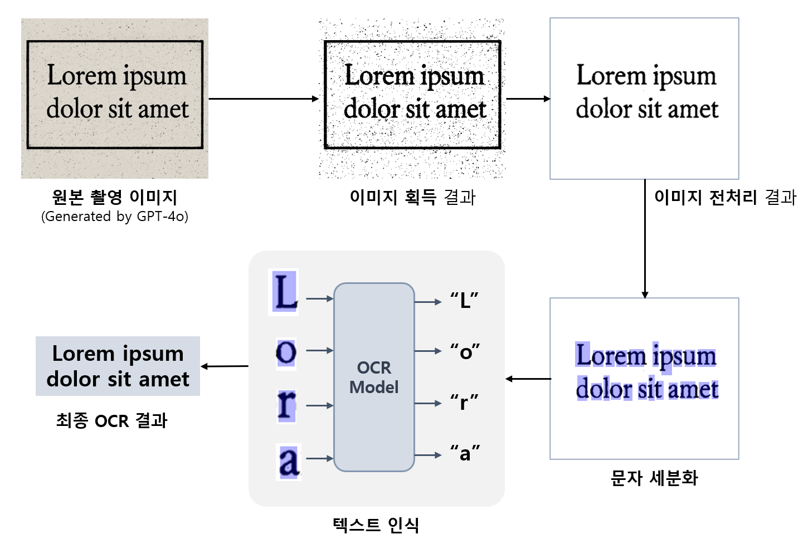

## 목차

* [1. 개요](#1-개요)
* [2. 실험 상세](#2-실험-상세)
  * [2-1. 이미지 회전 각도 판단](#2-1-이미지-회전-각도-판단)
  * [2-2. 글자 직사각형 영역 탐지](#2-2-글자-직사각형-영역-탐지)
  * [2-3. 텍스트 인식 (글자 분류)](#2-3-텍스트-인식-글자-분류)
* [3. 실험 결과](#3-실험-결과)

## 1. 개요

* [OCR의 기본 프로세스](OCR_Basics.md#2-ocr의-동작-원리) 에 따른 간단한 OCR 모델을 만들어서 테스트한다.
* **OCR 실무 경험 이전** 의 실험으로, 향후 **OCR 실무 경험 이후** 에 본 문서의 내용보다 OCR에 대한 이해가 얼마나 향상되었는지 평가한다.

## 2. 실험 상세

* OCR 의 기본 프로세스의 각 과정에 다음과 같이 알고리즘 및 딥러닝 모델을 적용한다.

| OCR 프로세스         | 알고리즘 / 딥러닝 모델                                                               |
|------------------|-----------------------------------------------------------------------------|
| 이미지 획득           | 단순 색 변환 (원본 색 → Black or White)                                             |
| 이미지 전처리 및 문자 세분화 | - 이미지 회전 각도 판단 **(CNN 모델)** 및 회전 처리 - 회전 처리된 이미지에 대해 글자를 나타내는 직사각형 영역 탐지 |
| 텍스트 인식           | - 탐지된 직사각형 영역에 있는 글자를 분류 **(CNN 모델)**                                       |
| 최종 결과 도출         | - OCR Model 를 이용하여 탐지된 결과를 최종 합성                                            |

### 2-1. 이미지 회전 각도 판단

### 2-2. 글자 직사각형 영역 탐지

### 2-3. 텍스트 인식 (글자 분류)

## 3. 실험 결과
