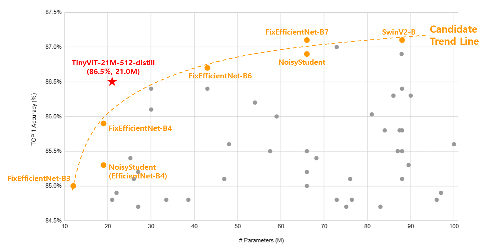

## 목차

* [1. 개요](#1-개요)
  * [1-1. Vision 분야에서의 Anomaly Detection 모델의 필요성](#1-1-vision-분야에서의-anomaly-detection-모델의-필요성) 
  * [1-2. 실험 대상 모델](#1-2-실험-대상-모델)
  * [1-3. 실험 대상 모델 선정 기준](#1-3-실험-대상-모델-선정-기준)
* [2. 실험](#2-실험)
  * [2-1. 실험 설계](#2-1-실험-설계) 
  * [2-2. 실험 결과](#2-2-실험-결과)

## 1. 개요

Vision 분야에서의 이상 탐지를 위해, **Normal / Abnormal 의 Classification (지도학습)** 방식의 모델이 아닌 **Anomaly Detection (주로 비지도학습)** 방식의 모델이 필요한 이유를 알아본다.

* 배경
  * 본인은 2024년 현업 실무에서 Vision Classification 및 Vision Anomaly Detection 모델 개발 업무를 담당했음
  * 이 중에서도 특히 **Vision Anomaly Detection 쪽 업무를 담당했음**
  * 회사에서 Vision Anomaly Detection 문제를 Vision Classification 으로 해결하는 것을 보고, **Vision Classification 으로 해결 가능한데 왜 굳이 Anomaly Detection 방식의 모델이 필요하지?** 라는 의문을 품게 됨
    * **상세 사항은 영업비밀이므로 공개 불가**

* 계획
  * 전체 일정 : **2025.03.28 (금) ~ 04.03 (목), 7d**

| 계획 내용                                   | 일정                     |
|-----------------------------------------|------------------------|
| 실험 대상 Vision Classification 모델 1개 선정    | 03.28 금 (1d)           |
| 실험 대상 Vision Anomaly Detection 모델 1개 선정 | 03.28 금 (1d)           |
| 실험 대상 Vision Classification 모델 논문 탐독    | 03.29 토 (1d)           |
| 실험 대상 Vision Anomaly Detection 모델 논문 탐독 | 03.30 일 (1d)           |
| 실험 설계                                   | 03.31 월 (1d)           |
| 실험 실시                                   | 04.01 화 - 04.02 수 (2d) |
| 실험 결과 정리                                | 04.03 목 (1d)           |

### 1-1. Vision 분야에서의 Anomaly Detection 모델의 필요성

* [ChatGPT 질의응답](https://chatgpt.com/share/67974281-7fb8-8010-9a1a-4b56c060e71b) 요약
  * abnormal 데이터의 희소성 관련 문제 ([데이터 불균형](../AI%20Basics/Data%20Science%20Basics/데이터_사이언스_기초_데이터_불균형.md) 등)
  * 다양하고 새로운 abnormal data 의 존재 가능성
  * 기타 (라벨링 비용 및 환경 문제)
* 실험을 통한 추가 발견 사항
  * TBU 

### 1-2. 실험 대상 모델

**1. Vision Classification**

* 실험 대상 모델 최종 선정
  * **TinyViT-21M-512-distill**
  * ImageNet Top-1 Accuracy **86.5 %**, Parameter Count **21.0 M (2100만 개)**

**2. Vision Anomaly Detection**

* 실험 대상 모델 최종 선정
  * TBU 

**3. 실험 후보 모델**

* Vision Classification

| 후보 모델                          | Top-1 정확도 | # Params |
|--------------------------------|-----------|----------|
| FixEfficientNet-B7             | 87.1%     | 66.0 M   |
| SwinV2-B                       | 87.1%     | 88.0 M   |
| NoisyStudent                   | 86.9%     | 66.0 M   |
| FixEfficientNet-B6             | 86.7%     | 43.0 M   |
| FixEfficientNet-B4             | 85.9%     | 19.0 M   |
| NoisyStudent (EfficientNet-B4) | 85.3%     | 19.0 M   |
| FixEfficientNet-B3             | 85.0%     | 12.0 M   |

* Vision Anomaly Detection

### 1-3. 실험 대상 모델 선정 기준

**1. 실험 대상 데이터셋**

* 데이터셋
  * [MVTec AD Dataset](https://www.kaggle.com/datasets/ipythonx/mvtec-ad)
  * **Creative Commons Attribution-NonCommercial-ShareAlike 4.0 International License (CC BY-NC-SA 4.0)** 이므로, 원칙적으로 **상업적 사용이 불가** 하다.
* 세부 카테고리
  * TBU 

**2. 실험 대상 모델 선정 기준**

* 기본 컨셉
  * **정확도와 학습 및 추론 시간을 모두 고려할 때, 성능이 가장 좋은 모델** 을 선정한다.

* 모델 후보 탐색 페이지
  * Vision Classification
    * [PapersWithCode : Image Classification on ImageNet](https://paperswithcode.com/sota/image-classification-on-imagenet)
  * Vision Anomaly Detection
    * [PapersWithCode : Anomaly Detection on MVTec AD](https://paperswithcode.com/sota/anomaly-detection-on-mvtec-ad)

* 모델 후보 기본 조건 **(아래 4가지 모두 만족)**
  * 모델 정확도
    * 각 분야 (Classification, Anomaly Detection) 별 **LeaderBoard 300 위 이내**
  * 모델 파라미터 개수
    * **100M (1억 개) 이하**
    * 기본적으로 학습 및 추론에 너무 많은 시간이 걸릴 것으로 예상되는 모델은 제외 
  * **512 x 512 이상의 해상도** 에서 사용 가능한 모델
    * 미세한 Anomaly 도 탐지할 수 있어야 함 (= 이상 탐지를 위해 인간 노동력 대신 AI를 사용할 만한 이유)
  * Github 등에 **구현 코드가 존재** 하는 모델

* 모델 선정 기준
  * 아래 각각에 대해 다음과 같은 방법으로 선정 **(아래 그림 참고)**
    * **정확도 (분류의 경우 Top 1 Accuracy) 및 파라미터 개수를 scatter plot** 으로 나타낸다.
    * 다른 어떤 모델도 해당 모델보다 **정확도가 더 높음과 동시에 파라미터 개수가 더 적은** 경우가 없는 모델만 Candidate 로 선정한다.
    * Candidate Model 의 추세선을 그린다.
    * Candidate Model 중 이 추세선을 기준으로 **가장 왼쪽 위에** 있는 모델을 최종 선택한다.
  * PapersWithCode LeaderBoard 정보만으로 선정 후, 다음을 반복
    * 최종 선택된 모델이 **512 x 512 이상에서 사용 불가능함이 확인** 되는 경우, 해당 모델을 제외하고 위 방법으로 최종 모델 재선정
    * 이것을 최종 선택된 모델이 512 x 512 이상에서 사용 가능함이 확인될 때까지 반복

**2. 실험 대상 모델 선정 이유**

* TBU

## 2. 실험

### 2-1. 실험 설계

### 2-2. 실험 결과