## 목차

* [1. 개요](#1-개요)
  * [1-1. Vision 분야에서의 Anomaly Detection 모델의 필요성](#1-1-vision-분야에서의-anomaly-detection-모델의-필요성) 
  * [1-2. 실험 대상 모델](#1-2-실험-대상-모델)
  * [1-3. 실험 대상 데이터셋](#1-3-실험-대상-데이터셋)
  * [1-4. 실험 대상 모델 선정 기준](#1-4-실험-대상-모델-선정-기준)
* [2. 실험](#2-실험)
  * [2-1. 기본 실험 설계](#2-1-기본-실험-설계)
  * [2-2. 모델 별 실험 설계](#2-2-모델-별-실험-설계)
  * [2-3. 실험 결과](#2-3-실험-결과)
* [3. 참고](#3-참고)
  * [3-1. Vision Anomaly Detection 에서 모델 규모 및 학습/추론 속도 기준의 불명확성](#3-1-vision-anomaly-detection-에서-모델-규모-및-학습추론-속도-기준의-불명확성)

## 1. 개요

Vision 분야에서의 이상 탐지를 위해, **Normal / Abnormal 의 Classification (지도학습)** 방식의 모델이 아닌 **Anomaly Detection (주로 비지도학습)** 방식의 모델이 필요한 이유를 알아본다.

* 배경
  * 본인은 2024년 현업 실무에서 Vision Classification 및 Vision Anomaly Detection 모델 개발 업무를 담당했음
  * 이 중에서도 특히 **Vision Anomaly Detection 쪽 업무를 담당했음**
  * 회사에서 Vision Anomaly Detection 문제를 Vision Classification 으로 해결하는 것을 보고, **Vision Classification 으로 해결 가능한데 왜 굳이 Anomaly Detection 방식의 모델이 필요하지?** 라는 의문을 품게 됨
    * **상세 사항은 영업비밀이므로 공개 불가**

* 계획
  * 전체 일정 : **2025.03.28 (금) ~ 04.08 (화), 12d**

| 계획 내용                                                               | 일정                     |
|---------------------------------------------------------------------|------------------------|
| 실험 대상 Vision Classification 모델 1개 선정                                | 03.28 금 (1d)           |
| 실험 대상 Vision Anomaly Detection 모델 1개 선정                             | 03.28 금 - 03.29 토 (2d) |
| 실험 대상 Vision Classification 모델 논문 탐독                                | 03.29 토 - 03.30 일 (2d) |
| 실험 대상 Vision Anomaly Detection 모델 논문 탐독                             | 03.31 월 (1d)           |
| 실험 설계                                                               | 03.31 월 (1d)           |
| [실험 실시](Special%20-%20Vision%20Anomaly%20Detection%20필요성/README.md) | 04.01 화 - 04.07 월 (7d) |
| 실험 결과 정리                                                            | 04.08 화 (1d)           |

* 실험 코드
  * [해당 문서](Special%20-%20Vision%20Anomaly%20Detection%20필요성/README.md) 참고. 

### 1-1. Vision 분야에서의 Anomaly Detection 모델의 필요성

* [ChatGPT 질의응답](https://chatgpt.com/share/67974281-7fb8-8010-9a1a-4b56c060e71b) 요약
  * abnormal 데이터의 희소성 관련 문제 ([데이터 불균형](../AI%20Basics/Data%20Science%20Basics/데이터_사이언스_기초_데이터_불균형.md) 등)
  * 다양하고 새로운 abnormal data 의 존재 가능성
  * 기타 (라벨링 비용 및 환경 문제)
* 실험을 통한 추가 발견 사항
  * Anomaly Detection 모델은 **학습 데이터 규모가 작을 때도** Classification 모델에 비해 충분한 성능을 발휘할 가능성이 높음
  * Anomaly 의 크기는 일반적으로 **매우 작은데, Classification 모델로는 이를 탐지하기 어려움**

### 1-2. 실험 대상 모델

**1. 최종 선정 모델**

| 분야                       | 모델 (논문 링크)                                                                   | 논문 스터디 자료                                                                                                                                                                                                  |
|--------------------------|------------------------------------------------------------------------------|------------------------------------------------------------------------------------------------------------------------------------------------------------------------------------------------------------|
| Vision Classification    | TinyViT-21M-512-distill [(논문 - 2022.07)](https://arxiv.org/pdf/2207.10666v1) | [Paper Study](../Paper%20Study/Vision%20Model/%5B2025.03.29%5D%20TinyViT%20-%20Fast%20Pretraining%20Distillation%20for%20Small%20Vision%20Transformers.md)                                                 |
| Vision Anomaly Detection | GLASS [(논문 - 2024.07)](https://arxiv.org/pdf/2407.09359v1)                   | [Paper Study](../Paper%20Study/Vision%20Model/%5B2025.03.31%5D%20A%20Unified%20Anomaly%20Synthesis%20Strategy%20with%20Gradient%20Ascent%20for%20Industrial%20Anomaly%20Detection%20and%20Localization.md) |

* Citation for **TinyViT-21M-512-distill**

``` 
TinyViT: Fast Pretraining Distillation for Small Vision Transformers,
by Wu, Kan and Zhang, Jinnian and Peng, Houwen and Liu, Mengchen and Xiao, Bin and Fu, Jianlong and Yuan, Lu,
European conference on computer vision (ECCV), 2022
```

* Citation for **GLASS**

``` 
A unified anomaly synthesis strategy with gradient ascent for industrial anomaly detection and localization,
by Chen, Qiyu and Luo, Huiyuan and Lv, Chengkan and Zhang, Zhengtao,
European Conference on Computer Vision, 2025
```

**2. Vision Classification**

* 실험 대상 모델 최종 선정
  * **TinyViT-21M-512-distill**
  * ImageNet Top-1 Accuracy **86.5 %**, Parameter Count **21.0 M (2100만 개)**


**3. Vision Anomaly Detection**

* 실험 대상 모델 최종 선정
  * **GLASS**
  * Detection AUROC **99.9 %** (Star 개수보다는 정확도에 큰 비중을 두어 선정)


**3. 실험 후보 모델**

* Vision Classification

| 후보 모델                          | Top-1 정확도 | # Params  |
|--------------------------------|-----------|-----------|
| FixEfficientNet-B7             | 87.1%     | 66.0 M    |
| SwinV2-B                       | 87.1%     | 88.0 M    |
| NoisyStudent                   | 86.9%     | 66.0 M    |
| FixEfficientNet-B6             | 86.7%     | 43.0 M    |
| **TinyViT-21M-512-distill**    | **86.5%** | **21.0M** |
| FixEfficientNet-B4             | 85.9%     | 19.0 M    |
| NoisyStudent (EfficientNet-B4) | 85.3%     | 19.0 M    |
| FixEfficientNet-B3             | 85.0%     | 12.0 M    |

* Vision Anomaly Detection

| 후보 모델                         | Top-1 정확도 | Github Stars |
|-------------------------------|-----------|--------------|
| **GLASS**                     | **99.9%** | **253**      |
| Efficient-AD (early stopping) | 99.8%     | 324          |
| PatchCore Large               | 99.6%     | 845          |
| SimpleNet                     | 99.6%     | 488          |
| PatchCore                     | 99.2%     | 845          |
| PatchCore (16-shot)           | 95.4%     | 845          |

### 1-3. 실험 대상 데이터셋

* 데이터셋
  * [MVTec AD Dataset](https://www.kaggle.com/datasets/ipythonx/mvtec-ad)
  * **Creative Commons Attribution-NonCommercial-ShareAlike 4.0 International License (CC BY-NC-SA 4.0)** 이므로, 원칙적으로 **상업적 사용이 불가** 하다.

```
Paul Bergmann, Michael Fauser, David Sattlegger, and Carsten Steger,
"A Comprehensive Real-World Dataset for Unsupervised Anomaly Detection",
IEEE Conference on Computer Vision and Pattern Recognition, 2019
```

* 세부 카테고리
  * 전체 4 개 
    * 전체 데이터셋 내의 15 개의 모든 세부 카테고리 중 아래와 같은 4 개를 대상으로 실험 
  * Texture 계열 2 개
    * Carpet, Grid
  * Object 계열 2 개
    * Bottle, Hazelnut

### 1-4. 실험 대상 모델 선정 기준

**1. 실험 대상 모델 탐색 기준**

* 기본 컨셉
  * **정확도와 학습 및 추론 시간을 모두 고려할 때, 성능이 가장 좋은 모델** 을 선정한다.

* 모델 후보 탐색 페이지
  * Vision Classification
    * [PapersWithCode : Image Classification on ImageNet](https://paperswithcode.com/sota/image-classification-on-imagenet)
  * Vision Anomaly Detection
    * [PapersWithCode : Anomaly Detection on MVTec AD](https://paperswithcode.com/sota/anomaly-detection-on-mvtec-ad)

* 모델 기본 조건 **(아래 4가지 모두 만족)**
  * 모델 성능 기준
    * Classification : **Top-1 Accuracy (300위 이내)**
    * Anomaly Detection : **Detection [AUROC](../AI%20Basics/Data%20Science%20Basics/데이터_사이언스_기초_Metrics.md#3-2-area-under-roc-curve-roc-auc) (100위 이내)**
  * 모델 규모 및 속도
    * Classification : 학습 및 추론 속도를 고려하여, Parameter 개수 **100M (1억 개) 이하**
    * Anomaly Detection : [모델 규모 및 학습/추론 속도 기준 불명확.](#3-1-vision-anomaly-detection-에서-모델-규모-및-학습추론-속도-기준의-불명확성) 따라서 이를 대체할 기준으로 **인지도 기준 (GitHub 공식 repo. 의 Star 개수 20개 이상 / 2025.03.29 기준) 을 이용** 
  * **512 x 512 이상의 해상도** 에서 사용 가능한 모델
    * 미세한 Anomaly 도 탐지할 수 있어야 함 (= 이상 탐지를 위해 인간 노동력 대신 AI를 사용할 만한 이유)
  * Github 등에 **구현 코드가 존재** 하는 모델

**2. 실험 대상 모델 후보 (Candidate) 및 최종 선정 기준**

* 아래 각각에 대해 다음과 같은 방법으로 선정 **(아래 그림 참고)**
  * **성능지표 및 파라미터 개수 (또는 Star 개수) 를 scatter plot** 으로 나타낸다.
  * 다른 어떤 모델도 해당 모델보다 **성능지표 값이 더 높음** 과 동시에, 또한 **파라미터 개수가 더 작거나 Star 가 더 많은** 경우가 없는 모델만 Candidate 로 선정한다.
  * Candidate Model 의 추세선을 그린다.
  * Candidate Model 중 이 추세선을 기준으로 **가장 왼쪽 위에** 있는 모델을 최종 선택한다.
* PapersWithCode LeaderBoard 정보만으로 선정 후, 다음을 반복
  * 최종 선택된 모델이 **512 x 512 이상에서 사용 불가능함이 확인** 되는 경우, 해당 모델을 제외하고 위 방법으로 최종 모델 재선정
  * 이것을 최종 선택된 모델이 512 x 512 이상에서 사용 가능함이 확인될 때까지 반복

**[ Vision Classification ]**

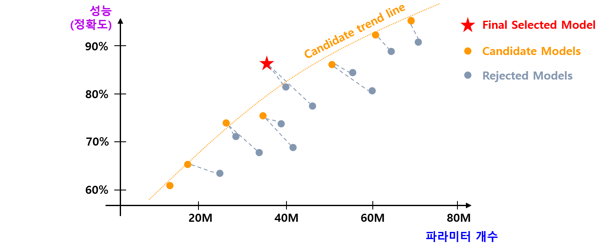

**[ Vision Anomaly Detection ]**


## 2. 실험

### 2-1. 기본 실험 설계

**1. 정량적 성능 평가**

* 목표
  * Vision Anomaly Detection vs. Classification Model 의 성능 비교 

* Vision Classification & Anomaly Detection 공통
  * 성능 평가 대상 데이터셋
    * MVTec AD 데이터셋의 Texture 계열 카테고리 중 Carpet, Grid
    * MVTec AD 데이터셋의 Object 계열 카테고리 중 Bottle, Hazelnut
  * [성능 평가 Metric](../AI%20Basics/Data%20Science%20Basics/데이터_사이언스_기초_Metrics.md)
    * [Accuracy, **Recall**, Precision](../AI%20Basics/Data%20Science%20Basics/데이터_사이언스_기초_Metrics.md#1-2-accuracy-recall-precision) (Positive = **Abnormal**)
    * [F1 Score](../AI%20Basics/Data%20Science%20Basics/데이터_사이언스_기초_Metrics.md#1-3-f1-score) (Positive = **Abnormal**)
    * Anomaly Detection 에서는 일반적으로 **실제 불량품을 불량품으로 예측** 하는 것이 중요하기 때문에, 여기서 Recall 이 중요함

* Vision Anomaly Detection 의 Train/Valid/Test 데이터 구분
  * **각 카테고리 별로** 다음과 같이 데이터를 랜덤하게 배분
  * Valid/Test Dataset 의 경우, 'good' 디렉토리에 속한 이미지를 Normal Data 로 간주

|                 | Train Data                 | Valid Data                                     | Test Data                                      |
|-----------------|----------------------------|------------------------------------------------|------------------------------------------------|
| Normal Sample   | 원본 데이터셋의 Train Data **전체** | 원본 데이터셋의 Test Data 중 Normal Sample 의 **50%**   | 원본 데이터셋의 Test Data 중 Normal Sample 의 **50%**   |
| Abnormal Sample | -                          | 원본 데이터셋의 Test Data 중 Abnormal Sample 의 **50%** | 원본 데이터셋의 Test Data 중 Abnormal Sample 의 **50%** |

* Vision Classification 의 Train/Valid/Test 데이터 구분
  * **각 카테고리 별로** 다음과 같이 데이터를 랜덤하게 배분

|                 | Train Data                                                                                                                                        | Valid Data                                     | Test Data                                      |
|-----------------|---------------------------------------------------------------------------------------------------------------------------------------------------|------------------------------------------------|------------------------------------------------|
| Normal Sample   | 원본 데이터셋의 Train Data **전체**                                                                                                                        | 원본 데이터셋의 Test Data 중 Normal Sample 의 **50%**   | 원본 데이터셋의 Test Data 중 Normal Sample 의 **50%**   |
| Abnormal Sample | 원본 데이터셋의 Test Data 중 Abnormal Sample 의 **50%** x [**4배** (90,180,270도 회전 Augmentation)](Basics_Image_Augmentation_Methods.md#1-1-이미지-형태의-기하학적-변형) | 원본 데이터셋의 Test Data 중 Abnormal Sample 의 **25%** | 원본 데이터셋의 Test Data 중 Abnormal Sample 의 **25%** |

**2. 설명 능력 평가**

* 목표
  * Vision Anomaly Detection 의 Anomaly Score vs. Classification Model 의 XAI 모델 (Grad-CAM 등) 간 Abnormal Region 설명 능력 비교 
  * 즉, **Anomaly 에 해당하는 영역을 정확히 파악하는 능력** 을 비교

* 모델 및 데이터셋
  * **1. 정량적 성능 평가** 실험 과정에서 학습된 모델 대상 실험
    * Classification 모델 (TinyViT-21M-512-distill)
    * Anomaly Detection 모델 (GLASS)
  * 테스트 대상 데이터
    * **1. 정량적 성능 평가** 의 Test Dataset 중 모든 Abnormal Sample 을 대상으로 평가 
  * Classification 모델에 사용되는 XAI 모델
    * [pytorch-grad-cam (by jacobgil)](https://github.com/jacobgil/pytorch-grad-cam/tree/master)
    * [ViT 계열 모델에서의 사용 예시](https://github.com/jacobgil/pytorch-grad-cam/blob/master/usage_examples/vit_example.py)

* 설명 능력 평가 방법
  * Ground Truth Abnormal Region 과 XAI 모델에 의해 도출된 Heatmap 에서 값이 큰 영역을 비교
  * 정성적 평가

**3. 새로운 Abnormal Class 탐지 성능 평가**

* 목표
  * Vision Classification 모델이 Normal image 들과 1 가지 유형의 Abnormal image 들을 학습했을 때, **다른 유형의 Abnormal 이미지들도 Abnormal image 로 분류하는지에 대한 성능** 을 평가한다.

* 설명 능력 평가 - 모델 및 데이터셋
  * 위 **정량적 성능 평가 방법** 에서 학습한 모델 및 Test Dataset 을 대상으로 평가
  * 해당 모델 및 데이터셋에 대해, [pytorch-grad-cam (by jacobgil)](https://github.com/jacobgil/pytorch-grad-cam/tree/master) 를 이용한 Abnormal Region 설명 능력 평가

* 설명 능력 평가 방법
  * **2. 설명 능력 평가** 와 동일하게, 정성적 평가 실시

**Citation for XAI model**

```
PyTorch library for CAM methods, by Jacob Gildenblat and contributors (2021),
Github URL : https://github.com/jacobgil/pytorch-grad-cam}
```

### 2-2. 모델 별 실험 설계

| 모델                        | [Early Stopping](../AI%20Basics/Deep%20Learning%20Basics/딥러닝_기초_Early_Stopping.md) 기준                      | 최대 Epochs  |
|---------------------------|------------------------------------------------------------------------------------------------------------|------------|
| GLASS (Anomaly Detection) | Image AUC 기준 30 epochs                                                                                     | 200 epochs |
| TinyViT (Classification)  | [AUROC](../AI%20Basics/Data%20Science%20Basics/데이터_사이언스_기초_Metrics.md#3-2-area-under-roc-curve-roc-auc) 기준 | 제한 없음      |

* 추가 사항
  * TinyViT 을 이용한 실험 시, Train Data 의 Abnormal Data 는 **90,180,270도 회전 [Image Augmentation](../Image%20Processing/Basics_Image_Augmentation.md) 을 적용하여 데이터 규모 4배 증대** 

### 2-3. 실험 결과

**0. 실험 결과 요약**

* 데이터셋 종류를 가리지 않고, **정량적 성능 및 XAI 모두** 에서 Anomaly Detection (GLASS) 의 성능이 Image Classification (TinyViT) 의 성능보다 훨씬 좋음
  * 이는 Anomaly Detection 모델이 **200~400장 수준의 비교적 소규모의 데이터** 로도 **이상 탐지에서 충분한 성능을 발휘할 수 있음** 을 의미
* 특정 Anomaly 종류를 학습한 Classification 모델은 **새로운 종류의 Anomaly 를 탐지하기 어려움**

**1. 정량적 성능 평가**

* 결론
  * Anomaly Detection (GLASS) 의 **정량적 성능** 이 Image Classification (TinyViT) 의 성능보다 훨씬 좋음
  * 이는 데이터셋 종류 (Object - "Bottle, Hazelnut" / Texture - "Carpet, Grid") 를 가리지 않고 동일

* F1 Score 가 가장 높아지는 Anomaly Score Threshold 에서의 **Best F1 Score** 기준

| 모델 \ 데이터셋 | Bottle  | Hazelnut | Carpet  | Grid    | 평균          |
|-----------|---------|----------|---------|---------|-------------|
| GLASS     | 93.75 % | 95.77 %  | 86.54 % | 87.88 % | **90.98 %** |
| TinyViT   | 78.05 % | 64.29 %  | 76.67 % | 73.17 % | **73.04 %** |

**2. 설명 능력 평가**

* 결론
  * Anomaly Detection (GLASS) 의 **설명 능력 (Anomaly 에 해당하는 영역을 정확히 표시하는 능력)** 이 Image Classification (TinyViT) 보다 훨씬 좋음
  * 데이터셋 종류 (Object, Texture) 를 가리지 않고 동일

* **Anomaly Detection (GLASS)** 모델
  * 모델 자체적으로 산출되는 Anomaly Score 를 이용
  * 실험 결과 요약
    * **Object (Bottle, Hazelnut)** 은 Anomaly 를 정확히 찾음
    * **Texture (Carpet, Grid)** 는 작은 Anomaly 를 탐지하지 못하거나 정상적인 부분을 Anomaly 로 탐지하는 경우도 있음

| 데이터셋     | 실행 결과                                                                                                           |
|----------|-----------------------------------------------------------------------------------------------------------------|
| Bottle   | 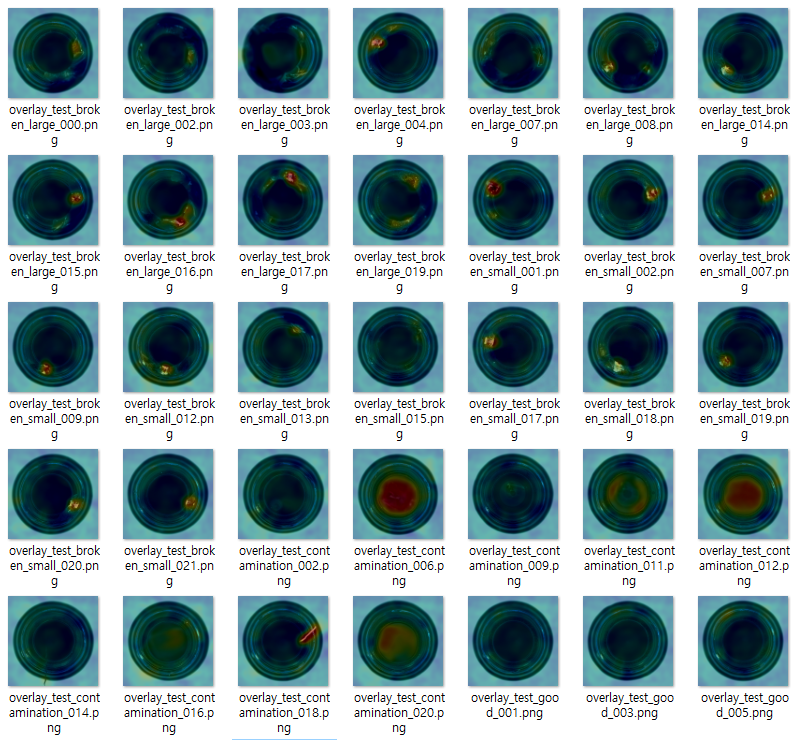                                                           |
| Hazelnut | 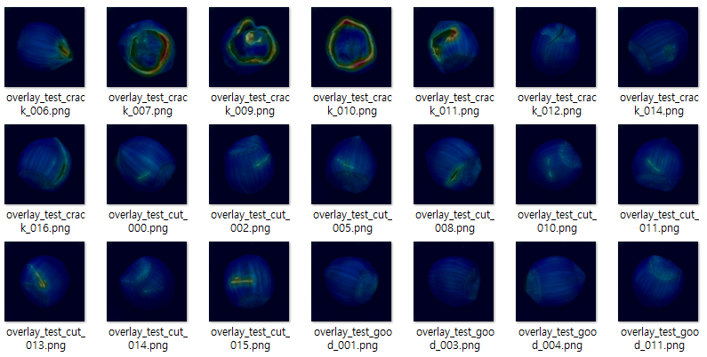<br>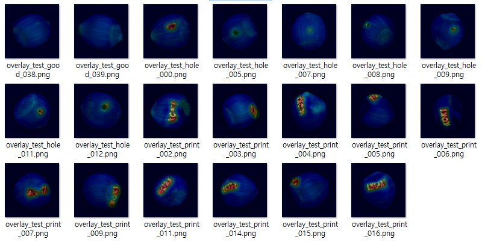  |
| Carpet   | 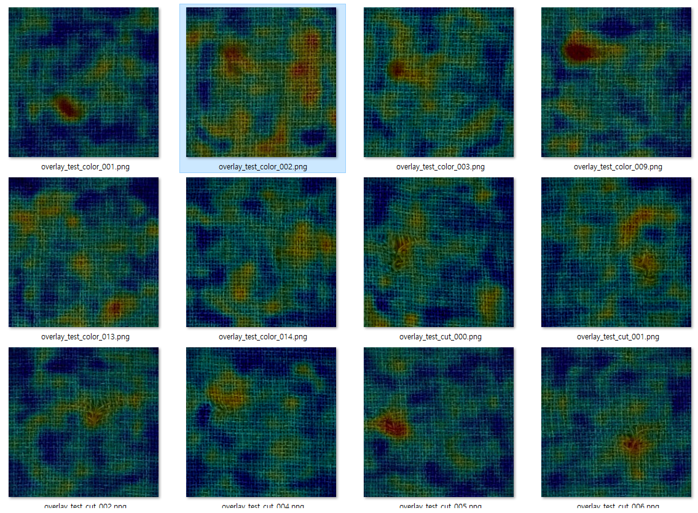                                                           |
| Grid     | 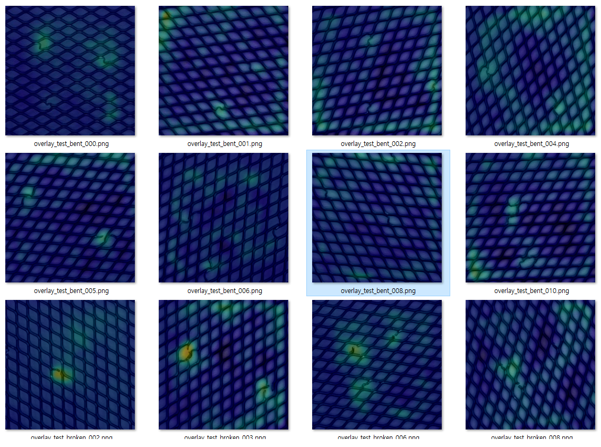<br>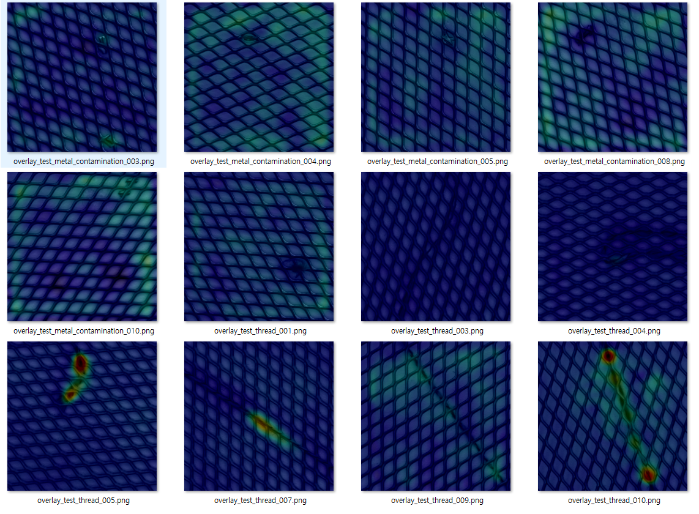 |

* **Image Classification (TinyViT)** 모델
  * PyTorch Grad-CAM 을 이용하여 산출한, Abnormal Class 에 대한 Heatmap 을 이용
  * 여기서는 **Stage 4 의 3 번째 Conv. Layer** 의 결과를 이용
  * 실험 결과 요약
    * Hazelnut 을 제외하고 **Anomaly 를 거의 찾아내지 못함**
    * Hazelnut 의 경우 Anomaly 를 비교적 정확히 찾아내지만, ```print``` Class 의 경우 **Abnormal 영역을 오히려 Normal 로 찾아냄**

| 데이터셋     | 실행 결과                                                                                                            |
|----------|------------------------------------------------------------------------------------------------------------------|
| Bottle   | 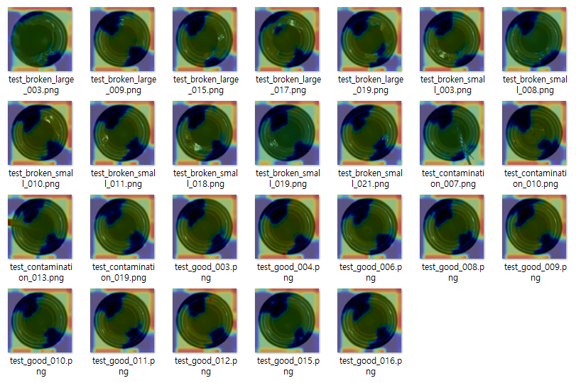                                                           |
| Hazelnut | 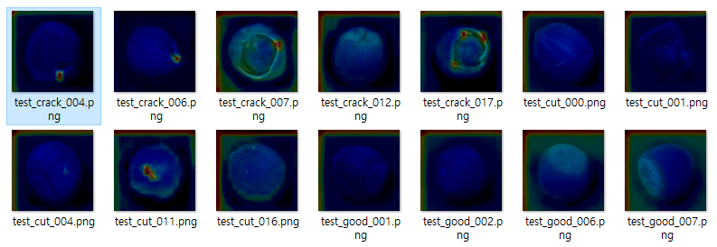<br>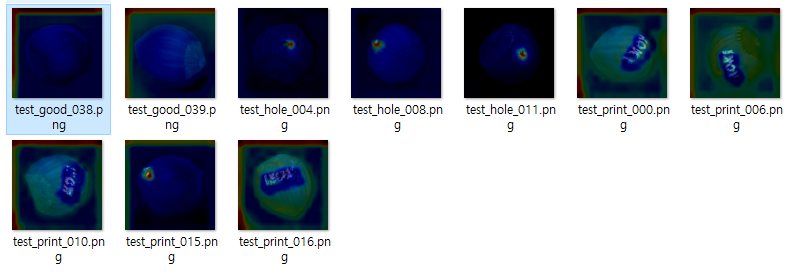 |
| Carpet   | 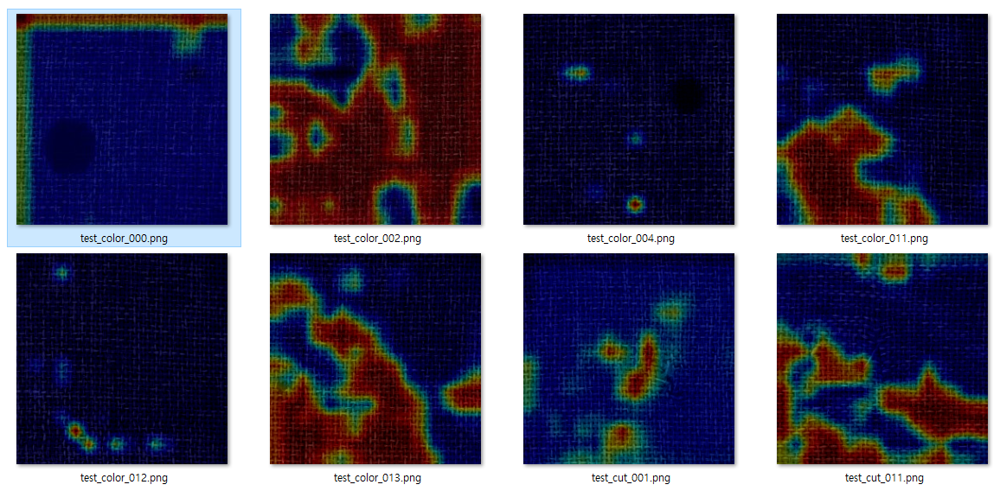<br>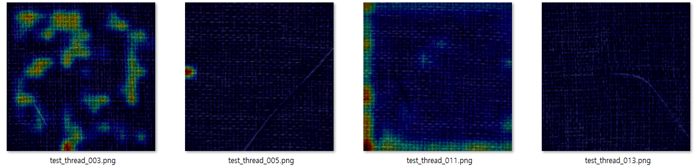 |
| Grid     | 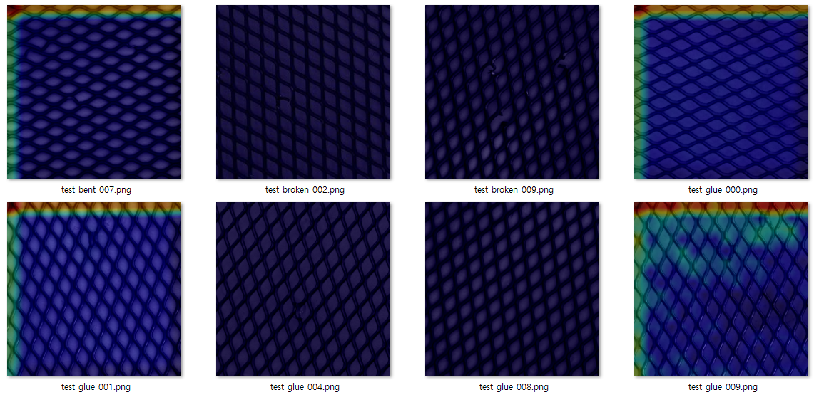<br>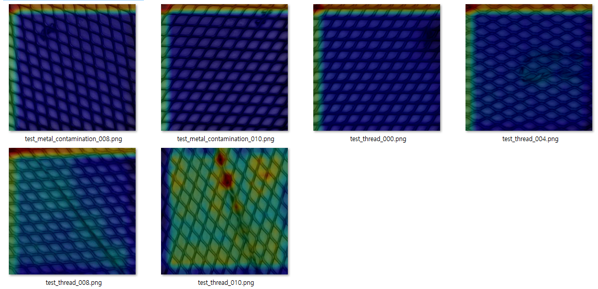 |

**3. 새로운 Abnormal Class 탐지 성능 평가**

* 결론
  * Image Classification (TinyViT) 모델은 기존에 학습한 Anomaly 외에 **새로운 Anomaly 를 거의 찾아내지 못함**

* **Image Classification (TinyViT)** 모델
  * 여기서는 **Stage 4 의 3 번째 Conv. Layer** 의 결과를 이용
  * 실험 결과 요약
    * Grid 를 제외하고 **Anomaly 를 거의 찾아내지 못함**

| 데이터셋     | 학습한 Abnormal Class | 실행 결과 (나머지 Abnormal Class)                                                                                       |
|----------|--------------------|------------------------------------------------------------------------------------------------------------------|
| Bottle   | ```broken_small``` | 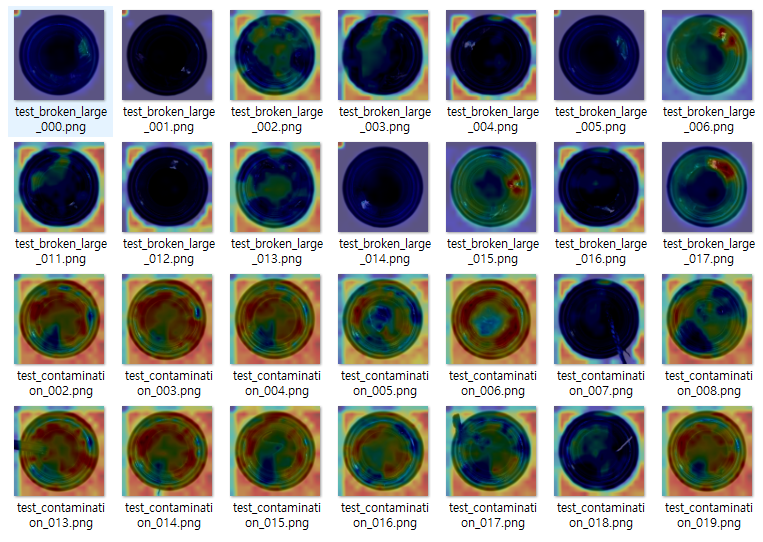                                                           |
| Hazelnut | ```crack```        | 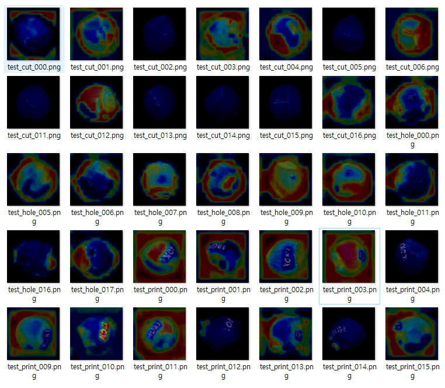                                                           |
| Carpet   | ```color```        | <br>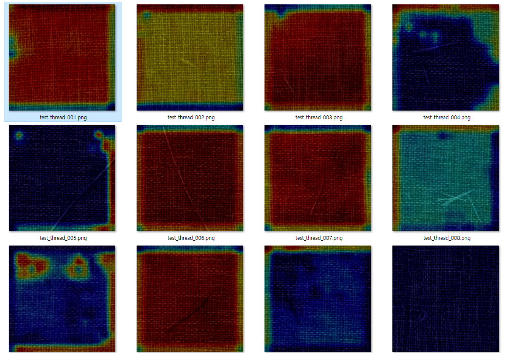 |
| Grid     | ```bent```         | 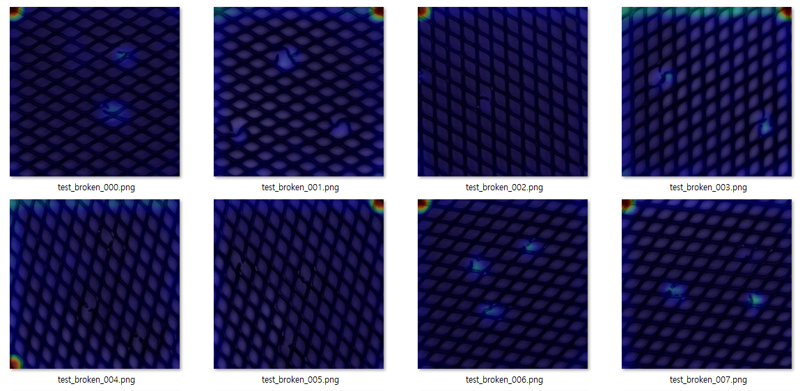<br>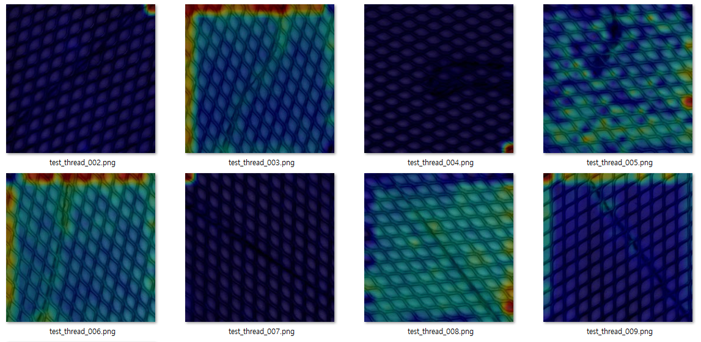 |

* 참고
  * 정량적 성능 평가 없이 **설명 능력 평가** 만 진행 

## 3. 참고

### 3-1. Vision Anomaly Detection 에서 모델 규모 및 학습/추론 속도 기준의 불명확성

* Vision Anomaly Detection 에서는 **모델 규모 및 학습/추론 속도의 기준** 을 정하기 어렵다.
  * Vision Classification 과 달리, Vision Anomaly Detection 은 **모델의 구조가 다양하기 때문에 파라미터 개수를 모델 규모 지표로 사용하기 어렵다.**
  * 또한, 학습 및 추론 속도는 **여러 논문에서 각각 다른 환경 (GPU 장비) 으로 테스트** 하기 때문에, 일정한 기준을 정하기 어렵다.
  * 이외의 다른 측정 지표 역시 생각하기 어렵다.
* 따라서 이를 대체할 지표를 선택해야 한다.
  * 여기서는 **모델의 인지도가 높을수록 사람들이 많이 쓰는 모델, 즉 학습/추론 속도 역시 만족스러운 모델** 일 것이라고 기본적으로 가정한다.
  * 따라서, 모델 인지도 지표로 많이 쓰이는 **Github 공식 repo. 의 Star 개수** 를 사용한다.