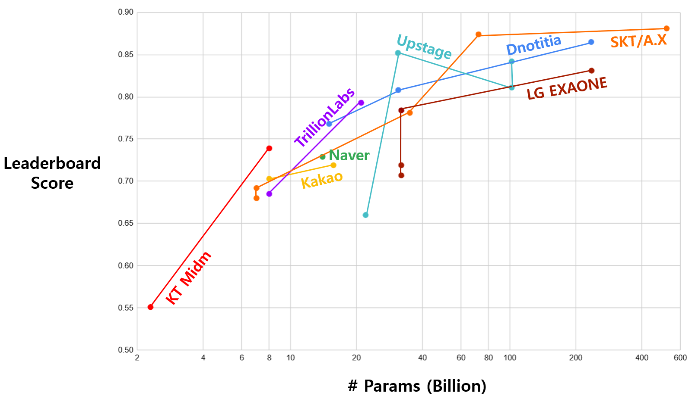

# LangChain 실습

## 목차

* [1. 기본 요구사항](#1-기본-요구사항)
* [2. 개발 일정](#2-개발-일정)
* [3. 구현 내용 요약](#3-구현-내용-요약)
  * [3-1. 한국어 LLM 선택 이유](#3-1-한국어-llm-선택-이유)
  * [3-2. 한국어 LLM 성능 상세 비교 결과](#3-2-한국어-llm-성능-상세-비교-결과)
* [4. 이슈 사항 및 해결 방법](#4-이슈-사항-및-해결-방법)

## 1. 기본 요구사항

* 다음 tool call 을 하는 간단한 LLM 에이전트 개발
  * 특정 날짜로부터 ```N```일 전/후의 날짜 계산
  * 특정 날짜의 요일 계산 및 반환
* 구현 필수 사항
  * Open Source LLM 을 ```trl``` 라이브러리를 이용하여 Fine-Tuning  
  * LangChain 기반으로 구현
  * [LangChain 에이전트 tool call 문서](../LangChain_에이전트_tool_call.md) 를 참고하여 tool call 방식으로 구현
  * 사용자와의 이전 대화를 기록하는 [메모리 (Memory)](../LangChain_메모리.md) 기능 포함

## 2. 개발 일정

* 전체 개발 일정
  * **2026.02.19 (목) - 02.24 (화), 6 days**
* 상세 개발 일정

| 구분         | 계획 내용                              | 일정                     | branch                                   | issue                                                          | 상태 |
|------------|------------------------------------|------------------------|------------------------------------------|----------------------------------------------------------------|----|
| 📃 문서화     | 기본 요구사항 및 개발 일정 문서화                | 02.19 목 (1d)           |                                          |                                                                | ✅  |
| 🧠 모델 선택   | 적절한 한국어 LLM 순위 산출 (최신 Open-Source) | 02.19 목 (1d)           |                                          |                                                                | ✅  |
| 🔨 모델 구현   | 도구 함수 구현 (전/후 날짜 계산, 요일 계산)        | 02.20 금 (1d)           | ```LangChain-practice-001-tool```        | [issue](https://github.com/WannaBeSuperteur/AI-study/issues/1) | ✅  |
| 🔨 모델 구현   | 메모리 구현 (도구 함수와 동일 방식)              | 02.20 금 (1d)           | ```LangChain-practice-002-memory```      | [issue](https://github.com/WannaBeSuperteur/AI-study/issues/2) | ✅  |
| 🧠 모델 선택   | LLM 학습 (Fine-Tuning) 대상 LLM 최종 선택  | 02.20 금 (1d)           | ```LangChain-practice-003-fine-tuning``` |                                                                | ⬜  |
| 📝 데이터셋 제작 | LLM 학습 데이터셋 제작                     | 02.20 금 - 02.22 일 (3d) | ```LangChain-practice-003-fine-tuning``` |                                                                | ⬜  |
| 🧪 모델 학습   | LLM 학습 (Fine-Tuning) 실시            | 02.20 금 - 02.23 월 (4d) | ```LangChain-practice-003-fine-tuning``` |                                                                | ⬜  |
| 🔍 최종 검토   | 최종 QA (버그 유무 검사)                   | 02.24 화 (1d)           |                                          |                                                                | ⬜  |
| 📃 문서화     | 프로젝트 문서 정리 및 마무리                   | 02.24 화 (1d)           |                                          |                                                                | ⬜  |

## 3. 구현 내용 요약

* 한국어 LLM 모델 선택
  * TBU 
  * [Dnotitia LLM 한국어 리더보드 (한국 모델)](https://leaderboard.dnotitia.com/?filter=korea) 참고

### 3-1. 한국어 LLM 선택 이유

**1. 한국어 LLM 선택 절차**

* **1.** [Dnotitia LLM 한국어 리더보드 (한국 모델)](https://leaderboard.dnotitia.com/?filter=korea) 에서 **LLM 브랜드명 (예: ```kakakcorp/kanana```)** 추출
  * 추출 결과 (총 8개 브랜드)
    * ```naver/HyperCLOVAX``` + ```naver/HCX```
    * ```kakaocorp/kanana```
    * ```LGAI-EXAONE```
    * ```skt/A.X```
    * ```KT/Midm-2.0```
    * ```dnotitia/DNA-2.0```
    * ```upstage/solar```
    * ```trillionlabs/Tri```

* **2.** 추출한 LLM 브랜드명을 HuggingFace 로 검색해서, 해당 브랜드의 **모든 모델** 탐색
  * 이때 **5B 이하** 의 모델 탐색

| LLM 브랜드                                   | HuggingFace 탐색 결과 (5B 이하 모델)                                                                                                                                           | [브랜드 순위 (참고)](#3-2-한국어-llm-성능-상세-비교-결과) |
|-------------------------------------------|------------------------------------------------------------------------------------------------------------------------------------------------------------------------|-----------------------------------------|
| ```naver/HyperCLOVAX``` + ```naver/HCX``` | [HyperCLOVAX-SEED-Text-Instruct-1.5B](https://huggingface.co/naver-hyperclovax/HyperCLOVAX-SEED-Text-Instruct-1.5B)                                                    |                                         |
| ```kakaocorp/kanana```                    | [kanana-1.5-2.1b-instruct-2505](https://huggingface.co/kakaocorp/kanana-1.5-2.1b-instruct-2505)                                                                        | 2위                                      |
| ```LGAI-EXAONE```                         | - [EXAONE-Deep-2.4B](https://huggingface.co/LGAI-EXAONE/EXAONE-Deep-2.4B)<br>- [EXAONE-3.5-2.4B-Instruct](https://huggingface.co/LGAI-EXAONE/EXAONE-3.5-2.4B-Instruct) |                                         |
| ```skt/A.X```                             | [ko-gpt-trinity-1.2B-v0.5](https://huggingface.co/skt/ko-gpt-trinity-1.2B-v0.5)                                                                                        | 3위                                      |
| ```KT/Midm-2.0```                         | [Midm-2.0-Mini-Instruct](https://huggingface.co/K-intelligence/Midm-2.0-Mini-Instruct)                                                                                 | **1위**                                  |
| ```dnotitia/DNA-2.0```                    | [DNA-2.0-4B](https://huggingface.co/dnotitia/DNA-2.0-4B)                                                                                                               |                                         |
| ```upstage/solar```                       | (5B 미만 LLM 없음)                                                                                                                                                         |                                         |
| ```trillionlabs/Tri```                    | [Tri-1.9B-Base](https://huggingface.co/trillionlabs/Tri-1.9B-Base)                                                                                                     |                                         |

* **3.** 위 한국어 모델 리더보드를 기준으로 **브랜드 별 LLM 성능 추이** 를 비교
  * 해당 비교 결과에 근거하여 최종적으로 **5.0B 미만 파라미터 개수 구간** 에서 가장 성능이 좋을 법한 브랜드의 모델 선정
  * 해당 선택한 모델이 **OOM, 권한 오류 등 오류** 발생 시, 그 다음으로 성능이 좋은 모델을 **오류 없는 모델이 처음으로 나타날 때까지** 선택
  * 아래의 [3-2. 한국어 LLM 성능 상세 비교 결과](#3-2-한국어-llm-성능-상세-비교-결과) 참고

**2. 해당 절차로 진행한 이유**

* Local PC (12GB GPU) 에서 LLM을 Fine-Tuning 할 때, **5B 초과의 LLM의 경우 OOM (Out of Memory) 가능성**
  * 메모리 및 연산량 절약을 위해, Fine-Tuning 시 **[LoRA](../../AI%20Basics/LLM%20Basics/LLM_기초_Fine_Tuning_LoRA_QLoRA.md) + [Quantization](../../AI%20Basics/LLM%20Basics/LLM_기초_Quantization.md)** 적용 시에도 OOM 가능 예상

* 리더보드 선택 이유
  * 리더보드 설명에 따르면 아래와 같이 **RAG, 툴 콜링 등의 성능을 정밀하게 평가** 하므로, 
  * Tool Call 이 가능한 LLM Agent 성능 평가지표로서 적합

> 디노티시아는 한국어 기반 추론, RAG, 툴 콜링 등의 성능을 정밀하게 평가하기 위해 자체 벤치마크를 구축했습니다.

### 3-2. 한국어 LLM 성능 상세 비교 결과

* 최종 비교 결과 (브랜드 별 순위)
  * **KT Midm (1위)** > Kakao Kanana (2위) > SKT A.X (3위)
  * 4위 이후
    * Dnotitia > TrillionLabs > Naver > Upstage > LG EXAONE 



* 전체 리스트
  * 출처: [Dnotitia LLM 한국어 리더보드 (한국 모델)](https://leaderboard.dnotitia.com/?filter=korea) (2026.02.19)
  * **총 27개** LLM 확인

| LLM                                           | 브랜드/회사             | LLM 크기 (파라미터 개수)     | LeaderBoard 점수 |
|-----------------------------------------------|--------------------|----------------------|----------------|
| ```naver/HyperCLOVAX-SEED-Think-14B```        | ```naver```        | 14.0B                | 0.729          |
| ```naver/HCX-DASH-002```                      | ```naver```        | (확인 불가)              | 0.570          |
| ```naver/HCX-003```                           | ```naver```        | (확인 불가)              | 0.614          |
| ```naver/HCX-005```                           | ```naver```        | (확인 불가)              | 0.700          |
| ```naver/HCX-007```                           | ```naver```        | (확인 불가)              | 0.852          |
| ```kakaocorp/kanana-1.5-8b-instruct-2505```   | ```kakaocorp```    | 8.0B                 | 0.703          |
| ```kakaocorp/kanana-1.5-15.7b-a3b-instruct``` | ```kakaocorp```    | 15.7B                | 0.719          |
| ```LGAI-EXAONE/EXAONE-3.5-32B```              | ```LGAI-EXAONE```  | 32.0B                | 0.784          |
| ```LGAI-EXAONE/EXAONE-Deep-32B```             | ```LGAI-EXAONE```  | 32.0B                | 0.707          |
| ```LGAI-EXAONE/EXAONE-4.0-32B```              | ```LGAI-EXAONE```  | 32.0B                | 0.719          |
| ```LGAI-EXAONE/K-EXAONE-236B-A23B```          | ```LGAI-EXAONE```  | 23.0B (total 236.0B) | 0.831          |
| ```skt/A.X-3.1-Light```                       | ```skt/A.X```      | 7.0B                 | 0.692          |
| ```skt/A.X-3.1```                             | ```skt/A.X```      | 35.0B                | 0.781          |
| ```skt/A.X-4.0-Light```                       | ```skt/A.X```      | 7.0B                 | 0.680          |
| ```skt/A.X-4.0```                             | ```skt/A.X```      | 72.0B                | 0.874          |
| ```skt/A.X-K1```                              | ```skt/A.X```      | 519.0B               | 0.881          |
| ```KT/Midm-2.0-Mini-Instruct```               | ```KT/Midm-2.0```  | 2.3B                 | 0.551          |
| ```KT/Midm-2.0-Base-Instruct```               | ```KT/Midm-2.0```  | 8.0B                 | 0.739          |
| ```dnotitia/DNA-2.0-14B```                    | ```dnotitia```     | 15.0B                | 0.768          |
| ```dnotitia/DNA-2.0-30B-A3B```                | ```dnotitia```     | 3.0B (total 31.0B)   | 0.808          |
| ```dnotitia/DNA-2.0-235B-A22B```              | ```dnotitia```     | 22.0B (total 235.0B) | 0.865          |
| ```upstage/solar-pro```                       | ```upstage```      | 22.0B                | 0.660          |
| ```upstage/solar-pro2```                      | ```upstage```      | 30.9B                | 0.852          |
| ```upstage/Solar-Open-100B```                 | ```upstage```      | 102.0B               | 0.811          |
| ```upstage/solar-pro3```                      | ```upstage```      | 12.0B (total 102.0B) | 0.842          |
| ```trillionlabs/Tri-7B```                     | ```trillionlabs``` | 8.0B                 | 0.685          |
| ```trillionlabs/Tri-21B```                    | ```trillionlabs``` | 21.0B                | 0.793          |

## 4. 이슈 사항 및 해결 방법

TBU
