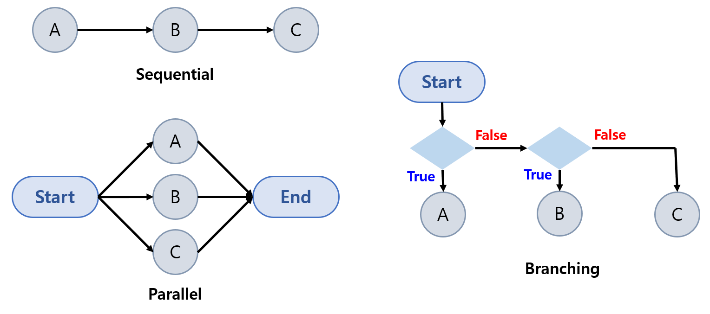

## 목차

* 목차
  * [1. 멀티 체인의 유형](#1-멀티-체인의-유형)
  * [2. 각 유형 별 멀티 체인 실습](#2-각-유형-별-멀티-체인-실습)
    * [2-1. 순차적 체인 (Sequential)](#2-1-순차적-체인-sequential)
    * [2-2. 병렬 체인 (Parellel)](#2-2-병렬-체인-parellel)
    * [2-3. 조건부 분기 (Branching)](#2-3-조건부-분기-branching)
* ipynb 실습 파일
  * TBU

## 1. 멀티 체인의 유형

LangChain에서의 '멀티 체인'의 유형은 다음과 같다.

| 멀티 체인 유형            | 설명                      |
|---------------------|-------------------------|
| 순차적 체인 (Sequential) | 각 프로세스를 **순차적으로** 실행    |
| 병렬 체인 (Parallel)    | 각 프로세스를 **병렬적으로** 실행    |
| 조건부 분기 (Branching)  | **조건에 따라** 정해진 프로세스를 수행 |



## 2. 각 유형 별 멀티 체인 실습

각 체인 유형별 코드 형식은 다음과 같다.

| 멀티 체인 유형            | 코드 형식                                    |
|---------------------|------------------------------------------|
| 순차적 체인 (Sequential) | ```chain = A \| B \| C```                |
| 병렬 체인 (Parallel)    | ```chain = RunnableParallel(a=A, b=B)``` |
| 조건부 분기 (Branching)  | ```chain = RunnableBranch(...)```        |

### 2-1. 순차적 체인 (Sequential)

### 2-2. 병렬 체인 (Parellel)

### 2-3. 조건부 분기 (Branching)