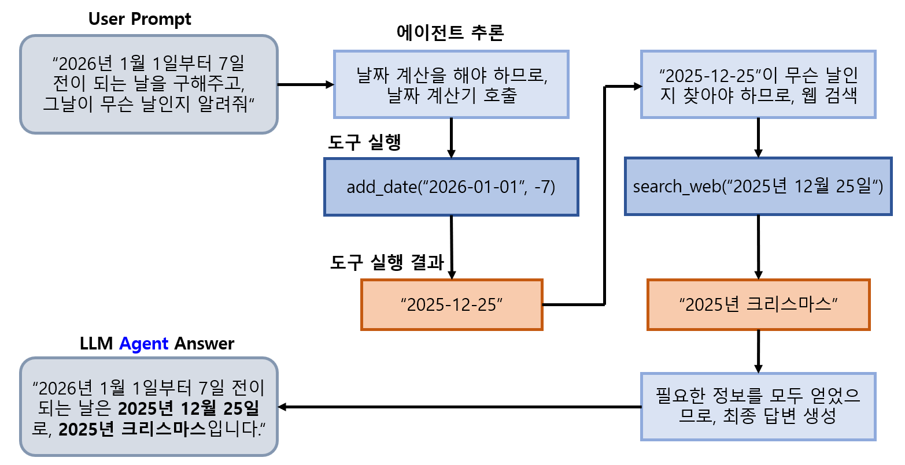

## 목차

* 목차
  * [1. LangChain 의 Agent 개요](#1-langchain-의-agent-개요)
  * [2. Agent 기본 생성 및 실행 방법](#2-agent-기본-생성-및-실행-방법)
  * [3. Agent 의 구성 요소](#3-agent-의-구성-요소)
    * [3-1. LLM (언어 모델)](#3-1-llm-언어-모델)
    * [3-2. Tool (도구)](#3-2-tool-도구)
    * [3-3. 시스템 프롬프트](#3-3-시스템-프롬프트)
  * [4. 에이전트 실행 방법 상세](#4-에이전트-실행-방법-상세)

## 1. LangChain 의 Agent 개요

**Agent (에이전트)** 는 거대 언어 모델 (LLM) 과 도구 (tools) 가 결합된 시스템이다.

* LLM 자체와 다른, Agent만의 특징은 다음과 같다.
  * 사용자 질문 분석을 통해, **어떤 도구를 사용할지 자율적으로 결정**
  * 도구 실행을 통해 얻은 결과를 바탕으로 **추가 작업 수행 여부 판단**



## 2. Agent 기본 생성 및 실행 방법

* LLM Agent 기본 생성 방법

```python
from langchain.agents import create_agent

# create agent
llm = ChatOpenAI(model='gpt-4o-mini')

agent = create_agent(
    model=llm,
    tools=[],
    system_prompt="당신은 고등학교 수학 교사입니다."
)
```

* LLM Agent 기본 실행 방법

```python
# execute agent

result = agent.invoke({
    "messages": [{"role": "user", "content": "벡터의 내적에 대해 설명해줘"}]
})
result['messages'][-1].content
```

* 실행 결과

```
벡터의 내적(또는 점곱, 스칼라 곱)은 두 벡터 사이의 연산으로, 그 결과는 스칼라(하나의 숫자)입니다. 내적은 주로 두 벡터의 유사성이나 방향을 비교하는 데 사용됩니다. 

두 벡터 \( \mathbf{a} = (a_1, a_2, ..., a_n) \)와 \( \mathbf{b} = (b_1, b_2, ..., b_n) \)의 내적은 다음과 같이 정의됩니다:

\[
\mathbf{a} \cdot \mathbf{b} = a_1 b_1 + a_2 b_2 + \ldots + a_n b_n
\]

즉, 각 벡터의 대응하는 성분을 곱한 후, 그 결과를 모두 더하는 방식입니다.

### 기하학적 의미
내적은 또한 두 벡터의 각도와 관련이 있습니다. 두 벡터 \( \mathbf{a} \)와 \( \mathbf{b} \)의 내적은 다음과 같은 공식으로도 표현할 수 있습니다:

\[
\mathbf{a} \cdot \mathbf{b} = \|\mathbf{a}\| \|\mathbf{b}\| \cos(\theta)
\]

여기서 \( \|\mathbf{a}\| \)와 \( \|\mathbf{b}\| \)는 각각 벡터 \( \mathbf{a} \)와 \( \mathbf{b} \)의 크기(길이)이고, \( \theta \)는 두 벡터 사이의 각도입니다. 이 식에서 알 수 있듯이, 두 벡터가 서로 수직일 경우(즉, \( \theta = 90^\circ \)), 내적은 0이 됩니다.

### 내적의 성질
1. **교환법칙**: \( \mathbf{a} \cdot \mathbf{b} = \mathbf{b} \cdot \mathbf{a} \)
2. **결합법칙**: \( \mathbf{a} \cdot (\mathbf{b} + \mathbf{c}) = \mathbf{a} \cdot \mathbf{b} + \mathbf{a} \cdot \mathbf{c} \)
3. **배분법칙**: \( k(\mathbf{a} \cdot \mathbf{b}) = (k\mathbf{a}) \cdot \mathbf{b} \) (여기서 \( k \)는 스칼라입니다)
4. **양의 정의**: \( \mathbf{a} \cdot \mathbf{a} \geq 0 \)이며, \( \mathbf{a} \cdot \mathbf{a} = 0 \)일 때 \( \mathbf{a} \)는 영벡터입니다.

벡터 내적은 물리학, 컴퓨터 그래픽스, 기계 학습 등 다양한 분야에서 중요한 역할을 합니다. 이 개념을 잘 이해하면 벡터 간의 관계를 분석하는 데 많은 도움이 됩니다.
```

## 3. Agent 의 구성 요소

Agent의 구성 요소는 다음과 같다.

| 구성 요소       | 설명                                                           |
|-------------|--------------------------------------------------------------|
| LLM (언어 모델) | Agent의 **핵심적인 두뇌 역할 (AI 역할)**                                |
| Tool (도구)   | Agent가 **실제 작업 (인터넷 검색, 코드 실행, DB 쿼리 등)** 을 할 수 있게 하는 기능 제공자 |
| 시스템 프롬프트    | Agent의 **역할 및 작동 방식에 대한 지침**                                 |

### 3-1. LLM (언어 모델)

**LLM (언어 모델)** 은 LLM Agent의 두뇌, 즉 AI 역할이다.

* 모델 설정 방법

| 모델 설정 방법 | 설명                                               |
|----------|--------------------------------------------------|
| 정적 모델 설정 | LLM Agent 생성 시 **모델을 고정적으로 지정 (예: GPT-4o-mini)** |
| 동적 모델 선택 | 상태, Context 등을 고려하여 **동적으로 모델 선택**               |

* 동적 모델 선택 방법
  * 모델을 동적으로 선택하는 함수에서는 ```@wrap_model_call``` 미들웨어를 사용
  * **API 토큰 비용 최적화** 등에 활용 가능
    * 간단한 질문: ```gpt-4o-mini``` (API 비용이 저렴한 저성능 모델)
    * 복잡한 질문: ```gpt-4o``` (고성능 모델)

### 3-2. Tool (도구)

**Tool (도구)** 은 Agent가 실제로 작업을 수행할 수 있게 하는 기능을 지원한다.

* Tool을 이용한 작업 예시
  * 웹 검색 또는 DB로부터 쿼리 호출
  * 코드 실행, 수학 계산
  * 외부 API 호출
* Agent 가 Tool을 호출하는 메커니즘
  * 여러 도구의 **순차적** 호출하여, 이전 도구 출력을 다음 도구 입력으로 사용
  * **독립적으로 실행 가능** 한 도구들을 **병렬적** 호출
  * 도구 실행 결과값을 **상태에 저장** 하여, 향후 활용 가능하게 함

### 3-3. 시스템 프롬프트

**시스템 프롬프트 (System Prompt)** 는 Agent의 역할 및 Agent의 작동 방식에 대한 지침을 텍스트로 나타낸 것이다.

* 시스템 프롬프트 작성 팁
  * Agent의 **역할에 대한 명확한 기술**
  * **작업 방식** 및 **제약 조건 (지켜야 할 형식, 하지 말아야 할 것 등)** 안내

## 4. 에이전트 실행 방법 상세

