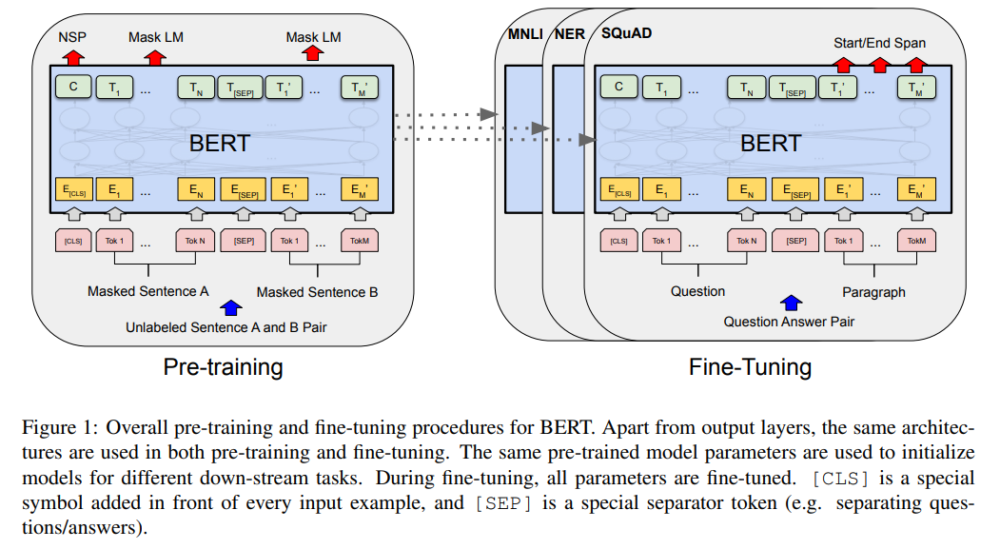
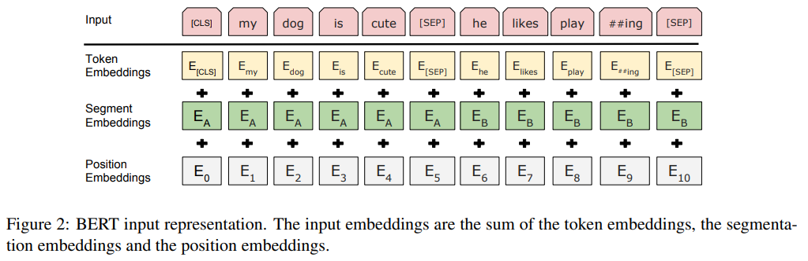
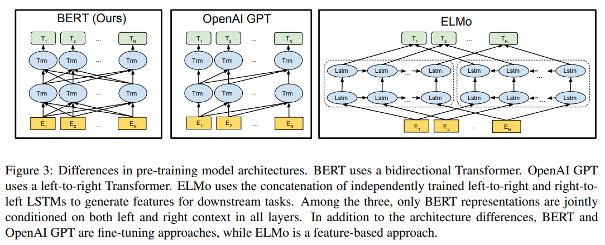

# 자연어 처리 (NLP) 기초 - BERT, SBERT (Sentence BERT) 모델

## BERT 모델이란?
[BERT 논문](https://arxiv.org/pdf/1810.04805.pdf)

**BERT (Bidirectional Encoder Representations from Transformers)** 는 Google AI의 언어 모델 연구진이 개발하여 2018년에 공개한 NLP 모델이다.

left-to-right의 단방향으로 학습하는 일반적인 언어 모델과 달리, BERT에서는 **MLM (Masked Language Model)** objective를 이용하여 딥러닝을 이용한 양방향의 transformer를 pre-train할 수 있다.



(출처: Jacob Devlin, Ming-Wei Chang et al, BERT: Pre-training of Deep Bidirectional Transformers for Language Understanding)

BERT 모델의 학습은 Pre-training과 Fine-tuning의 2가지 단계이다.

위 그림은 BERT 모델의 Pre-training과 Fine-tuning의 **질문과 대답** 에 대한 학습을 나타낸 것이다.
* [CLS] 는 모든 입력 데이터의 앞에 붙는 특별한 symbol이고, [SEP] 는 특별한 separator 토큰이다.
* 각 Masked Sentence 입력들은 Pre-training, Fine-tuning 과정에서 모두 임베딩된다.
* 입력값은 각 Masked Sentence를 구성하는 각각의 token이고, 출력값 $T_i$는 $i$번째 입력 토큰에 대한 final hidden vector이다.



(출처: Jacob Devlin, Ming-Wei Chang et al, BERT: Pre-training of Deep Bidirectional Transformers for Language Understanding)

위 그림은 BERT 모델의 입력에 대한 Token, Segment, Position 임베딩을 나타낸 것이다. input embedding의 값은 다음의 3가지를 합한 값이다.
* token embedding
* segmentation embedding
* position embedding

논문에서 제안한 BERT의 모델 구조는 **L** = (Layer 개수), **H** = (hidden size), **A** = (self-attention head의 개수) 라고 할 때 다음의 2가지이다.
* $BERT_{BASE}$ (L=12, H=768, A=12, params=110M)
* $BERT_{LARGE}$ (L=24, H=1024, A=16, params=340M)

### BERT와 OpenAI의 GPT의 차이


(출처: Jacob Devlin, Ming-Wei Chang et al, BERT: Pre-training of Deep Bidirectional Transformers for Language Understanding)

BERT와 OpenAI의 GPT, 그리고 ELMo의 주요한 차이점은 다음과 같다.
* BERT : 양방향 transformer를 사용한다.
* GPT : 단방향 (left-to-right) transformer를 사용한다.
* ELMo : 각각 개별적으로 학습된 left-to-right LSTM과 right-to-left LSTM을 이용한다.

## SBERT 모델
BERT도 문장을 임베딩을 할 수 있지만, **S-BERT (Sentence-BERT)** 는 BERT의 이 문장 임베딩 성능을 개선한 것이다.
* BERT의 문장 임베딩을 응용하여 BERT를 fine tuning한다.

S-BERT의 학습 방법은 다음과 같다.
* 1. 문장 ```s1```과 ```s2```의 문장 쌍이 주어진다.
* 2. 임베딩 벡터를 준비한다.
  * **문장 쌍을 분류** 하는 문제의 경우, ```s1```에 대한 임베딩 벡터, ```s2```에 대한 임베딩 벡터, 그리고 그 임베딩 벡터의 차이를 나타내는 벡터의, 총 3개의 벡터를 준비한다.
  * **문장 쌍에 대한 회귀** 문제의 경우, ```s1```, ```s2``` 각각에 대한 임베딩 벡터를 준비한다.
* 3. 준비한 벡터의 코사인 유사도를 구하거나 ( **문장 쌍 분류** 문제의 경우 ) concatenate한다. ( **문장 쌍 회귀** 문제의 경우 )
  