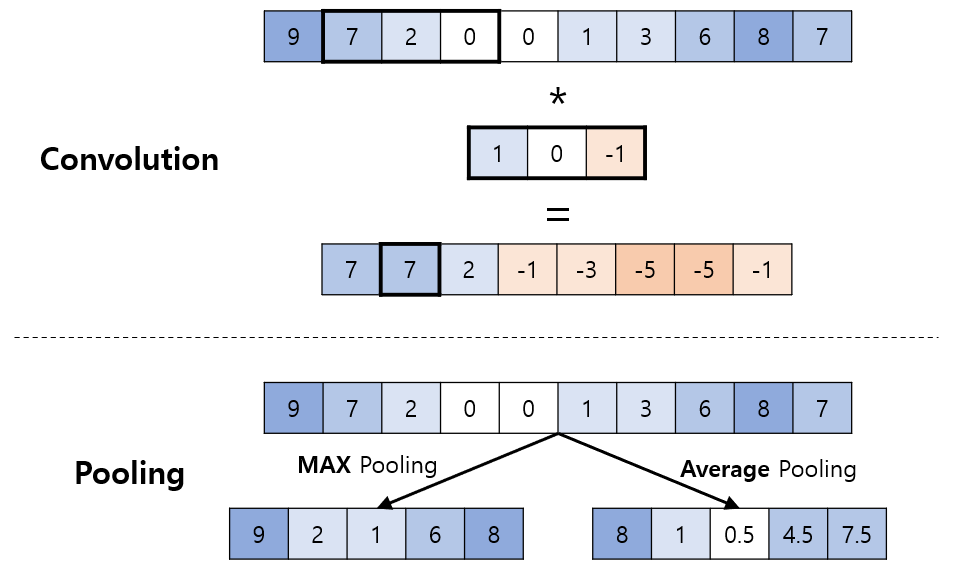
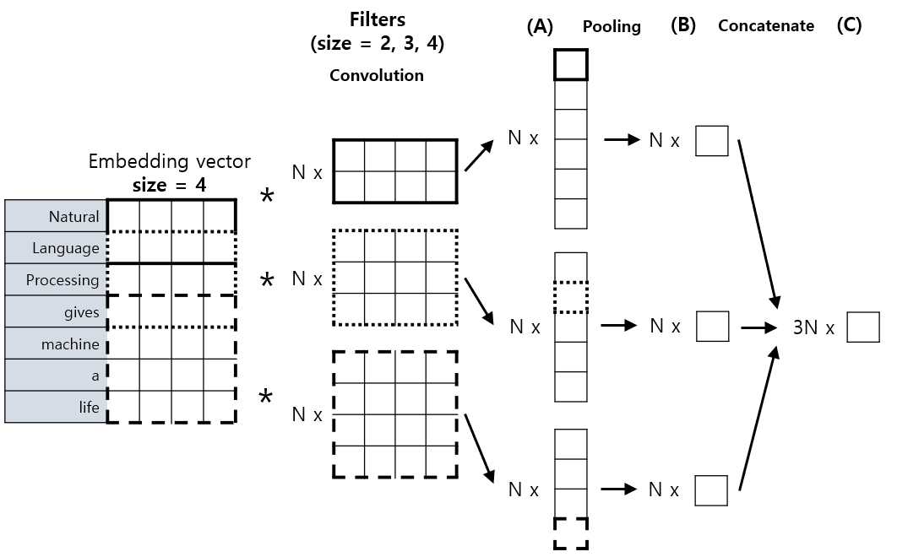

# 자연어 처리 (NLP) 기초 - CNN (Conv. Neural Network) 을 이용한 NLP

## 1차원 CNN
CNN (Convolutional Neural Network) 을 이용하여 NLP (자연어 처리) 문제를 해결하기 위해서는, **1차원 CNN** 을 이용해야 한다.
* 자연어 문장은 일종의 1차원 시계열 구조이고, 따라서 RNN 및 LSTM을 이용할 수도 있지만, 1차원 CNN을 이용할 수도 있다.
* [CNN 기초](https://github.com/WannaBeSuperteur/AI-study/blob/main/Image%20Processing/Basics_CNN.md) 에서 이미지가 기존의 2차원 대신 1차원이라고 생각하면 된다.

1차원 CNN의 Convolution과 Pooling은 각각 다음과 같다.

## 1차원 CNN을 이용한 NLP

1차원 CNN을 이용하여 NLP 문제를 해결하려면, **Convolution을 위한 필터의 크기를 다양하게 하고,** 이렇게 만들어진 크기가 다양한 필터들을 이용할 수 있다. 그 방법은 다음과 같다.
* 먼저 크기가 다양한 필터들을 이용하여 각각 Convolution 을 적용한 결과물 **(A)** 을 얻는다.
* 이 결과물들을 Pooling 한다. (Max Pooling을 이용할 수 있다.) Pooling 한 결과물은 단일 스칼라 값 **(B)** 이다.
* 이 스칼라 값들을 concatenate 하여 벡터 **(C)** 로 만든다.
* 마지막으로 이 벡터를 Fully Connected 부분의 Dense Layer와 연결하여 최종 출력값을 도출한다.

아래는 이것을 나타낸 그림이다. 여기서는 필터 크기를 각각 2, 3, 4로 했고, "Natural Language Proessing gives machine a life." 라는 문장의 길이는 7개의 토큰, 각 단어를 임베딩한 벡터의 크기는 모두 4이다. 또한 여기서는 Pooling 방법으로 Max Pooling을 적용한다.

