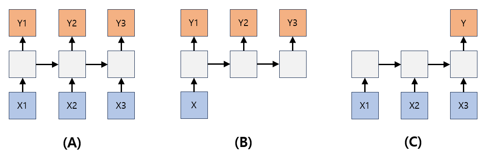

# 자연어 처리 (NLP) 기초 - RNN과 LSTM, GRU

## RNN이란?
**RNN (Recurrent Neural Network)** 은 일반적인 입력층 -> 은닉층 -> 출력층 구조의 딥러닝 신경망과 약간 다르게, 다음과 같은 형태의 구조를 하고 있는 신경망이다.
* 즉, 은닉층의 출력값이 출력층으로도 이동하지만, 동시에 다음 은닉층으로도 이동한다.


위 그림에서 ```X1, X2, X3, ..., Xt```는 입력층, ```Y1, Y2, Y3, ..., Yt```는 출력층, 나머지는 은닉층을 나타낸다.

### RNN의 형태 및 용도
RNN은 그 형태에 따라 다양한 용도로 사용할 수 있다. NLP 외에도 **시계열 데이터 분석** 등을 위해 사용될 수 있다.



위 그림과 같이 RNN은 입력값 중 일부가 존재하지 않을 수 있고, 출력값 중 일부가 존재하지 않을 수 있는 등 다양한 형태를 정의할 수 있다. 각 형태별로 다음과 같이 부른다.

* **(A) : many-to-many** 입력값 여러 개와 이에 대응되는 출력값 여러 개로 구성되어 있다. 챗봇 및 번역 등에서 활용한다.
* **(B) : one-to-many** 입력값 1개와 이에 대응되는 출력값 여러 개로 구성되어 있다. 이미지를 인식하고 적절한 제목이나 글을 작성하는 이미지 캡셔닝 등에 사용된다.
* **(C) : many-to-one** 입력값 여러 개와 이에 대응되는 출력값 1개로 구성되어 있다. 글을 읽고 느껴지는 감정을 분류하는 문제, 메일이 정상 메일인지 스팸인지를 판단하는 문제 해결에 사용된다.

## LSTM
**LSTM (Long Short Term Memory)** 는 RNN의 문제점 중 **출력값과 멀리 떨어져 있는 정보를 기억하지 못한다** 는 단점을 보완하기 위해 설계된 다음과 같은 구조이다. (왼쪽은 RNN, 오른쪽이 LSTM)


여기서 ```s```는 sigmoid 활성화 함수를 나타내며, 출력값의 범위는 0에서 1까지이다.

LSTM에는 Cell State, Forget Gate, Input Gate, Output Gate라는 구조가 존재한다. 각 구조에 해당하는 부분은 다음과 같다.


**Cell State** : cell 정보를 다음 cell로 전달한다.
* Forget Gate에서 정한 잊어버릴 정보와 Input Gate에서 정한 업데이트할 정보에 의해 업데이트된다.

각 Gate는 다음과 같다.
* **Forget Gate** : 입력값과 직전 은닉층의 출력값에 따라, cell state의 정보 중에서 어떤 것을 **잊어버릴** 것인지 정한다.
* **Input Gate** : 입력값과 직전 은닉층의 출력값 중 어떤 것을 cell state에 **저장할지** 정한다.
* **Output Gate** : 입력값과 직전 은닉층의 출력값에 따라, cell state의 정보 중에서 어떤 것을 **출력할지** 정한다.

어떤 것을 잊어버리고 기억할지 정하는 과정을 통해 RNN의 단점을 극복한다.

## GRU
**GRU (Gated Recurrent Unit)** 는 LSTM의 간소화된 버전이라고 할 수 있다.

GRU의 구조는 다음 그림과 같다. (왼쪽은 RNN, 오른쪽이 GRU)


여기서 ```s```는 sigmoid 활성화 함수를 나타내며, 출력값의 범위는 0에서 1까지이다.


GRU에서의 각 변수의 값을 계산하는 과정 및 수식은 위 그림과 같다.

GRU의 특징은 다음과 같다.
* LSTM의 복잡한 구조를 비교적 단순화시켰다.
* LSTM의 **장기 의존성 문제 (the problems of long-term dependencies)** 는 은닉층 초반의 정보가 마지막까지 전달되지 못하는 문제인데, 이것을 해결한다.
* LSTM과 우열을 가리기 힘든 정도의 성능이지만, 데이터 양이 적을수록 GRU가, 많을수록 LSTM이 좋다는 이야기가 있다.