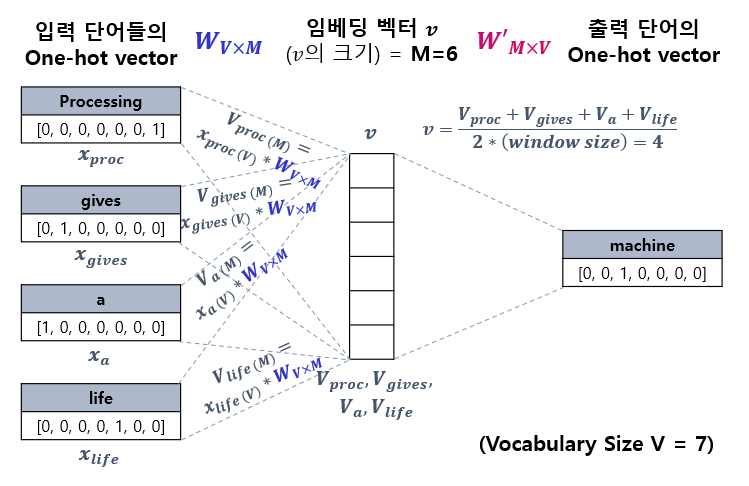
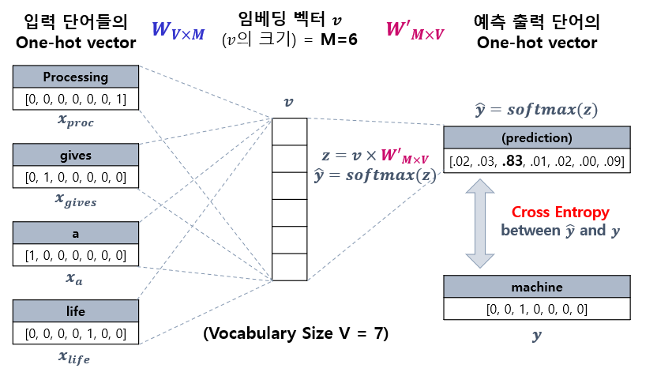
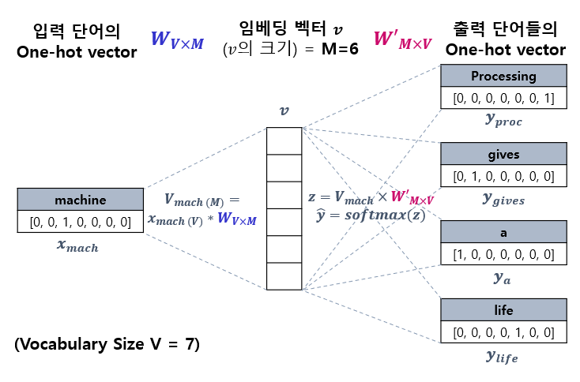
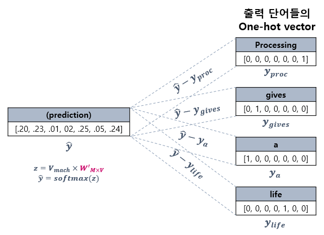

# 자연어 처리 (NLP) 기초 - Word2Vec 모델

## Word2Vec 모델이란?
**Word2Vec (Word to Vector)** 는 Word Embedding (워드 임베딩)의 한 가지 방법으로, one-hot encoding을 일정 부분 이용하면서도 단어 간 의미의 유사도를 나타낼 수 있도록 단어를 벡터화한다.

Word2Vec의 핵심 아이디어는 **비슷한 문맥에서 등장하는 단어들은 비슷한 의미를 갖는다** 는 것이다.
* 예를 들어 ```고양이```는 ```귀엽다```, ```먹이```와 같은 단어의 주변에 등장할 수 있다. 이 내용의 텍스트를 벡터화하면 이 단어들은 의미적으로 가까운 위치에 놓인다.

Word2Vec의 특징은 **단어의 의미를 벡터로 연산** 할 수 있다는 것인데, 이는 각 단어를 나타내는 **단어 벡터가 의미의 유사성을 반영** 하기 때문이다. 대표적인 예는 다음과 같다.
* ```king을 나타내는 벡터``` - ```man을 나타내는 벡터``` + ```woman을 나타내는 벡터``` = ```queen을 나타내는 벡터```

## CBOW와 Skip-gram
Word2Vec의 학습 방식은 CBOW와 Skip-gram의 2가지이다.

Word2Vec에서는 **window size** 라는 것을 정의하는데, 이것은 중앙의 단어를 기준으로 주변 몇 개의 단어들을 학습에 이용할 것인지 나타내는 것이다.

예를 들어 ```Natural Language Processing gives machine a life.``` (각 단어는 토큰과 일치, 마침표는 토큰이 아님) 라는 문장에서 ```(window size) = 2``` 인 경우,
* ```Language``` 라는 단어가 중앙일 때는 주변 단어는 ```Natural```, ```Processing```, ```gives``` 이다. ```Language```를 기준으로 왼쪽으로 2칸 떨어진 단어가 없으므로 주변 단어가 총 3개이다.
* ```machine``` 이 중앙일 때 주변 단어는 ```Processing```, ```gives```, ```a```, ```life``` 이다.

여기서 Vocabulary 배열은 ```[a, gives, machine, Langauge, life, Natural, Processing]```의 길이 **V = 7** 인 배열이고, 이 배열에 맞춰서 one-hot encoding을 실시한다.

### CBOW (Continuous Bag of Words)
**CBOW (Continuous Bag of Words)** 는 주변의 단어들을 통해 그 중앙의 단어를 예측하는 방법이다.

예를 들어 ```Natural Language Processing gives machine a life.``` 에서 window size = 2일 때, ```machine```의 주변 단어들을 이용하여 ```machine```을 예측하는 것을 학습하는 방법은 다음 그림과 같다.



* 1. CBOW 신경망의 입력으로 입력 단어 Processing, gives, a, life의 one-hot 벡터 $x_{proc}$, $x_{gives}$, $x_a$, $x_{life}$ (크기는 모두 $V$) 가 입력된다.
* 2. 이들 입력값들과 가중치 행렬 $W$ (크기: $V \times M$) 를 각각 곱하여, 임베딩 벡터 $v$ (크기: $M$) 를 계산하기 위한 벡터 $V_{proc}$, $V_{gives}$, $V_a$, $V_{life}$ (크기는 모두 $M$) 을 계산한다.
* 3. 이들 벡터 $V_{proc}$, $V_{gives}$, $V_a$, $V_{life}$ 를 평균하여 임베딩 벡터 $v$ 를 계산한다.



* 4. 임베딩 벡터 $v$와 또 다른 가중치 행렬 $W'$ (크기: $M \times V$) 를 곱하여 $z$ (크기: $V$) 를 계산하고, 여기에 softmax를 적용하여 예측 출력값 $\hat{y}$ (크기: $V$) 을 계산한다. **이 출력값과 실제 machine을 나타내는 one-hot 벡터 $y$와의 cross entropy를 최소화** 하도록 학습한다.

이렇게 학습시키면 $v$는 다양한 단어를 임베딩할 수 있는 임베딩 벡터가 된다.

### Skip-gram
**Skip-gram** 은 CBOW의 반대 방식으로, 중앙의 단어를 통해 그 주변의 단어들을 예측하는 것이다.

CBOW의 예시를 거꾸로 한 예시를 이용하여, 학습 방법을 소개하면 다음과 같다.



* 1. Skip-gram의 신경망의 입력으로 중심에 있는 단어 machine의 one-hot 벡터 $x_{mach}$ (크기: $V$)가 주어진다.
* 2. CBOW와 유사하게 이 입력값과 가중치 행렬 $W$ (크기: $V \times M$) 를 곱하여 중앙 단어에 대한 임베딩 벡터 $v$ (크기: $M$) 를 계산한다.
* 3. CBOW와 동일하게 임베딩 벡터 $v$와 또 다른 가중치 행렬 $W'$ (크기: $M \times $V) 를 곱하여 $z$ (크기: $V$) 를 계산하고, 여기에 softmax를 적용하여 예측 출력값 $\hat{y}$ (크기: $V$) 을 계산한다.



* 4. 이 예측 출력값 $\hat{y}$ 에서 각 단어를 나타내는 one-hot 벡터 $y_{proc}$, $y_{gives}$, $y_a$, $y_{life}$ 를 뺀 값을 오차로 하여, **이 오차를 최소화** 시키도록 학습한다.