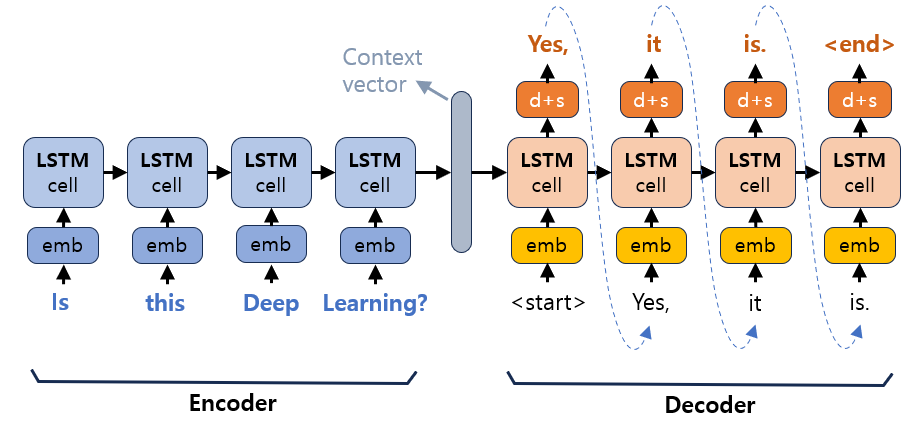
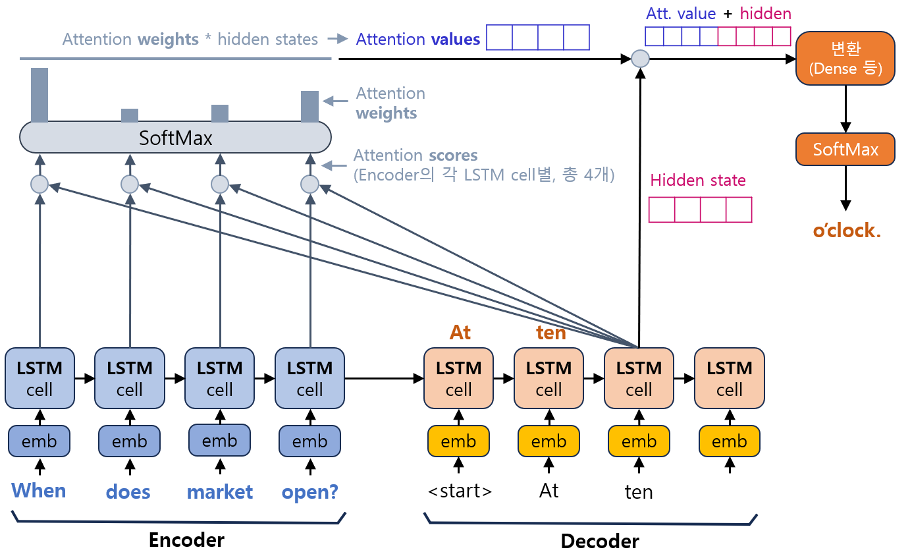

# 자연어 처리 (NLP) 기초 - 어텐션 (Attention) 메커니즘

## 시퀀스-투-시퀀스 (seq2seq) 모델
**Sequence-to-Sequence (seq2seq, 시퀀스-투-시퀀스)** 모델은 챗봇, 머신러닝 번역 등 many-to-many RNN의 응용 가능한 분야에 대해 입력 시퀀스 (문장) 으로부터 다른 시퀀스 (문장) 를 출력하기 위한 NLP 모델이다.

seq2seq 모델은 다음 그림과 같이 Encoder와 Decoder, 그리고 Context vector로 구성되어 있다.



(```emb``` : embedding, ```d+s``` : dense + softmax)

* 1. Encoder 부분에 입력값이 단어 단위로 순차적으로 임베딩되어 입력되고, LSTM cell들로 전달된다.
* 2. 입력값들이 LSTM을 거쳐 context vector라는 이름의 벡터 (입력 문장의 모든 단어에 대한 정보를 압축한 벡터) 로 벡터화된다.
* 3. context vector는 Decoder 부분에 있는 첫번째 LSTM cell로 전달되며, 이 첫번째 LSTM cell은 context vector와 문장의 시작 토큰 ```<start>```를 입력받아서 다음에 등장 확률이 가장 높은 단어를 출력한다.
* 4. 3번의 출력값은 다음 LSTM cell의 입력값으로 들어온다. 이 LSTM cell은 직전 LSTM cell의 정보와 이 입력값을 이용해서 다음에 등장 확률이 가장 높은 단어를 출력한다.
* 5. 이 과정을 문장의 종료 토큰 ```<end>```가 나타날 때까지 반복한다.

## 어텐션 (Attention) 메커니즘이란?
**어텐션 (Attention) 메커니즘** 은 seq2seq 모델의 Decoder에서의 매 시점(step)마다, 입력 문장의 단어들 중에서 **해당 시점에서 예측해야 하는 단어와 관련된 부분** 에 더 집중하는 메커니즘이다.

기존의 seq2seq은 다음과 같은 문제점이 있는데, 이를 해결하기 위한 것이다.
* 고정된 크기의 벡터에 모든 정보를 저장할 때 정보 손실이 발생한다.
* RNN에서 발생하는 vanishing gradient 문제 때문에, 입력 문장이 길면 번역, 챗봇 답변 등 출력값의 품질이 떨어질 수 있다.

Attention의 작동 원리는 다음과 같다.



위 그림은 ```When does market open?``` 이라는 문장이 입력되고, ```At ten o'clock.``` 이라는 문장의 출력을 의도한 경우의 Attention 메커니즘이다. 현재 Decoder에서는 2번째 LSTM cell의 출력으로 ```ten```이 예측되었고, 이것이 3번째 LSTM cell의 예측으로 입력되어, **3번째 cell의 출력을 예측** 하려고 하는 상황이다.

* 1. 먼저 Decoder의 3번째 LSTM cell의 hidden state ($s_t$) 를 Encoder의 각 LSTM cell의 hidden state ($h_i$) 와 연결하여 attention score라는 점수를 계산한다.
* 2. 이 attention score에 Softmax 함수를 적용하여, attention score에 대한 확률분포인 **Attention Distribution (어텐션 분포)** 를 계산한다.
  * 어텐션 분포의 각각의 값은 **Attention Weight (어텐션 가중치)** (막대그래프의 길이에 비례) 라고 한다.
  * 어텐션 가중치 ${\alpha}^t = softmax(e^t)$ 이다.
* 3. Encoder의 각 단어에 대응되는 LSTM cell에 대한 **어텐션 가중치** 와 **hidden state** 의 가중치 합인 **Attention Value (어텐션 값)** 을 구한다.
  * Encoder의 LSTM cell의 hidden state를 $h_1, h_2, ..., h_n$이라고 할 때, 어텐션 값은 $$a_t = \sum_{i=1}^n {{\alpha}_i^t h_i}$$ 이다.
* 4. 어텐션 값과 Decoder의 LSTM cell의 hidden state를 concatenate한다.
* 5. 4번의 결과값을 변환하여 최종적으로 출력값을 예측한다.

## attention score 계산 함수의 종류
attention score를 계산하기 위해서 아래와 같은 다양한 종류의 함수를 사용할 수 있다. 단, 여기서 Decoder의 LSTM cell의 hidden state $s_t$, Encoder의 LSTM cell의 hidden state $h_i$ 이다.
* dot : score($s_t$, $h_i$) = $s_t^T h_i$
* scaled dot : dot을 이용하여 계산한 attention score를 일정 값으로 나눈 것
* general : score($s_t$, $h_i$) = $s_t^T W_a h_i$ ($W_a$ 는 학습 가능한 가중치 행렬)
