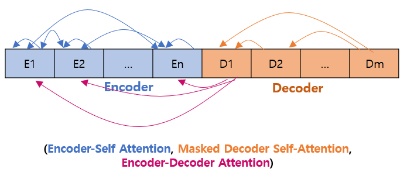
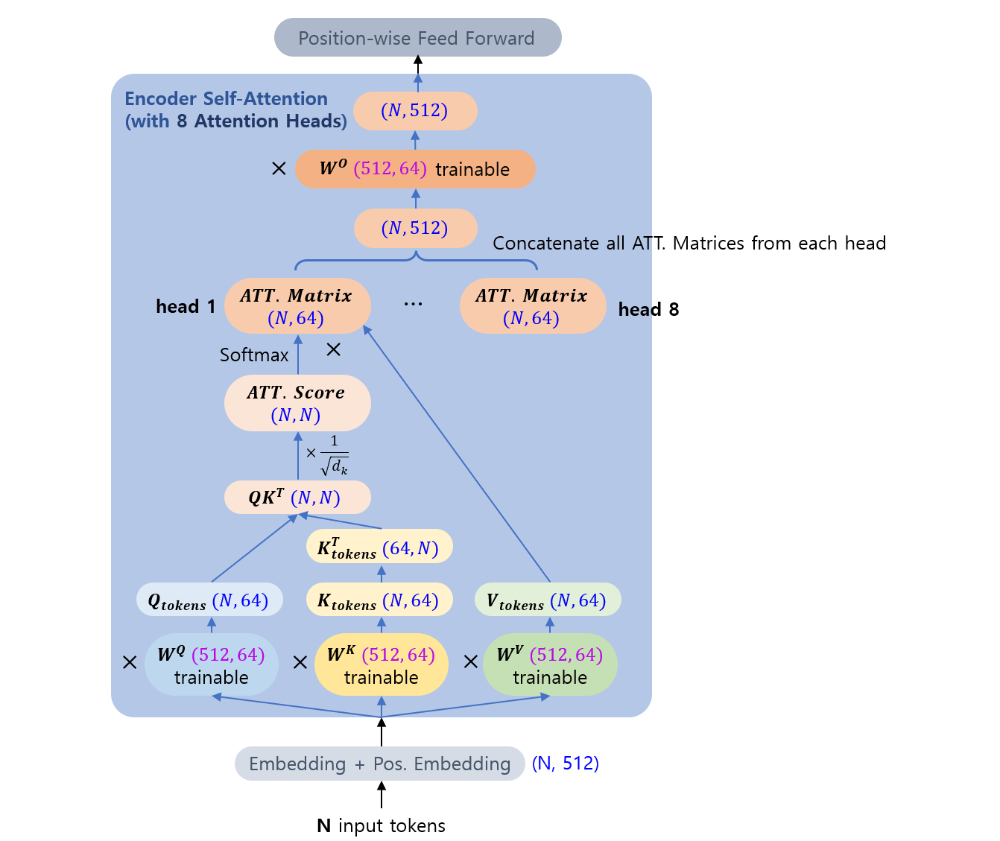

# 자연어 처리 (NLP) 기초 - 트랜스포머 (Transformer) 모델

## 목차

* [1. 트랜스포머 모델](#1-트랜스포머-모델)
* [2. 포지셔널 인코딩 (Positional Encoding)](#2-포지셔널-인코딩-positional-encoding)
* [3. 트랜스포머에서의 어텐션 메커니즘](#3-트랜스포머에서의-어텐션-메커니즘)
  * [3-1. Encoder Self-Attention](#3-1-encoder-self-attention)
  * [3-2. Masked Decoder Self-Attention](#3-2-masked-decoder-self-attention)
  * [3-3. Encoder-Decoder Attention](#3-3-encoder-decoder-attention)
* [4. Position-wise Feed Forward](#4-position-wise-feed-forward)
* [5. GPT (Generative Pre-trained Transformer)](#5-gpt-generative-pre-trained-transformer)
* [6. 탐구 : Transformer 의 Attention 구조에 대한 이유](#6-탐구--transformer-의-attention-구조에-대한-이유)
  * [6-1. Single Head 가 아닌 Multi-Head 인 이유](#6-1-single-head-가-아닌-multi-head-인-이유) 
  * [6-2. Attention Score 계산 시 sqrt(hidden-dims) 로 나누는 이유](#6-2-attention-score-계산-시-sqrthidden-dims-로-나누는-이유) 
  * [6-3. Query, Key, Value 를 각각 사용하는 이유](#6-3-query-key-value-를-각각-사용하는-이유)
  * [6-4. Transformer 구조에서 Batch 보다는 Layer Norm 사용 이유](#6-4-transformer-구조에서-batch-normalization-보다-layer-normalization-을-사용하는-이유)
* [7. Vision 에의 응용 : Vision Transformer (ViT)](#7-vision-에의-응용--vision-transformer-vit)

## 1. 트랜스포머 모델

**트랜스포머 (Transformer)** 는 인코더에서 단어 시퀀스를 입력받고, 디코더에서 출력 단어 시퀀스를 출력하는 형태의 Encoder-Decoder 구조를 유지하면서, **N개의 Encoder와 M개의 Decoder** 를 이용하는 형태의 모델이다.

* 논문 : [Attention is All You Need (2017.06.)](https://arxiv.org/pdf/1706.03762)


조금 더 깊이 들어가 보면 다음과 같은 구조를 가지고 있다.

* **입력, 출력** 문장의 각 token 을 **각각의 Encoder, Decoder** 로 매칭시킨다.
  * 각 입력/출력 token 에 Embedding + Positional Encoding 을 적용한다.
* 세부 동작 방식
  * 입력 문장은 Attention + Position-wise Feed Forward 를 거쳐 다음 Encoder 로 입력된다. 이것이 **입력 문장이 끝날 때까지 반복** 된다.
  * 마지막 Encoder 의 출력은 첫 번째 Decoder 의 Encoder-Decoder Attention 의 입력으로 들어간다.
  * Decoder 역시, N 번째 Decoder 의 출력이 N + 1 번째 Decoder 의 입력으로 들어가는 것이 **출력 문장이 끝날 때까지** 반복된다.


## 2. 포지셔널 인코딩 (Positional Encoding)

RNN에서는 단어를 순서대로 입력받았기 때문에 자연어 처리에 유용했으나, 트랜스포머에서는 그렇지 않기 때문에 (즉, **모든 token 을 한번에 입력** 받기 때문에) **단어의 순서를 따로 표시** 해야 한다. 그 방법이 **포지셔널 인코딩 (Positional Encoding)** 이다.

트랜스포머에서 입력 단어 시퀀스 내에서의 특정 임베딩 벡터의 위치를 $p$, 임베딩 벡터 내에서 특정 차원의 인덱스를 $i$, 임베딩 벡터의 차원을 $d_model$ 이라고 하자. 이때 $i$의 값이 짝수 $2i$인지, 홀수 $2i+1$인지에 따라 포지셔널 인코딩 값 PE가 각각 다음과 같다.

* $PE_{(p, 2i)} = sin((pos/(10000^{2i/{d_{model}}}))$
* $PE_{(p, 2i+1)} = cos((pos/(10000^{2i/{d_{model}}}))$

예를 들어 입력 단어 시퀀스가 20개의 토큰으로 구성되어 있고 ($p=0,1,...,19$), 임베딩 벡터가 32차원일 때 ($d_{model}=32, i=0,1,...,31$), $i$와 $p$의 값에 따른 Positional Encoding 값은 다음과 같다.


Transformer 모델에서는 임베딩 벡터가 입력되기 전에 **Positional Encoding 값을 먼저 더한다.** 예를 들어 다음과 같다.


즉, 단어가 Encoder 또는 Decoder의 hidden layer로 입력되기 전에 먼저 Positional Encoding 값이 더해진다.

## 3. 트랜스포머에서의 어텐션 메커니즘

트랜스포머 모델에서는 다음과 같은 3가지 [어텐션 메커니즘](Basics_어텐션%20(Attention).md) 이 사용된다.

| 어텐션 메커니즘                      | 위치      | 설명                                          |
|-------------------------------|---------|---------------------------------------------|
| Encoder Self-Attention        | Encoder | 입력 시퀀스 내에서 단어 간 관계 고려 (자기 자신을 포함한 모든 단어 고려) |
| Masked Decoder Self-Attention | Decoder | 출력 시퀀스에서 단어 간 관계 고려 (단, 매 순간 이전 단어만 고려)     |
| Encoder-Decoder Attention     | Decoder | 출력 시퀀스에서 입력 시퀀스의 단어를 고려한 Attention          |

각 어텐션을 그림으로 나타내면 다음과 같다.



여기서 ```E1, E2, ..., En```은 각각 Encoder, ```D1, D2, ..., Dm```은 각각 Decoder를 나타낸다.

각 어텐션이 Encoder와 Decoder에서 실시되는 것을 그림으로 나타내면 다음과 같다.


여기서 N 은 Encoder의 개수, M 은 Decoder의 개수를 나타낸다.

### 3-1. Encoder Self-Attention

**(Multi-head) Encoder Self-Attention** 은 **입력 문장의 단어 (token) 간 관계** 를 고려한 Attention 이며, **Encoder** 에 위치한다.

* 이때 **Multi-head Attention** 를 적용하여, 입력 token 을 임베딩한 벡터의 차원을 **여러 개의 head 에 균등하게 분배** 한다.
* 단어 간 관계는 **자기 자신을 포함** 한다.

Self-Attention 의 효과는 다음과 같다.

* **입력 문장 내의 각 token 간 관계** 에 대한 분석
* 이를 통해, 지시대명사가 가리키는 것 등을 AI 모델이 파악할 수 있음
  * 예: ```The animal didn't cross the street because it was too tired.``` 라는 문장에서 ```it``` 이 ```street``` 이 아닌 ```animal``` 을 가리킴을 파악 가능

Encoder Self-Attention 을 수식으로 나타내면 다음과 같다.

* $\displaystyle SelfAttention(Q, K, V) = Softmax(\frac{Q \times K^T}{\sqrt {d_k}}) V$
  * $Q, K, V$ : 각각 Query, Key, Value
  * $d_k$ : 각 token 을 나타내는 Key 벡터의 차원 (Query, Value 벡터와 차원 동일)
* Encoder Self-Attention Matrix 의 shape 는 **(token 개수, $d_k$)** 이다.

----

Encoder Self-Attention 에 대해 보다 깊이 들어가면 다음과 같다.



Attention Head 의 개수가 **8개** (예시) 이고, 문장의 입력 token 이 $N$ 개일 때, 다음과 같이 동작한다.

* 각 단어 벡터가 **512 차원** (예시) 인 Embedding + Pos Embedding 에 가중치 행렬을 곱해서 **$d_k$ = (512 / Head 개수) = 64 차원** 의 Query, Key, Value 행렬을 만든다.
* $N \times N$ 의 $QK^T$ 행렬을 구한다.
* $QK^T$ 행렬을 $d_k$ 의 제곱근으로 나누어 Attention Score 행렬 ($N \times N$) 을 구한다.
* $QK^T$ 행렬에 Value 에 해당하는 행렬 $V$ 를 곱하여 $N \times 64$ 의 Attention Matrix 를 구한다.
* 나머지 7개의 head 에서 계산된 Attention Matrix 들과 concatenate 한다.
* 마지막으로 가중치 행렬 $W_O$ 를 지나고, 이것이 Multi-head Self-Attention 의 최종 출력값이다.

### 3-2. Masked Decoder Self-Attention

**Masked Decoder Self-Attention** 은 **출력 문장의 단어 (token) 간 관계** 를 고려한 Attention 이며, **Encoder** 에 위치한다.

* 단, Encoder Self-Attention 과는 달리 **매 순간 이전에 등장했던 단어들만 고려** 한다. 즉, **Attention Score 를 나타내는 행렬에서 이후의 단어를 masking 처리** 한다.
* 이외의 과정은 앞에서 설명한 Encoder Self-Attention 과 동일하다.


### 3-3. Encoder-Decoder Attention

**Encoder-Decoder Attention** 은 **출력 문장을 생성할 때, 입력 문장의 단어와의 관계를 고려한 Attention** 이다. **Decoder** 에 위치한다.

* Query, Key, Value 는 각각 다음의 Block 의 결과물로부터 얻는다.
  * **Query** 는 **첫 번째 Decoder** 의 결과물로부터 얻음
  * **Key, Value** 는 모두 **마지막 Encoder** 의 결과물로부터 얻음
* 이로 인해 Attention Score Matrix 가 **입력 문장의 token N 개와 출력 문장의 token M 개에 대해 $M \times N$ 의 크기** 로 만들어진다.
* 이외의 사항은 나머지 Encoder Self-Attention, Masked Decoder Self-Attention 과 동일하다.


## 4. Position-wise Feed Forward

Encoder와 Decoder 의 Attention Layer 이후에 있는 **Position-wise Feed Forward** 는 **Fully-Connected Neural Network (FFNN)** 라고 할 수 있다.

* Position-wise Feed-Forward 는 다음과 같은 구조를 갖는다.


## 5. GPT (Generative Pre-trained Transformer)

**GPT (Generative Pre-trained Transformer)** 는 OpenAI의 Large Language Model (거대 언어 모델)로, 그대로 풀어 쓰면 **사전 학습된 생성형 트랜스포머** 이다.
* 생성 (Generative) 은 생성형 AI 기술을 적용하여 답변을 생성한다는 의미이다.
* 사전 학습 (Pre-trained) 는 사전 학습된 언어 모델을 사용한다는 의미이다.

GPT의 역사는 다음과 같다.
* OpenAI의 첫 LLM인 GPT-1이 2018년 6월 출시되었다.
* GPT-2가 2019년 2월 출시되었다. 단문의 경우 인간이 쓴 글과 구별할 수 없을 정도의 글을 쓸 수 있다.
* GPT-3가 2020년 6월 출시되었다.
* GPT-3.5가 2022년 11월 출시되었다.
* GPT-4가 2023년 3월 14일 출시되었다.

2022년 11월 30일, GPT의 응용으로 전 세계 AI의 역사에 한 획을 그은 **ChatGPT** 가 등장했으며, 2023년 3월 GPT-4가 적용되었다. (GPT-4 API는 2023년 7월부터 일반인이 사용 가능하다.)

## 6. 탐구 : Transformer 의 Attention 구조에 대한 이유

여기서는 [Transformer 의 Attention 메커니즘 구조](#3-트랜스포머에서의-어텐션-메커니즘) 에 대해, 다음과 같이 **그 구조에 대한 이유** 를 탐구한다.

* Single Head 가 아닌 **Multi-Head** 를 사용하는 이유
* Attention Score 계산 시, **$Softmax(QK^T)$ 값을 hidden dimension 인 $\sqrt{d_k}$ 로 나누는** 이유
* **Query, Key, Value 를 각각** 사용하는 이유
  * QKV 가 아닌 Query-Query-Query (QQQ), Value-Value-Value (VVV) 가 아닌 이유

### 6-1. Single Head 가 아닌 Multi-Head 인 이유

```
3.2.2 Multi-Head Attention

Instead of performing a single attention function with dmodel-dimensional keys, values and queries,
we found it beneficial to linearly project the queries, keys and values h times with different,
learned linear projections to dk, dk and dv dimensions, respectively.

...

Multi-head attention allows the model to jointly attend to information from different representation
subspaces at different positions. With a single attention head, averaging inhibits this.
```

[(출처)](https://arxiv.org/pdf/1706.03762) : Ashish Vaswani and Noam Shazeer et al., "Attention Is All You Need" (2017)

* 즉, LLM 이 문장에 나타난 정보들을 **서로 다른 위치의 서로 다른 표현 공간에서 해석** 할 수 있게 한다.
  * 이는 **여러 부분에서 문장을 해석하여, 그 정보들을 상호 보완적으로 이용** 하기 때문이다. 
* 이를 통해 성능을 향상시킨다.

### 6-2. Attention Score 계산 시 sqrt(hidden-dims) 로 나누는 이유

```
3.2.1 Scaled Dot-Product Attention

While for small values of dk the two mechanisms perform similarly, additive attention outperforms
dot product attention without scaling for larger values of dk. We suspect that for large values of dk,
the dot products grow large in magnitude, pushing the softmax function into regions where it has
extremely small gradients. To counteract this effect, we scale the dot products by √1/dk.
```

[(출처)](https://arxiv.org/pdf/1706.03762) : Ashish Vaswani and Noam Shazeer et al., "Attention Is All You Need" (2017)

* hidden dimension (차원 개수) 인 $d_k$ 값이 매우 크면 dot product 값인 **$QK^T$ 가 매우 커진다.**
* 이로 인해, [Softmax 함수](../AI%20Basics/Deep%20Learning%20Basics/딥러닝_기초_활성화_함수.md#2-5-softmax-함수) 의 특성상 **$Softmax(QK^T)$ 의 gradient 가 매우 작아진다.**
* 이를 방지하기 위해 $QK^T$ 를 $\sqrt{d_k}$ 으로 나누어 주는 것이다.

### 6-3. Query, Key, Value 를 각각 사용하는 이유

* Query, Key, Value 가 각각 존재하는 이유
  * 다음과 같이 **(Decoder 를 통한 token 생성 시, 입력 token 중에서) 특정 단어에 '집중'하기 위한 [Attention 메커니즘](Basics_어텐션%20(Attention).md)** 특성상 서로 다른 3가지 역할을 하는 벡터가 필요하기 때문이다.

| 요소    | 역할 (Decoder 에서의 생성 시 기준)                                        |
|-------|-----------------------------------------------------------------|
| Query | Decoder 를 통해 생성할 token 을 나타내는 벡터                                |
| Key   | Encoder 에 있는 각 token 을 나타내는 벡터 (이들 token 중 가장 관련성이 높은 것을 찾아야 함) |
| Value | 각 token 에 대해, 해당 token 의 **다른 모든 token 들과의 관련성** 을 나타내는 벡터      |

* Query-Key-Value 가 아닌 Query-Query-Query (QQQ) 또는 Value-Value-Value (VVV) 는 사용 가능한가?
  * Encoder Self-Attention 에서는 **Query = Key = Value** 이므로 실제로 그렇게 사용하는 셈이다.
    * 이때, Self Attention Matrix (dim: $N \times N$) 에서 주대각선 성분이 가장 크고, **주대각선 이외의 성분 중 큰 값** 을 나타내는 것이 Encoder 의 **각 token 간의 관계 파악** 에 있어서 중요하다.
    * 이때도 학습을 통해서 결국 Query, Key, Value 의 값은 서로 달라진다.
  * 그러나 Encoder-Decoder Attention 에서는 **Query 는 생성할 문장, Key, Value 는 입력 문장** 으로부터 얻으므로 이러한 구조 자체가 불가능하다.

### 6-4. Transformer 구조에서 Batch Normalization 보다 Layer Normalization 을 사용하는 이유

* 트랜스포머 구조에서는 아래 그림과 같이 [Batch Normalization](../AI%20Basics/Deep%20Learning%20Basics/딥러닝_기초_Regularization.md#4-1-batch-normalization) 보다는 **[Layer Normalization](../AI%20Basics/Deep%20Learning%20Basics/딥러닝_기초_Regularization.md#4-2-layer-normalization) 을 사용** 한다. 그 이유는 다음과 같다.


(참고 : [PEFT (Parameter-Efficient Fine-Tuning) of LLM](../AI%20Basics/LLM%20Basics/LLM_기초_Fine_Tuning_PEFT.md))

* Transformer 의 학습 데이터의 길이 (sequence length, token count) 는 **가변적** 인데, 이를 **sequence 길이에 상관없이 평균 및 표준편차를 일관되게 계산하여 정규화** 하기 위해서이다.
* Batch Normalization 의 경우, sequence 의 길이 (token 개수) 에 따라 **평균 및 표준편차의 계산이 일관적이지 않을** 수 있다.

## 7. Vision 에의 응용 : Vision Transformer (ViT)

Transformer 의 구조를 Vision 분야에 응용한 모델로 **Vision Transformer (ViT)** 가 있다. 자세한 것은 [해당 문서](../Image%20Processing/Basics_Vision_Transformer_ViT.md) 참고.