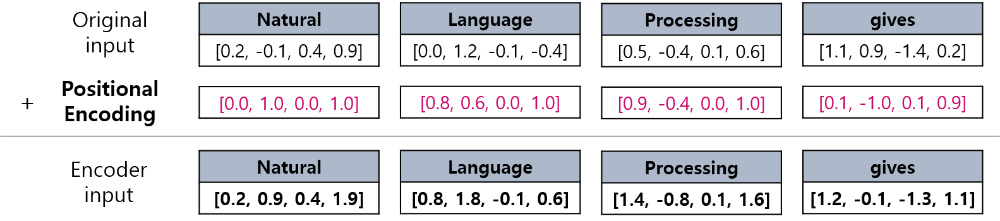

# 자연어 처리 (NLP) 기초 - 트랜스포머 (Transformer) 모델

## 목차

* [1. 트랜스포머 모델](#1-트랜스포머-모델)
* [2. 포지셔널 인코딩 (Positional Encoding)](#2-포지셔널-인코딩-positional-encoding)
* [3. 트랜스포머에서의 어텐션 메커니즘](#3-트랜스포머에서의-어텐션-메커니즘)
  * [3-1. Encoder Self-Attention](#3-1-encoder-self-attention)
  * [3-2. Masked Decoder Self-Attention](#3-2-masked-decoder-self-attention)
  * [3-3. Encoder-Decoder Attention](#3-3-encoder-decoder-attention)
  * [3-4. Position-wise Feed Forward](#3-4-position-wise-feed-forward)
* [4. GPT (Generative Pre-trained Transformer)](#4-gpt-generative-pre-trained-transformer)

## 1. 트랜스포머 모델

**트랜스포머 (Transformer)** 는 인코더에서 단어 시퀀스를 입력받고, 디코더에서 출력 단어 시퀀스를 출력하는 형태의 Encoder-Decoder 구조를 유지하면서, **N개의 Encoder와 M개의 Decoder** 를 이용하는 형태의 모델이다.


조금 더 깊이 들어가 보면 다음과 같은 구조를 가지고 있다.

* **입력, 출력** 문장의 각 token 을 **각각의 Encoder, Decoder** 로 매칭시킨다.
  * 각 입력/출력 token 에 Embedding + Positional Encoding 을 적용한다.
* 세부 동작 방식
  * 입력 문장은 Attention + Position-wise Feed Forward 를 거쳐 다음 Encoder 로 입력된다. 이것이 **입력 문장이 끝날 때까지 반복** 된다.
  * 마지막 Encoder 의 출력은 첫 번째 Decoder 의 Encoder-Decoder Attention 의 입력으로 들어간다.
  * Decoder 역시, N 번째 Decoder 의 출력이 N + 1 번째 Decoder 의 입력으로 들어가는 것이 **출력 문장이 끝날 때까지** 반복된다.


## 2. 포지셔널 인코딩 (Positional Encoding)

RNN에서는 단어를 순서대로 입력받았기 때문에 자연어 처리에 유용했으나, 트랜스포머에서는 그렇지 않기 때문에 (즉, **모든 token 을 한번에 입력** 받기 때문에) **단어의 순서를 따로 표시** 해야 한다. 그 방법이 **포지셔널 인코딩 (Positional Encoding)** 이다.

트랜스포머에서 입력 단어 시퀀스 내에서의 특정 임베딩 벡터의 위치를 $p$, 임베딩 벡터 내에서 특정 차원의 인덱스를 $i$, 임베딩 벡터의 차원을 $d_model$ 이라고 하자. 이때 $i$의 값이 짝수 $2i$인지, 홀수 $2i+1$인지에 따라 포지셔널 인코딩 값 PE가 각각 다음과 같다.

* $PE_{(p, 2i)} = sin((pos/(10000^{2i/{d_{model}}}))$
* $PE_{(p, 2i+1)} = cos((pos/(10000^{2i/{d_{model}}}))$

예를 들어 입력 단어 시퀀스가 20개의 토큰으로 구성되어 있고 ($p=0,1,...,19$), 임베딩 벡터가 32차원일 때 ($d_{model}=32, i=0,1,...,31$), $i$와 $p$의 값에 따른 Positional Encoding 값은 다음과 같다.


Transformer 모델에서는 임베딩 벡터가 입력되기 전에 **Positional Encoding 값을 먼저 더한다.** 예를 들어 다음과 같다.



즉, 단어가 Encoder 또는 Decoder의 hidden layer로 입력되기 전에 먼저 Positional Encoding 값이 더해진다.

## 3. 트랜스포머에서의 어텐션 메커니즘

트랜스포머 모델에서는 다음과 같은 3가지 [어텐션 메커니즘](Basics_어텐션%20(Attention).md) 이 사용된다.

| 어텐션 메커니즘                      | 위치      | 설명                                          |
|-------------------------------|---------|---------------------------------------------|
| Encoder Self-Attention        | Encoder | 입력 시퀀스 내에서 단어 간 관계 고려 (자기 자신을 포함한 모든 단어 고려) |
| Masked Decoder Self-Attention | Decoder | 출력 시퀀스에서 단어 간 관계 고려 (단, 매 순간 이전 단어만 고려)     |
| Encoder-Decoder Attention     | Decoder | 출력 시퀀스에서 입력 시퀀스의 단어를 고려한 Attention          |

각 어텐션을 그림으로 나타내면 다음과 같다.


여기서 ```E1, E2, ..., En```은 각각 Encoder, ```D1, D2, ..., Dm```은 각각 Decoder를 나타낸다.

각 어텐션이 Encoder와 Decoder에서 실시되는 것을 그림으로 나타내면 다음과 같다.


여기서 N은 Encoder와 Decoder의 개수 (서로 같음) 를 나타낸다.

### 3-1. Encoder Self-Attention

### 3-2. Masked Decoder Self-Attention

### 3-3. Encoder-Decoder Attention

### 3-4. Position-wise Feed Forward

## 4. GPT (Generative Pre-trained Transformer)

**GPT (Generative Pre-trained Transformer)** 는 OpenAI의 Large Language Model (거대 언어 모델)로, 그대로 풀어 쓰면 **사전 학습된 생성형 트랜스포머** 이다.
* 생성 (Generative) 은 생성형 AI 기술을 적용하여 답변을 생성한다는 의미이다.
* 사전 학습 (Pre-trained) 는 사전 학습된 언어 모델을 사용한다는 의미이다.

GPT의 역사는 다음과 같다.
* OpenAI의 첫 LLM인 GPT-1이 2018년 6월 출시되었다.
* GPT-2가 2019년 2월 출시되었다. 단문의 경우 인간이 쓴 글과 구별할 수 없을 정도의 글을 쓸 수 있다.
* GPT-3가 2020년 6월 출시되었다.
* GPT-3.5가 2022년 11월 출시되었다.
* GPT-4가 2023년 3월 14일 출시되었다.

2022년 11월 30일, GPT의 응용으로 전 세계 AI의 역사에 한 획을 그은 **ChatGPT** 가 등장했으며, 2023년 3월 GPT-4가 적용되었다. (GPT-4 API는 2023년 7월부터 일반인이 사용 가능하다.)