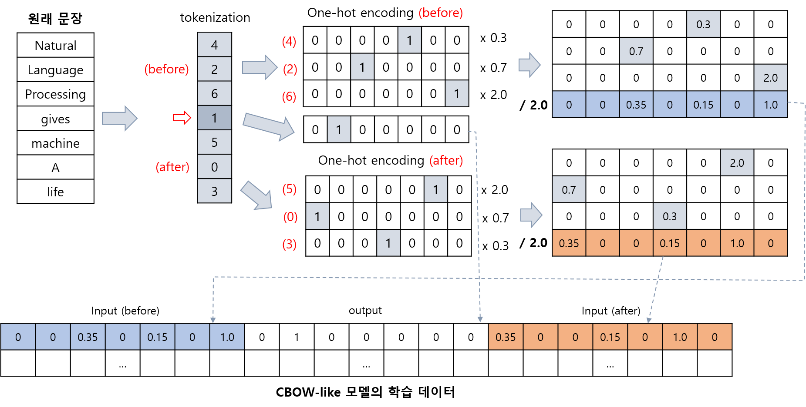

# NLP Project 003. Python 코드 자동 수정
* Dataset: [Python Code Data](https://www.kaggle.com/datasets/veeralakrishna/python-code-data)
  * Python Code를 [Word Embedding의 CBOW](https://github.com/WannaBeSuperteur/AI-study/blob/main/Natural%20Language%20Processing/Basics_Word2Vec%20(CBOW%2C%20Skip-gram).md) 과 유사한 방식으로 학습한 후, 주어진 코드의 빈칸을 채우는 AI를 만든다.
  * 파이썬 코드 전처리 및 tokenize 기준
    * 파이썬 코드에서 각 변수명은 ```var1```, ```var2```, ... 로 대체한다.
    * 파이썬 코드에서 각 함수명은 ```func1```, ```func2```, ... 로 대체한다.
    * 파이썬 코드에서 숫자 값은 ```(n)``` 으로 대체한다.
    * ```''```, ```""``` 안에 들어가는 텍스트는 각각 ```mytxttkn1```, ```mxtxttkn2```, ... 로 대체한다. (서로 같은 텍스트는 동일한 이름으로 처리)
    * 괄호, 연산기호, ```if```, ```and```, 개행, 각 변수명, 각 함수명 등을 모두 token으로 간주한다.
  * AI 실행 과정
    * ```python_code.txt``` 파일의 코드를 tokenize한다.
    * window size (전후 token 개수) 를 일정한 값으로 하여 코드의 처음부터 끝까지 탐색하면서, AI의 판단에 따라 코드를 수정한다.
* 수행 기간: 2024.02.08 ~ 2024.02.14 (7일)

## 파일 및 코드 설명
* ```Python_code_data.txt``` (데이터셋을 다운받아야 함) : 학습 데이터
* ```read_data.py``` : 데이터를 읽는 함수
  * 출력 파일 : ```converted_data.csv``` (데이터 읽기 및 변환 결과)
* ```tokenizer.py``` : 파이썬 코드를 tokenize 하는 것과 관련된 함수 모음
  * 출력 파일 : ```data_preproecssing_result.csv``` (```main.py``` 를 통해 함수 실행 시, 데이터 텍스트 전처리 결과)
  * 출력 파일 : ```data_preproecssing_result_test.csv``` (```tokenizer.py``` 직접 실행 시, 테스트용 데이터 텍스트 전처리 결과)
* ```embedding_cbow.py``` : CBOW 와 유사한 방식으로 word embedding 하는 **임베딩 모델** 관련 함수 모음 (임베딩 모델 저장 포함)
  * 출력 파일 : ```embedding_dataset.csv``` : 임베딩 데이터셋 (CBOW 방식과 유사하게)
    * **임베딩 모델** 의 학습 데이터를 생성하기 위한 데이터
  * 출력 파일 : ```embedding_dataset_for_cbow.csv``` : CBOW 와 유사한 방식으로 모델을 학습시키기 위한, **각 vocab index (단어를 나타내는 one-hot vector의 인덱스) 에 대해 전후 window size 이내의 position 별 one-hot 값을 가중평균한, 크기 ```vocab size```인 배열** (CBOW의 output position을 기준으로 before, after 각각, 총 2개) 을 계산한 후, 해당 2개 배열의 각 원소를 **그 최댓값으로 나눈** 배열을 나타낸 데이터셋
    * **임베딩 모델** 의 학습 데이터로 사용
    * **임베딩 모델** 의 입력 데이터는 후술할 가중평균이며, 출력 데이터는 CBOW의 output position에 해당하는 token의 one-hot 배열 (단, 해당 배열에서 평균값이 가장 큰, 즉 가장 많이 등장하는 토큰에 해당하는 1개의 열의 값을 이용)
    * position에 따른 가중평균 (입력 데이터 차원 = 2 * ```vocab size```) 을 이용하고 최종적으로 그 최댓값으로 나눈다는 점은 CBOW와 다르다.

**임베딩 모델** 의 학습 데이터 생성 방법을 그림으로 나타내면 다음과 같다. 단, 실제 가중치는 아래 그림과 다르며, 실제 구현에서는 **아래 그림의 최종 학습 데이터의 output 중 열의 평균값이 가장 큰 1개의 열만 출력 데이터로 사용** 한다.



* 위 그림에서, 임베딩 모델에 대해 **window size = 3, before = ```[Natural, Language, Processing]```, after = ```[machine, a, life]```** 를 적용
* 위 그림에서, CBOW-like 방법을 적용하기 위한 중심점이 되는, output data로 사용되는 word는 ```gives```

**임베딩 모델을 이용한 word embedding 방법**
* 실제 임베딩 적용 시에는 다음과 순서로 진행한다.
  * 크기 (2 * ```vocab size```) 인 배열을 생성한다.
  * 임베딩하려는 토큰의 tokenizer vocab 상의 index가 i일 때, 그 배열의 ```i```, ```vocab size + i``` 인덱스만 1로 하고 나머지는 모두 0으로 한다.
  * **임베딩 모델** 에 해당 배열을 입력으로 넣는다.
  * embedding layer (크기 : ```16```) 의 출력값이 해당 token의 임베딩 값이다.

* ```generate_dataset.py``` : 원본 코드를 입력, 그 사이에 들어갈 것 (없을 수도 있음) 을 출력으로 하는 **메인 모델** 의 학습 데이터 생성
  * **메인 모델** 관련 정보
    * 입력 : 특정 부분 이전 N개 token + 이후 N개 token (특정 부분의 길이는 0 또는 1 token)
    * 출력 : 해당 특정 부분에 들어갈 token (없음 or 1개)
    * 입출력 데이터는 **```embedding_cbow.py``` 실행 결과로 임베딩된 배열** 형태
    * 원본 데이터셋 (Python Code Data) 의 코드 중 **연속된 (2 * N)개 token** 및 1개 token을 그 사이에 둔 **2개의 "연속된 N tokens"** 를 사용한다.
    * 해당 특정 부분이 변수명, 함수명 또는 텍스트인 경우, 해당 변수명/함수명/텍스트는 그 주변 N개 token 이내에 1번 이상 등장해야 한다.
    * 해당 특정 부분은 숫자 값 (```(n)```) 이 될 수 없다.
* ```main.py``` : 데이터 읽기, 모델 생성 등 전체적인 프로세스 진행
* ```test.py``` : 모델 테스트 (파이썬 코드는 ```python_code.txt``` 파일에 작성)
  * 전처리된 파이썬 코드를 원상복구하는 기능 포함

## 실행 순서
```
python main.py
python test.py
```

## 성능지표 결과
```test.py``` 파일을 실행시켜서 **정성평가** 진행
* ```test.py``` 파일과 같은 디렉토리에 파이썬 코드를 ```python_code.txt``` 파일에 저장한 후 실행
* 사용자가 개별적으로 정성평가 가능하므로, 여기서는 성능지표 결과를 표시하지 않음

## branch info
|branch|status|type|start|end|description|
|---|---|---|---|---|---|
|NLP-P3-master|||240208||마스터 브랜치|
|NLP-P3-1|```done```|```feat```|240209|240209|데이터를 읽는 ```read_data.py``` 코드 작성|
|NLP-P3-2|```done```|```feat```|240209|240209|파이썬 코드 토크나이저 ```tokenizer.py``` 코드 작성|
|NLP-P3-3|```done```|```feat```|240209|240209|토큰화된 파이썬 코드를 CBOW로 임베딩 학습 및 **임베딩 모델** 저장|
|NLP-P3-4|```done```|```fix```|240209|240212|**임베딩 모델** 학습 시 평균으로 수렴하는 이슈 해결|
|NLP-P3-5||```feat```|||**메인 모델** 에 사용되는 학습 데이터 생성|
|NLP-P3-6||```feat```|||**메인 모델** 학습|
|NLP-P3-7||```feat```|||학습한 모델 테스트|