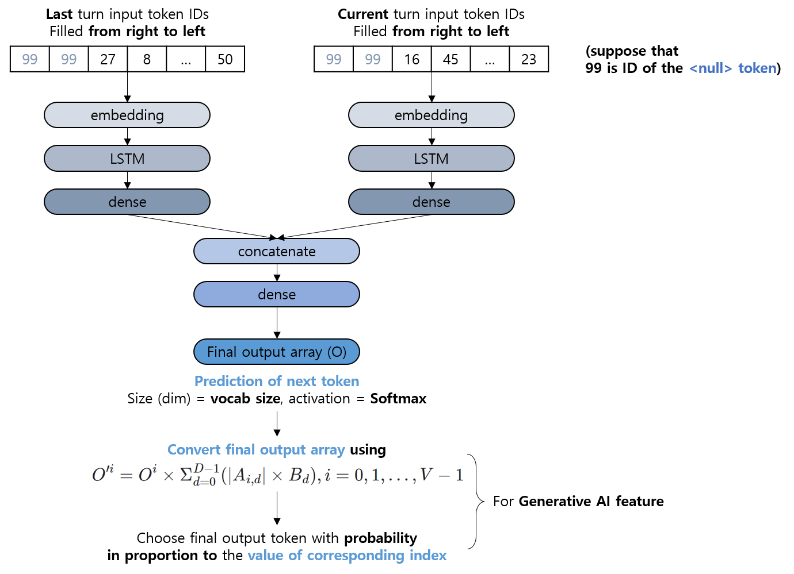

# NLP Project 005. 미니 ChatGPT 만들기 (2)
* Dataset: [Human Conversation training data](https://www.kaggle.com/datasets/projjal1/human-conversation-training-data)
  * Human 1, Human 2 라는 두 사람이 대화를 나누는 것에 대한 학습 데이터이다.
  * 다운로드 버튼을 클릭하여 ```archive.zip``` 파일을 다운받은 후, 그 파일의 압축을 풀어서 나온 ```archive/human_chat.txt``` 파일이 학습 데이터이다.
* 수행 기간: 2024.03.01 ~ 2024.03.03 (3일)
  * 모델 1 (성능 그나마 좋음) : next token에 대한 one-hot 예측 벡터 출력 방식
    * [2024.03.03 17:48 KST commit](https://github.com/WannaBeSuperteur/AI-study/tree/b3d9f22e29ff040cee7db7265726cb77f5297759/Natural%20Language%20Processing/Project%20005.%20%EB%AF%B8%EB%8B%88%20ChatGPT%20%EB%A7%8C%EB%93%A4%EA%B8%B0%20(2))
    * [Download AI-Study Repository at this time (38.4 MB)](https://github.com/WannaBeSuperteur/AI-study/archive/b3d9f22e29ff040cee7db7265726cb77f5297759.zip)
  * 모델 2 (최종 반영) : next token에 대한 embedding을 예측하여 출력 후, vocab에서 가장 가까운 word embedding을 찾는 방식
    * **현재 브랜치에서 사용 가능**

## 파일 및 코드 설명
* ```tokenize_data.py``` : 학습 데이터에 대한 tokenize 진행
* ```generate_data.py``` : 모델 학습에 필요한 입력 데이터 및 출력 데이터로 구성된 데이터셋 **(모델의 학습 데이터)** 생성
  * 출력 파일 : ```train_data.csv``` (학습 데이터)
* ```embedding_helper.py``` : token의 one-hot encoding, dictionary에서의 index 값으로 변환 등 임베딩 관련 함수
* ```add_bert_embedding_dict.py``` : vocab 의 모든 token에 대한 BERT embedding 결과 저장
  * 필요 파일 : ```train_data.csv``` (학습 데이터, vocab 추출용)
  * 출력 파일 : ```bert_embedding_dict.csv``` (**BERT embedding table**, vocab 의 token 별 BERT embedding 결과)
* ```train.py``` : 모델에 대한 학습 실시
  * 필요 파일 : ```train_data.csv``` (학습 데이터), ```bert_embedding_dict.csv``` (**BERT embedding table**, vocab 의 token 별 BERT embedding 결과)
  * 출력 모델 : ```mini_chatgpt_model```  (챗봇용 NLP 모델)
* ```test.py``` : 학습으로 만들어진 **실제 모델** 테스트
  * 필요 파일 : ```bert_embedding_dict.csv``` (**BERT embedding table**, vocab 의 token 별 BERT embedding 결과)
  * 필요 모델 : ```mini_chatgpt_model``` (챗봇용 NLP 모델)
* ```main.py``` : 전처리, 학습 실시, 테스트 실시의 모든 과정을 한번에 진행

## 데이터 전처리 및 생성 과정
* tokenize 방법
  * 문장 부호 및 단어 간 공백 단위로 tokenize
* 데이터 생성 방법
  * 학습 데이터 전체를 처음부터 읽어 나가면서, 다음과 같이 데이터 생성
    * ```Human B```가 말하는 중인 특정 시점에서, 그 직전의 ```Human A``` 의 말에서 **마지막 30개** 의 token을 추출하여 오른쪽부터 배치 + 이후 ```Human B``` 가 현재까지 말한 내용에서 마지막 **30 (학습용) + 1 (예측용) = 31개** 의 token을 추출하여 오른쪽부터 배치
    * token의 개수가 30개 미만인 경우, 앞쪽의 token은 ```<null>``` 이라는 특별한 token 으로 지정
    * 예를 들어, 학습 데이터의 row 중 ```<null> <null> <null> <null> <null> <null> <null> <null> <null> <null> <null> <null> <null> <null> <null> <null> <null> <null> <null> <null> <null> <null> <null> that 's come -ing up soon ! <null> <null> <null> <null> <null> <null> <null> <null> <null> <null> <null> <null> <null> true ! the volunteers have already sent out some emails and collected some funds . now , we``` 를 보면,
      * 앞의 30개 token인 ```<null> <null> <null> <null> <null> <null> <null> <null> <null> <null> <null> <null> <null> <null> <null> <null> <null> <null> <null> <null> <null> <null> <null> that 's come -ing up soon !``` 은 직전 발화자 (A) 의 말
      * 뒤의 30개 token인 ```<null> <null> <null> <null> <null> <null> <null> <null> <null> <null> <null> <null> <null> true ! the volunteers have already sent out some emails and collected some funds . now ,``` 는 현재 발화자 (B) 의 현재까지의 말
      * 마지막 token인 ```we``` 는 현재 발화자 (B) 가 다음으로 말할, 이어지는 토큰
      * 마지막 token이 ```<person-change>``` 인 경우, 해당 턴 종료를 의미
  * 위와 같은 방법으로 구성한 데이터셋에서, 첫 90%는 train data, 마지막 10%는 validation data
    * train, valid 데이터 구분은 데이터를 지정하거나 실제 Tensorflow를 이용하여 학습할 때 split_ratio 등을 이용하여 적용한다.
  * 위 데이터는 ```train_data.csv``` 파일에 저장한다.

## 머신러닝 모델 설명
* 아래 그림은 [2024.03.03 17:48 KST commit](https://github.com/WannaBeSuperteur/AI-study/tree/b3d9f22e29ff040cee7db7265726cb77f5297759/Natural%20Language%20Processing/Project%20005.%20%EB%AF%B8%EB%8B%88%20ChatGPT%20%EB%A7%8C%EB%93%A4%EA%B8%B0%20(2)) 당시 버전의 모델 구조입니다.



* 각 token에 해당하는 word 를 저장하고 one-hot encoding 할 수 있는 **dictionary (=vocab)** 필요
* **모델 설명 (```mini_chatgpt_model```)**
  * ChatGPT와 같은 챗봇에서 답변을 출력하는 것과 같은 역할을 하는 NLP 모델
  * 입력 : 학습 데이터에서, 입력 데이터에 해당하는 30 + 30 = 60개의 token의 ID
  * 출력 : 학습 데이터에서, 출력 데이터에 해당하는 1개의 token에 대해 **BERT 모델** 의 임베딩에 근거한 임베딩 결과 (크기: ```embedding size``` = **128**)
    * BERT embedding의 원래 dimension은 768 이지만, 이 중 **첫 128개의 element** 만을 이용
    * vocab에 있는 각 단어의 **BERT 모델** 에 의한 임베딩 벡터를 저장한 **BERT embedding table** 에서, 출력 벡터와 가장 가까운 임베딩 벡터에 해당하는 token을 최종 출력 
  * **생성형 출력** 을 위한 처리
    * 출력 벡터와 임베딩 벡터 간 Cosine Similarity를 계산할 때, 벡터의 각 (대응되는) 성분별 가중치를 둔다. 
    * 거리가 가장 가까운 토큰이 아닌, 각 임베딩 벡터 별 (=token 별) **```(가중치 적용된 cos similarity 값의 4제곱)``` 의 값이 일정 threshold (예: 0.05) 이상인 모든 token을, 해당 값에 비례하여 확률적으로** 출력
      * 예를 들어, ```(가중치 적용된 cos similarity 값의 4제곱)``` 의 값을 저장한 배열이 [0.02, 0.5, 0.25, 0.03, 0.01, 0.04, 0.15] (vocab size = 7) 이고 해당 threshold가 0.05일 때, 0.5에 해당하는 index의 token을 출력할 확률은 100% 가 아니라 **0.5 / (0.5 + 0.25 + 0.15) = 55.6%**  
  * 모델 구조 :
    * 입력 데이터에서 상대방의 말에 해당하는 마지막 30 token을 **token ID -> token-wise embedding -> LSTM -> Dense -> input-A** 로 구성
    * 입력 데이터에서 현재 말하는 중인 자신의 말에 해당하는 마지막 30 token을 **token ID -> token-wise embedding -> LSTM -> Dense -> input-B** 로 구성
    * 위 **input-A**, **input-B** 에 해당하는 내용에 대해 **("input-A" + "input-B" concatenation) -> Dense Layers -> output** 을 적용
      * output 부분 : ```output (dimension = embedding size = 128)``` : embedding table 기준, 출력 벡터와 가장 가까운 임베딩 벡터에 해당하는 token 출력

## 실행 순서
```
python main.py
python test.py
```

## 성능지표 결과
* 성능 측정지표 : 정성 평가로 진행
  * ```test.py``` 파일 실행 시, 입력 문장을 받은 후, **메인 모델** 이 출력하는 답변을 확인할 수 있음
  * 이때, **메인 모델** 은 다음 token 예측을 ```<Person-Change>``` 토큰이 올 때까지 반복하여, 예측한 token을 모두 연결하여 완전한 문장을 출력하게 한다.
* ```test.py``` 실행 시 vocab에 존재하지 않는 token 처리
  * vocab 내의 모든 token의 BERT Embedding을 사전에 저장한 ```bert_embedding_dict.csv``` 의 데이터를 근거로, 해당 token과 Euclidean Distance가 가장 가까운 vocab 내의 token으로 대체하여 처리
* 현재 **가장 최근의 상대방의 발화 내용에 따라서만** 응답하도록 AI 데이터셋이 설계되었다.

## branch info
|branch|status|type|start|end|description|
|---|---|---|---|---|---|
|NLP-P5-master|||240301|240303|마스터 브랜치|
|NLP-P5-1|```done```|```fix```|240301|240301|tokenizer 개선|
|NLP-P5-2|```done```|```feat```|240301|240301|학습 데이터 생성|
|NLP-P5-3|```done```|```feat```|240301|240301|모델 구성 및 해당 모델의 학습 실시|
|NLP-P5-4|```done```|```feat```|240301|240301|전처리, 학습, 테스트의 모든 과정을 진행하는 ```main.py``` 파일 작성|
|NLP-P5-5|```done```|```fix```|240301|240301|모델 성능 향상을 위한 architecture 수정 (1차)|
|NLP-P5-6|```done```|```feat```|240301|240301|모델 정성평가용으로, 사용자가 입력하면 모델을 통해 답변을 출력하는 부분 작성|
|NLP-P5-7|```ing```|```fix```|240301|240303|모델 성능 향상을 위한 arctitecture, tokenizer 등 수정|
|NLP-P5-8|```done```|```fix```|240302|240302|NLP-P5-7 의 하위 branch로, 데이터셋 구성 방식 수정 (다이얼로그 구분, null token 관련)|
|NLP-P5-9|```done```|```fix```|240302|240303|NLP-P5-7 의 하위 브랜치로, vocab에 존재하지 않는 단어 처리|
|NLP-P5-10|```done```|```fix```|240303|240303|NLP-P5-7 의 하위 브랜치로, 데이터셋 구성 방식 2차 변경 및 이에 따른 모델 구조 변경|
|NLP-P5-11|```done```|```fix```|240303|240303|NLP-P5-7 의 하위 브랜치로, 모델 출력을 기존의 one-hot과 유사한 방식에서 embedding으로 변경|