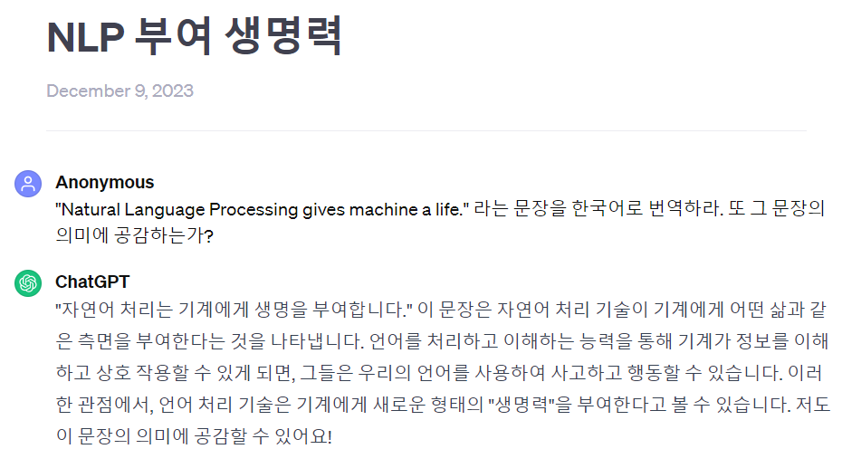

# NLP (자연어 처리)

Transformer, BERT, S-BERT 부터 시작해서, 최종적으로는 Mini Chat-GPT를 만드는 것이 목표!!

**TODO :**
* Transformer, BERT, S-BERT 등 NLP 알고리즘 기초지식 익히기 (~2023.12.10)
* 자체 제작 자연어 처리 과제 (~2024.02.11)
  * 1차 : 2023.12.11 ~ 2024.02.06
    * Project 001. 영어 문장 감성 분석
  * 2차 : 2024.02.07 ~ 02.11
    * Project 002. 이모지 데이터 유사도 검증
  * 3차 : 2024.02.08 ~ 02.13
    * Project 003. Python 코드 자동 수정
* 프로젝트 (2024.02.16 ~ 03.10)
  * Mini ChatGPT 만들기 (생성형 AI를 이용) : 2024.02.16 ~ 03.10
  * 문장에 따라 적절히 행동하는 AI 만들기 : 2024.03.11 ~ 04.07

**Project Branch Naming Rule :**
* **NLP-P123-master** 123번째 NLP 관련 프로젝트 (토이 프로젝트 등) 의 master branch 
* **NLP-P123-456** 123번째 NLP 관련 프로젝트의 456번째 sub-branch

## 자연어 처리 기술은 기계에게 생명을 부여한다

(출처: ChatGPT)

**Natural Language Processing gives machine a life.** 라는 문장은 이곳 NLP 파트에서 기술을 소개할 때 사용하는 대표적인 예시 문장이다. [ChatGPT도 이 문장의 의미에 공감한다.](https://chat.openai.com/share/3f608c85-58d1-4500-ad4c-7a99b045f2e6)

## Projects
* **Project 001. 영어 문장 감성 분석** (2023.12.12 ~ 2024.02.06 중 3일)
  * 기본적인 데이터 전처리, Sentence-BERT (S-BERT) 를 통한 문장 임베딩, 신경망 내에서 입력 데이터가 분리 및 합성되는 Tensorflow 모델
* **Project 002. 이모지 데이터 유사도 검증** (2024.02.07 ~ 2024.02.11, 5일)
  * S-BERT
* **Project 003. Python 코드 자동 수정** (2024.02.08 ~ 2024.02.13, 6일)
  * word embedding model (CBOW와 유사한 방식) 을 통한 토큰 임베딩, 딥러닝 모델이 평균으로 수렴하는 이슈의 원인 및 해결 방안 파악