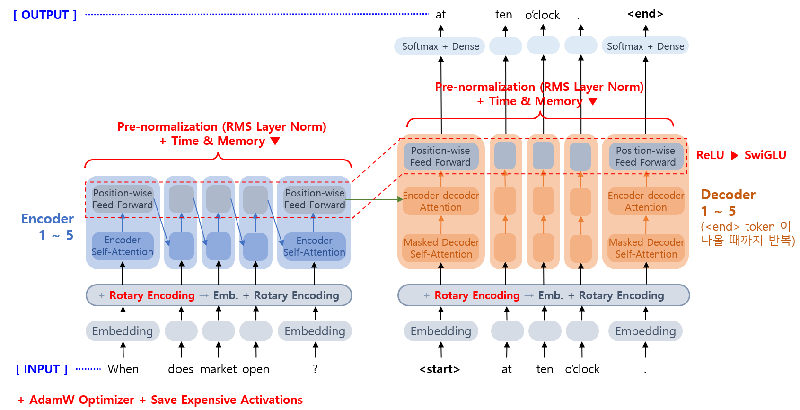
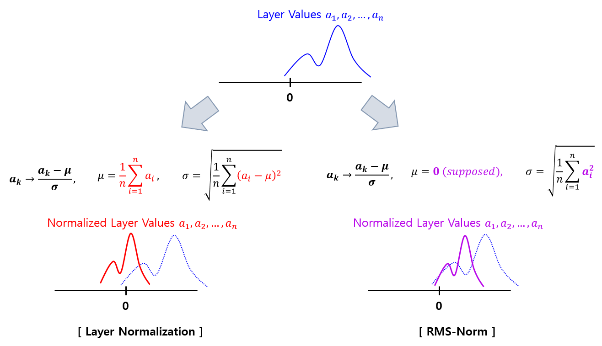

## 목차

* [1. 핵심 아이디어](#1-핵심-아이디어)
* [2. 모델 구조](#2-모델-구조)
  * [2-1. Pre-normalization](#2-1-pre-normalization) 
  * [2-2. SwiGLU](#2-2-swiglu)
  * [2-3. Rotary Embedding](#2-3-rotary-embedding)
  * [2-4. Optimizer 설정](#2-4-optimizer-설정)
  * [2-5. 학습 속도 향상을 위한 구현 방법](#2-5-학습-속도-향상을-위한-구현-방법)
* [3. 학습 (pre-training) 데이터](#3-학습-pre-training-데이터)
* [4. 실험 결과](#4-실험-결과)
  * [4-1. 독해 및 언어 추론](#4-1-독해-및-언어-추론)
  * [4-2. 상식](#4-2-상식)
  * [4-3. 수학 및 코딩](#4-3-수학-및-코딩)

## 논문 소개

* Hugo Touvron, Thibaut Lavril et al., "LLaMA: Open and Efficient Foundation Language Models", 2023
* [arXiv Link](https://arxiv.org/pdf/2302.13971)

## 1. 핵심 아이디어

* 기본적으로는 [Transformer 구조](../../Natural%20Language%20Processing/Basics_트랜스포머%20모델.md) 를 따른다.
* 단, 다음과 같이 3가지 차별점이 있다.

| 차별점                                                                          | 설명                                        |
|------------------------------------------------------------------------------|-------------------------------------------|
| Pre-normalization                                                            | 출력을 정규화하는 대신, **각 Transformer 레이어** 를 정규화 |
| SwiGLU [활성화 함수](../../AI%20Basics/Deep%20Learning%20Basics/딥러닝_기초_활성화_함수.md) | 활성화 함수를 바꿈으로써 성능 향상                       |
| Rotary Embeddings                                                            | 기존의 Positional Embedding 방법을 변경           |

## 2. 모델 구조

모델 구조는 Transformer 기반이지만, LLaMA 에서는 다음과 같은 추가 사항이 있다.

| 추가 사항             | 설명                                                                                                                                                                                    | 참고 논문                                            |
|-------------------|---------------------------------------------------------------------------------------------------------------------------------------------------------------------------------------|--------------------------------------------------|
| Pre-normalization | 각 Transformer Layer 에 대해 RMSNorm **(Root Mean-Square [Layer Normalization](../../AI%20Basics/Deep%20Learning%20Basics/딥러닝_기초_Regularization.md#4-2-layer-normalization))** 을 이용하여 정규화 | [(2019.10 논문)](https://arxiv.org/pdf/1910.07467) |
| SwiGLU 활성화 함수     | 기존 Transformer 의 ReLU 를 **SwiGLU 활성화 함수** 로 변경                                                                                                                                        | [(2020.02 논문)](https://arxiv.org/pdf/2002.05202) |
| Rotary Embedding  | 기존의 Positional Embedding 대신, **Rotary Embedding (RoPE)** 적용                                                                                                                           | [(2021.04 논문)](https://arxiv.org/pdf/2104.09864) |
| Optimizer 설정      | [AdamW Optimizer](../../AI%20Basics/Deep%20Learning%20Basics/딥러닝_기초_Optimizer.md#2-3-adamw) 적용 ($\beta_1 = 0.9, \beta_2 = 0.95$)                                                      |                                                  |
| 학습 속도 향상을 위한 구현   | - Multi-head Attention 을 학습 시간 및 메모리를 줄이는 방향으로 개선<br>- 계산 비용이 비교적 큰 activation 값을 따로 저장하여 계산 비용 절감                                                                                    |                                                  |



### 2-1. Pre-normalization

LLaMA 에서는 기존 Transformer 구조와 달리, 각 Transformer Layer 의 Sub-Layer 들에 대해 RMSNorm **(Root Mean-Square [Layer Normalization](../../AI%20Basics/Deep%20Learning%20Basics/딥러닝_기초_Regularization.md#4-2-layer-normalization))** 을 이용하여 정규화했다.

RMS-Norm 은 다음과 같은 핵심 컨셉으로 Layer Normalization 하는 것이다.

* Re-centering invariance (평균을 0으로 정규화) 보다는 **Re-scaling invariance (표준편차, 분산을 1로 정규화)** 에 집중한다.
  * Layer Normalization 이 성능을 향상시키는 핵심적인 이유가 **표준편차 정규화** 이다. 
  * invariance 는 Layer 의 값들이 편향적이어도 이를 평균과 표준편차에 대한 정규화를 통해 보정하는 것을 말한다.
* Layer Normalization 에서의 평균 계산 부분을 제거하여 **Layer Normalization 을 비교적 간단하게** 한다.
  * 즉, **평균을 0으로 간주하고** 정규화하는 셈이다.



### 2-2. SwiGLU

LLaMA 에서는 기존 Transformer 의 ReLU 를 **SwiGLU 활성화 함수** 로 변경하여 성능을 향상시킨다.

* 이는 [PaLM 논문 (2022.04)](https://arxiv.org/pdf/2204.02311) 에서 아이디어를 얻은 것이다.
* 단, 원래 PaLM 논문에서와 달리 [Position-wise Feed Forward](../../Natural%20Language%20Processing/Basics_트랜스포머%20모델.md#4-position-wise-feed-forward) 의 중간 tensor 의 차원을 그 전후 tensor 의 4 배가 아닌 8/3 배로 했다.

SwiGLU 함수의 핵심 아이디어는 다음과 같다.

* [Swish 활성화 함수](../../AI%20Basics/Deep%20Learning%20Basics/딥러닝_기초_활성화_함수.md#2-6-silu-swish-함수) 와 GLU 활성화 함수를 결합한다.
* Swish 함수와 GLU 함수의 장점이 결합되어서 우수한 성능을 달성한다.

GLU 함수의 핵심 아이디어는 다음과 같다. [(논문)](https://arxiv.org/pdf/1612.08083)

* 입력값의 중요도를 나타내는 **게이팅 (Gating) 메커니즘** 을 사용하여, 중요한 정보만 다음 레이어로 전달 
* $GLU(x, W_1, W_2, b_1, b_2) = (xW_1 + b_1) ⊗ \sigma(xW_2 + b_2)$
  * 단, $W_k$ 는 가중치, $b_k$ 는 bias, ⊗ 는 행렬의 같은 위치의 요소끼리의 곱셈 ($k = 1, 2$)
  * 여기서 $\sigma(xW_2 + b_2)$ 부분이 gate 역할을 한다.

SwiGLU 함수의 수식은 다음과 같다.

* $SwiGLU(x, W_1, W_2, b_1, b_2, \beta) = Swish_\beta(xW_1 + b_1) ⊗ \sigma(xW_2 + b_2)$


### 2-3. Rotary Embedding

LLaMA 에서는 기존의 [Absolute Position Embedding](../../Natural%20Language%20Processing/Basics_트랜스포머%20모델.md#2-포지셔널-인코딩-positional-encoding) 대신, **Rotary Embedding (RoPE)** 를 적용했다. RoPE 의 핵심 아이디어는 다음과 같다.

* Embedding 된 Vector 의 성분을 2개씩 묶어서, 해당 성분을 좌표평면 위의 점이라고 할 때 이것을 원점을 중심으로 회전시킨다.
* 이때, **각 묶음마다 그 회전 각도를 서로 다르게** 한다.


구체적으로는, Embedding 된 Vector 의 각 성분을 다음과 같은 행렬을 이용하여 변환한다.

* $x_m → R_{\Theta,m}^d x_m$ ($m$ 은 각 성분의 index)
* $R_{\Theta,m}^d$ 행렬은 다음과 같다.


[(출처)](https://arxiv.org/pdf/2104.09864) : Jianlin Su and Yu Lu et al., "RoFormer: Enhanced Transformer with Rotary Position Embedding", 2021 

* 여기서 $\theta_i = 10000^{-2(i-1)/d}, i \in [1, 2, ..., d/2]$ 이다.
* 즉, **index $m$ 이 증가할수록 회전 각도가 점점 감소하는** 추세이다.

### 2-4. Optimizer 설정

LLaMA 에서는 Optimizer 로 [AdamW Optimizer](../../AI%20Basics/Deep%20Learning%20Basics/딥러닝_기초_Optimizer.md#2-3-adamw) 를 적용했다. 구체적인 설정값은 다음과 같다.

* Optimizer Hyper-parameter
  * $\beta_1 = 0.9$
  * $\beta_2 = 0.95$
* [Learning Rate Scheduler](../../AI%20Basics/Deep%20Learning%20Basics/딥러닝_기초_Learning_Rate_Scheduler.md)
  * Cosine Learning Rate Scheduler (최종 learning rate 는 최대 learning rate 의 10%) 
  * 2,000 Warmup Steps 
* [Weight Decay](../../AI%20Basics/Deep%20Learning%20Basics/딥러닝_기초_Optimizer.md#1-1-중요-개념-weight-decay)
  * 0.1
* Gradient Clipping
  * Gradient 의 크기가 일정 절댓값을 넘어가지 못하게 함 ([Gradient Explosion](../../AI%20Basics/Deep%20Learning%20Basics/딥러닝_기초_Regularization.md#3-gradient-vanishing) 방지)
  * 본 논문에서는 1.0 을 적용
* Learning Rate 및 Batch Size 를 여러 가지로 하여 실험 실시

### 2-5. 학습 속도 향상을 위한 구현 방법

LLaMA 에서는 학습 속도 향상을 위해 다음과 같은 구현 방식을 이용했다.

* Multi-head Attention 을 학습 시간 및 메모리를 줄이는 방향으로 개선
  * 자사인 [Facebook Research (Meta) 의 xFormers](https://github.com/facebookresearch/xformers) 라이브러리를 이용 
* 계산 비용이 비교적 큰 activation 값을 따로 저장하여 계산 비용 절감
  * Transformer Layer 의 경우, **back-propagation 을 PyTorch 의 자동 구현을 사용하지 않고 직접 구현**
  * Linear Layer 의 출력 등이 계산 비용이 비교적 큼

## 3. 학습 (pre-training) 데이터

LLaMA 를 학습시키기 위해 사용한 데이터는 다음과 같다.

| 학습 데이터               | 비중   | 설명                                        |
|----------------------|------|-------------------------------------------|
| English CommonCrawl  | 67%  | 2017 ~ 2020년의 데이터를 CCNet 파이프라인으로 전처리      |
| C4                   | 15%  | 공개적으로 사용 가능한 데이터셋인 C4 데이터셋 사용             |
| Github               | 4.5% | 공개된 Github 데이터셋                           |
| Wikipedia            | 4.5% | 2022년 6~8월 간의 20개 언어로 된 Wikipedia 데이터셋 사용 |
| Gutenberg and Books3 | 4.5% |                                           |
| ArXiv                | 2.5% |                                           |
| Stack Exchange       | 2%   |                                           |

학습 데이터에 대한 tokenizer 로는 **byte-pair encoding (BPE)** 알고리즘을 사용했다. 그 핵심 아이디어는 다음과 같다.

* **연속적으로 등장한 횟수가 가장 많은 글자의 쌍을 1글자로 치환** 하는 **압축 알고리즘**

예를 들어 다음과 같다.

```
   aaabbcabbcbbcd
-> aaaXaXXd       ... X = bbc
-> aaYYXd         ... X = bbc, Y = aX
-> No more pair to replace. BPE Algorithm finished. (Final result: aaYYXd)
```

## 4. 실험 결과

LLaMA 모델의 종류 및 그 구조는 다음과 같다.


[(출처)](https://arxiv.org/pdf/2302.13971) : Hugo Touvron, Thibaut Lavril et al., "LLaMA: Open and Efficient Foundation Language Models", 2023

실험 결과를 요약하면 다음과 같다.

* 독해, 언어 추론, 상식, 코딩 분야에서 다른 모든 언어 모델 대비 우수한 성능 기록
* 단, 수학 분야에서는 Minerva 라는 언어 모델이 LLaMA 보다 우수한 성능 기록

### 4-1. 독해 및 언어 추론

* 비슷한 파라미터 개수 (PaLM 62B vs. LLaMA 65B) 에서, **LLaMA 가 PaLM 등 다른 언어 모델보다 우수** 한 성능을 달성

|        | Reading Comprehension               | MMLU (Massive Multitask Language Understanding) |
|--------|-------------------------------------|-------------------------------------------------|
| N-Shot | Zero-Shot                           | Five-Shot                                       |
| 결과     |  |              |

[(출처)](https://arxiv.org/pdf/2302.13971) : Hugo Touvron, Thibaut Lavril et al., "LLaMA: Open and Efficient Foundation Language Models", 2023

### 4-2. 상식

* 비슷한 파라미터 개수 (PaLM 62B vs. LLaMA 65B vs. Chinchilla 70B) 에서, **LLaMA 가 PaLM 등 다른 언어 모델보다 우수** 한 성능을 달성

|    | NaturalQuestions                    | TriviaQA                             |
|----|-------------------------------------|--------------------------------------|
| 방법 | Exact match                         | Zero-shot & Few-shot Exact match     |
| 결과 |  |  |

[(출처)](https://arxiv.org/pdf/2302.13971) : Hugo Touvron, Thibaut Lavril et al., "LLaMA: Open and Efficient Foundation Language Models", 2023

### 4-3. 수학 및 코딩

* 비슷한 파라미터 개수에서, 다음과 같은 성능을 달성했다. 수학 분야에서 Minerva 보다 성능이 다소 떨어지는 것을 제외하고는 모두 우수한 성능을 달성했다.
  * 수학 : Minerva (62B) > **LLaMA (65B)** > PaLM (62B)
  * 코드 생성 : **LLaMA (65B)** > PaLM-cont (62B) > PaLM (62B)

|         | 수학적 추론                               | 코드 생성                                |
|---------|--------------------------------------|--------------------------------------|
| 평가 데이터셋 | MATH + GSM8k                         | HumanEval + MBPP                     |
| 결과      |  |  |

[(출처)](https://arxiv.org/pdf/2302.13971) : Hugo Touvron, Thibaut Lavril et al., "LLaMA: Open and Efficient Foundation Language Models", 2023
