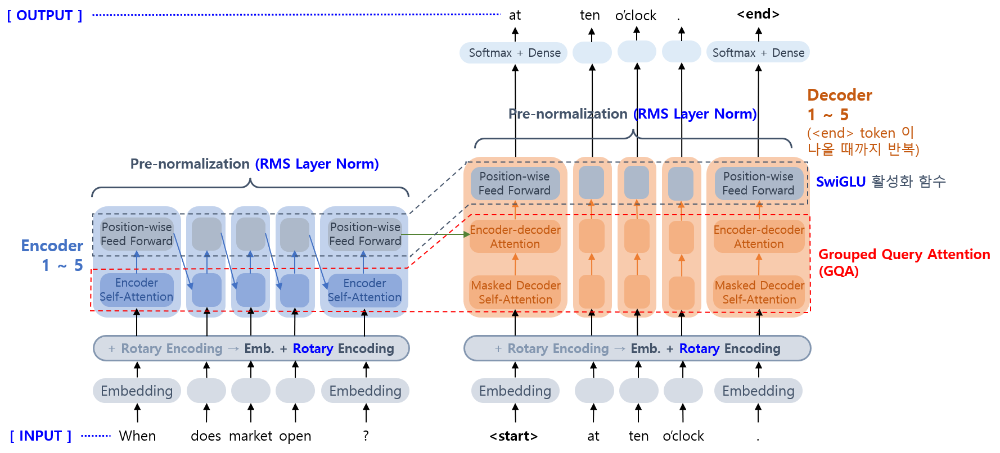
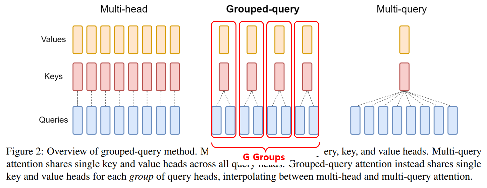
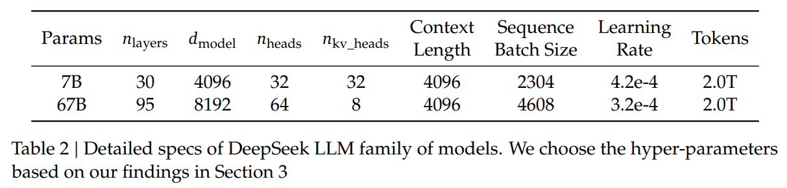
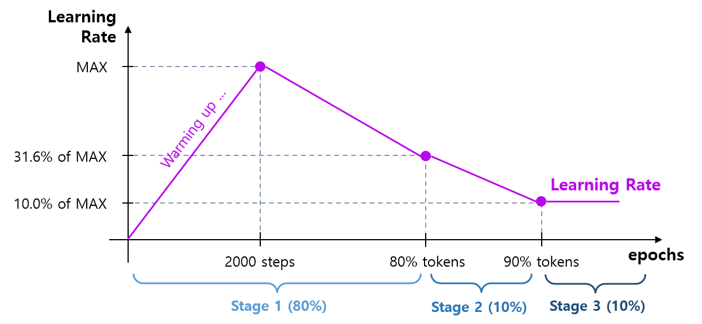
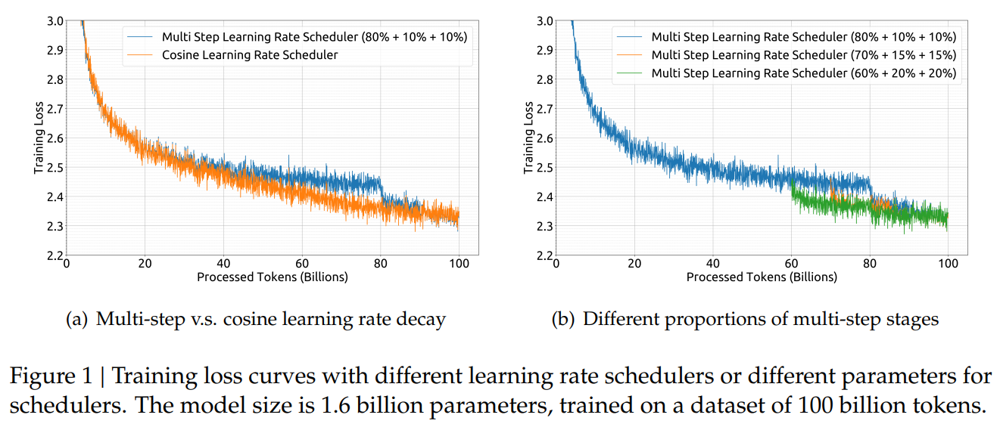
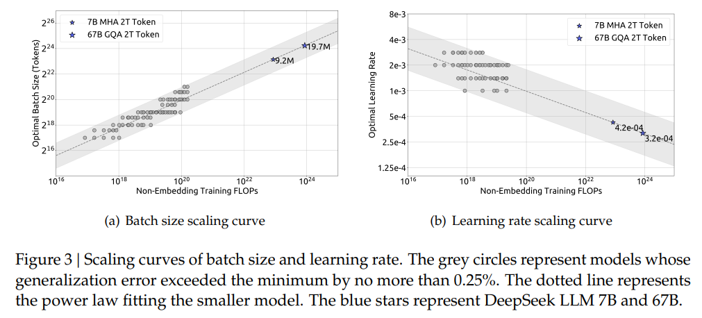

## 목차

* [1. 핵심 아이디어](#1-핵심-아이디어)
* [2. 모델 구조](#2-모델-구조)
  * [2-1. 기본 구조 (LLaMA 기반)](#2-1-기본-구조-llama-기반)
  * [2-2. Grouped Query Attention (GQA)](#2-2-grouped-query-attention-gqa)
  * [2-3. Macro Design](#2-3-macro-design)
  * [2-4. 하이퍼파라미터](#2-4-하이퍼파라미터)
  * [2-5. 학습 프레임워크 (HAI-LLM)](#2-5-학습-프레임워크-hai-llm)
* [3. 스케일링 법칙](#3-스케일링-법칙)
  * [3-1. Batch Size 및 Learning Rate 대한 스케일링 법칙](#3-1-batch-size-및-learning-rate-대한-스케일링-법칙)
  * [3-2. 최적의 모델 규모 찾기](#3-2-최적의-모델-규모-찾기)
* [4. 학습 데이터](#4-학습-데이터)
* [5. 실험 결과](#5-실험-결과)
  * [5-1. 언어 이해 및 추론](#5-1-언어-이해-및-추론)
  * [5-2. 상식 및 표준화 시험](#5-2-상식-및-표준화-시험)
  * [5-3. 수학 및 코딩](#5-3-수학-및-코딩)

## 논문 소개

* Xiao Bi, Deli Chen et al., "DeepSeek LLM Scaling Open-Source Language Models with Longtermism", 2024
* [arXiv Link](https://arxiv.org/pdf/2401.02954)

## 1. 핵심 아이디어

DeepSeek LLM 의 핵심 아이디어는 다음과 같다.

* [LLaMA](%5B2025.03.12%5D%20LLaMA%20-%20Open%20and%20Efficient%20Foundation%20Language%20Models.md) 모델 기반 구조
* 추론에 사용되는 연산량 감소를 위해, **Grouped Query Attention (GQA)** 적용

## 2. 모델 구조

DeepSeek LLM 의 모델 구조를 요약하면 다음과 같다.

| 구분                            | 설명                                                                                                                                                                                                                                                                                                                                                                                                                                                                                                                                                                  |
|-------------------------------|---------------------------------------------------------------------------------------------------------------------------------------------------------------------------------------------------------------------------------------------------------------------------------------------------------------------------------------------------------------------------------------------------------------------------------------------------------------------------------------------------------------------------------------------------------------------|
| 기본 구조                         | [LLaMA](%5B2025.03.12%5D%20LLaMA%20-%20Open%20and%20Efficient%20Foundation%20Language%20Models.md) 모델 기반 - [RMS-Norm](%5B2025.03.12%5D%20LLaMA%20-%20Open%20and%20Efficient%20Foundation%20Language%20Models.md#2-1-pre-normalization) 을 이용한 Layer Normalization - Feed-Forward Network 에 [SwiGLU 활성화 함수](%5B2025.03.12%5D%20LLaMA%20-%20Open%20and%20Efficient%20Foundation%20Language%20Models.md#2-2-swiglu) 적용 - [Rotary Embedding](%5B2025.03.12%5D%20LLaMA%20-%20Open%20and%20Efficient%20Foundation%20Language%20Models.md#2-3-rotary-embedding) 적용 |
| Grouped Query Attention (GQA) | 추론 연산량 감소를 위해 기존의 Multi-head Attention 을 대체                                                                                                                                                                                                                                                                                                                                                                                                                                                                                                                         | 
| Macro Design                  | DeepSeek LLM 7B, 30B 각각 30개, 95개의 레이어 적용                                                                                                                                                                                                                                                                                                                                                                                                                                                                                                                            |

### 2-1. 기본 구조 (LLaMA 기반)

* [LLaMA Paper Study 문서](%5B2025.03.12%5D%20LLaMA%20-%20Open%20and%20Efficient%20Foundation%20Language%20Models.md) 참고.

### 2-2. Grouped Query Attention (GQA)

DeepSeek LLM 에서는 기존 LLaMA 및 [Transformer](../../Natural%20Language%20Processing/Basics_트랜스포머%20모델.md) 에 적용된 Multi-head Attention 대신, **Grouped Query Attention (GQA)** 이라는 [어텐션 메커니즘](../../Natural%20Language%20Processing/Basics_어텐션%20(Attention).md) 을 이용한다.

Grouped Query Attention (GQA) 의 핵심 아이디어는 다음과 같다. [(2023.05 논문)](https://arxiv.org/pdf/2305.13245)

* 각 Query 를 $G$ 개의 group 으로 나눈다.
* 각 Group 내의 모든 Query 들은 서로 같은 Key 와 Value 를 공유한다.

[(출처)](https://arxiv.org/pdf/2305.13245) : Joshua Ainslie, James Lee-Thorp et al., "GQA: Training Generalized Multi-Query Transformer Models from Multi-Head Checkpoints", 2023

### 2-3. Macro Design

DeepSeek LLM 은 레이어 개수를 다음과 같이 설계했다.

| 모델           | 레이어 개수 |
|--------------|--------|
| DeepSeek-7B  | 30 개   |
| DeepSeek-67B | 95 개   |

각 모델 별 상세한 설계는 다음과 같다.

[(출처)](https://arxiv.org/pdf/2401.02954) : Xiao Bi and Deli Chen et al., "DeepSeek LLM Scaling Open-Source Language Models with Longtermism", 2024

### 2-4. 하이퍼파라미터

DeepSeek LLM 에서는 다음과 같은 하이퍼파라미터를 적용했다.

* Optimizer and Hyper-parameter
  * [AdamW Optimizer](../../AI%20Basics/Deep%20Learning%20Basics/딥러닝_기초_Optimizer.md#2-3-adamw) 
  * $\beta_1 = 0.9$
  * $\beta_2 = 0.95$
* [Learning Rate Scheduler](../../AI%20Basics/Deep%20Learning%20Basics/딥러닝_기초_Learning_Rate_Scheduler.md)
  * Multi-Step Learning Rate Scheduler **(80% + 10% + 10% 전략)**
  * 2,000 Warmup Steps 이후 최대 learning rate 에 도달
  * 80% token 을 학습하는 시점에 최대치의 31.6% 에 도달 ($\sqrt {1/10}$ 의 의도로 추정)
  * 90% token 을 학습하는 시점부터 최대치의 10% 를 적용
* [Weight Decay](../../AI%20Basics/Deep%20Learning%20Basics/딥러닝_기초_Optimizer.md#1-1-중요-개념-weight-decay)
  * 0.1
* Gradient Clipping
  * Gradient 의 크기가 일정 절댓값을 넘어가지 못하게 함 ([Gradient Explosion](../../AI%20Basics/Deep%20Learning%20Basics/딥러닝_기초_Regularization.md#3-gradient-vanishing) 방지)
  * 본 논문에서는 1.0 을 적용

Learning Rate Scheduling 전략으로 위와 같은 **80% (Stage 1) + 10% (Stage 2) + 10% (Stage 3)** 전략과 그 외의 여러 전략을 비교한 결과는 다음과 같다.

* 각 전략 별로, 학습 시의 Training Loss 추이 및 100 Billion token 의 학습 완료 시 Training Loss 를 비교했다.
* 각 Stage 의 비율을 조절함으로써 아래와 같이 **약간 더 좋은 성능** 을 얻을 수 있었다.

[(출처)](https://arxiv.org/pdf/2401.02954) : Xiao Bi and Deli Chen et al., "DeepSeek LLM Scaling Open-Source Language Models with Longtermism", 2024

### 2-5. 학습 프레임워크 (HAI-LLM)

DeepSeek LLM 을 학습시키기 위한 프레임워크로, **경량 프레임워크** 중 하나인 **HAI-LLM (High-flyer, 2023)** 을 사용했다.

* 이 프레임워크를 통해 모델 학습 및 테스트를 진행했다.

HAI-LLM 프레임워크의 장점은 **데이터, 텐서 및 Sequence, 파이프라인 등에 대한 병렬화를 지원** 한다는 것이다.

## 3. 스케일링 법칙

DeepSeek LLM 을 개발하면서 발견된 스케일링 법칙의 insight 는 다음과 같다.

* 모델의 규모 (Training FLOPs) 가 클수록,
  * 최적의 Batch Size 가 커진다.
  * 최적의 [Learning Rate](../../AI%20Basics/Deep%20Learning%20Basics/딥러닝_기초_Learning_Rate.md) 가 감소한다.
* 최적의 모델 규모 및 학습 데이터 규모는 다음과 같이 정의된다.
  * **일반화 오류 (Generalization Error) 를 최소화** 하는 **데이터 규모 & 모델 파라미터 개수**

### 3-1. Batch Size 및 Learning Rate 대한 스케일링 법칙

하이퍼파라미터인 **Batch Size** 및 **Learning Rate** 는 각각 다음과 같은 특징을 보인다.

* 모델 규모가 클수록, 최적의 **Batch Size** 가 커진다.
* 모델 규모가 클수록, 최적의 **Learning Rate** 는 작아진다.

[(출처)](https://arxiv.org/pdf/2401.02954) : Xiao Bi and Deli Chen et al., "DeepSeek LLM Scaling Open-Source Language Models with Longtermism", 2024

한편, **주어진 컴퓨팅 자원의 양을 $C$ 라고 할 때**, 최적의 Learning Rate $\eta_{opt}$ 및 최적의 batch size $B_{opt}$ 는 다음과 같다.

* 컴퓨팅 자원이 늘어날수록 최적의 Learning Rate 는 **약간씩 감소한다.**
  * $\eta_{opt} = 0.3118 \times C^{-0.1250}$
* 컴퓨팅 자원이 늘어날수록 최적의 Batch Size 는 **증가한다.**
  * $\eta_{opt} = 0.2920 \times C^{0.3271}$

### 3-2. 최적의 모델 규모 찾기

여기서는 **최적의 모델 규모** 를 다음과 같이 정의한다.

* 최적의 모델 규모는,
  * **일반화 오류 (Generalization Error) 를 최소화** 하는 **데이터 규모 & 모델 파라미터 개수**
* $M_{opt}(C), D_{opt}(C) = \argmin_{M,D s.t. C=MD} Loss(N, D)$
  * $M, D$ : 각각 모델 및 데이터 규모 
    * $M_{opt}(C)$, $D_{opt}(C)$ : 주어진 컴퓨팅 자원량 $C$ 에 대한 최적의 모델 및 데이터 규모
  * $C = MD$ : 필요한 컴퓨팅 자원은 모델 규모와 데이터 규모의 곱
  * $N$ : 하이퍼파라미터 개수
  * $Loss$ : 일반화 오류를 나타내는 [Loss Function](../../AI%20Basics/Deep%20Learning%20Basics/딥러닝_기초_Loss_function.md)

----

여기서 모델 규모를 나타내는 $M$ 과 특정 종류의 파라미터 개수 $N_1$, $N_2$ 는 각각 다음과 같이 계산한다.

| 구분                                     | 수식                                                              |
|----------------------------------------|-----------------------------------------------------------------|
| 모델 규모 $M$                              | $M = 72 n_{layer} d_{model}^2 + 12 n_{layer} d_{model} l_{seq}$ |
| Non-embedding (임베딩을 제외한) 파라미터 개수 $N_1$ | $6 N_1 = 72 n_{layer} d_{model}^2$                              |
| Complete 파라미터 개수 $N_2$                 | $6 N_2 = 72 n_{layer} d_{model}^2 + 6 n_{vocab} d_{model}$      |

* $n_{layer}$ : 모델의 레이어 개수
* $d_{model}$ : 각 token 에 대한 임베딩 벡터의 차원
* $n_{vocab}$ : vocabulary (token 사전) 의 크기
* $l_{seq}$ : LLM 에 입력 가능한 Input Sequence 의 길이 (token 개수)

## 4. 학습 데이터

## 5. 실험 결과

### 5-1. 언어 이해 및 추론

### 5-2. 상식 및 표준화 시험

### 5-3. 수학 및 코딩