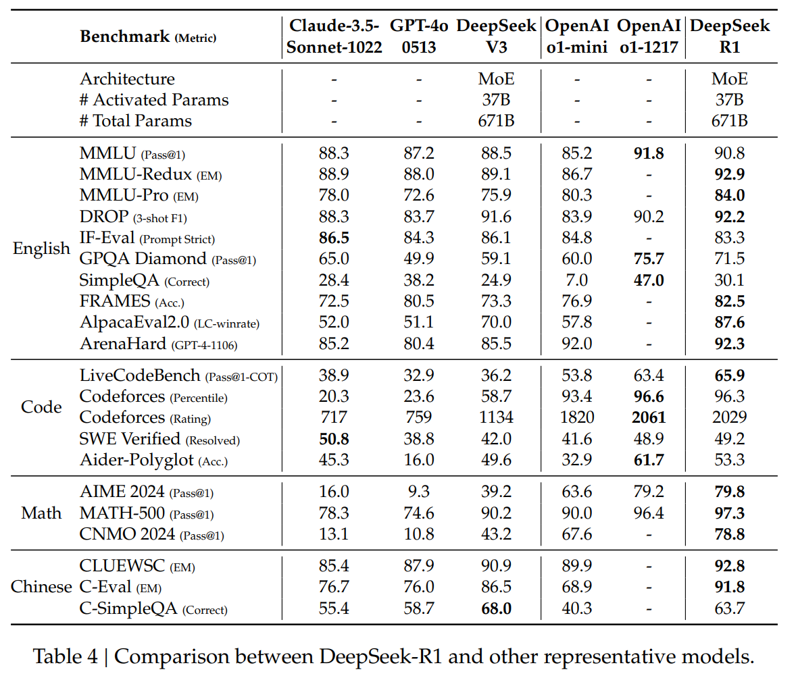

## 목차

* [1. 핵심 아이디어](#1-핵심-아이디어)
* [2. DeepSeek-R1-Zero 모델](#2-deepseek-r1-zero-모델)
  * [2-1. Reinforcement Learning 알고리즘](#2-1-reinforcement-learning-알고리즘)
  * [2-2. Reward 모델링](#2-2-reward-모델링)
  * [2-3. Training 을 위한 템플릿](#2-3-training-을-위한-템플릿)
* [3. DeepSeek-R1 모델](#3-deepseek-r1-모델)
  * [3-1. Cold Start](#3-1-cold-start)
  * [3-2. 추론 지향 강화학습](#3-2-추론-지향-강화학습)
  * [3-3. Rejection Sampling & SFT (Supervised Fine-Tuning)](#3-3-rejection-sampling--sft-supervised-fine-tuning)
  * [3-4. 모든 시나리오에 대한 강화학습](#3-4-모든-시나리오에-대한-강화학습)
* [4. 실험 결과](#4-실험-결과)
  * [4-1. DeepSeek-R1-Zero 모델의 학습 중 성능 추이](#4-1-deepseek-r1-zero-모델의-학습-중-성능-추이)
  * [4-2. DeepSeek-R1 모델 성능](#4-2-deepseek-r1-모델-성능)
  * [4-3. Distilled Model 성능](#4-3-distilled-model-성능)
* [5. 한계점 및 향후 연구 방향](#5-한계점-및-향후-연구-방향)
  * [5-1. 한계점](#5-1-한계점)
  * [5-2. 향후 연구 방향](#5-2-향후-연구-방향)

## 논문 소개

* DeepSeek-AI, "DeepSeek-R1: Incentivizing Reasoning Capability in LLMs via Reinforcement Learning", 2025
* [arXiv Link](https://arxiv.org/pdf/2501.12948)

## 1. 핵심 아이디어

* LLM 에 대한 [Supervised Fine-Tuning (SFT)](../../AI%20Basics/LLM%20Basics/LLM_기초_Fine_Tuning_SFT.md) 없이도 **강화학습을 통해 높은 추론 성능을 달성** 할 수 있다.
* **작은 규모의 Cold-start Data** 만으로도 성능이 추가로 향상될 수 있다.
* 여기서는 DeepSeek-R1-Zero 모델과 DeepSeek-R1 모델에 대해 각각 설명한다.

| 모델               | 구분         | 설명                                                                    |
|------------------|------------|-----------------------------------------------------------------------|
| DeepSeek-R1-Zero | Base Model | Supervised Data 없이 **오직 강화학습만을 이용하여** 추론 모델 학습                        |
| DeepSeek-R1      |            | 강화학습의 불안정한 Cold Start 상태를 줄이기 위해, **소규모의 추론 관련 Supervised Data** 를 이용 |

## 2. DeepSeek-R1-Zero 모델

**Base Model** 인 **DeepSeek-R1-Zero** 모델은 Supervised Data 없이 **오직 강화학습만을 이용하여** 학습하는 형태의 추론 모델이다.

* 즉, 강화학습을 통해 스스로 진화하는 방식으로 추론하는 것을 목표로 한다.

### 2-1. Reinforcement Learning 알고리즘

DeepSeek-R1-Zero 모델에서 사용하는 강화학습은 **Group Relative Policy Optimization (GRPO)** 알고리즘을 사용한다. 동작 방식은 다음과 같다.

* 각 질문 별로, 이전의 Policy 에 따라 **생성된 추론 결과 output 몇 개를 샘플링** 하여 그룹으로 만든다.
* 다음과 같은 방향으로 학습한다.
  * **새로운 Policy** 에 의해 해당 output 이 발생할 확률을 **높인다.**
  * **이전 Policy 또는 Reference Model** 에 의해 해당 output 이 발생할 확률을 **낮춘다.**
  * 참고: [DPO, ORPO](../../AI%20Basics/LLM%20Basics/LLM_기초_Fine_Tuning_DPO_ORPO.md)


[(출처)](https://arxiv.org/pdf/2501.12948) DeepSeek-AI, "DeepSeek-R1: Incentivizing Reasoning Capability in LLMs via Reinforcement Learning", 2025

* 질문 및 출력
  * $q$ : 각 질문
  * $o_i (o_1, o_2, ..., o_G)$ : 각 질문 별 GRPO 에 의해 샘플링된 output, 총 $G$ 개
* 정책 (Policy)
  * $\pi_{\theta_{old}}$ : 이전의 Policy
  * $\pi_\theta$ : 현재 Policy
  * $\pi_{ref}$ : Reference Model 의 Policy
* 보상 (Reward)
  * $r_i (r_1, r_2, ..., r_G)$ : 각 질문 별 각 샘플링 된 output 에 의한 reward
  * $A_i$ : 각 질문에 대한 advantage
    * $r_i$ 를 해당 질문과 관련된 모든 reward 에 대해 정규화한 값
* 하이퍼파라미터
  * $\epsilon$ : 강화학습 기법 중 보상을 조정하기 위한 PPO (Proximal Policy Optimization) 에서 사용되는 하이퍼파라미터 
  * $\beta$ : 다음 두 확률 간의 중요도를 조절하는 scaling factor
    * **새로운 Policy** 에 의한 $o_i$ 발생 확률 / **이전 Policy** 에 의한 발생 확률 (수식 왼쪽)
    * **Reference Model 의 Policy** 에 의한 $o_i$ 발생 확률 / **새로운 Policy** 에 의한 발생 확률 (수식 오른쪽의 $D_{KL}$)

### 2-2. Reward 모델링

DeepSeek-R1-Zero 모델을 강화학습 시키기 위한 **보상 (Reward) 의 모델링** 은 다음과 같다.

| Reward 모델        | 설명                                                                                                                                          |
|------------------|---------------------------------------------------------------------------------------------------------------------------------------------|
| Accuracy Rewards | **정답이 맞는지** 에 대한 보상<br>- 수학 문제의 경우, 최종 정답 여부<br>- 코딩 문제의 경우, 테스트 케이스에 대해 실행 결과가 일치하는지의 여부                                                   |
| Format Rewards   | 모델의 [사고 프로세스 (Chain of Thought, CoT)](../../AI%20Basics/LLM%20Basics/LLM_기초_Chain_of_Thought.md) 를 ```<think> ... </think>``` 태그의 안쪽에 넣도록 함 |

* Neural Reward Model (딥러닝 기반의 보상 모델) 은 LLM 이 개발자가 의도하지 않은 방법으로 목표를 달성하는 **Reward Hacking 에 취약** 할 수 있으므로 사용하지 않는다.

### 2-3. Training 을 위한 템플릿

DeepSeek-R1-Zero 모델이 **학습 중 이상 행동 없이** 학습을 원활히 할 수 있도록 다음과 같이 답변의 템플릿을 지정했다.


[(출처)](https://arxiv.org/pdf/2501.12948) DeepSeek-AI, "DeepSeek-R1: Incentivizing Reasoning Capability in LLMs via Reinforcement Learning", 2025

## 3. DeepSeek-R1 모델

메인 모델인 **DeepSeek-R1** 모델은 강화학습의 불안정한 Cold Start 상태를 줄이기 위해, **소규모의 추론 관련 Supervised Data** 를 이용하는 형태의 모델이다.

DeepSeek-R1 모델의 핵심 질문은 다음과 같다.

* 추론 성능이 **고품질의 추론 데이터를 Cold Start 시점에 추가** 함으로써 향상될 수 있는가?
* 깔끔한 추론 과정은 물론 **일반적인 문제 해결 능력** 까지 갖추도록 추론 모델을 학습시키는 방법은 무엇일까?

이 질문에 해결책을 제시하기 위해, DeepSeek-R1 에서는 다음과 같은 4단계의 학습 파이프라인을 이용한다.

| 파이프라인 과정                 | 설명                                                                 |
|--------------------------|--------------------------------------------------------------------|
| Cold Start               | **초기 강화학습 Agent** 를 고품질의 추론 데이터로 **Fine-tuning**                   |
| 추론 지향 강화학습               | DeepSeek-R1-Zero (Base Model) 과 같은 학습 프로세스                         |
| Rejection Sampling & SFT | 추론 지향 강화학습 수렴 후, **다른 데이터를 추가** 하여 모델의 전반적 성능 향상                   |
| 모든 시나리오에 대한 강화학습         | 인간 친화적인 모델을 위해, **모델이 사람에게 도움이 되는 정도 (helpfulness)** 에 기반한 추가 강화학습 |


### 3-1. Cold Start

첫 단계인 **Cold Start** 는 **초기 강화학습 Agent (RL Actor) 를 소규모의 고품질 추론 데이터로 Fine-tuning** 하는 과정이다.

* 이는 초기의 불안정한 Cold Start 상태를 방지하기 위한 것이다.
* 이 추론 데이터는 [생각의 사슬 (Chain of Thought, CoT)](../../AI%20Basics/LLM%20Basics/LLM_기초_Chain_of_Thought.md) 에 기반하여 작성된 것이다.

여기서는 다음과 같은 방법을 사용했다.

* **DeepSeek-V3-Base 모델 학습에 사용한 수천 개의 데이터** 를 학습의 시작점으로 한다. 그 장점은 다음과 같다.
  * **(가독성)** DeepSeek-R1-Zero 가 생성하는 답변에 있는, 가독성이 떨어진다는 문제점이 적음 
  * **(성능 향상 가능성)** Cold-Start 데이터의 [패턴을 더 잘 디자인](../../AI%20Basics/LLM%20Basics/LLM_기초_Prompt_Engineering.md) 하면 DeepSeek-R1-Zero 보다 성능이 향상될 가능성이 있음

### 3-2. 추론 지향 강화학습

두 번째 단계인 **추론 지향 강화학습 (Reasoning-oriented Reinforcement Learning)** 은 Base Model 인 DeepSeek-R1-Zero 와 같은 강화학습 과정이다.

* 자세한 것은 DeepSeek-R1-Zero 모델의 [강화학습 알고리즘](#2-1-reinforcement-learning-알고리즘) 및 [보상 모델링](#2-2-reward-모델링) 부분 참고.

### 3-3. Rejection Sampling & SFT (Supervised Fine-Tuning)

세 번째 단계인 **Rejection Sampling & SFT (Supervised Fine-Tuning)** 은 추론 지향 강화학습이 수렴한 후, **일반 LLM의 학습에도 사용되는 다양한 분야의 전반적인 데이터를 추가** 하여 모델의 전반적 성능을 향상시키는 것이다.

* 여기서는 다음과 같이 **추론용 데이터** 와 **그렇지 않은 데이터** 를 각각 생성하고, 이를 이용하여 모델을 Fine-tuning 한다.

| 구분               | 생성 및 Fine-tuning 방법                                                                                                                                                                                                                        |
|------------------|--------------------------------------------------------------------------------------------------------------------------------------------------------------------------------------------------------------------------------------------|
| 추론용 데이터          | 강화학습 중 모델의 **checkpoint (학습 과정 중의 모델)** 에서,<br>- Rejection Sampling 을 통해 추론 관련 Prompt 를 선별하고,<br>- 이에 대해 추론 과정을 생성한다.<br>또한, 이때 다음과 같이 학습 데이터를 추가/삭제한다.<br>- 학습 데이터를 일부 추가하여 데이터셋 확대<br>- 추론 과정이 여러 가지 언어, 긴 문단 등으로 이루어진 가독성이 떨어지는 데이터는 제외 |
| 일반 데이터 (추론용이 아닌) | **DeepSeek-V3 모델을 SFT 시키기 위해 사용한 데이터셋** 의 일부를 활용한다.                                                                                                                                                                                        |

* Rejection Sampling: 정규분포 등 **우리가 이미 알고 있는 분포** 에 따라 Sample을 생성 후, 해당 분포에서 **확률적으로 데이터를 추출 또는 기각 (Reject)** 하여 원하는 분포로 변형시키는 것

### 3-4. 모든 시나리오에 대한 강화학습

인간 친화적인 모델을 만들기 위해, 다음과 같이 **인간 친화적 지표** 에 기반한 추가 강화학습을 실시한다.

* 모델이 사람에게 도움이 되는 정도 (helpfulness)
* 모델이 사람에게 해로움이 없는 정도 (harmlessness)

추론용 데이터와 그렇지 않은 데이터에 대해서 각각 다음과 같이 추가 강화학습을 실시한다.

| 구분               | 추가 학습 방법                                                                |
|------------------|-------------------------------------------------------------------------|
| 추론용 데이터          | DeepSeek-R1-Zero 에서와 같이, 수학, 코딩 및 논리적 추론에 대한 **Rule-based reward** 를 이용 |
| 일반 데이터 (추론용이 아닌) | Reward Model 이 **복잡한 시나리오에서도 인간의 선호를 학습** 할 수 있도록 추가 학습                 |

## 4. 실험 결과

실험 결과 요약

* DeepSeek-R1 모델은 학습이 진행됨에 따라 답변의 길이가 늘어난다. 이는 **오래 생각할수록 (그래서 긴 답변을 하게 됨) 추론 정확도가 높아짐** 을 의미한다.
* 수학, 영어, 중국어 등을 포함하여 **전반적으로 다른 LLM에 비해 우수** 한 성능 달성
* [Knowledge Distillation](../../AI%20Basics/Deep%20Learning%20Basics/딥러닝_기초_Knowledge_Distillation.md) 시키는 경우, Qwen-32B, LLaMA-70B 로 지식 증류시킨 모델의 성능이 좋음

### 4-1. DeepSeek-R1-Zero 모델의 학습 중 성능 추이

**1. DeepSeek-R1-Zero 모델의 AIME (의료 벤치마크) 정확도**

* 8000 Step 정도에서 R1-Zero-Pass 및 R1-Zero-Cons 둘 다 OpenAI의 o1-0912 모델에 근접한 정확도를 보인다.


[(출처)](https://arxiv.org/pdf/2501.12948) DeepSeek-AI, "DeepSeek-R1: Incentivizing Reasoning Capability in LLMs via Reinforcement Learning", 2025

**2. DeepSeek-R1-Zero 모델이 생성하는 답변의 평균 길이**

* 학습이 진행될수록 생성하는 답변이 점점 더 길어지는 추세이다.
* $N$ step 에서 대략적으로 $N$ 의 길이를 보이는, 어느 정도 선형에 가까운 추세이다.
* 이는 **DeepSeek 모델이 학습하면서 문제 해결을 위해 더 많은 '생각 시간'을 갖는다** 는 것을 의미이다. [(참고: 생각 시간에 따른 스케일링 법칙?)](../../AI%20Trend/AI_TREND_Sep_2024.md#20240915-일)


[(출처)](https://arxiv.org/pdf/2501.12948) DeepSeek-AI, "DeepSeek-R1: Incentivizing Reasoning Capability in LLMs via Reinforcement Learning", 2025

### 4-2. DeepSeek-R1 모델 성능

**다양한 [벤치마크](../../AI%20Basics/LLM%20Basics/LLM_기초_LLM의_성능_평가.md#4-llm-벤치마크-데이터셋)에서의 성능 평가 결과**

* 수학, 영어, 중국어에서 DeepSeek-R1 모델이 다른 LLM보다 정확도가 우수하다.
* 단, 코딩의 경우 OpenAI의 o1-1217 모델이 DeepSeek-R1 보다 약간 더 우수한 편이다.



[(출처)](https://arxiv.org/pdf/2501.12948) DeepSeek-AI, "DeepSeek-R1: Incentivizing Reasoning Capability in LLMs via Reinforcement Learning", 2025

### 4-3. Distilled Model 성능

여기서는 DeepSeek-R1 모델을 다음과 같이 [Distillation](../../AI%20Basics/Deep%20Learning%20Basics/딥러닝_기초_Knowledge_Distillation.md) (지식 증류) 시켰다.

* Qwen, LLaMA 등 다른 오픈소스 모델을 DeepSeek-R1 모델을 이용하여 선정한 80만 개의 sample을 이용하여 직접 [Fine-tuning](../../AI%20Basics/LLM%20Basics/LLM_기초_Fine_Tuning.md) 했다.
* 여기서 사용한 Base Model 들은 다음과 같다.

| 구분        | 모델                                                                         |
|-----------|----------------------------------------------------------------------------|
| Qwen 시리즈  | - Qwen2.5-Math-1.5B<br>- Qwen2.5-Math-7B<br>- Qwen2.5-14B<br>- Qwen2.5-32B |
| LLaMA 시리즈 | - LLaMA-3.1-8B<br>- **LLaMA-3.3-70B-Instruct (최종 선택)**                     |

**Distilled Model 들에 대한 다양한 [벤치마크](../../AI%20Basics/LLM%20Basics/LLM_기초_LLM의_성능_평가.md#4-llm-벤치마크-데이터셋)에서의 성능 평가 결과**

* DeepSeek-R1 모델을 Qwen-32B, LLaMA-70B 모델로 증류시킨 모델의 성능이 다른 모델에 비해 좋은 편이다.


[(출처)](https://arxiv.org/pdf/2501.12948) DeepSeek-AI, "DeepSeek-R1: Incentivizing Reasoning Capability in LLMs via Reinforcement Learning", 2025

## 5. 한계점 및 향후 연구 방향

DeepSeek-R1 모델의 한계점 및 향후 추가 연구 방향은 다음과 같다.

### 5-1. 한계점

* 현재 DeepSeek-R1 은 DeepSeek-V3 에 비해 **함수 호출, 멀티턴, 복잡한 role-playing** 등의 성능이 부족함
* 중국어, 영어가 아닌 다른 언어 이용 시 '언어가 섞이는' (Language Mixing) 문제점
* 프롬프트에 민감해서 [프롬프트 엔지니어링](../../AI%20Basics/LLM%20Basics/LLM_기초_Prompt_Engineering.md) 이 중요함

### 5-2. 향후 연구 방향

* [생각의 사슬 (CoT)](../../AI%20Basics/LLM%20Basics/LLM_기초_Chain_of_Thought.md) 를 강화하여 현재 R1 모델의 성능이 떨어지는 문제를 해결하는 방법 연구
* Software Engineering 분야에서의 성능 향상 시도