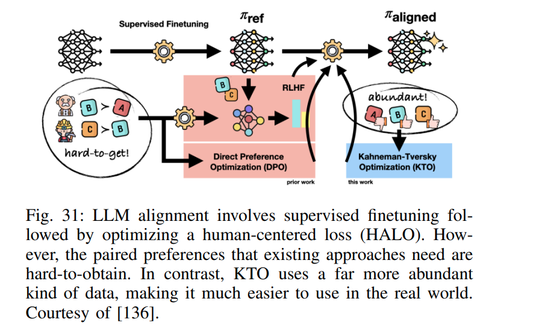
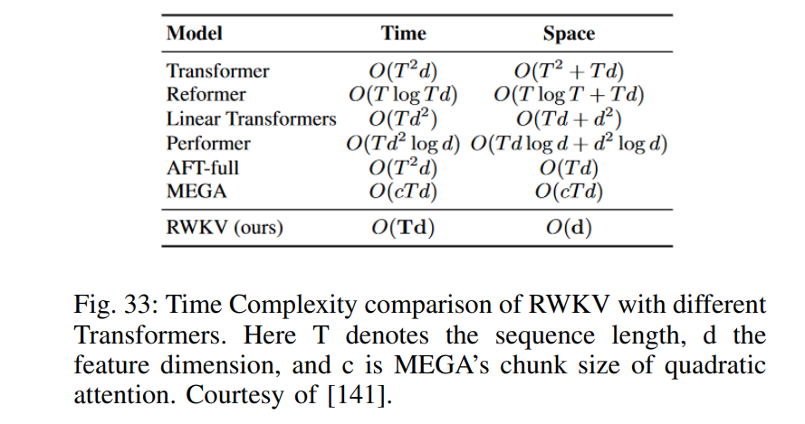
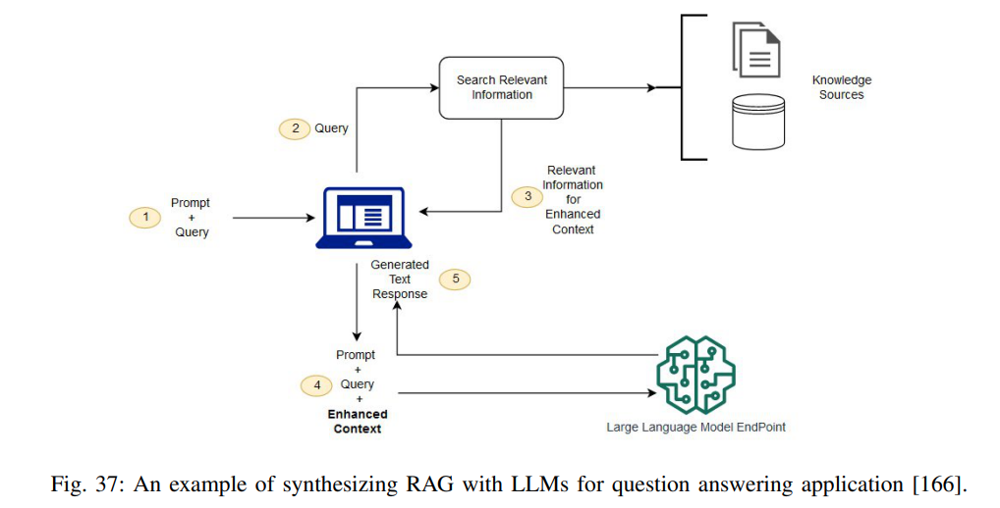
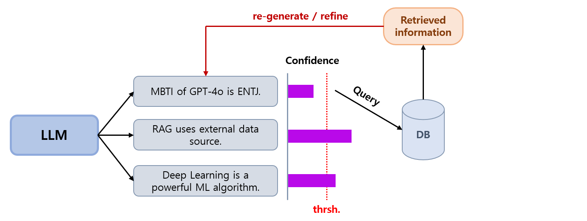
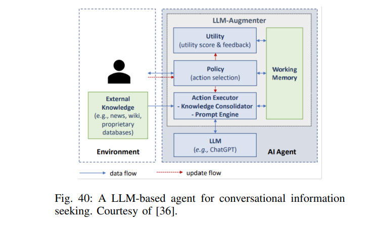

## 목차

* [1. (Part III) LLM 은 어떻게 만들어지는가?](#1-part-iii-llm-은-어떻게-만들어지는가)
  * [1-1. (G) LLM 에 대한 Alignment](#1-1-g-llm-에-대한-alignment)
  * [1-2. (H) Decoding (텍스트 생성) 전략](#1-2-h-decoding-텍스트-생성-전략)
  * [1-3. (I) 비용 효율적인 학습, 추론, 모델 압축 등](#1-3-i-비용-효율적인-학습-추론-모델-압축-등)
* [2. (Part IV) LLM 은 어떻게 쓰이고 Augment 되는가?](#2-part-iv-llm-은-어떻게-쓰이고-augment-되는가)
  * [2-1. LLM 의 한계](#2-1-llm-의-한계)
  * [2-2. LLM 의 프롬프트 설계 및 엔지니어링](#2-2-llm-의-프롬프트-설계-및-엔지니어링)
  * [2-3. LLM 의 Augmentation : RAG](#2-3-llm-의-augmentation--rag)
  * [2-4. 추가적인 도구 사용](#2-4-추가적인-도구-사용)
  * [2-5. LLM 에이전트](#2-5-llm-에이전트)
* [3. (Part VII) LLM 의 도전 과제 및 미래](#3-part-vii-llm-의-도전-과제-및-미래)
  * [3-1. 더 작고 효율적인 LLM](#3-1-더-작고-효율적인-llm)
  * [3-2. Attention 이후의, LLM의 새로운 구조](#3-2-attention-이후의-llm의-새로운-구조)
  * [3-3. 멀티모달 모델](#3-3-멀티모달-모델)
  * [3-4. LLM 의 사용 및 Augementation 기술의 발전](#3-4-llm-의-사용-및-augementation-기술의-발전)
  * [3-5. LLM 의 보안 및 윤리](#3-5-llm-의-보안-및-윤리)

## 논문 소개

* Shervin Minaee, Tomas Mikolov et al., "Large Language Models: A Survey", 2024
* [arXiv Link](https://arxiv.org/pdf/2402.06196)
* 이 문서에서 다룰 파트
  * Part III. LLM 은 어떻게 만들어지는가? - G, H, I 
  * Part IV. LLM 은 어떻게 쓰이고 Augment 되는가?
  * Part VII. LLM 의 도전 과제 및 미래

## 1. (Part III) LLM 은 어떻게 만들어지는가?

이 부분 중 G, H, I 는 각각 다음과 같은 내용으로 구성된다.

* G : LLM 에 대한 Alignment ([Fine Tuning](../../AI%20Basics/LLM%20Basics/LLM_기초_Fine_Tuning.md) 등)
* H : LLM 의 Decoding ([Transformer](../../Natural%20Language%20Processing/Basics_트랜스포머%20모델.md) 의 Decoder 를 이용한 텍스트 생성) 전략
* I : 비용 효율적인 학습, 추론, 모델 압축 등 전략

### 1-1. (G) LLM 에 대한 Alignment

LLM 에 대한 Alignment는 **LLM 을 인간이 사용하려는 목적에 맞게 AI 시스템을 조정** 하는 것을 의미한다.

* 일반적으로 LLM 에 대한 Fine-Tuning 을 의미한다.

LLM 에 대한 Alignment 전략으로는 다음과 같은 것들이 있다.

| 전략                                                                                                                                                                     | 설명                                                                                                                                                                                           |
|------------------------------------------------------------------------------------------------------------------------------------------------------------------------|----------------------------------------------------------------------------------------------------------------------------------------------------------------------------------------------|
| [RLHF (Reinforcement Learning from Human Feedback)](../../AI%20Basics/LLM%20Basics/LLM_기초_Fine_Tuning_DPO_ORPO.md#1-1-rlhf-reinforcement-learning-from-human-feedback) | - LLM 이 인간의 피드백을 통해 학습하도록 하는 방법론                                                                                                                                                             |
| RLAIF (Reinforcement Learning from AI Feedback)                                                                                                                        | - RLHF 에서 사람을 AI로 바꾼 것으로, LLM 이 AI의 피드백을 통해 학습하도록 하는 방법론 - Pre-trained model 을 LLM과 직접 연결할 수 있음                                                                                           |
| [DPO (Direct Preference Optimization)](../../AI%20Basics/LLM%20Basics/LLM_기초_Fine_Tuning_DPO_ORPO.md#2-dpo-direct-preference-optimization)                             | - LLM 의 Fine-Tuning 을 **사용자 선호 / 비선호 답변에 대한 일종의 분류 문제로 변환**                                                                                                                                  |                                       |
| KTO (Kahneman-Tversky Optimization)                                                                                                                                    | - DPO 의 $(x, y_w, y_l)$ ($y_w$ 는 사용자 선호 응답, $y_l$ 은 비선호 응답) 의 구조가 필요 없음 - $(x, y)$ 만 필요하고, **LLM의 응답 $y$ 가 'disirable'한지만 판단** - $y_w, y_l$ 의 paired preference 정보 없이도 DPO 보다 좋은 성능 달성 |                        

[(출처)](https://arxiv.org/pdf/2402.06196) : Shervin Minaee, Tomas Mikolov et al., "Large Language Models: A Survey", 2024

### 1-2. (H) Decoding (텍스트 생성) 전략

LLM 에서 Decoding 은 **(Transformer 의 Decoder 처럼) 학습된 LLM 을 이용하여 텍스트를 생성** 하는 것을 말한다. 그 기본 과정은 다음과 같다.

* tokenizer 는 input prompt 를 token ID 의 리스트로 변환한다.
* 변환된 token ID 리스트에 대해, 언어 모델은 **다음에 가장 올 것 같은 token 또는 그 목록을 예측** 한다.
* 마지막으로 **[Softmax 활성화 함수](../../AI%20Basics/Deep%20Learning%20Basics/딥러닝_기초_활성화_함수.md#2-5-softmax-함수) 를 이용** 하여 각 token에 대한 확률 정보를 생성한다.

널리 알려진 Decoding 전략은 다음과 같다.

| Decoding 전략    | 설명                                                                                                                                                                                                     |
|----------------|--------------------------------------------------------------------------------------------------------------------------------------------------------------------------------------------------------|
| Greedy Search  | 다음에 등장할 확률 예측값이 가장 높은 token 을 채택                                                                                                                                                                       |
| Beam Search    | 다음에 등장할 확률이 **가장 높은 N 개의 token** 을 예측한 후 적용하는 것을 **M (max seq length) 회, 즉 M 개의 next token 만큼 반복** - 가능한 모든 경우 중 점수가 가장 높은 것을 채택 - 전체 경우의 수는 $N^M$ 가지                                            |
| Top-k Sampling | 확률 예측값이 가장 높은 N 개의 token 선정 후, [Temperature 를 이용한 Softmax](../../AI%20Basics/Deep%20Learning%20Basics/딥러닝_기초_Knowledge_Distillation.md#4-1-soft-label) 를 적용하여 산출한 확률을 이용하여 각 token을 그 확률만큼의 가중치로 랜덤 채택 |
| Top-p Sampling | 확률 예측값이 가장 높은 순서대로 token 을 정렬한 후, 그 확률의 누적 합이 cut-off = p 가 되는 시점까지의 token 을 선정 - Top-k Sampling 과 달리, token 의 개수가 정해져 있지 않음 - Nucleus sampling 이라고도 함                                           |

### 1-3. (I) 비용 효율적인 학습, 추론, 모델 압축 등

여기서는 **비용 효율적으로 LLM 을 학습, 추론하는 방법 및 모델을 압축하는 방법** 을 소개한다. 대표적인 방법들로는 다음과 같은 것들이 있다.

* 학습 최적화 (Optimized Training) - ZeRO, RWKV
* [LoRA (Low-Rank Adaption)](../../AI%20Basics/LLM%20Basics/LLM_기초_Fine_Tuning_LoRA_QLoRA.md)
* [Knowledge Distillation](../../AI%20Basics/Deep%20Learning%20Basics/딥러닝_기초_Knowledge_Distillation.md)
* [Quantization](../../AI%20Basics/LLM%20Basics/LLM_기초_Quantization.md)

각 방법에 대한 설명은 다음과 같다.

**1. 학습 최적화 - ZeRO, RWKV**

| 방법                                   | 설명                                                                                                                                                                                                                                                                                                       |
|--------------------------------------|----------------------------------------------------------------------------------------------------------------------------------------------------------------------------------------------------------------------------------------------------------------------------------------------------------|
| ZeRO (Zero Redundancy Optimizer)     | 학습 과정에서의 Memory Redundancy 를 제거하여 메모리 사용량 감소                                                                                                                                                                                                                                                             |
| RWKV (Receptance Weighted Key Value) | **RNN 의 효율적인 추론** 을 이용한, Transformer 에 대한 효율적인 병렬 학습 방법 - Linear Attention 을 이용하여 모델이 Transformer 또는 RNN 처럼 동작하게 함    [(출처)](https://arxiv.org/pdf/2402.06196) : Shervin Minaee, Tomas Mikolov et al., "Large Language Models: A Survey", 2024 |

**2. LoRA (Low-Rank Adaption)**

* 핵심 발상
  * 특정한 Task 를 위해 Fine-Tuning 된 LLM 과, 원래 LLM 의 weight 은 **Low intrinsic Rank 관계** 를 보인다.
  * 즉 **Low-Rank Matrix 로 근사** 시킬 수 있다.
* 핵심 아이디어
  * 1개의 큰 행렬 (예: 4096 x 2048) 을 이용하는 대신, **이를 2개의 작은 행렬의 곱 (예: 4096 x 64, 64 x 2048) 으로 분해** 한다.
  * 이를 통해 **학습에 필요한 연산량을 크게 줄인다.**
  * 구체적으로는 다음과 같이 구현한다.
    * 원래 LLM : $h = W_0 x$
    * LoRA 적용된 LLM : $h = W_0 x + BAx$ ($BAx$ 추가, $A$, $B$ 는 분해된 2개의 작은 행렬)

**3. Knowledge Distillation**

* Knowledge Distillation (지식 증류) 는 **보다 거대한 언어 모델인 Teacher Model 을 이용하여, 보다 작은 언어 모델인 Student Model 을 학습시키는 것** 을 말한다.
  * Teacher Model 의 핵심 지식을 Student Model 로 전수하는 개념이다.
  * **API Distillation** : Teacher Model 의 API를 이용한 Knowledge Distillation
    * 예를 들어 OpenAI의 모델의 API를 이용하여, OpenAI의 모델을 Teacher Model 로 하여 그 핵심 지식을 Student Model 로 전수할 수 있다.
    * 단, **OpenAI는 API Distillation 을 통해 생성한 모델이 OpenAI 의 모델과 경쟁하는 것을 금지** 한다.

**4. Quantization**

* Quantization (양자화) 는 **LLM 의 가중치에 쓰이는 값들의 자료형을 바꾸어서, 모델의 크기를 줄이고 연산을 더 빠르게 하는** 것이다.
  * 예를 들어 Float32 → Int8 로의 양자화를 생각할 수 있다.
* Quantization 의 프로세스는 다음과 같이 분류할 수 있다.

| 프로세스 분류                                                                                                   | 설명                                                                        |
|-----------------------------------------------------------------------------------------------------------|---------------------------------------------------------------------------|
| [Post-Training Quantization (PTQ)](../../AI%20Basics/LLM%20Basics/LLM_기초_Quantization.md#2-1-ptq-vs-qat)  | 이미 학습된 모델에 대해 양자화 적용 - Dynamic PTQ 와 Static PTQ 로 구분                   |
| [Quantization-Aware Training (QAT)](../../AI%20Basics/LLM%20Basics/LLM_기초_Quantization.md#2-1-ptq-vs-qat) | 학습 시에 이미 모델이 양자화되어 있음 - 학습이 완료된 모델에 대해서는, 좋은 성능이 보장되며 추가적인 양자화가 필요 없다. |

## 2. (Part IV) LLM 은 어떻게 쓰이고 Augment 되는가?

이 부분은 다음과 같은 내용으로 구성된다.

* LLM 의 한계
* LLM 의 [프롬프트 설계 및 엔지니어링](../../AI%20Basics/LLM%20Basics/LLM_기초_Prompt_Engineering.md)
* LLM 의 Augmentation : [RAG (Retrieval-Augmented Generation, 검색 증강 생성)](../../AI%20Basics/LLM%20Basics/LLM_기초_RAG.md)
* 추가적인 도구 사용
* LLM 에이전트

### 2-1. LLM 의 한계

LLM 은 근본적으로 **다음에 나타날 token을 예측하도록 설계** 되었기 때문에, [Fine-tuning](../../AI%20Basics/LLM%20Basics/LLM_기초_Fine_Tuning.md) 과 같은 기술의 발달에도 불구하고 다음과 같은 한계점이 존재한다.

* 이전 프롬프트의 내용을 기억하지 못한다.
* 확률적으로 next token 을 생성한다는 점이 문제가 될 수 있다.
* 외부 데이터 접근 불가
* 매우 큰 크기로 인해 많은 GPU 자원 필요
* 환각 현상

**1. [환각 현상](../../AI%20Basics/LLM%20Basics/LLM_기초_환각_현상.md) (Hallucination)**

* 위 문서에서도 설명되어 있지만, 환각 현상은 **내재적 환각** 과 **외재적 환각** 으로 구분된다.
* 아래 표에서 **원본 데이터** 는 GPT-4 등 일반적으로 널리 알려진 LLM에서는 **LLM이 학습한 세계에 대한 다양한 지식** 을 의미한다.

| 구분                                   | 설명                                              |
|--------------------------------------|-------------------------------------------------|
| 내재적 환각 (Intrinsic Hallucinations) | 원본 데이터와의 논리적 모순 또는 부정확한 정보 생성                   |
| 외재적 환각 (Extrinsic Hallucinations) | 원본 데이터에 없는 내용을 질문할 때, 그 데이터를 통해 검증할 수 없는 정보를 생성 |

* 환각 현상의 극복을 위한 시도
  * [RLHF (Reinforcement Learning from Human Feedback, 인간 피드백을 통한 강화학습)](../../AI%20Basics/LLM%20Basics/LLM_기초_Fine_Tuning_DPO_ORPO.md#1-1-rlhf-reinforcement-learning-from-human-feedback) 와 같은 방법이 시도되었다.
  * 그러나, **확률적으로 next token 을 생성한다는 본질적인 특징에 의한 한계점** 은 여전히 존재한다.
  * 환각 현상 극복은 프롬프트 엔지니어링, 모델 선택 등 **여러 분야에 걸쳐 있는** 문제이다.

**2. 환각 현상을 측정할 수 있는 [LLM 평가 Metric](../../AI%20Basics/LLM%20Basics/LLM_기초_LLM의_성능_평가.md)**

* 환각 현상 측정에 사용되는 Metric 은 다음과 같다.

| 구분          | 설명                                                                                                       |
|-------------|----------------------------------------------------------------------------------------------------------|
| 통계적 방법      | ROUGE, BLEU 등 - 내재적 환각 현상 측정 가능 PARENT, PARENT-T, Knowledge-F1 등 - 구조적인 지식 데이터가 있을 때 사용 가능      |
| 언어 모델 기반 방법 | - IE-Based Metrics - QA-Based Metrics - NLI-Based Metrics - Faithfulness Classification Metrics |
| 기타          | - 사람이 직접 평가                                                                                              |

이 중에서 **언어 모델 기반 방법** 에 대한 상세 설명은 다음과 같다.

| 구분                                  | 설명                                                                                 |
|-------------------------------------|------------------------------------------------------------------------------------|
| IE-Based Metrics                    | - Information Extraction Model (정보 추출 모델) 을 이용하여 **지식을 간소화** - 이 지식을 원본 데이터와 비교 |
| QA-Based Metrics                    | - 생성된 콘텐츠와, **질문-답변 프레임워크를 통해 추출** 한 원본 데이터를 비교                                    |
| NLI-Based Metrics                   | - **자연 언어 추론 데이터셋** 을 이용한 평가                                                       |
| Faithfulness Classification Metrics | - **task에 특화된 데이터셋** 을 이용한 평가                                                      |

### 2-2. LLM 의 프롬프트 설계 및 엔지니어링

LLM 이 원하는 답변을 생성하게 하기 위해서는 프롬프트에 질문이나 지시 등이 필요한데, 그 질문이나 지시를 작성하는 전략을 [프롬프트 엔지니어링 (Prompt Engineering)](../../AI%20Basics/LLM%20Basics/LLM_기초_Prompt_Engineering.md) 이라고 한다.

* Prompt Engineering 은 **LLM을 목적에 맞게 정교하게 사용** 하기 위한 기술인 셈이다.

프롬프트 엔지니어링의 전략은 다음과 같다.

| 구분                                                                                  | 설명                                                                                                                                                                                                                                                         |
|-------------------------------------------------------------------------------------|------------------------------------------------------------------------------------------------------------------------------------------------------------------------------------------------------------------------------------------------------------|
| [Chain-of-Thought (CoT)](../../AI%20Basics/LLM%20Basics/LLM_기초_Chain_of_Thought.md) | - 일반적인 LLM이 추론에 특화되어 있지 않다는 문제점을 해결 - **추론 절차를 LLM에게 제공** 하여 이 문제를 해결 - **Zero-shot CoT** : LLM에게 단순히 단계적으로 생각하라고 함  - **Manual CoT** : 단계적 사고의 예시를 제공, Zero-shot 보다 효과적임                                                                         |
| Tree-of-Thought (ToT)                                                               | - 각 가지가 서로 다른 사고 과정을 나타내는 **'생각의 나무'** 아이디어 - 복잡한 사고를 요하는 경우에 적합                                                                                                                                                                                        |
| Self-Consistency                                                                    | - 동일한 프롬프트에 대해 LLM이 여러 개의 응답을 생성하면, 그 응답 각각에 대해 **일관성을 분석** - Ensemble 기반 아이디어, "여러 개의 응답을 생성하면 그것들 중 정확한 것이 있을 것이다" - 답변의 진실성이 중요한 경우에 적합                                                                                                           |
| Reflection                                                                          | - 추론에 기반하여, **LLM이 자신이 생성한 답변을 평가** 하도록 함 - 이것은 LLM의 'self-editing' 능력에 기반함                                                                                                                                                                             |
| Expert Prompting                                                                    | - LLM에게 **전문가로서의 역할을 지정** 한 후, 고품질의 답변을 하도록 함                                                                                                                                                                                                              |
| Chains                                                                              | - LLM 이 생성한 답변 내에서 **여러 개의 component 를 연결** 하는 아이디어 - 최종 답변에 기여하는 **서로 연결된 여러 step을 생성** 하는 방법                                                                                                                                                          |
| Rails                                                                               | - LLM 이 **사용자가 지정한 템플릿** 에 따라 응답을 생성하게 하는 기술 - LLM 응답의 정확도 및 보안성 향상 가능  - **Topical Rails** : LLM이 특정 domain 에 대한 응답을 하게 함 - **Fact-checking Rails** : 잘못된 응답 생성 최소화 (환각 현상 방지) **- Jailbreaking Rails** : LLM이 자체적 제한 사항을 위반하는 응답을 생성하는 것을 방지 |
| Automatic Prompt Engineering (APE)                                                  | 프롬프트 생성 자동화. 그 과정은 다음과 같다. - **Prompt Generation** : LLM이 주어진 task에 대한 가능한 prompt 를 생성 **Prompt Scoring** : 각 prompt 를 그 효율성 등에 따라 점수화 **Refinement and Iteration** : 이 점수 평가를 통해 prompt를 다듬음                                                     |

### 2-3. LLM 의 Augmentation : RAG

* LLM 은 **자체적으로 최신 정보에 대한 지식을 가지고 있지 않다** 는 한계점이 있는데, 이를 극복하기 위해서 LLM 을 Augmentation 하는 방법이 사용된다.
* 그 대표적인 방법으로 [RAG (Retrieval-Augmented Generation, 검색 증강 생성)](../../AI%20Basics/LLM%20Basics/LLM_기초_RAG.md) 이 있다.

[(출처)](https://arxiv.org/pdf/2402.06196) : Shervin Minaee, Tomas Mikolov et al., "Large Language Models: A Survey", 2024

**FLARE (Forward-looking Active Retrieval Augmented Generation)**

* 목표
  * RAG 와 결합하여 사용되는 LLM 의 능력을 향상시킨다.
* 핵심 아이디어
  * LLM 의 **다음 내용에 대한 예측 (Prediction) + 정보 검색 (Information Retrieval)** 의 결합
* 상세
  * LLM 은 다음에 올 내용을 예측한다.
  * 이 예측을 RAG 에 입력되는 query 로 하여, 정보 검색 (Information Retrieval) 을 실시한다.
  * 정보 검색을 일회성으로 실시하는 전통적인 RAG 과는 다른 방법론이다.
* 특징
  * LLM 에 의해 생성된 각 segment 들에 대해 **confidence 평가** 가 이루어진다. 
  * 이 confidence 평가 점수가 정해진 기준보다 낮으면 **해당 내용을 쿼리로 하여 RAG 을 통해 정보를 검색** 한다.
  * RAG 을 통해 추출된 정보는 **LLM 이 문장을 다시 생성하거나 다듬는 데** 사용된다.

### 2-4. 추가적인 도구 사용

* LLM 은 RAG 이외에도 여러 가지 추가적인 도구 (API call 등) 와 결합할 수 있다.
* 이 도구들을 통해 LLM 의 능력 범위를 확장시킬 수 있다.

**관련 논문**

| 논문                                                                                                                       | 설명                                                                                          |
|--------------------------------------------------------------------------------------------------------------------------|---------------------------------------------------------------------------------------------|
| [Toolformer: Language Models Can Teach Themselves to Use Tools (2023.02)](https://arxiv.org/pdf/2302.04761)              | - LLM에게 **어떤 도구 (검색 엔진, 계산기, API 파라미터 등) 를 이용해야 할지** 를 학습시킴                                 |
| [Gorilla: Large Language Model Connected with Massive APIs](https://arxiv.org/pdf/2305.15334)                            | - **API 활용** 능력이 GPT-4보다 우수                                                                 |
| [ART: Automatic multi-step reasoning and tool-use for large language models (2023.03)](https://arxiv.org/pdf/2303.09014) | - 외부 도구를 이용한 **자동화된 CoT 프롬프트 엔지니어링** - 여러 가지 프롬프트 엔지니어링 전략으로 LLM의 복잡한 과제 (추론 등) 해결 능력 향상 |

### 2-5. LLM 에이전트

**LLM 에이전트 (LLM Agents)** 는 **LLM과 다른 도구들의 결합을 통해 특정 분야의 작업을 자동으로 수행할 수 있는 시스템** 을 말한다.

* 사용자 및 환경과 상호작용하며, 어떤 도구를 사용할지 등 결정을 내릴 수 있다.
* LLM 에이전트의 핵심 기능은 다음과 같다.

| 구분    | 설명                               |
|-------|----------------------------------|
| 도구 사용 | 외부 도구 (API 등) 및 서비스에 대한 접근 및 사용  |
| 의사 결정 | 입력, 맥락, 사용 가능한 도구 등 정보에 의한 의사 결정 |

[(출처)](https://arxiv.org/pdf/2402.06196) : Shervin Minaee, Tomas Mikolov et al., "Large Language Models: A Survey", 2024

**LLM 에이전트를 위한 Prompt Engineering 기술**

| 기술 (논문)                                                                                                                             | 설명                                                                                                                                                                                                                                                                                                                                                                                                                  |
|-------------------------------------------------------------------------------------------------------------------------------------|---------------------------------------------------------------------------------------------------------------------------------------------------------------------------------------------------------------------------------------------------------------------------------------------------------------------------------------------------------------------------------------------------------------------|
| [ReWOO: Decoupling Reasoning from Observations for Efficient Augmented Language Models (2023.05)](https://arxiv.org/pdf/2305.18323) | 외부 정보 및 도구에 의존하지 않고도 **추론 계획을 LLM 스스로 수립** 할 수 있도록 함 (논문에서는 이를 직접 관찰하는 것과 추론하는 것을 서로 분리, 즉 reasoning 을 direct observation 으로부터 decoupling 했다고 표현) - 필요한 정보가 주어질 때마다, 추론을 위한 구조화된 framework 을 자체 생성 - 토큰 효율성 및 도구 사용 실패 (tool failure) 에 대한 robustness 측면에서 우수  세부 동작 방식 - **Meta-planning** : 처음에는 주어진 문제를 해결하기 위한 Outline 계획 수립 - **Execution** : Meta-planning 에서 수립한 계획을 주어진 정보를 이용 (결합) 하여 실행 |
| [ReAct: Synergzing Reasoning and Acting in Language Models (2022.10)](https://arxiv.org/pdf/2210.03629)                             | LLM 이 말로서 생성되는 추론뿐만 아니라 **실제 실행 가능한 step을 생성** 하게 한다. - 이를 통해 모델의 문제 해결 능력 향상 - 추론 과정 생성과 행동 사이를 모델이 오갈 수 있음                                                                                                                                                                                                                                                                                                  |
| [DERA: Enhancing Large Language Model Completions with Dialog-Enabled Resolving Agents (2023.03)](https://arxiv.org/pdf/2303.17071) | **특정 맥락에서 여러 Agent를 사용** 할 수 있게 한다. - Researcher : 정보를 가져오고 분석하는 Agent - Decider : 제공된 정보를 이용하여 최종 결정을 내리는 Agent  이러한 **역할 분담** 을 통해 **문제 해결 및 의사 결정 능력을 향상** 시킨다. - 따라서 **복잡한 문제 해결/의사 결정 과제** 에서 좋은 성능을 발휘할 수 있다.                                                                                                                                                                                  |

## 3. (Part VII) LLM 의 도전 과제 및 미래

이 부분은 다음과 같은 내용으로 구성된다.

* 더 작고 효율적인 LLM
* [Attention](../../Natural%20Language%20Processing/Basics_어텐션%20(Attention).md) 메커니즘 이후의, LLM 의 새로운 구조
* 멀티모달 모델
* LLM 의 사용 및 Augementation 기술의 발전
* LLM 의 보안 및 윤리 ([환각 현상](../../AI%20Basics/LLM%20Basics/LLM_기초_환각_현상.md) 등)

### 3-1. 더 작고 효율적인 LLM

* 지금까지의 트렌드
  * 지금까지 **큰 모델일수록 성능이 좋다** 는 것이 통용되고 있었다.
    * 이는 GPT-4 와 같은 큰 모델이 비교적 좋은 성능을 보여준다는 것을 통해 알 수 있다.
  * 그러나, **큰 모델은 latency 가 늘어나는 등 성능 이슈가 있는 측면** 이 있다.
* 향후 전망
  * **Small Language Model (SLM)** 의 개발
  * 이를 통해, **특정 task 에 대한 성능은 LLM 수준으로 유지** 하면서도, **비교적 가볍고 빠른** 언어 모델을 통해 latency 등 기존 LLM 의 단점 극복

### 3-2. Attention 이후의, LLM의 새로운 구조

* 지금까지의 트렌드
  * [TransFormer 구조](../../Natural%20Language%20Processing/Basics_트랜스포머%20모델.md) 를 사용하는 것이 현재 NLP 및 LLM 의 구현 방식
* 향후 전망
  * 언젠가는 Transformer 가 아닌 완전히 새로운 구조의 혁신적인 LLM 구현 방법이 나올 수 있음

현재 연구되고 있는 LLM 의 새로운 구조는 다음과 같다.

| LLM 구조                   | 설명                                                                                                                                                                                                          | 최근 등장한 모델                                                                                                                                                                                                                         |
|--------------------------|-------------------------------------------------------------------------------------------------------------------------------------------------------------------------------------------------------------|-----------------------------------------------------------------------------------------------------------------------------------------------------------------------------------------------------------------------------------|
| State Space Model (SSM)  | - SSM 은 Markov Chain 기반의 일종의 시계열 모델 - 기존 SSM 의 구조를 언어 모델에 맞게 재구성                                                                                                                                         | - [Mamba: Linear-time sequence modeling with selective state spaces (2023.12)](https://arxiv.org/pdf/2312.00752) - [Hyena Hierarchy: Towards Larger Convolutional Language Models (2023.02)](https://arxiv.org/pdf/2302.10866) |
| Monarch Mixer            | - Monarch Matrix 라는 새로운 구조를 통해 높은 GPU 효율 달성                                                                                                                                                                 | [Monarch Mixer: A Simple Sub-Quadratic GEMM-Based Architecture (2023.10)](https://arxiv.org/pdf/2310.12109)                                                                                                                       |
| Mixture of Experts (MoE) | - 학습 시, 여러 개의 세부 LLM 을 포함한 거대한 LLM 을 학습 - 실제 동작 시에는 이들 중 **Gating 과 유사한 메커니즘** 을 통해 사용자가 요청한 task 에 적합한 몇 개의 LLM만 동작 - 이를 통해 **LLM 의 자원 효율성 강화** - **Attention 이든 아니든, 포함되는 세부 LLM이 어떤 구조여도 상관없음** |                                                                                                                                                                                                                                   |

### 3-3. 멀티모달 모델

향후에는 **텍스트뿐만 아니라 여러 종류의 데이터를 처리할 수 있는 멀티모달 LLM** 이 많이 등장할 것이다.

* 여기에는 이미지, 비디오, 오디오 등이 포함된다.

현재까지 나온 멀티모달 LLM 은 다음과 같다.

| 멀티모달 LLM   | 논문                                                                                                                                                 |
|------------|----------------------------------------------------------------------------------------------------------------------------------------------------|
| LLAVA      | [Visual Instruction Tuning (2023.04)](https://arxiv.org/pdf/2304.08485)                                                                            |
| LLAVA-Plus | [LLaVA-Plus: Learning to Use Tools for Creating Multimodal Agents (2023.11)](https://arxiv.org/pdf/2311.05437)                                     |
| GPT-4      | [GPT-4 Technical Report (2023.03)](https://arxiv.org/pdf/2303.08774v3)                                                                             |
| Qwen-vl    | [Qwen-VL: A Versatile Vision-Language Model for Understanding, Localization, Text Reading, and Beyond (2023.08)](https://arxiv.org/pdf/2308.12966) |
| Next-GPT   | [NExT-GPT: Any-to-Any Multimodal LLM (2023.09)](https://arxiv.org/pdf/2309.05519)                                                                  |

### 3-4. LLM 의 사용 및 Augementation 기술의 발전

* 지금까지의 트렌드
  * LLM의 문제점 (환각 현상 등) 은 프롬프트 엔지니어링, RAG 등을 통해 극복되어 왔다.
* 향후 전망
  * 이러한 Augmentation 기술들이 더욱 발달할 것이다.
  * 아래 논문들과 같이, **LLM 기반 에이전트 시스템** 이 발달할 것이다.
    * [The Rise and Potential of Large Language Model Based Agents: A Survey (2023.09)](https://arxiv.org/pdf/2309.07864)
    * [A survey on large language model based autonomous agents (2023.08)](https://arxiv.org/pdf/2308.11432)
    * [Agent ai: Surveying the horizons of multimodal interaction (2024.01)](https://arxiv.org/pdf/2401.03568)

### 3-5. LLM 의 보안 및 윤리

다음과 같은 분야가 LLM 의 보안 및 윤리 관점에서 중요한 문제이다.

* LLM 의 답변을 통해 개인정보 또는 보안 정보를 얻는 것과 같은 공격 또는 취약점
* 딥 페이크 (Vision 모델과 결합 시)
* 가짜 뉴스 등 거짓 정보 생성

이를 해결하는 방법은 다음과 같다.

* 이러한 공격 탐지를 위한 **LLM의 추론 능력 강화**
* LLM 이 편향성을 띄지 않도록 하는 다양한 방면에서의 연구 및 개발
